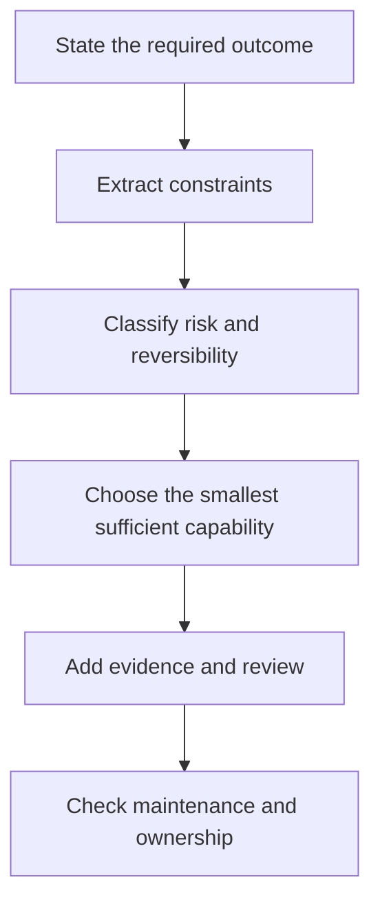

# 学决策，不背词汇

> 认证蓝图描绘的是合格从业者能够说明并捍卫的决策。若把它当成术语表，你学到的恰恰是考试里最没用的部分。

**类型：** Learn
**语言：** Python
**前置要求：** 无
**预计时间：** 约 75 分钟

## 学习目标

- 将认证蓝图转成按权重安排的学习计划。
- 区分稳定的工程原则与可能变化的产品细节。
- 建立证据台账，记录决策、理由和官方来源。
- 不使用题库泄露内容，也能练习场景判断。
- 以各领域表现而不是某一次漂亮的模拟分数来设定就绪门槛。

## 问题所在

Maya 花了两周背功能名称。她能解释 Project、上下文窗口和连接器。接着她遇到一个场景。

某团队想总结一份机密周报。源文件每周五都会更新，最终摘要要交给管理层。可选方案有：把报告粘到新聊天里、加进旧 Project、连接实时数据源、或开发定制应用。每种方案都能生成摘要；但只有一种同时符合更新频率、审核要求、数据政策和维护成本。

Maya 在记忆里搜索连接器的定义；而场景实际在要求她做决策。

这一区别贯穿整套课程。官方指南描述的工作包括选择产品、验证输出、管理知识和升级风险。定义能辅助这些工作，却不能替你完成它们。

考试还使用换算分数。练习百分比不是官方分数，任何社区模拟题都无法预测结果。你的任务是培养足够的判断力，让陌生场景仍然有清晰的解题结构。

## 核心概念

### 蓝图是一份岗位模型

每个领域对应目标岗位应承担的一部分工作。权重估计计分考试中该领域的占比；权重不是难度，小领域也可能有难题。权重告诉你应如何分配练习时间。

对 Associate Foundations 而言，权重最大的领域是输出评估与验证。这说明该角色既要会向 Claude 提问，也要能判断答案是否适合使用。

阅读每个目标时，用三个标签：

1. **Know：** 必须记住的事实或术语。
2. **Do：** 必须执行的流程。
3. **Decide：** 必须依据约束取舍的选择。

大多数薄弱学习计划在 Know 上投入过多；大多数场景题集中考 Do 和 Decide。

### 稳定原则与易变事实

有些知识变化很慢：

- 敏感数据需要获批的处理路径。
- 会进入重要交付物的主张必须有证据。
- 持久指令应简洁、限定范围且持续维护。
- 不可逆操作比可逆草稿需要更严格的审核。
- 若小模型已满足实测要求，使用大模型就是浪费。

另一些知识可能在本课写成之后、你学习之前发生变化：

- 模型名称、价格和上下文限制。
- 套餐资格与功能可用性。
- 产品导航和界面标签。
- 连接器的能力与审批行为。
- 认证费用、政策和访问规则。

第二类信息必须带验证日期和官方来源。本课程依据 2026 年 7 月生效的 1.0 版指南核对。预约考试前，请重新打开最新官方指南和认证 FAQ。

### 场景决策栈

当多个答案似乎都合理时，按以下顺序审视场景：



“足够小的能力面”很重要。若一次性草稿能在安全前提下由直接聊天完成，受管理的 Project 可能多余；若数据源每天更新，粘贴副本可能过期；若工作流会做出有后果的操作，便利性不能凌驾于审批之上。

### 错误答案通常在局部是对的

好的干扰项很少是胡话。它们解决了错误的问题、忽视某个约束，或加入不必要的复杂度。

常见形式包括：

- **有能力但不合适：** 功能能完成任务，但不满足给定的隐私或新鲜度要求。
- **默认追求最大能力：** 没有测得需求就选最大模型。
- **只修 prompt：** 失败实际来自陈旧知识或缺失来源，却只改写 prompt。
- **没有归属的自动化：** 工作流没有审核人、升级路径或维护负责人。
- **先执行后定政策：** 先处理敏感材料，再分类。
- **一个成功样本：** 把一次精致输出当成可靠性的证据。

### 建立证据台账

笔记应记录决策，而不是抄段落。每个目标一条记录：

```json
{
  "objective": "Choose when human verification is required",
  "decision_rule": "Require independent review when an error could create material harm or the claim lacks authoritative evidence",
  "counterexample": "A low-risk brainstorming list can be reviewed by the author during normal editing",
  "artifact": "claim-evidence matrix",
  "official_source": "URL and verification date",
  "confidence": "practiced"
}
```

反例能划清规则的适用边界。若你说不出某条规则何时不适用，记住的可能只是一句口号。

## 动手构建

建立一个七行的 Associate Foundations 台账，每个领域一行。每行写下：

- 领域权重。
- 预计要做的两项决策。
- 一项能证明你会做这份工作的产物。
- 一个希望迅速识别的失败模式。
- 一个官方来源。
- 当前信心：未接触、理解、练过或限时练过。

接着按比例分配十小时学习时间。先按数学比例分配，再按薄弱处调整。一个你已做得很好的 21% 领域，可能比一个从未用过的 12% 领域更少需要补强。

使用公式：

```text
domain hours = total hours x domain weight x weakness multiplier
```

归一化最终数字，使其回到你的可用总时长。陌生领域用 1.5 的薄弱系数是合理的；不要用系数来逃避自己不喜欢的高权重工作。

最后，为练习题建立错误日志，记录：

- 你做出的决策。
- 漏掉的约束。
- 所选项为何看起来有吸引力。
- 哪条规则会导向更好的答案。
- 同一规则适用的新场景。

复盘错误日志比重复做同一套模拟题更有价值。

### 用节奏代替临时抱佛脚

把以下四阶段节奏当作课程启发式方法。可把它铺到四周，也可压缩到实际可用时间：

1. **定位：** 阅读最新指南，做一次未看过的诊断题，把每个错误映射到目标和信心水平。
2. **构建：** 完成必修课程和自己产出的产物。运行测试，不要把代码、政策或架构示例只当散文。
3. **迁移：** 解决新场景，说明每个看似合理的替代方案为何落败，用错误日志修复薄弱领域。
4. **模拟：** 按公布的闭卷规则做新的限时题组，复盘蒙对的题，并在考前立即停止添加新材料。

选择补救方法前，先给每个错误分类：

- **记忆缺口：** 你不知道稳定事实或定义。
- **陈旧事实：** 你记住了需要查最新官方资料的产品细节。
- **遗漏约束：** 忽略了隐私、新鲜度、延迟、成本、权限或可逆性。
- **顺序错误：** 在错误的生命周期阶段选了有效操作。
- **能力面混淆：** 选了有能力的产品或工具，却不是最小、最易维护的方案。
- **证据失败：** 把自信、存在引用或一次成功运行当成证明。
- **过度工程：** 场景尚未需要时就加上架构。

类别决定修复方式。陈旧事实需要查文档；遗漏约束需要新场景；顺序错误需要生命周期图。重读同一段解释不是万能学习策略。

## 交互实验

使用路线图图表调整领域信心和可用时间。根据薄弱程度和领域权重安排学习顺序，别把每个目标等量对待。

```figure
00-certification-route-map
```

## 实践实验

运行本地场景评分器，然后改变一个信心标签，观察按权重排序的学习顺序。故意破坏领域权重或分配时长，确认运行器会拒绝无效计划。

## 交付产物

`outputs/readiness-plan.json` 中的完整产物是一份十小时 Associate Foundations 计划。它包含七个蓝图领域、当前信心、每个领域两项决策、失败模式、官方来源、要产出的具体产物、四阶段练习节奏和错误答案分类法。

## 验证

无需 API key 即可验证数据包及其测试：

```bash
cd certifications/claude/lessons/00-certification-strategy/code
python3 main.py
python3 -m unittest discover tests -v
```

验证器会证明领域权重与分配时长一致、每个来源都有日期且是官方来源、每个领域都有练习证据、补救措施覆盖不同失败类别。示例通过后，再将填入的值替换成自己的值。

## 综合项目关联

这六道测验题检验你能否根据权重、带日期的事实、约束和错误证据推理。将已验证计划带入所选路线的总结项目；在 Associate 路线中，它会成为第 29 课的覆盖与就绪记录。

## 上手使用

分四轮使用本课程。

**第一轮：定位。** 阅读最新指南，做一次诊断并标记薄弱领域。做完前不要看诊断题答案。

**第二轮：构建。** 完成课程及其产物。不要看笔记，运行工作周总结项目；它把产品选择、知识维护、prompt、验证、治理和交接放到一个工作流里。

**第三轮：解释。** 对每个决策，说明最佳替代项为何在给定约束下失败。解释会暴露虚假的自信。

**第四轮：限时。** 在闭卷条件下完成整套模拟题，复盘每个答案，包括蒙对的答案。蒙对不等于掌握。

保守的就绪门槛是：

- 两套新的限时练习都达到或超过目标。
- 原始练习计分下没有领域低于 75%。
- 每个总结项目产物都完成。
- 每道错题都能用遗漏的约束来解释。
- 完整模拟题至少剩十分钟。

这是学习门槛，不是对 Anthropic 换算分数的预测。

## 考试决策模式

- 比较方案时，以是否满足全部明确约束为准，功能数量不决定优先级。
- 将“最新、机密、定期、已批准、可审计、管理层”等词视为架构输入。
- 区分内容质量与工作流质量。未经批准的数据路径产生了好答案，仍是错误方案。
- 新鲜度重要时，优先维护中的来源而不是复制快照。
- 后果、不确定性或不可逆性高时，加入人工审核。
- 产品事实应依据最新官方资料核验，而不是相信记忆中的界面。

## 常见坑

- 使用泄露的真题题库。它违反项目规则，并训练识别而非判断。
- 认为答案越长越可能正确。
- 不标日期地背精确价格。
- 把最大模型等同于最安全的选择。
- 做许多低质量模拟题，而不研究解释。
- 把熟悉一个场景当成能处理陌生场景的证明。
- 混淆原始练习百分比与官方换算分数。

## 练习

1. 从每个领域各选一个目标，标为 Know、Do 或 Decide，并说明理由。
2. 写一个不需要 Project 的场景，再写一个 Project 是最简单可维护选择的场景。
3. 找出本课程中一个可能改变的产品事实，在官方来源中验证并记录日期。
4. 将薄弱的错误日志条目“我忘了答案”改写为“遗漏约束”的解释。
5. 设计一项比单次模拟分数严格、但能在可用时间内实现的个人就绪门槛。

## 关键术语

| 术语 | 含义 |
|---|---|
| 蓝图 | 用于界定考试范围的官方领域与目标地图 |
| 换算分数 | 经转换的考试分数，不等于原始正确率 |
| 干扰项 | 在不完整理解下看似合理的错误选项 |
| 决策规则 | 在已知约束下从多个方案中选择的可复用方法 |
| 证据台账 | 将目标、规则、产物与官方来源关联起来的带日期记录 |
| 就绪门槛 | 进入下一测评阶段前必须满足的一组条件 |

## 延伸阅读

- [Anthropic Partner 认证目录](https://anthropic-partners.skilljar.com/page/partner-certifications)
- [Anthropic 认证 FAQ](https://anthropic-partners.skilljar.com/page/faq-certifications)
- [Claude Certified Associate Foundations 考试指南](https://everpath-course-content.s3-accelerate.amazonaws.com/instructor%2F6nizmqk8tpzpfjvt6qmmav7rh%2Fpublic%2F1783542847%2FClaude+Certified+Associate+%E2%80%93+Foundations+Exam+Guide.pdf)
- [CCAR-F Exact Mechanics Review](../../../references/ccar-f-exact-mechanics.md)
- [Prompt 工程：技术与模式](../../../../../phases/11-llm-engineering/01-prompt-engineering/)
- [LLM 应用的评估与测试](../../../../../phases/11-llm-engineering/10-evaluation/)
