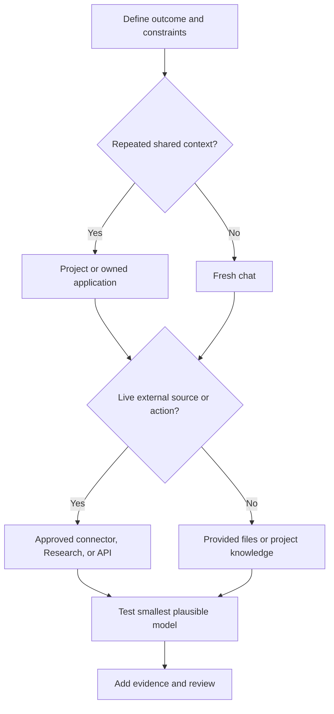

# 选择能承载工作的最小载体

> 产品选择，就是知识工作尺度上的架构设计。载体选错了，即使输出正确，也可能过时、无法审核或成本高得毫无必要。

**类型：** Learn
**语言：** Python
**前置要求：** [学决策，不背词汇](../../00-certification-strategy/)、[托管式 LLM 平台](../../../../../phases/17-infrastructure-and-production/01-managed-llm-platforms/)
**预计时间：** 约 90 分钟

## 学习目标

- 在聊天、Projects、Research、文件与 Artifacts、连接器和编程载体之间做出选择。
- 说明 Haiku、Sonnet 和 Opus 的长期定位，而不依赖某个具体模型版本。
- 根据质量、速度、成本、新鲜度和治理约束匹配载体与模型。
- 通过架构决策记录，对比 Anthropic 直连、Amazon Bedrock、Google Vertex AI 和 Microsoft Foundry 四种部署路径。
- 判断应使用记忆、项目知识还是新对话来延续上下文。
- 为可能变化的产品事实标注官方来源和核验日期。

## 问题所在

一位运营负责人每周都要准备竞品简报。她打开上周的聊天，粘贴三个新链接，要求更新，然后把结果转发出去。

输出很漂亮，却引用了上次对话里的旧产品价格，遗漏了内部文档中的政策变更，还包含一条没有来源的竞品主张。她选错了工作载体。

旧聊天带来了过时的上下文。粘贴链接不能保证研究足够全面。内部政策不在可用知识范围内。工作流也没有主张核验步骤。

考试目标叫作“产品与模型选择”，考的是边界设计。你要决定 Claude 能看到什么、记住什么、检索什么、创建什么，以及这项任务值得投入多少推理能力。

## 核心概念

### 先看工作，再看功能菜单

从六个维度描述任务：

| 维度 | 问题 |
|---|---|
| 重复性 | 这是一次性、重复性还是持续性的工作？ |
| 知识 | 所需来源是小型、大型、私有还是持续变化的？ |
| 新鲜度 | 昨天的副本今天会不会已经错了？ |
| 输出 | 结果是回复、报告、文件、分析，还是可复用工作流？ |
| 后果 | 如果结果错误或操作并非本意，会发生什么？ |
| 协作 | 只有一个人使用，还是需要团队共享和维护？ |

然后再选择载体。

### 聊天适合边界明确的对话式工作

对于输入清晰的一次性任务，新聊天通常是正确的默认选择。它提供了干净的上下文边界，适合起草、头脑风暴、解释、转换给定文本和简短分析。

旧假设悄悄影响新工作时，长期延续的聊天会变得危险。目标发生变化、上下文包含冲突指令，或你已经说不清哪些早期消息仍然重要时，就该重新开始。如果需要延续上下文，重开前先提炼一份简短且经过核验的交接说明。

聊天搜索和记忆可以找回先前上下文，但不能替代获批的事实来源。记忆适合保存偏好和长期工作背景；政策、价目表或客户记录则应放在有负责人和日期的维护系统中。

### Projects 是受维护的上下文边界

Project 把围绕同一主题的聊天、项目指令和知识库组织在一起。同一套稳定上下文要支持重复工作时，它更合适，例如品牌指南、研究项目、操作流程或客户合作。

Project 的价值在于让上下文可以重复使用。每段新对话都从一条刻意设定的边界开始。

风险在于配置过时。Project 若保存着上季度的政策，就可能稳定地重复同一个错误。每个 Project 都需要负责人、来源清单、复核节奏和移除流程。

官方产品行为会变化。截至 2026 年 8 月 8 日，Anthropic 帮助资料称 Projects 可以包含指令和上传的知识，并在知识接近上下文限制时使用检索。可用性、限制和套餐要求都必须在当前帮助中心重新核验。

### Cowork 是可引导的任务循环

Cowork 是面向多步骤知识工作的产品载体，不是独立部署路径，也不是本课的考试目标。截至 2026 年 8 月 9 日，Anthropic 当前帮助资料将它描述为目标驱动的任务循环：你描述结果、审查方案、观察进度，并在运行过程中引导或调整工作方向。Projects 可以为相关任务提供长期文件、链接、指令和记忆。Skills 提供可复用工作流，plugins 则可封装 skills、连接器、agents 和 hooks。

当结果是真实文件，或任务需要跨获批来源协调，而且工作过程适合人工引导时，可以使用 Cowork。文件边界要尽量收窄：当前文档称，本地访问仅限已连接的文件夹，文件操作受权限控制，永久删除需要明确批准。面对敏感文件、陌生 plugins、有后果的操作或广泛的计算机访问，应采用手动批准、密切跟进任务并检查最终文件。循环运行得再久，责任也不会转移给模型。

### Research 适合多来源调查

任务需要广泛收集信息、进行多次搜索、综合并添加引用时，使用 Research。查询单个最新事实时，直接网页搜索更合适；比较市场、查阅多篇论文，或协调公开来源与已连接内部资料时，Research 更合适。

Research 不会替你判断来源。长篇报告仍可能引用薄弱证据、混用不同日期的主张，或漏掉私有约束。引用只是通往证据的导航，不能自动证明主张成立。

### 文件与 Artifacts 让输出可检查

根据后续用途选择输出形式。答案读完即弃时，内联文本就够了；需要比较字段时，结构化表格更合适；结果要进入业务流程时，可下载文档或电子表格更合适。

产物应展示假设、来源、日期和未解决事项。隐藏不确定性的精美文件，比不上带有清晰证据列的朴素表格容易审核。

文件创建和编辑能力可能随载体、套餐、文件类型与大小变化。围绕这些能力设计重复工作流前，要核验当前限制。

### 连接器用实时、受权限控制的访问替代复制

连接器让 Claude 从外部服务检索内容或在其中执行操作。当来源新鲜度很重要，而手动复制粘贴会逐渐偏离时，它们很有用。

不要因为存在某个连接器就选择它。先检查：

- 它是只读的，还是能修改数据。
- 它会继承已连接账号的哪些权限。
- 是否每项操作都需要批准。
- 哪些数据会随对话一并保留。
- 是否需要组织管理员启用。
- 连接器是否能提供你所需的确切内容类型。

截至 2026 年 8 月 8 日，官方文档称 Google Workspace 连接器可以搜索 Gmail、使用 Calendar 和 Drive，执行操作时需要明确批准。文档也列出了部分内容可能不可见等限制。这些都属于可能变化的产品事实。

### API 和编码载体适合由你掌控的软件行为

如果需要确定性集成、定制界面、自动化测试、版本化配置，或在软件系统内重复执行，应转向 API、Claude Code 或 agent runtime。

不要为了逃避学习如何配置 Project 而开发应用。如果工作流需要聊天产品无法表达的合约，例如类型化输出 schema、由应用掌控的授权，或每次发布时自动评估，就应该开发应用。

### 部署是控制平面的决策

选择工作载体与选择 Claude 在哪里运行，是两项不同决策。Project 可以是员工使用的正确载体，同时另一个应用使用云托管 API。不要把这两项选择都藏在“Claude”这个词后面。

截至 2026 年 8 月 9 日，Anthropic 官方文档列出四种企业架构评审应比较的部署路径：

| 路径 | 控制平面与采购 | 适用场景 | 批准前重新核验 |
|---|---|---|---|
| Claude for Enterprise 与直连 Claude API | Anthropic 管理面向人的产品和第一方 API 服务。Enterprise 席位与直连 API workspace 是两种不同的用量形态。 | 可以直接向 Anthropic 采购、重视第一方产品访问，且不强制通过云市场。 | Enterprise 身份与席位政策、API 身份验证、workspace 预算、数据条款、可用功能和模型生命周期。 |
| Amazon Bedrock | AWS 原生身份验证、计费、区域、配额和由 AWS 管理的推理边界。 | 组织已经通过 AWS IAM、AWS 采购和 AWS 合规控制来治理生产 AI。 | 模型访问、区域端点、功能差异、AWS 数据处理、配额和具体的 Bedrock API 代际。 |
| Google Vertex AI | Google Cloud 项目身份、计费，以及全球、多区域或区域端点。 | 工作负载属于现有 Google Cloud landing zone，并沿用其 IAM、计费、日志和数据驻留控制。 | 模型与功能支持、端点地理位置、预置容量或按量付费容量，以及 Google Cloud 数据处理。 |
| Microsoft Foundry | Azure 原生端点和身份验证，使用 Azure Marketplace 计费。当前文档列出了 Azure 托管与 Anthropic 托管选项。 | Azure 采购、Entra 身份、Azure RBAC 和 Foundry 运维已经是获批路径。 | 托管选项、部署类型、区域或数据区、模型与功能支持，以及当前处理者条款。 |

这张表描述各条路径的责任归属，不对它们排名。应选择能够满足组织约束、又尽量少引入新控制平面的路径。

可以把 Anthropic 直连视为同一个采购家族，但仍要明确列出各自控制。Claude for Enterprise 管理具名人员和共享工作；直连 Claude API 则通过 API organization 与 workspace 管理应用工作负载。席位不是 API 容量，API 支出上限也不是席位政策。

合作云在各层的运营者和数据处理者上也有差异。截至 2026 年 8 月 9 日，Anthropic 的数据保留文档称，第一方 Claude API 和 Microsoft Foundry 由 Anthropic 担任数据处理者，Amazon Bedrock 和 Google Cloud 则由云提供商担任数据处理者。Foundry 还有不同托管选项，具体边界必须查阅当前 Foundry 页面。应记录确切产品、区域和托管选项，而不是只写“Azure”或“AWS”。

### 先评估需求，再看供应商

在接触供应商前先写下决策标准：

| 标准 | 架构问题 |
|---|---|
| 云承诺 | 已经有哪些 landing zone、网络控制、日志系统和支持团队？ |
| 采购 | 用量必须通过云市场结算，还是可以直接与 Anthropic 签约？ |
| 合规与数据边界 | 谁是数据处理者、推理在哪里运行、哪些数据可以离开边界、适用哪些保留条款？ |
| 身份 | 人员使用 Enterprise SSO 和 SCIM，还是工作负载使用云身份、联合身份或限定范围的 API 凭证？ |
| 席位与预算 | 购买的是具名用户访问、应用 token、预置容量，还是其中多项？限制在哪里执行？ |
| 运营控制 | 谁负责启用模型、配额、区域、日志、事件响应、弃用迁移和功能核验？ |

根据实际工作负载为每项标准分配权重，为每条路径评分并写下简短理由，再计算结果。没有理由的分数只是装饰；把分数复制给另一个组织则是在制造误导。

最后写一份架构决策记录。说明选中的路径、拒绝的替代方案、后果和复核触发条件。云承诺、处理者条款、必需功能或采购方式都可能变化，因此已采纳的决策仍需设定复核日期。

### 按角色定位选择模型家族

长期稳定的家族定位是：

- **Haiku：** 对范围窄、定义清晰且量大的工作，优先考虑速度和低成本。
- **Sonnet：** 为多数专业工作流平衡能力、延迟和成本。
- **Opus：** 面向最困难的推理、综合与 agent 工作；仅在实测质量值得额外成本或延迟时优先使用能力。

确切的代际、alias、价格、上下文限制、输出限制、thinking 模式和平台可用性都会变化。不要把版本表当作永久知识来教，应查阅实时的模型概览和定价页面。

选择需要证据。先在最小的可行模型上运行代表性样例；只有修正 prompt、上下文和验证设计后仍有实测失败，才升级模型。



## 动手构建

创建一份包含两项关联决策的产品选择记录。

首先，为每周竞品简报选择工作载体。

1. 明确输出：一份附来源附录的两页管理层简报。
2. 设定新鲜度：公开主张不得早于七天；内部产品事实来自当前获批路线图。
3. 使用 Research 广泛收集公开资料，并使用获批连接器或维护中的 Project 来源获取内部文档。
4. 在两个模型家族档位上测试一份有五个来源的代表性简报，再选择模型。
5. 比较事实覆盖率、缺乏支持的主张、延迟和审核时间。
6. 要求人工负责人批准最终主张。
7. 记录每项可能变化事实所依据的产品文档和日期。

决策记录应包含被拒绝的替代方案。说明复用旧聊天为何会受过时上下文影响；如果原生工作流已经满足需求，也要说明为什么定制应用为时过早。

其次，为一个应用工作负载完成部署决策矩阵：

1. 在评分前写明具体工作负载和六项部署标准。
2. 比较 Claude for Enterprise 与直连 API、Amazon Bedrock、Google Vertex AI 和 Microsoft Foundry。
3. 针对该工作负载，为每项标准分配一到五的权重。
4. 为每个候选方案给出一到五的适配分，并逐项说明理由。
5. 将每条可能变化的平台主张链接到当前官方文档，并记录核验日期。
6. 选择加权适配度最高的方案，再写下 ADR 的后果和复核触发条件。

不要操纵权重来强推偏好的供应商。如果硬性合规规则会淘汰某条路径，应在评分前把它写成门槛。

## 交互实验

使用模型适配图调整重复性、新鲜度、后果、协作和输出约束。观察哪项约束会让更简单的载体不再适用；不存在永远最好的载体。

```figure
01-claude-model-fit
```

## 实践实验

运行本地适配评分器，然后让较便宜的模型无法通过某个门槛，或让更简单的载体满足全部约束。改变部署权重、破坏候选分数，或删除带日期的证据。推荐结果必须跟随证据变化，不能由产品或云偏好决定。

## 交付产物

`outputs/product-selection-record.json` 包含一份填写完成的每周竞品简报工作载体决策，以及一个面向受监管 Azure 应用的部署矩阵和 ADR。部署部分覆盖当前四条路径、六项加权标准、针对场景的理由、带日期的官方证据、后果与复核触发条件。

## 验证

运行确定性验证器及其测试：

```bash
cd certifications/claude/lessons/01-claude-product-and-model-landscape/code
python3 main.py
python3 -m unittest discover tests -v
```

验证器会拒绝以下情况：产品事实没有日期、模型选择未出现在 benchmark 中、缺少人工责任人、决策没有被拒绝的替代方案、部署路径不完整、算术结果漂移、ADR 忽略加权适配度最高的方案，以及缺少官方证据。示例通过后，把填写好的记录改成你负责的一项重复工作流。

## 综合项目关联

本课测验考查如何在约束变化时判断产品与模型是否适配。这份产物会把产品选择和来源边界决策带入第 29 至 32 课的总结项目；届时你必须说明为什么更小或更原生的载体无法满足要求。

## 上手使用

开始工作前，使用这张精简决策卡：

```text
Outcome:
Recurrence:
Required sources and freshness:
Sensitivity:
Output form:
Human owner:
Chosen surface:
Chosen model family:
Chosen deployment path:
Cloud commitment and procurement route:
Data boundary and processor:
Human seats versus application budget:
Why smaller or simpler alternatives fail:
Changeable facts verified on:
```

如果填不出来源和负责人字段，就还没到写 prompt 的时候。

选择模型时，维护一套小型对比集。十个代表性任务比一个英雄式样例更有用，应包含简单、普通、模糊和容易失败的案例。衡量小模型是否达到要求，不要只比较文风。

## 考试决策模式

- 一次性、有明确边界的转换任务通常从新聊天开始。
- 需要共享稳定上下文的重复工作适合受维护的 Project。
- 广泛、最新且涉及多来源的调查适合 Research。
- 最新外部数据或外部操作适合获批连接器或自有集成。
- 结构化、自动化、可测试的行为适合 API 或编码载体。
- 已有 AWS 治理与采购体系时，Bedrock 可能是运营变化最小的方案。
- 已有 Google Cloud 治理与端点要求时，Vertex AI 可能是运营变化最小的方案。
- 已有 Azure 采购、身份和 Foundry 运维体系时，Microsoft Foundry 可能是运营变化最小的方案。
- 能接受直采和第一方控制时，Anthropic 直连可能适用，但 Enterprise 席位和 API 工作负载仍是两项独立决策。
- 按实测质量选择满足要求的最小模型。
- 旧上下文更可能干扰新任务时，重新开始。

## 常见坑

- 因为方便而复用旧聊天。
- 把记忆当作权威数据库。
- 上传一次文件后，就假设它会一直保持最新。
- 用 Research 查询一个简单事实。
- 向连接器授予超出任务所需的权限。
- 把当前模型价格硬编码进永久决策规则。
- 尚未测试 Sonnet 或 Haiku 能否达标，就选择 Opus。
- 原生载体已经足够，却仍开发定制应用。
- 只看功能宣传就选择某家云，忽略采购、身份和事件责任归属。
- 把具名用户席位当作应用容量，或把 API 预算当作席位政策。
- 只写“运行在我们的云中”，却不记录确切产品、托管选项、端点地理位置和数据处理者。
- 把今天的模型与功能支持固化成永久供应商矩阵。

## 练习

1. 分别为一次性改写、重复性的政策问答工作流、包含五个来源的市场报告和自动工单分类器选择载体，并说明每项选择。
2. 设计两个上传文件比使用连接器更合适的场景。
3. 在五个代表性任务上比较小模型和大模型。运行前先定义成功标准。
4. 审计一个你正在使用的 Project，列出负责人、过时来源、持久指令和复核日期。
5. 在官方帮助中心找出一项当前产品限制，把它记为带日期的事实，并注明需要复核，不能写成永久规则。
6. 为组织内某个应用评估四条部署路径，然后修改云承诺权重，并说明 ADR 是否应该改变。

## 关键术语

| 术语 | 含义 |
|---|---|
| 工作载体 | 管理输入、上下文、工具和输出的产品边界 |
| 项目知识 | 为 Project 内对话维护的文件或来源 |
| 记忆 | 从先前工作中提取、由用户控制的连续性信息，与权威来源数据相互独立 |
| 连接器 | 连接外部服务或数据源、受权限控制的通道 |
| Research | 多步骤的信息收集与综合能力 |
| 最小足够能力 | 满足所有实测要求的最简单载体和模型 |
| 部署路径 | 人员或应用访问 Claude 的商业与运营路径 |
| 控制平面 | 管理身份、政策、计费、配额、部署和运营配置的系统 |
| 架构决策记录 | 记录决策、背景、替代方案、后果和复核触发条件并标注日期的文档 |

## 延伸阅读

- [模型概览](https://platform.claude.com/docs/en/about-claude/models/overview)
- [身份验证](https://platform.claude.com/docs/en/manage-claude/authentication)
- [Workspaces](https://platform.claude.com/docs/en/manage-claude/workspaces)
- [配置单点登录](https://support.claude.com/en/articles/13132885-set-up-single-sign-on-sso)
- [Claude Enterprise 支出上限](https://platform.claude.com/docs/en/manage-claude/spend-limits-api)
- [API 与数据保留](https://platform.claude.com/docs/en/manage-claude/api-and-data-retention)
- [Amazon Bedrock 中的 Claude](https://platform.claude.com/docs/en/build-with-claude/claude-in-amazon-bedrock)
- [Google Cloud 上的 Claude](https://platform.claude.com/docs/en/build-with-claude/claude-on-vertex-ai)
- [Microsoft Foundry 中的 Claude](https://platform.claude.com/docs/en/build-with-claude/claude-in-microsoft-foundry)
- [Projects 是什么？](https://support.claude.com/en/articles/9517075-what-are-projects)
- [Claude Cowork 入门](https://support.claude.com/en/articles/13345190-get-started-with-claude-cowork)
- [安全使用 Claude Cowork](https://support.claude.com/en/articles/13364135-use-claude-cowork-safely)
- [在 Claude 中使用 Skills](https://support.claude.com/en/articles/12512180-use-skills-in-claude)
- [安装 Cowork plugins](https://claude.com/docs/cowork/guide/plugins)
- [何时使用网页搜索、extended thinking 和 Research](https://support.claude.com/en/articles/11095361-when-should-i-use-web-search-extended-thinking-and-research)
- [用连接器扩展 Claude](https://support.claude.com/en/articles/11176164-use-connectors-to-extend-claude-s-capabilities)
- [使用 Google Workspace 连接器](https://support.claude.com/en/articles/10166901-use-google-workspace-connectors)
- [上下文工程](../../../../../phases/11-llm-engineering/05-context-engineering/)
- [模型路由](../../../../../phases/17-infrastructure-and-production/16-model-routing/)
