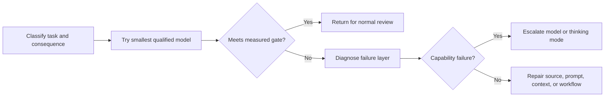

# 把能力花在失败代价高的地方

> 模型选择要在质量、延迟、上下文和成本之间分配资源，不能照着产品排名做决定。

**类型：** Learn
**语言：** Python
**前置要求：** [选择能承载工作的最小载体](../../01-claude-product-and-model-landscape/)、[缓存、速率限制与成本优化](../../../../../phases/11-llm-engineering/11-caching-cost/)
**预计时间：** 约 90 分钟

## 学习目标

- 无需背诵价格表，也能估算 token 成本和工作流成本。
- 根据实测质量、延迟和后果选择模型。
- 解释采样的非确定性，以及为什么发布结论需要重复评估。
- 只有核验当前模型和平台后，才选择 speed、effort 与 thinking 设置。
- 区分模型失败与 prompt、上下文、来源和工作流失败。
- 把路由、缓存、批处理和输出限制作为相互独立的优化手段。

## 问题所在

某支持团队把每个请求都路由到能力最强的模型。第一个月看似很成功：质量很高，但响应时间不稳定，账单是预估的四倍。

经理于是把所有请求都切到最快的模型。成本降了下来，但升级摘要开始漏掉例外情况，复杂退款案例也收到了自信却不完整的建议。

两种设计都把模型名称当成政策，却都没有描述实际工作。

生产决策要从失败代价出发。内部头脑风暴里出现一个错别字，代价很低；退款决策漏掉一条例外，代价就高得多。模型、prompt、上下文、来源质量和审核流程都应体现这种差异。

## 核心概念

### Token 是工作负载的计量单位

模型处理的是 token，不是页数或单词数。输入 token 包括指令、对话历史、提供的文档、工具定义和检索到的内容。输出 token 包括回复；根据产品或 API 的不同，还可能包括当前定价中描述的推理相关计算或其他计费单位。

规划时，拆成四个部分：

```text
total input = stable instructions + task input + retrieved knowledge + prior turns
total output = requested answer + structured metadata
```

不要把所有输入藏进一个数字里。稳定指令可能受益于缓存；检索知识可以裁剪；先前轮次可以总结或丢弃；任务输入通常无法移除。

### 先用变量，再填实时价格

价格会变，长期有效的公式不会：

```text
request cost = input_tokens / 1,000,000 x input_rate
             + output_tokens / 1,000,000 x output_rate
             + tool or feature charges
```

对于工作流：

```text
workflow cost = request cost x requests per case x cases per month
              + review cost
              + failure and rework cost
```

审核和返工也有成本。便宜模型若让人工修正时间翻倍，反而可能是更贵的选择。

来看一份仅供说明、并非当前价格的费率表。模型 A 的输入费率为 1 个单位，输出为 5 个单位；模型 B 分别为 3 和 15。每个案例使用 20,000 个输入 token 和 2,000 个输出 token，模型 B 每次调用的成本是模型 A 的三倍。如果模型 A 能通过 98% 的分流案例，而且能识别困难案例，就把常规工作路由到 A，把其余不确定案例升级。如果无法安全识别困难案例，路由设计就还不完整。

### 用门槛衡量质量，别凭感觉

测试模型前，先定义最低可接受结果。可用维度包括：

- 必需事实齐全。
- 没有缺乏支持的主张。
- 遵循指令。
- 输出 schema 有效。
- 延迟低于工作流上限。
- 人工修正时间低于门槛。
- 安全与隐私控制不受破坏。

最佳模型，是以足够余量通过每项必需门槛的最便宜方案。只看平均质量不够：一个模型可能整体得分很高，却在每个后果严重的边缘案例上失败。

### 采样每次从概率分布中选择

语言模型生成每个 token 时，面对的是一组可能后续内容的概率分布。采样从该分布中做选择。对于接受 temperature 设置的模型，temperature 会改变分布的集中程度，但不会让模型推理变成确定性函数。

Anthropic API 官方文档明确指出，即使 temperature 为零，也不是完全确定的。相同请求通过第一方 API 和合作云仍可能产生不同结果。固定模型 ID 可以稳定模型权重，但 Anthropic 的模型版本文档也说明，路由、安全分类器和采样逻辑等服务基础设施仍可能变化。

这会改变什么才算证据：

- 一次回复通过，只能证明这一次回复通过了。
- 单一平均值会掩盖尾部失败和多次运行之间的差异。
- 确定性验证器可以检查 schema 和算术，却无法让生成变得确定。
- 在同一个版本化任务上重复试验，才能揭示最低质量、方差、严重失败和尾部延迟。
- 模型、prompt、工具、平台或服务模式发生变化，都需要重新比较。

小型学习练习中，每种配置至少独立运行三次。生产环境的样本量应根据观察到的风险和方差决定，不能把这个最低数当作标准。分别比较各风险切片，并优先采用“关键案例最低质量”“p95 延迟”这类门槛。漂亮的平均值可能掩盖严重失败。

采样控制本身也是可能变化的产品事实。截至 2026 年 8 月 9 日，Anthropic 当前 Messages 指南称，Claude 4.7 及后续版本会拒绝非默认的 `temperature`、`top_p` 或 `top_k` 值。较旧且仍受支持的模型可能继续接受其中部分参数。未核对当前模型和平台文档前，不要从旧请求复制采样设置。

### 诊断失败层级

输出薄弱时，先问失败来自哪一层：

1. **需求失败：** 从未定义成功标准。
2. **来源失败：** 必需事实缺失或已过时。
3. **上下文失败：** 相关证据被埋没、截断，或与冲突材料混在一起。
4. **prompt 失败：** 指令或输出标准不清楚。
5. **模型失败：** 输入和标准都没有问题，但模型能力仍然不足。
6. **工作流失败：** 缺少审核、升级机制或工具行为。

升级模型主要对第五层有效。它也许能暂时掩盖其他问题，却会让系统更难调试。

### 延迟由多个部分组成

用户感受到的延迟包括：

- 首次出现可见输出前的时间。
- 流式数据块之间的时间。
- 总生成时间。
- 工具与检索时间。
- 人工批准时间。

能力更强的模型可能单次调用更慢，但能减少重试；小模型可能响应很快，却制造更多循环。要测量完整工作流。

### 根据可观察约束路由

一个简单的路由策略可以把工作分成三条通道：

| 通道 | 示例 | 策略 |
|---|---|---|
| 常规 | 格式化给定更新 | 快速模型，严格模板 |
| 模糊 | 比较相互冲突的笔记 | 均衡模型，要求来源 |
| 有后果 | 建议是否批准例外 | 强模型加必需审核 |

分类器本身也会失败。尽可能使用确定性信号，例如文档长度、任务类型、敏感度标签、请求的操作或用户明确选择。记录路由决策，并审计错误路由。



### 缓存、批处理和限制解决不同问题

**Prompt caching** 在当前模型和平台支持时，可以降低重复处理稳定 prompt 前缀的成本和延迟。它不会让过时指令变正确。

**Semantic caching** 为足够相似的请求复用先前结果。它需要新鲜度策略，不适合个性化、快速变化或后果严重的工作。

**Batch processing** 用响应时间换成本和吞吐量。它适合夜间分类或批量提取等离线工作，不适合让用户等待的交互式工作。

**输出限制** 可以避免回复无谓拉长，设得低于任务需求时也会截断工作。要求最短的有效输出，并验证完整性。

**上下文裁剪** 在无关输入产生费用、干扰模型之前将其移除。增加上下文不会自动增加知识。

### 配置是带日期的组合

模型选择只是配置手段之一：

| 手段 | 改变什么 | 测量什么 |
|---|---|---|
| 模型 | 基础能力、价格、支持的功能和生命周期 | 各风险切片的质量、成本、延迟、兼容性 |
| Speed | 支持快速模式时的服务速度，通常需要支付溢价 | 每秒输出 token 数、首 token 时间、p95 延迟、可接受结果成本 |
| Effort | 在支持时，模型分配给文本、thinking 和工具使用的工作量与 token 开销 | 质量、工具调用次数、输出 token、延迟、成本 |
| Thinking | 在支持时，模型是否以及如何分配显式推理 | 困难案例质量、thinking token、总输出、延迟、成本 |
| Prompt 与输出合约 | 指令、证据边界、格式和要求的长度 | 指令遵循、schema 有效性、修正时间 |
| 采样 | 仍接受随机性控制的模型生成行为 | 结果差异、严重失败、风格多样性 |

截至 2026 年 8 月 9 日，官方模型概览列出的准确 Claude API ID 是 `claude-sonnet-5` 和 `claude-opus-5`。Sonnet 5 默认启用 adaptive thinking，也允许禁用 thinking，并支持产物中使用的 low 和 high effort 值。Opus 5 支持 adaptive thinking 和产物中使用的 medium effort 值。

Fast mode 的适用范围更窄。当前官方文档只列出 Opus 5 和 Opus 4.8，不包括 Sonnet 5；该功能仅限 Claude API，包括 Managed Agents，不支持合作平台。它处于研究预览阶段，需要相应访问权限、`speed: "fast"` 以及 `anthropic-beta: fast-mode-2026-02-01` 请求头。它使用相同模型提供更快推理和溢价计费，并不承诺更高智能。可用性、支持范围和价格都可能独立变化。

不要把永久兼容性矩阵写进路由代码或学习笔记。每次实验前：

1. 记录准确模型 ID 和平台。
2. 打开当前官方页面，核对模型支持、thinking、effort、speed 和价格。
3. 为每项待测配置标记 `docs-supported` 或 `docs-unsupported`，并记录日期与来源。文档支持并不能证明你的账号拥有预览访问权限。
4. 不要试验不支持的组合，也不要假设它会静默降级。
5. 针对相同任务集和门槛，重复运行受支持的配置。

平台允许时，每次只改变一个手段。如果支持范围迫使你同时更换模型和 speed，应把它称为路由替代方案；这类结果无法单独归因于 speed。

### 考试换算分数不是百分比

截至 2026 年 8 月 9 日，Anthropic 认证 FAQ 称，成绩采用 100 到 1,000 的换算分数，最低合格分数为 720。换算用于校准难度可能不同的考试版本。

因此，720 绝不表示原始合格线是 72% 的正确率。本课程的测验与模拟百分比是原始练习分数，不能换算成官方分数，也无法预测考试结果。

## 动手构建

为每周运营工作流创建一个包含十个案例的模型选择基准测试。

- 四个常规格式化和分类案例。
- 三个模糊的综合案例。
- 两个来源相互冲突的案例。
- 一个必须升级给人工处理的后果严重案例。

运行任何模型前，先定义评分标准：

```json
{
  "required_facts": 4,
  "unsupported_claims_allowed": 0,
  "format_valid": true,
  "latency_seconds_max": 20,
  "human_correction_minutes_max": 3,
  "consequential_case_must_escalate": true
}
```

先测试最小的可行模型家族。记录输入与输出 token、延迟、评分和修正时间。只升级失败案例。将路由工作流与所有十个案例都使用大模型的方案进行比较。

报告必须回答：

- 哪些案例可以安全使用小模型？
- 哪项可观察信号会把案例向上路由？
- 哪些失败并非模型失败？
- 在假设业务量下，路由能节省多少成本？
- 路由器不确定时怎么办？

然后为一个模糊或后果严重的案例创建 mode-trials 产物：

1. 查看结果前，先定义最低质量、最大 p95 延迟、最大平均成本和最少重复运行次数。
2. 提出至少三种改变 speed、effort 或 thinking 的配置。
3. 在当前官方文档中核验每个准确模型与平台组合。保留一个文档明确不支持的组合，作为被拒绝选项。
4. 每个受支持配置都使用相同的 prompt、来源、工具和评分标准，至少运行三次。
5. 记录每次运行的质量、延迟、成本和结果指纹。
6. 根据原始运行数据核对最低质量、p95 延迟和平均成本。
7. 选择通过所有门槛且成本最低的受支持配置。

所提供的产物会在一个模型上比较 low 与 high effort、adaptive 与 disabled thinking、standard 与 fast 服务，以及一个不受支持的 fast 组合。其中 `standard` speed 是省略请求字段时采用的标准化实验标签；fast 配置另行记录所需预览访问权限、请求字段和 beta 请求头。这是带日期的示例，不是可复用的兼容性表，也不能证明账号拥有相应权限。

## 交互实验

使用风险图调整后果、不确定性、可逆性和审核强度。它会在你优化 token 开销前，显现误判为通过的隐性成本。

```figure
02-responsible-ai-risk
```

## 实践实验

运行十案例路由基准测试。让一个后果严重的案例跳过审核、复制案例 ID，或错误填写路由成本，观察确定性验证如何失败。然后删掉一次重复模式运行、修改核对后的 p95 值、尝试文档明确不支持的模式，或选择成本不达标的配置。修复证据，门槛保持不变。

## 交付产物

`outputs/model-routing-benchmark.json` 保存了覆盖常规、模糊、来源冲突和后果严重工作的十案例路由合约，其中包括实测门槛、选定通道、token 估算、审核时间，以及路由与全部案例使用大模型的对比。

`outputs/mode-trials.json` 是应用配置产物，记录当前文档证据、speed、effort、thinking、fast mode 请求前置条件、重复质量、p95 延迟、平均成本、不受支持的组合、选定模式和重新运行触发条件。

这些支持声明来自带日期的官方文档，状态统一使用 `docs-supported`。它们未通过 live request 核验，因此没有标为 `live-request-verified`。质量、延迟和成本值是练习用说明数据，不是供应商调用或基准测试结果。请用自己任务集与账号的重复运行结果替换它们。

## 验证

不调用供应商即可验证基准测试：

```bash
cd certifications/claude/lessons/02-model-selection-and-token-economics/code
python3 main.py
python3 -m unittest discover tests -v
```

验证器会保留原有基准测试检查，并单独验证模式试验。它要求：当前官方支持证据、明确的说明性测量标签、fast mode 请求前置条件、每种 `docs-supported` 模式至少三次重复运行、可观察的结果指纹、核对后的汇总、一个未尝试的 `docs-unsupported` 选项，以及选择通过门槛且成本最低的配置。它没有硬编码任何未来模型支持何种模式的结论。

## 综合项目关联

测验考查路由、失败层级诊断和成本推理。把验证后的基准测试用作第 29 至 32 课总结项目中的模型选择证据，再用自己的代表性案例结果替换说明性测量。

## 上手使用

使用这句决策说明：

```text
For [task class], choose [model family or mode] because it clears [quality gate]
across [repeated runs] within [p95 latency and mean cost limit]. Escalate when
[observable condition], and require [review rule] when [consequence threshold].
Model, platform, speed, effort, and thinking support checked in official docs on [date].
```

如果理由只有“它更聪明”，说明决策还没有做完。

运行基准测试前，查阅实时模型概览和定价页面。把准确模型标识符保存在基准测试结果中，永久政策里不要写死。这样可以防止模型别名变化悄悄使证据失效。

把不受支持的配置留在决策记录中，不要放进生产请求。拒绝理由能解释为什么没有测试某个诱人模式，也为未来重新核验提供明确触发点。

## 考试决策模式

- 在花钱购买更多能力前，先修复缺失的标准、来源和上下文。
- 使用通过代表性质量门槛的最小模型。
- 不要只算 token 价格，还要计入人工修正与失败成本。
- 使用可观察信号，把后果严重或模糊的工作向上路由。
- 只有工作流能接受延迟完成时才使用批处理。
- 只有新鲜度与隔离条件允许时，才缓存稳定且可复用的材料。
- 把模型功能、价格和限制视为带日期的事实。
- 对概率性评估重复试验；低 temperature 或固定模型 ID 都不能保证输出一致。
- 把 speed、effort 和 thinking 当作需要实测的配置选择。
- 把 720 视为认证换算分数，绝不能当成原始百分比。

## 常见坑

- 根据模型家族名气选型，忽略任务基准测试。
- 只用一个简单样例比较模型。
- 只报告平均质量，隐藏关键案例失败。
- 把每个糟糕输出都称为模型限制。
- 不断增加上下文，让成本与干扰一同上升。
- 底层来源变化后仍复用缓存输出。
- 在成本模型中漏掉审核时间。
- 使用不透明分类器路由，而且没有审计轨迹。
- 因为一次运行通过或 temperature 较低，就宣称 prompt 是确定性的。
- 从不同模型或平台复制 speed、effort、thinking 或采样设置。
- 对不受支持的模式静默降级，没有关闭失败并记录不兼容性。
- 只比较平均延迟，隐藏违反用户目标的尾部延迟。
- 把考试 720 的换算门槛转成 72% 的原始目标。

## 练习

1. 用符号表达式计算一个包含 50,000 个案例和两个模型档位的工作流月度成本。
2. 为支持工作流写出三个确定性路由信号。
3. 把五种失败分别诊断为需求、来源、上下文、prompt、模型或工作流问题。
4. 找出一项应使用批处理的任务，以及一项必须保持交互式的任务。
5. 在官方文档中核验一项当前 thinking 功能，并记录模型、平台和日期。
6. 将一种配置运行三次，保留结果指纹，并解释单次运行会掩盖什么。
7. 在官方文档中找出一个当前不受支持的模式组合，记录下来但不要发送请求。

## 关键术语

| 术语 | 含义 |
|---|---|
| Token 经济性 | 输入、输出、请求量、模型费率与工作流成本之间的关系 |
| 质量门槛 | 候选配置必须通过的可测量阈值 |
| 路由 | 根据任务信号选择模型或执行通道 |
| 升级 | 把不确定或后果严重的工作交给更强能力或人工审核 |
| Prompt caching | 为稳定 prompt 材料复用供应商侧计算 |
| 返工成本 | 修正不合格输出所需的人工或机器工作量 |
| 采样 | 从模型概率分布中选择生成 token |
| 模式试验 | 针对一组准确模型、平台、speed、effort 和 thinking 配置开展的重复、带日期评估 |
| 尾部延迟 | p95 等高百分位延迟指标，用于暴露平均值掩盖的慢请求 |
| 换算分数 | 用于校准不同考试版本的转换后结果，不是原始正确率 |

## 延伸阅读

- [模型概览](https://platform.claude.com/docs/en/about-claude/models/overview)
- [Create a Message API 参考](https://platform.claude.com/docs/en/api/messages/create)
- [使用 Messages](https://platform.claude.com/docs/en/build-with-claude/working-with-messages)
- [模型 ID 与版本](https://platform.claude.com/docs/en/about-claude/models/model-ids-and-versions)
- [Claude Sonnet 5 新特性](https://platform.claude.com/docs/en/about-claude/models/whats-new-sonnet-5)
- [Claude Opus 5 新特性](https://platform.claude.com/docs/en/about-claude/models/whats-new-opus-5)
- [Claude 定价](https://platform.claude.com/docs/en/about-claude/pricing)
- [Thinking](https://platform.claude.com/docs/en/build-with-claude/thinking)
- [Effort](https://platform.claude.com/docs/en/build-with-claude/effort)
- [Fast mode](https://platform.claude.com/docs/en/build-with-claude/fast-mode)
- [Prompt caching](https://platform.claude.com/docs/en/build-with-claude/prompt-caching)
- [Batch processing](https://platform.claude.com/docs/en/build-with-claude/batch-processing)
- [Anthropic 认证 FAQ](https://anthropic-partners.skilljar.com/page/faq-certifications)
- [缓存、速率限制与成本优化](../../../../../phases/11-llm-engineering/11-caching-cost/)
- [Prompt 与语义缓存经济性](../../../../../phases/17-infrastructure-and-production/14-prompt-semantic-caching/)
- [以模型路由降低成本](../../../../../phases/17-infrastructure-and-production/16-model-routing/)
