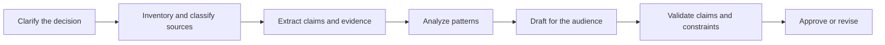

# 把请求变成可测试的合约

> 好 prompt 会描述要写什么，也会在生成开始前给出可检查的成功标准。

**类型：** Learn
**语言：** Python
**前置要求：** [学决策，不背词汇](../../00-certification-strategy/)、[Prompt 工程](../../../../../phases/11-llm-engineering/01-prompt-engineering/)
**预计时间：** 约 100 分钟

## 学习目标

- 把模糊请求转成结果、证据标准、约束和验收检查。
- 将复杂工作拆成能够独立检查和纠正的阶段。
- 在直接 prompting、示例、结构化章节、迭代和重新设计工作流之间做出选择。
- 诊断 prompt 失败，不把每个糟糕输出都当作模型失败。
- 为高价值 Claude 工作流构建可复用的 prompt 数据包。

## 问题所在

一位运营经理要求 Claude“研究我们的客户投诉，制作一份有说服力的管理层报告并提出建议”。结果读起来很流畅，包含四条建议、两个趋势和一张整洁的表格。

但它根本无法使用。其中一条建议违反政策；表格混用了两个日期范围；漏掉了一项地区例外；也没人能判断哪条投诉支持哪项主张。

团队尝试了三种修复。他们加上“请保持准确”，要求 Claude“更深入地思考”，然后把相同请求粘贴到能力更强的模型中。文笔变好了，证据问题却依然存在。

这份请求从未定义要支持的决策、允许使用的来源、必需覆盖范围、受众，或一条建议有证据支持的判断标准。Claude 优化出了看似合理的报告，因为“看似合理”是唯一可见的目标。

## 核心概念

### Prompting 就是接口设计

Prompt 是连接人类意图和模型行为的接口。好的接口会明确输入、约束、输出和失败状态；薄弱的 prompt 则把这四项全藏在“出色”“全面”或“专业”这类形容词里。

使用以下合约：

1. **结果：** 这份输出要支持什么决策或行动？
2. **上下文：** 哪些背景是必需的，哪些无关？
3. **任务：** Claude 应执行什么转换？
4. **证据：** 哪些来源可以支持主张？证据有缺口时怎么办？
5. **约束：** 哪些情况绝不能发生？
6. **格式：** 结果必须采用什么确切形式？
7. **验收检查：** 人或程序如何判断它是否通过？

各部分是否齐全，比排列顺序更重要。可以用 Markdown 标题、XML 风格标签或其他一致的分隔符标记章节。结构既能帮助模型区分数据与指令，也便于审核者定位假设。

```text
<outcome>
Prepare the weekly support review so the director can choose two process fixes.
</outcome>

<sources>
Use only the attached tickets and policy handbook. Treat the handbook as authoritative.
</sources>

<task>
Group complaints by root cause, quantify each group, and propose no more than three fixes.
</task>

<constraints>
Do not infer customer intent. Mark missing dates as unknown. Do not include names.
</constraints>

<output>
Return: executive summary, evidence table, recommendations, uncertainties.
</output>

<checks>
Every recommendation must cite at least two ticket IDs and one policy section.
</checks>
```

### 先定标准，再改措辞

没有目标，就无法优化 prompt。先定义标准，再用代表性案例改进 prompt。

对于投诉报告，标准可以是：

- 每条投诉只归类一次，无法归类时明确标记。
- 各项计数之和与输入总数一致。
- 政策主张引用提供的具体章节。
- 建议不超出团队权限。
- 不包含个人身份信息。
- 明确展示不确定性，禁止无依据的猜测。

“让它更好”没有任何诊断信号。“各项计数必须一致”则会告诉你哪里失败、该改什么。

### 沿验证边界拆解

长任务若在每个阶段都产出可检查的产物，会更安全。一种实用拆法是：



这与按任意页数切分不同。每条边界都应回答一个问题：

- 能否在分析前核验来源集合？
- 能否在解释前核验提取出的事实？
- 能否在发布前核验建议？

只有互不依赖的任务才能并行。投诉分类和政策约束提取可以并行；撰写建议必须等待两者完成。

顺序执行的阶段可以减少隐藏耦合，也能建立恢复点。如果提取错了，只需修复提取阶段，不必重新生成整份报告。

### 示例用来教边界

规则难以说明或格式必须精确时，few-shot 示例很有用。好示例要展示决策边界，尤其是简单的中心案例无法说明的情况。

对于情感标签，不要只给三个明显正面的示例。应包含一条模糊投诉、一条褒贬混合的陈述和一个“unknown”案例，并解释每个标签为何适用。模型由此学到类别之间的分界。

示例也可能意外制造规则。如果每个演示都提到零售客户，模型可能把零售用语视为任务的一部分。示例要多样、精简，并与书面标准保持一致。

### 谨慎分配角色

角色 prompt 可以提供视角，例如“以合规审核员的身份行事”，但不会带来知识、权限或访问能力。角色不能替代政策文本、来源证据或人工批准步骤。

应使用具体视角：

```text
Review the draft from the perspective of the privacy owner.
Identify each sentence that exposes personal data, cite the applicable supplied policy,
and propose the smallest compliant revision.
```

这可以测试。“你是世界上最优秀的隐私专家”则不行。

### 迭代需要假设

有效迭代每次只改变一个有意义的变量，并在小型评估集上测量效果。例如：

- 假设：要求主张—证据表可以减少缺乏支持的建议。
- 假设：把政策放在工单前面可以改善例外处理。
- 假设：增加一个反例可以改善混合案例的分类。

比较 prompt 变体时，评估案例要保持不变。否则无法区分究竟是 prompt 更好，还是输入更简单。

反复修改仍然无效时，停止润色句子。问题可能是缺少证据、需求冲突、上下文过多、能力不足，或工作流不安全。

## 动手构建

### 第 1 步：编写验收卡

选择一项重复工作，在写 prompt 前先写一张简短验收卡：

```text
Decision supported:
Primary reader:
Authoritative sources:
Required facts:
Forbidden content or actions:
Output structure:
Pass conditions:
Escalation conditions:
```

让每项通过条件都可观察。“专业”无法观察；“不使用未解释的缩写，并以三句话摘要开头”则可以。

### 第 2 步：建立来源层级

来源冲突很常见。告诉 Claude 哪个来源优先。

```text
Authority order:
1. Approved policy handbook dated 2026-07-01
2. Current operating procedure
3. Ticket notes

If sources conflict, report the conflict. Do not silently choose the newer or longer text.
```

新旧程度和权威性不是一回事。最新的聊天消息不会自动推翻获批政策。

### 第 3 步：设计阶段

为每个阶段定义输入、输出和门槛：

| 阶段 | 输入 | 输出 | 门槛 |
|---|---|---|---|
| 接收 | 请求与来源清单 | 范围卡 | 负责人确认决策和截止时间 |
| 提取 | 获批来源 | 主张—证据行 | 必需字段齐全 |
| 分析 | 已核验的数据行 | 模式与例外 | 各项计数一致 |
| 起草 | 获批分析 | 面向受众的报告 | 格式与范围通过检查 |
| 验证 | 草稿及来源 | 发现与修正 | 高风险发现已解决 |

这张表就是工作流规范。每个阶段的 prompt 都可以比一个巨型 prompt 更小、更精确。

### 第 4 步：加入不确定性行为

告诉 Claude 缺少证据时该怎么做：

```text
If a required fact is unavailable, write "Not established from supplied sources."
List the missing source and explain which conclusion cannot be made.
Do not estimate a number unless the task explicitly permits estimation.
```

弃答是设计好的输出，不是模型缺陷。

### 第 5 步：测试对抗性案例

至少创建五个案例：

- 证据完整的正常请求。
- 缺少一项必需来源的请求。
- 两个来源相互冲突。
- 来源内容中藏有一条指令。
- 请求超出用户权限。

根据验收卡记录通过或失败，不要依赖一次令人印象深刻的演示。

## 交互实验

使用 prompt 合约图，分别编辑结果、证据、约束、输出形式和检查项。沿阶段门槛观察：缺少来源时应停止分析，继续生成只会得到格式更好的不确定内容。

```figure
03-prompt-contract
```

## 实践实验

运行合约评分器，删除一项验收检查、来源优先级、阶段门槛或对抗性案例。修复确切失败，不要添加模糊的 prompt 措辞。

## 交付产物

`outputs/prompt-contract-packet.json` 是填写完成的投诉分析合约，包含全部七项合约内容、来源权威顺序、五个对抗性评估案例、明确的弃答行为和阶段级门槛。

## 验证

在本地验证：

```bash
cd certifications/claude/lessons/03-prompting-and-task-decomposition/code
python3 main.py
python3 -m unittest discover tests -v
```

验证器会拒绝模糊的通过标准、缺失的权威顺序、缺少升级行为，以及未覆盖正常、缺少来源、冲突、注入和越权情况的评估集。

## 综合项目关联

测验会检查合约设计、任务拆解、证据层级和弃答行为。把验证后的数据包带入第 29 至 32 课的总结项目，作为所构建工作流的版本化 prompt 与验收合约。

## 上手使用

### 考试决策模式

面对场景题时，按以下顺序处理：

1. 明确要求的结果。
2. 找出缺失的要求或证据。
3. 优先采用能让失败变得可观察的修复。
4. 后果严重时，保留明确的人工或政策边界。
5. 只有处理完 prompt、上下文和工作流原因后，才升级模型能力。

最有力的答案通常会改善合约或工作流，很少只是添加一个模糊形容词。

### 常见坑

- **整个项目只用一个 prompt：** 复杂工作没有检查点。
- **只有更多细节，没有层级：** 更长的 prompt 可能包含更多矛盾。
- **把角色当权限：** 人设不会创造可靠事实或权限。
- **示例没有边缘案例：** 模型学会了简单模式，却没学到边界。
- **依赖思维链：** 要求输出隐藏推理文本，不能替代可验证的中间产物。
- **一上来就升级模型：** 更强能力无法找回不存在的政策。
- **没完没了地在对话中修正：** 可复用任务需要版本化指令和评估案例。

### 练习

1. 把“给管理层总结一下”改写成七部分 prompt 合约。
2. 取一个五步任务，找出哪些步骤可以并行，并解释每项依赖。
3. 为某个类别标签创建三个示例：一个明确案例、一个边界案例和一个弃答案例。
4. 为你的 prompt 设计五个评估案例，包括证据冲突和越权请求。
5. 回顾最近的一次薄弱输出，把失败归类为需求、来源、上下文、prompt、模型或工作流问题。

## 关键术语

- **验收标准：** 输出必须满足的可观察条件。
- **拆解：** 把工作拆成依赖关系和输出明确的多个阶段。
- **Few-shot prompting：** 提供示例，展示所需任务或边界。
- **Prompt 合约：** 对结果、上下文、任务、证据、约束、格式和检查项的结构化说明。
- **来源层级：** 来源冲突时，用于确定哪项证据具有权威性的规则。
- **弃答：** 证据或权限不足时，明确拒绝推断。
- **验证边界：** 工作继续前，可以测试中间产物的节点。

## 延伸阅读

- [Anthropic：Prompt 工程概览](https://platform.claude.com/docs/en/build-with-claude/prompt-engineering/overview)
- [Anthropic：Prompting 最佳实践](https://platform.claude.com/docs/en/build-with-claude/prompt-engineering/claude-4-best-practices)
- [Anthropic：定义成功标准并构建评估](https://platform.claude.com/docs/en/test-and-evaluate/develop-tests)
- [AI Engineering from Scratch：Few-Shot Prompting 与思维链](../../../../../phases/11-llm-engineering/02-few-shot-cot/)
- [AI Engineering from Scratch：Anthropic 工作流模式](../../../../../phases/14-agent-engineering/12-anthropic-workflow-patterns/)

官方产品行为和特定模型的 prompting 建议可能变化。以上链接于 2026-08-08 核验。确定生产 prompt 或学习特定版本功能前，请重新核对当前 Anthropic 文档。
