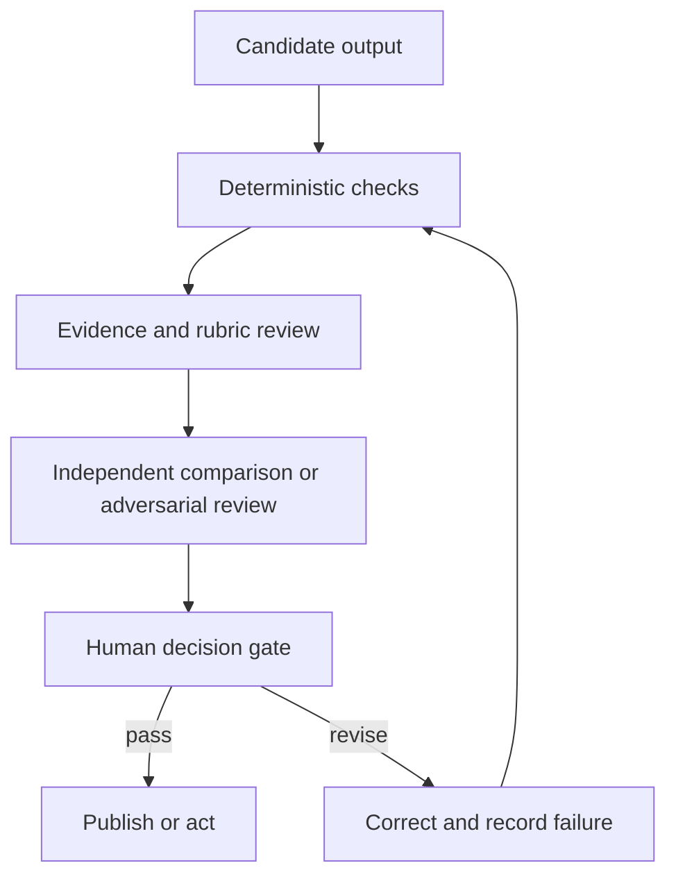

# 验证主张，而非置信度

> 流畅度反映表达质量。验证则提供证据，说明输出能否安全地完成任务。

**类型：** Learn
**语言：** Python
**前置要求：** [把请求变成可测试的合约](../../03-prompting-and-task-decomposition/)、[把每项事实放进正确的上下文](../../04-context-knowledge-memory-and-caching/)、[评估与测试](../../../../../phases/11-llm-engineering/10-evaluation/)
**预计时间：** 约 115 分钟

## 学习目标

- 针对具体任务，为准确性、完整性、一致性、受众适配、偏见和格式制定标准。
- 把后果严重的主张追溯到权威证据。
- 组合使用确定性检查、rubric 评分器、独立审核和人工判断。
- 诊断幻觉、遗漏、矛盾、范围和引用失败。
- 先从模型能力限制诊断异常输出，再选择修复方案。
- 把生产失败转成长期有效的评估案例。

## 问题所在

Claude 根据客户数据和内部政策生成每周管理层简报。简报开头有力，建议简洁，每节都有引用。管理层据此批准了一项政策变更。

后来，一位分析师发现三个问题。一处引用指向一份只提到相关主题、却不支持该主张的文档；一个小客户群在聚合过程中消失了；还有一条建议超出团队权限。

文档有引用、语气专业，所以看起来像是经过验证。实际上没人检查覆盖范围、蕴含关系或行动范围。

这就是为什么输出评估在 Claude Certified Associate 蓝图中权重最高。结果通过与其后果相称的检查后，Claude 工作流才算结束。

## 核心概念

### 从输出的职责出发

评估标准应由输出要支持的决策决定。头脑风暴清单和监管申报文件需要不同的证据与审核。

可以从六个维度开始：

1. **准确性：** 事实主张是否有证据支持？计算是否正确？
2. **完整性：** 必需项目、群体、例外和限制条件是否齐全？
3. **一致性：** 章节、数字、标签和建议是否相互一致？
4. **受众适配：** 目标读者能否理解并据此行动？
5. **公平与安全：** 输出是否引入无正当理由的偏见、暴露数据或违反政策？
6. **格式合规：** 是否满足人员和系统的结构要求？

这些只是类别，不是分数。要把它们转成可观察测试。

薄弱标准：

```text
The report is accurate and complete.
```

可测试标准：

```text
Every quantitative claim must reconcile with the supplied dataset.
Every recommendation must cite at least one supporting finding and one governing constraint.
All seven operating regions must appear or be marked "no data."
The summary must state the two largest uncertainties.
```

### 把主张追溯到证据

引用只是指针。验证要判断所指证据是否支持确切主张。

建立主张—证据矩阵：

| 主张 ID | 主张 | 来源 | 支持类型 | 权威性 | 审核结果 |
|---|---|---|---|---|---|
| C-01 | 北部地区退货量上升 | 数据集第 120-184 行 | 直接计算 | 一手数据 | 通过 |
| C-02 | 培训导致变化 | 访谈记录 7 | 推测 | 轶事 | 失败 |
| C-03 | 退款需要批准 | 政策 4.2 | 直接引用 | 获批政策 | 通过 |

矩阵把四个常见问题分开：

- 来源存在吗？
- 对这项主张而言，它具有权威性吗？
- 它确实蕴含该主张，还是只讨论了相关主题？
- 主张是否强于证据？

报告可以引用正确，却仍夸大因果关系。“之后发生”不能证明“由此导致”。

### 重试前先诊断属性

“输出不符合预期”不是有效诊断。泛泛重试通常会复现相同失败，因为原因并未改变。

Anthropic 的能力入门课程把诊断归纳为四种模型属性。把它们组织成一棵实用故障树，比孤立地使用四个标签更容易定位问题：

| 属性 | 失败信号 | 针对性应对 |
|---|---|---|
| 下一 token 预测 | 答案流畅且看似合理，却没有证据支持 | 用提供的证据约束后果严重的主张，要求弃答，并验证蕴含关系 |
| 知识 | 任务依赖最新、罕见、私有或有争议的事实 | 添加当前权威来源并暴露不确定性，不依赖参数记忆 |
| 工作记忆 | 重要上下文被埋没、当前会话中缺失，或与过多材料竞争 | 只检索相关上下文、拆分任务、总结状态并验证覆盖范围 |
| 可引导性 | 指令模糊、冲突、过长或无法检查 | 把请求重写成简洁合约，明确优先级、示例、约束和验收测试 |

多种属性可能同时失败。一个很长的政策问题可能超出有效工作记忆，同时又要求模型知识之外的事实。记录一项主要属性、所有促成属性、诊断证据，以及针对每项原因的修复。

可选的 AI Fluency 4D 检查补充了同一决策中的人工一侧：

- **委派：** 决定哪些工作可以委派，哪些判断必须留给人。
- **描述：** 提供系统所需的上下文、目标、约束和成功标准。
- **辨别：** 评估结果是否准确、实用且合适。
- **尽责：** 在整个工作流中落实隐私、归属、政策和问责。

这些检查不能替代具体任务的评估，但能帮助你选择合适的评估器和修复方案，避免把每个失败都归为“prompt 写得不好”。

### 使用分层验证

没有任何单一评估器足够可靠。组合多个层级：



**确定性检查**是代码或精确规则，适合验证 schema 有效性、必需字段、行总数、取值范围、引用 ID 是否存在、禁用词和权限标志。

**Rubric 审核**处理需要解释的质量，例如摘要是否保留核心例外。模型可以按 rubric 评分，但评分器本身也需要测试。

**独立或对抗性审核**通过单独一轮检查，寻找缺乏支持的主张、遗漏群体、冲突和不安全建议。独立性很重要。让生成过程自行宣告正确，会产生相关联的盲区。

**人工审核**负责后果、模糊取舍和组织权限。人工不应重复每项机械检查，而应收到证据、不确定性、失败检查，以及需要判断的决策。

### 让评估器匹配属性

为每项属性选择成本最低且可靠的评估器：

| 属性 | 最合适的首选评估器 |
|---|---|
| 有效 JSON | Parser 或 schema 验证器 |
| 算术总数 | 确定性计算 |
| 必需字段完全匹配 | 程序断言 |
| 语义得到保留 | 基于 rubric 的比较 |
| 段落支持主张 | 引用原文片段的证据审核 |
| 管理层语气合适 | 人工或经过测试的 rubric 评分器 |
| 高影响公平决策 | 依据政策的合格人工审核 |

不要让 LLM 判断代码能精确确定的事情，也不要强迫代码决定依赖上下文的伦理取舍。

### 幻觉不只一种失败

修复前先给缺陷分类：

- **捏造：** 编造了事实或来源。
- **错误归属：** 把真实主张归给了错误来源。
- **越界推断：** 结论强于证据。
- **遗漏：** 缺少必需事实、群体或例外。
- **矛盾：** 输出的两个部分无法同时为真。
- **范围违规：** 回复超出请求范围或权限。
- **过时：** 曾经有效的事实已经不再是最新。
- **格式失败：** 下游系统无法使用内容。

不同缺陷需要不同修复。捏造可能需要限定来源和弃答；遗漏可能需要覆盖清单；矛盾可能需要对账环节；格式失败可能需要结构化输出和 parser 验证。

### 评估集要体现风险

实用评估集不能只有正常示例，还应包括：

- 常见的代表性任务。
- 重要边缘案例。
- 先前观察到的失败。
- 缺失和冲突证据。
- 藏在来源文本中的对抗性指令。
- 涉及隐私、公平或未授权操作的案例。
- 接近长度和格式限制的输入。

按风险组跟踪表现。95% 的汇总分数可能掩盖最重要案例只有 40% 的通过率。

为重大 prompt 或模型变更保留一个留出集。如果反复针对每个案例调优，工作流可能只记住测试形式，却无法泛化。

### 不带品牌偏见地比较输出

比较 prompt 或模型变体时：

1. 使用相同案例和标准。
2. 条件允许时，隐藏每项结果来自哪个系统。
3. 随机排列展示顺序。
4. 先为各维度评分，再给出整体偏好。
5. 调查审核者之间的分歧。
6. 重复运行足够次数，以观察不稳定性。

一份偏好的输出只是一则轶事。部署决策需要观察代表性风险上的结果分布。

## 动手构建

### 第 1 步：定义发布门槛

把门槛写成三级：

```text
Blocker: unsupported high-impact claim, exposed restricted data, invalid total
Required: all regions covered, citations resolvable, recommendation within authority
Quality: concise summary, readable headings, minimal repetition
```

阻断项会阻止发布。质量问题则可能允许先发布再创建修复工单，具体取决于政策。这样可以避免外观偏好与安全失败争夺优先级。

### 第 2 步：建立验证记录

记录每次运行：

```json
{
  "workflow_version": "brief-v3",
  "source_snapshot": "2026-W31",
  "checks": {
    "schema": "pass",
    "totals_reconcile": "pass",
    "claim_support": "fail",
    "privacy": "pass"
  },
  "failed_claims": ["C-08"],
  "uncertainties": ["West region sample incomplete"],
  "reviewer_decision": "revise"
}
```

这些值仅作说明。生产环境中，应对验证日志执行相应保留与隐私政策。

对于异常结果，附上一份简短诊断：

```json
{
  "primaryProperty": "knowledge",
  "contributingProperties": ["next-token-prediction"],
  "evidence": "The cited policy was published after the model's supplied source snapshot.",
  "targetedFix": "Retrieve the approved current policy and rerun claim-support checks.",
  "humanCompetency": "discernment"
}
```

只有标签没有价值。证据和针对性修复能让诊断变得可测试。

### 第 3 步：分开生成与审核

向审核者提供草稿、标准和来源证据，不要允许它暗中改写。

```text
Return one row per finding:
claim_id | severity | evidence | criterion | proposed correction

If no supplied source supports a claim, mark it unsupported.
Do not invent replacement evidence.
```

生成器随后可以根据明确的发现列表修订。保留原始发现和修正结果，以便审计。

### 第 4 步：校准评分器

创建通过、临界和失败输出示例，让合格审核者进行标注，再把自动评分器的判断与人工参考进行比较。

先检查误放，因为它们会放出坏结果；再检查误拦，因为它们会浪费审核容量。记录人工判断确实存在的合理分歧，不要强求虚假的一致。

### 第 5 步：闭环

每项重大生产失败都应至少产生一项长期产物：

- 一个新评估案例。
- 一项更精确的标准。
- 一项确定性检查。
- 一项来源管理修复。
- 一项 prompt 或工作流变更。
- 一项监控信号或升级规则。

修完单份报告，还要改进放行它的系统。

## 交互实验

使用文档与视觉流水线检查从输入证据到提取字段、主张、验证发现和发布决策的每一步转换。切换视觉提取失败或主张缺乏支持的状态，观察哪项门槛必须阻止发布。

```figure
05-document-vision-pipeline
```

## 实践实验

针对填写完成的主张矩阵运行发布评分器。把阻断决策改成发布、让一项主张指向不存在的来源、把精确总数交给模型评判，或从异常输出诊断中删掉一种能力属性，确认发布验证会失败。

## 交付产物

`outputs/claim-validation-record.json` 是填写完成的审核数据包，包含主张—证据矩阵、四属性能力诊断、发布门槛、评估器分工、不确定性，以及最终 `revise` 决策。它特意保留了一条失败的因果主张，以展示阻断路径。

## 验证

运行确定性检查：

```bash
cd certifications/claude/lessons/05-output-evaluation-and-validation/code
python3 main.py
python3 -m unittest discover tests -v
```

验证器会证明主张 ID 唯一、每项来源引用都能解析、能力诊断包含全部四种属性和针对性修复、精确属性使用确定性评估器，而且阻断失败不能产生发布决策。

## 综合项目关联

测验会检查蕴含关系、评估器选择、风险切片失败和回归学习。把这份数据包作为第 29 至 32 课综合项目的验证和审核证据。

## 上手使用

### 考试决策模式

被问到如何改进输出质量时：

1. 定义输出的目的和后果。
2. 选择明确且针对任务的标准。
3. 对精确属性使用精确检查。
4. 把重要主张追溯到权威证据。
5. 对模糊或高影响内容保留独立审核和人工审核。
6. 把观察到的失败反馈到评估集中。

### 常见坑

- **把流畅当正确：** 打磨精致的答案也可能错误。
- **把引用当支持：** 链接未必蕴含主张。
- **只看一个汇总分数：** 关键风险群体消失在平均值中。
- **只有自我审核：** 生成器和审核者共享相同假设与遗漏。
- **用 LLM 做精确算术：** 确定性检查更便宜、更可靠。
- **人工审核没有数据包：** 审核者只收到正文，没有主张、证据或失败检查。
- **只测试顺利路径：** 缺失、冲突、过时和对抗性输入仍不可见。
- **只修症状：** 报告改好了，失败案例却从未进入测试套件。

### 练习

1. 把五个主观质量目标转成可观察标准。
2. 为一页报告建立主张—证据矩阵，并标出越界推断。
3. 为十项检查分配确定性、rubric、独立或人工评估器。
4. 建立一个包含四个正常案例、三个边缘案例和三个高风险案例的评估集。
5. 对两份输出进行盲测比较，并记录审核者的分歧。

## 关键术语

- **蕴含关系：** 证据是否真正支持所述主张。
- **评估集：** 用于测量行为的一组代表性和风险导向案例。
- **确定性检查：** 对精确预期属性执行的可重复程序测试。
- **Rubric 评分器：** 按既定定性标准进行评估的人或模型。
- **独立审核：** 不依赖生成器自我判断的单独评估环节。
- **发布门槛：** 输出发布或用于行动前必须通过的条件。
- **误放：** 评估器错误接受无效输出。
- **回归：** 变更后，原先通过的行为发生失败。

## 延伸阅读

- [Anthropic：定义成功标准并构建评估](https://platform.claude.com/docs/en/test-and-evaluate/develop-tests)
- [Anthropic：评估工具](https://platform.claude.com/docs/en/test-and-evaluate/eval-tool)
- [Anthropic：减少幻觉](https://platform.claude.com/docs/en/test-and-evaluate/strengthen-guardrails/reduce-hallucinations)
- [Anthropic Academy：AI 能力与限制](https://anthropic.skilljar.com/ai-capabilities-and-limitations)
- [Anthropic Academy：AI Fluency 框架与基础](https://anthropic.skilljar.com/ai-fluency-framework-foundations)
- [AI Engineering from Scratch：高级 RAG 与评估](../../../../../phases/11-llm-engineering/07-advanced-rag/)
- [AI Engineering from Scratch：审核 agent](../../../../../phases/14-agent-engineering/39-reviewer-agent/)
- [AI Engineering from Scratch：公平标准](../../../../../phases/18-ethics-safety-alignment/21-fairness-criteria-group-individual-counterfactual/)

评估工具、模型行为和产品界面都可能变化。这些官方参考资料于 2026-08-08 核验。模型、prompt、来源、工具或工作流政策变化时，都要重新验证评分器和门槛。
