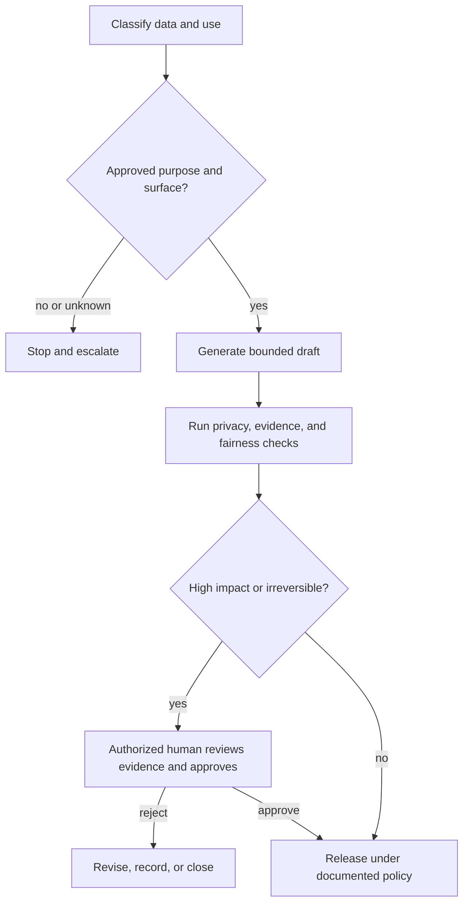

# 让能力受权责边界约束

> 模型可以生成答案，却不代表它有权查看数据、做出决策或执行操作。

**类型：** Learn
**语言：** Python
**前置要求：** [把每项事实放进正确的上下文](../../04-context-knowledge-memory-and-caching/)、[验证主张，而非置信度](../../05-output-evaluation-and-validation/)、[护栏](../../../../../phases/11-llm-engineering/12-guardrails/)
**预计时间：** 约 110 分钟

## 学习目标

- 在选择 Claude 载体或工作流前，对信息和用例进行分类。
- 区分技术能力、组织许可与人工决策权。
- 为隐私、安全、偏见、透明度、保留和滥用风险设计控制措施。
- 根据后果、可逆性和模糊程度设置人工审核。
- 为不安全或不合规行为建立事件与升级路径。

## 问题所在

一位客户成功经理想加快账号审核。他们把支持记录、合同摘录和续约笔记粘贴到未经批准的个人 AI 账号中。Claude 生成的摘要很实用，于是经理又要求它按续约风险对客户排序，并自动发送特别优惠。

还没谈输出质量，这个工作流就已经存在多项失败：

- 支持记录包含个人信息和商业敏感数据。
- 没人检查适用的产品条款与保留控制。
- 排名可能导致不同客户群受到不均等对待。
- 经理无权自动批准折扣。
- 来源、审核过程和已发送消息都没有记录。

在 prompt 中加一句“保护隐私”修不好这个系统。治理要定义谁可以使用哪些数据、出于什么目的、在哪种载体上、采用哪些控制，以及最终由谁负责。

## 核心概念

### 处理前先分类

先看数据和决策，再看模型。

一个简单的组织分类可以是：

| 类别 | 示例 | 典型控制方向 |
|---|---|---|
| 公开 | 已发布文档 | 核验完整性和归属 |
| 内部 | 非公开流程笔记 | 使用获批账号并实施访问控制 |
| 机密 | 合同、客户详情 | 只使用必需数据、严格限制权限、复核保留策略 |
| 受限 | 秘密、受监管记录、高度敏感标识符 | 禁止处理，或要求使用专门批准的受控工作流 |

这些标签只是示例，不是普遍法律。应采用组织的实际政策与法律指导。

用例也要分类。为人工审核者总结文本，与决定资格或发送有约束力的通信完全不同。低敏感度输入仍可能支持高影响决策。

在接收环节问五个问题：

1. 哪些数据会进入工作流？
2. 获批目的是什么？
3. 谁可以访问输入和输出？
4. 后续可能产生什么决策或行动？
5. 记录可以保留多久？

如果有任何答案未知，先澄清政策，再开始生成。

### 能力、许可与决策权相互独立

Claude 在技术上可以起草优惠方案。连接器可能有权限访问客户记录。两者都不代表工作流获准批准折扣或发送消息。

使用三道门槛：

```text
Capability: Can the system perform the operation?
Permission: May this identity access the required data or tool?
Authority: May this role make or execute the decision?
```

三项都必须通过。工具权限应遵循最小权限原则，只向工作流提供获批目的所需的数据和操作。后果显著时，应把读取、起草、批准和执行角色分开。

### 最小化数据并限制目的

目的限制意味着，为一项工作批准的数据不会自动获准用于另一项工作。为解决事件而收集的支持记录，未必获准用于客户画像。

数据最小化要求使用足够完成任务的最小输入：

- 不需要身份时移除姓名。
- 用范围受限的引用替代确切标识符。
- 只检索相关章节，避免读取整份记录。
- 避免把秘密放进 prompt 或日志。
- 只输出下一步所需字段。

最小化能减少暴露、prompt 体积和意外二次使用，但不能替代获批载体和有记录的政策。

### 产品条款是可能变化的事实

不同消费产品、商业产品、API 用法、套餐和配置设置，在数据使用、保留、区域处理、管理控制和功能可用性上可能不同。这些事实也会变化。

不要把某个 Claude 载体上的假设直接套到另一个载体。部署前，根据当前官方条款和组织合同核验：

- 提交的数据是否以及如何被使用。
- 默认和可配置的保留时间。
- 删除行为与法律例外。
- 管理员访问与审计能力。
- 区域或数据驻留选项。
- 连接器和第三方数据处理。

在工作流决策日志中记录来源和核验日期。

### 人工审核应设置在决策边界

“有人参与”太模糊。要明确这个人会看到什么、决定什么，以及可以阻止什么。

以下任一项较高时，应加强审核：

- 对人员、财务、权利、安全或声誉的影响。
- 操作的不可逆性。
- 政策或证据的模糊程度。
- 案例的新颖程度。
- 操作后发现错误的难度。



审核者需要看到来源证据、模型输出、不确定性、政策约束和拟执行操作。只有一个批准按钮，只会形成仪式化监督。

### 公平性需要明确群体和结果

要求模型“保持公正”解决不了偏见。要定义：

- 谁会受到影响？
- 会分配或拒绝什么结果？
- 哪些属性或代理变量可能造成无正当理由的差异？
- 使用哪种比较和门槛？
- 谁有资格解释结果？
- 有什么申诉或修正路径？

在合法且适当的前提下，按相关群体测试。既要调查数据不平衡，也要调查工作流设计。如果人工审核者看到同样误导性的证据，也可能复制相同偏见。

对于涉及就业、信贷、住房、医疗、教育、公共服务或法定权利的决策，应请合格的政策、法律和领域负责人参与。本课程不构成法律建议。

### 透明度应服务受影响的人

有用的透明度会说明：

- 政策要求披露时，AI 是否实质参与。
- 哪些信息影响了结果。
- 仍存在哪些不确定性或限制。
- 谁做出了最终决策。
- 如何申请修正或提出申诉。

不要为了满足模糊的透明度要求，而暴露隐藏系统指令、安全控制、个人数据或专有推理。应在问责所需的层面解释流程和证据。

### 护栏需要纵深防御

Prompt 指令只是其中一层。完整的工作流还可以包括：

- 输入分类与访问控制。
- 秘密和个人数据检测。
- 可信来源检索过滤。
- 工具 allowlist 和限定范围的凭证。
- 结构化输出与确定性验证。
- 内容与政策检查。
- 有后果操作前的批准。
- 速率与支出上限。
- 采用适当保留策略的审计日志。
- 监控、回滚和事件响应。

假设来源内容可能包含恶意指令。检索到的文档属于不可信数据，不能作为命令执行。清楚划定边界，把工具授权放在模型文本之外。

### 事件需要预设处理路径

事件可能是隐私暴露、不安全建议、未授权工具使用、系统性偏见、prompt 注入，或反复出现的无证据输出。

上线前做好准备：

1. **检测：** 定义信号和报告渠道。
2. **控制：** 暂停工作流、撤销凭证或禁用操作路径。
3. **保全：** 在不扩散敏感数据的前提下保留获批证据。
4. **通知：** 遵循组织和法律升级规则。
5. **纠正：** 修复数据、权限、prompt、模型或工作流控制。
6. **学习：** 添加评估案例和监控，防止复发。

未核对实际政策与司法辖区前，不要承诺删除、通知时限或法律结论。

## 动手构建

### 第 1 步：编写用例卡

```text
Purpose:
Data classes:
Affected people:
Allowed sources:
Approved Claude surface:
Allowed outputs:
Prohibited actions:
Human decision owner:
Retention rule:
Incident owner:
```

目的、数据类别或行动权限发生变化时，必须明确批准。

### 第 2 步：建立控制图

把每项风险映射到预防、检测和纠正控制：

| 风险 | 预防 | 检测 | 纠正 |
|---|---|---|---|
| 个人数据暴露 | 最小化并脱敏输入 | 扫描 prompt 和输出 | 控制影响、通知、轮换访问权限 |
| 缺乏支持的建议 | 限定来源 | 主张—证据验证 | 阻止并修订 |
| 未授权操作 | 只读工具与批准 | 审计尝试的操作 | 撤销凭证并调查 |
| 不均等对待 | 定义标准和代表性测试 | 分群评估 | 返工数据、政策或工作流 |

单项控制很少能覆盖完整失败路径。

### 第 3 步：设计批准数据包

审核者应收到：

- 拟议决策或操作。
- 支持与冲突证据。
- 数据和政策分类。
- 自动检查结果。
- 已知不确定性。
- 可逆性和受影响群体。
- 明确的批准、修订、拒绝与升级选项。

人工决策与模型建议要分别记录。

### 第 4 步：开展威胁研讨

至少测试以下情况：

- 意外出现受限数据。
- 已连接文档包含忽略政策的指令。
- 用户请求超出批准目的。
- 模型提出超出角色决策权的操作。
- 评估显示某个受影响群体存在差异。
- 第三方连接器不可用或行为发生变化。

记录哪项控制能发现问题，以及接下来由谁处理。

## 交互实验

使用置信度—风险图调整证据置信度、后果、可逆性和受影响群体。调整后可以看到：即使输出置信度很高，只要决策权或影响程度较高，仍然需要审核。

```figure
06-data-analysis-confidence
```

## 实践实验

运行治理评分器。把分析置信度提高到 1.0、移除人工门槛，或允许不可信内容授权修改操作。结果应表明，置信度永远无法替代决策权或后果控制。

## 交付产物

`outputs/responsible-use-control-map.json` 是填写完成的客户续约辅助治理数据包，包含获批目的、数据类别、禁止操作、预防/检测/纠正控制、人工批准数据包和事件负责人。

## 验证

验证控制措施：

```bash
cd certifications/claude/lessons/06-governance-safety-and-responsible-use/code
python3 main.py
python3 -m unittest discover tests -v
```

验证器会拒绝以下情况：控制层缺失、事件无人负责、高影响操作没有授权人工门槛，以及任何允许不可信内容授权修改的设计。

## 综合项目关联

测验会检查能力与决策权、数据最小化、特定载体条款、审核质量、注入边界和公平性应对。把这份数据包带入 Associate 综合项目 29 和 Professional Architect 综合项目 32，作为治理与批准证据。

## 上手使用

### 考试决策模式

在治理场景中：

1. 对数据、目的和后果进行分类。
2. 检查当前获批产品条款和组织政策。
3. 最小化输入和权限。
4. 把生成能力与做出或执行决策的权力分开。
5. 在高影响或不可逆操作前设置有实际意义的人工门槛。
6. 保留证据、可审计性、申诉渠道和事件响应。

### 常见坑

- **只靠 prompt 治理：** 一句话无法执行访问或保留规则。
- **把技术访问当决策权：** 把连接器权限误认为业务批准。
- **所有载体采用同一隐私规则：** 产品和合同行为各不相同。
- **先收集，以后再找用途：** 二次用途没有获得批准。
- **人工走过场：** 审核者缺少证据或无权拒绝。
- **靠指令实现公平：** 没有定义群体、衡量方式或申诉路径。
- **最大化日志：** 审计数据会制造新的隐私和安全风险。
- **对合规过度自信：** 工作流在没有合格审核时给出法律结论。

### 练习

1. 对组织内三个工作流的数据和操作进行分类。
2. 为一项 Claude 辅助流程创建用例卡。
3. 建立包含预防、检测和纠正控制的控制图。
4. 按最小权限原则，为权限过宽的连接器重新设计权限范围。
5. 为一条后果严重的建议编写批准数据包。
6. 进行一次事件桌面推演，并确定第一个控制措施。

## 关键术语

- **目的限制：** 只将数据用于获批目标。
- **数据最小化：** 只处理该目标所需的信息。
- **最小权限：** 只授予必需的最小访问与操作范围。
- **人工决策门槛：** 授权人员可以检查、拒绝、修订或批准的明确节点。
- **纵深防御：** 在失败路径上部署多重控制。
- **Prompt 注入：** 不可信内容试图改变模型或工具行为。
- **申诉路径：** 受影响人员质疑或修正结果的流程。
- **事件响应：** 预先准备的检测、控制、通知、纠正和学习措施。

## 延伸阅读

- [Anthropic：API 与数据保留](https://platform.claude.com/docs/en/manage-claude/api-and-data-retention)
- [Anthropic 隐私中心](https://privacy.anthropic.com/)
- [Anthropic 信任中心](https://trust.anthropic.com/)
- [Anthropic：负责任扩展政策](https://www.anthropic.com/responsible-scaling-policy)
- [Anthropic：减少 prompt 泄露](https://platform.claude.com/docs/en/test-and-evaluate/strengthen-guardrails/reduce-prompt-leak)
- [AI Engineering from Scratch：安全、秘密与审计](../../../../../phases/17-infrastructure-and-production/25-security-secrets-audit/)
- [AI Engineering from Scratch：合规框架](../../../../../phases/17-infrastructure-and-production/26-compliance-frameworks/)
- [AI Engineering from Scratch：公平性标准](../../../../../phases/18-ethics-safety-alignment/21-fairness-criteria-group-individual-counterfactual/)

隐私、保留、管理控制、产品条款和监管义务都会变化，也可能因载体、套餐、合同、地点和设置而不同。这些官方来源于 2026-08-08 核验。处理敏感数据或自动化后果严重的决策前，请核验当前条款，并获得组织内合格人员的指导。
