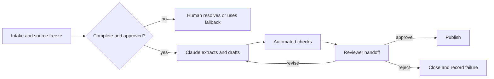

# 自动化前先设计交接

> Claude 完成任务后，工作流还没有结束。下一个人必须能够验证、决策、行动并恢复。

**类型：** Learn
**语言：** Python
**前置要求：** [验证主张，而非置信度](../../05-output-evaluation-and-validation/)、[让能力受权责边界约束](../../06-governance-safety-and-responsible-use/)、[Anthropic 工作流模式](../../../../../phases/14-agent-engineering/12-anthropic-workflow-patterns/)
**预计时间：** 约 105 分钟

## 学习目标

- 先绘制当前工作流，再决定 Claude 应在哪里参与。
- 判断工作流步骤应辅助、自动化、重新设计还是拒绝。
- 明确步骤的输入、输出、负责人、门槛、备用路径和服务预期。
- 构建保留证据、不确定性和决策权的人工交接数据包。
- 衡量工作流价值，不忽略审核、失败和维护成本。

## 问题所在

某产品团队把每周发布简报自动化了。Claude 阅读 issue 摘要、起草简报，并在每周五发布到共享频道。

前两份简报节省了时间。第三份包含一个已经移出范围的功能，第四份漏掉一项尚未解决的安全问题。过去负责汇总简报的工程师以为产品经理现在负责审核，产品经理则以为自动发布的内容已经获批。

团队自动化了文本生产，却删掉了责任模型。工作流没有来源截止点、批准门槛、升级路径，也没有数据不完整时的备用方案。

成功的工作流由一串职责组成，每项职责都有明确证据和可恢复状态。

## 核心概念

### 先绘制当前状态

添加 Claude 前，先观察工作实际如何流转：

- 什么事件会启动工作？
- 谁提供每项输入？
- 哪些系统是记录来源？
- 人们在哪里运用判断？
- 哪些例外最耗时间？
- 谁批准结果？
- 接下来会触发什么下游操作？
- 如何发现并恢复失败？

不要只记录理想流程。跟随几个真实案例，非正式检查往往承载着关键知识。如果没有把它们编码或分配给负责人就直接删除，质量会下降，而新工作流表面上仍显得高效。

### 先选干预方式，再选工具

为每个步骤选择四种干预方式之一：

1. **辅助：** Claude 提议、总结、提取或起草，人员仍是操作主体。
2. **自动化：** 系统依据政策执行边界明确、经过充分测试且可逆的步骤。
3. **重新设计：** 当前步骤由糟糕的输入或系统重复造成浪费，应删除或重构。
4. **拒绝：** 由于数据、后果、模糊性或政策风险不可接受，该步骤不应使用 Claude。

自动化不一定代表成熟度最高。如果分析师花数小时核对两个相互冲突的电子表格，更快生成核对说明并不能解决来源冲突。

### 把每个步骤写成合约

每个步骤都应包含：

```text
Trigger:
Owner:
Allowed inputs and sources:
Transformation:
Output schema:
Pass criteria:
Timeout or service expectation:
Escalation condition:
Fallback:
Next owner:
```

合约让每个步骤都能独立测试，也能防止责任在多个系统之间消失。

对于发布简报提取步骤：

```text
Trigger: Thursday 15:00 source freeze
Owner: release coordinator
Inputs: approved tracker view and signed security status
Output: structured candidate items with source IDs and status
Pass: all required teams represented; unresolved fields marked
Escalate: missing security status or conflicting launch state
Fallback: coordinator uses the manual template
Next owner: product manager validates inclusion decisions
```

### 根据后果与可逆性设置控制

两个问题决定自动化深度：

1. 如果结果错误，后果有多严重？
2. 能否在造成伤害前，以低成本撤销操作？

| 后果 | 可逆 | 设计方向 |
|---|---|---|
| 低 | 是 | 可以采用带监控的边界自动化 |
| 高 | 是 | 先生成或暂存，发布前必须审核 |
| 低 | 否 | 增加确认、审计并缩小范围 |
| 高 | 否 | 保留授权人工决策门槛和可靠备用路径 |

保存待审核的草稿，与向数千名客户发送消息完全不同。把操作决策权视为一项独立能力。

### 选择符合依赖关系的工作流模式

Claude 工作流通常使用少数几种模式：

- **Prompt chaining：** 固定顺序，每个阶段都可以检查。
- **路由：** 对工作分类，并发送到专门路径。
- **并行化：** 并行运行相互独立的分析，再协调结果。
- **Orchestrator-workers：** 协调者把可变工作拆成子任务，再综合结果。
- **Evaluator-optimizer：** 生成、按标准审核并修订，直到通过门槛或达到限制。

优先选择能够表达工作的最简单模式。固定五阶段报告不需要开放式 agent。路由工作流则需要可观察的路由信号，以及模糊案例的备用路径。



### 交接本身就是产品

交接应尽量减少重新调查。向下一位负责人提供：

- 所需决策和截止时间。
- 工作流范围与版本。
- 来源 ID 和新鲜度状态。
- 候选输出。
- 已通过和失败的检查。
- 已知不确定性与冲突。
- 已执行的操作。
- 可选操作：批准、修订、拒绝、升级。
- 备用与恢复说明。

不要把关键限制藏在长记录末尾。交接应围绕决策组织。

接手人必须知道还有哪些职责归自己。“请审核”信息不足。应具体写明：“确认 R-14 和 R-19 已获准对外发布；其余检查均已通过。”

### 在失败时保留状态

长工作流会失败。API 会超时，连接器会返回部分数据，审核者会错过截止时间，输入也可能在生成后发生变化。

在有意义的边界建立检查点：

- 来源快照已接受。
- 提取已验证。
- 草稿版本已生成。
- 审核发现已记录。
- 批准已记录。
- 外部操作已完成。

尽可能让重试具备幂等性。重试草稿生成通常安全；发送或财务操作如果没有幂等键，重试可能造成重复伤害。

上线前定义人工备用路径。如果当前没有任何员工能执行备用路径，这种韧性就是虚构的。

### 衡量完整工作流

同时跟踪价值和风险：

```text
net value = time saved
          - human review time
          - correction and incident cost
          - platform and model cost
          - maintenance cost
```

实用运营指标包括：

- 端到端完成时间。
- 排队与审核时间。
- 首次通过率。
- 高严重度误放率。
- 升级与备用路径使用率。
- 单案例返工量。
- 单个获接受结果的成本。
- 来源新鲜度失败。
- 用户修正与申诉结果。

如果审核变得更困难，更快的生成阶段未必能缩短端到端时间。

### 按利益相关者沟通限制

管理层需要预期价值、风险边界和就绪证据。操作人员需要确切输入、失败信号和备用步骤。审核者需要标准和决策权。安全与政策负责人需要数据流、权限、保留和事件控制。

不要把能力演示当成生产证据。要说明测试了什么、在哪些案例上测试、哪些部分仍由人工负责，以及哪些当前产品事实需要重新核验。

## 动手构建

### 第 1 步：绘制一个真实案例

画出当前流程中的角色和系统，并标记：

- 等待时间。
- 返工循环。
- 判断节点。
- 记录来源查询。
- 外部操作。
- 已知例外。

询问操作人员：哪项非正式检查能防止最严重的错误？

### 第 2 步：为候选干预评分

对每个步骤按 1 到 5 分评分：

| 因素 | 问题 |
|---|---|
| 重复性 | 是否反复执行相同转换？ |
| 清晰度 | 能否写出通过标准？ |
| 数据批准 | 输入是否获批且受控？ |
| 可逆性 | 错误操作能否被阻止或撤销？ |
| 可检测性 | 失败能否在造成伤害前被发现？ |

低分步骤应采用辅助、重新设计或拒绝，不适合自动化。

### 第 3 步：编写未来状态合约

定义每个步骤、负责人、门槛、检查点、备用路径和服务预期。明确写出人工路径，再让操作人员、审核者和政策负责人分别演练一个正常案例和一个例外。

### 第 4 步：构建交接数据包

使用稳定模板：

```text
Decision required:
Deadline and owner:
Workflow and source versions:
Candidate result:
Evidence:
Checks passed:
Checks failed:
Uncertainty:
Actions available:
Fallback:
```

如果数据包漏掉必需阻断项或来源版本，应拒绝接收。

### 第 5 步：以影子模式试点

让 Claude 与现有流程并行运行，但不允许它执行外部操作。比较结果和审核投入。应包含例外，不要只测试简单案例。只有门槛通过、事件负责人准备就绪后，才进入有限发布。

## 交互实验

使用审核门槛图调整后果、可逆性、模糊程度和证据完整性。控制应在进入不可逆状态前，从边界自动化转为强制审核。

```figure
07-human-review-threshold
```

## 实践实验

运行交接评分器。移除负责人、检查点、备用路径，或删除发布步骤的批准要求，观察合约如何失败。然后清除未解决的审核检查，比较推荐的下一步操作。

## 交付产物

`outputs/workflow-handoff-packet.json` 是填写完成的发布简报工作流，包含步骤负责人、门槛、检查点、备用路径、服务预期和可直接行动的审核数据包。

## 验证

在本地验证工作流：

```bash
cd certifications/claude/lessons/07-workflow-design-and-human-handoffs/code
python3 main.py
python3 -m unittest discover tests -v
```

验证器会检查每个步骤是否具有负责人、门槛、升级条件、备用路径和下一位负责人；不可逆发布是否经过人工批准；交接是否列明失败检查和可选决策。

## 综合项目关联

测验会检查当前状态绘制、重新设计、交接内容、重试安全、责任归属和影子模式就绪情况。把验证后的数据包作为 Associate 综合项目 29 的运营与审核交接。

## 上手使用

### 考试决策模式

对于工作流场景：

1. 绘制当前决策、证据、角色和例外路径。
2. 自动化前先消除流程浪费。
3. 选择符合依赖关系的最简单模式。
4. 在后果严重或不可逆边界保留人工决策权。
5. 发送包含证据和失败检查的结构化交接。
6. 上线前定义检查点、备用路径、监控和负责人。

### 常见坑

- **自动化文案，却删除负责人：** 没人知道谁负责批准。
- **把演示当部署证据：** 正常示例会掩盖例外与运营问题。
- **固定流程使用开放式 agent：** 复杂度增加，却没有价值。
- **把相互依赖的工作并行化：** 证据尚未验证，综合就已经开始。
- **把人工参与当口号：** 没有审核数据包，也没有拒绝决策权。
- **没有来源截止点：** 输出审批期间，输入仍在变化。
- **重试一切：** 不可逆操作可能执行两次。
- **只衡量节省时间：** 审核、修正、失败与维护全被忽略。

### 练习

1. 绘制一项重复工作流，并找出一项非正式质量检查。
2. 把每个步骤归类为辅助、自动化、重新设计或拒绝。
3. 为价值最高的候选步骤编写步骤合约。
4. 为只有五分钟时间的审核者设计交接数据包。
5. 进行一次失败桌面推演：来源在批准后、发布前发生变化。
6. 定义五项能揭示工作流是否创造净价值的指标。

## 关键术语

- **当前状态图：** 表示工作如今实际如何流转的图。
- **步骤合约：** 工作流步骤的触发条件、负责人、输入、转换、输出、门槛、升级条件、备用路径和下一位负责人。
- **交接数据包：** 为下一位负责人准备的结构化状态和证据。
- **检查点：** 已验证阶段之后的持久恢复点。
- **幂等性：** 重复操作不会造成效果叠加的属性。
- **影子模式：** 运行新工作流，但不允许它控制真实结果。
- **备用路径：** 自动化路径不安全或不可用时，采用的经过测试的替代路径。
- **来源截止点：** 固定输出代表哪些输入版本的边界。

## 延伸阅读

- [Anthropic：构建高效 agents](https://www.anthropic.com/research/building-effective-agents)
- [Anthropic：定义成功标准并构建评估](https://platform.claude.com/docs/en/test-and-evaluate/develop-tests)
- [AI Engineering from Scratch：范围合约](../../../../../phases/14-agent-engineering/36-scope-contracts/)
- [AI Engineering from Scratch：验证门槛](../../../../../phases/14-agent-engineering/38-verification-gates/)
- [AI Engineering from Scratch：多会话交接](../../../../../phases/14-agent-engineering/40-multi-session-handoff/)
- [AI Engineering from Scratch：先提议再提交](../../../../../phases/15-autonomous-systems/15-propose-then-commit/)

Claude 产品功能、连接器行为、模型能力、限制和成本都可能变化。这些来源于 2026-08-08 核验。把工作流从影子模式转入生产前，应重新核验当前官方文档和组织控制。
