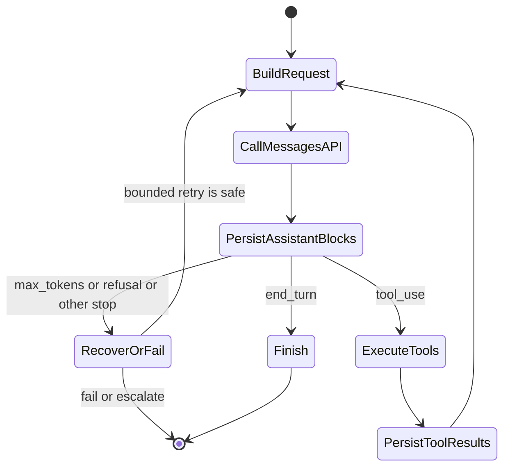

# Messages API 是一台状态机

> 对话状态由应用维护。一个放错位置的内容块就能破坏整个循环。

**类型：** Build
**语言：** Python
**前置要求：** [把能力花在失败代价高的地方](../../02-model-selection-and-token-economics/)、[把请求变成可测试的合约](../../03-prompting-and-task-decomposition/)、[把每项事实放进正确的上下文](../../04-context-knowledge-memory-and-caching/)
**预计时间：** 约 120 分钟

## 学习目标

- 把一次 Claude 请求建模为明确的应用状态转换
- 分别选择 SDK 或原始 REST，以及同步、流式或批量交付方式
- 使用明确的资产边界构建图片与文档内容块
- 保留类型化响应块，并根据 `stop_reason` 分支处理
- 执行会话、重试、超时、保留和上下文预算规范
- 不依赖真实 API key，测试完整生命周期

## 一次失败，读懂协议

某工程师发送了以下序列：

1. 用户问：“订单 A-17 在哪里？”
2. Claude 返回一个 ID 为 `toolu_01` 的 `tool_use` 块。
3. 应用运行 `lookup_order`。
4. 应用在一个新请求中只发送工具结果。

第二个请求失败了，或者 Claude 的回复仿佛它从未请求过工具。

这并不神秘。Messages API 是无状态的。客户端没有重新发送包含原始 `tool_use` 块的 assistant 消息。`tool_result` 不是独立事实；它在由你的代码维护的对话序列中，通过 ID 回答一项具体工具请求。

框架会替你维护消息数组，所以这个问题很容易被忽略。认证要求你在便利层之下理解协议。亲手构建一次原始状态机，之后调试任何 SDK、agent 框架和托管 runtime 都会容易得多。

## 一次请求，一次转换

请求向模型提供模型、system 指令、消息、token 控制和可选能力。响应返回内容块、用量元数据和生成停止原因。下一步做什么，由应用决定。

```json
{
  "model": "<current-model-id>",
  "max_tokens": 800,
  "system": "Answer from verified order data only.",
  "messages": [
    {
      "role": "user",
      "content": "Where is order A-17?"
    }
  ]
}
```

准确模型标识符和可选请求字段会变化。把它们当作配置；平台允许时，主动固定具体版本，并在当前[模型概览](https://platform.claude.com/docs/en/about-claude/models/overview)中核验。长期不变的合约是：客户端提交上下文，并收到类型化响应。



这张图比背 SDK 方法更有用。每条箭头都是应用的责任，你可以记录、测试、重试或拒绝它。

## 独立选择两种访问模式

客户端库和完成模式回答的是不同问题，应分别选择。

| 客户端 | 适用场景 | 仍由你负责 |
|---|---|---|
| 官方 SDK | 语言受支持，而且你需要类型化请求与响应模型、类型化错误、请求头管理、默认重试、分页和流式累积辅助工具 | 应用状态、`stop_reason` 政策、重试安全、工具授权、日志和最终验证 |
| 原始 REST | runtime 没有受支持的 SDK、受限环境不允许添加依赖，或需要定制 HTTP transport 或协议级 fixture | 身份验证与版本请求头、JSON 类型、SSE framing、超时、重试、错误映射、向前兼容和连接清理 |

对于受支持的生产语言，SDK 消除了协议样板，因此是更安全的默认选择；应用生命周期仍由你负责。只有额外控制值得额外测试负担时，才应使用原始 REST。[Python SDK 指南](https://platform.claude.com/docs/en/cli-sdks-libraries/sdks/python)记录了同步与异步客户端、类型化模型、流式辅助工具、默认重试和原始响应访问方式。[API 概览](https://platform.claude.com/docs/en/api/overview)则是直接 HTTP 合约。

然后选择一个或多个结果如何返回：

| 完成模式 | 最适合 | 完成证据 | 不适合 |
|---|---|---|---|
| 同步 Message | 一次交互请求，必须拿到完整响应后才能继续 | 一个解析后的 `Message`，且其 `stop_reason` 已处理 | 渐进式渲染或大型离线队列 |
| 流式 Message | 一次交互或长响应，需要部分展示或关注首 token 时间 | 累积内容、终止 `message_stop` 和最终消息元数据 | 根据部分 delta 执行不可逆操作 |
| Message Batch | 大量可以稍后完成的独立请求 | 异步处理后，按稳定 `custom_id` 核对每项结果 | 对话式工具循环或逐 token 用户反馈 |

异步 SDK 客户端不等于 Message Batches。它只是让进程可以并发等待普通 HTTP 工作。Message Batch 是服务端异步工作负载，包含已存储的输入和结果、逐项结果，以及稍后对账过程。当前[批处理指南](https://platform.claude.com/docs/en/build-with-claude/batch-processing)还指出，结果不按提交顺序排列，因此必须通过 `custom_id` 确定身份。

## 内容是类型化块序列

不要把响应简化成 `response.content[0].text`。Claude 可以在一条消息中返回多个块：

- `text` 包含面向用户或中间过程的语言。
- `tool_use` 指定工具、提供结构化输入，并带有唯一请求 ID。
- 启用相应功能时，`thinking` 可以承载扩展推理数据。
- 随着时间推移，供应商功能可能引入其他块类型。

防御性代码应根据 `type` 分支，明确处理受支持的块，并记录未知块，不能暗中把它们当作文本。这在版本变更时很重要。假设每个块都有 `text` 属性的 parser，会把有效工具请求变成空答案。

工具往返有严格顺序：

```json
[
  {
    "role": "user",
    "content": "Where is order A-17?"
  },
  {
    "role": "assistant",
    "content": [
      {
        "type": "tool_use",
        "id": "toolu_01",
        "name": "lookup_order",
        "input": {"id": "A-17"}
      }
    ]
  },
  {
    "role": "user",
    "content": [
      {
        "type": "tool_result",
        "tool_use_id": "toolu_01",
        "content": "{\"status\":\"ready\"}"
      }
    ]
  }
]
```

Assistant 请求在前，user 角色的结果在后。`tool_use_id` 必须与原始 ID 完全一致。多个工具调用同时到达时，要为每项都返回结果，并保留对应关系。

## 停止原因是控制信号

文本可能说“我现在去检查”，但响应实际上为了工具而停止。文本看似完整，也可能是生成达到 token 上限。应根据协议信号分支处理。

| 信号 | 应用解释 | 安全应对 |
|---|---|---|
| `end_turn` | Claude 已完成本轮 | 验证并展示答案 |
| `tool_use` | 请求了一个或多个客户端工具 | 验证、授权、执行、追加结果，再继续 |
| `max_tokens` | 配置的输出预算终止了生成 | 把输出视为可能不完整；只有计划明确时才重试 |
| `stop_sequence` | 配置的序列终止了生成 | 确认该边界对当前合约有效 |
| `pause_turn` | 服务端操作可能需要继续 | 遵循当前特定功能的延续合约 |
| `refusal` | 模型拒绝请求 | 保留拒绝，并采用获批备用路径或升级 |
| `model_context_window_exceeded` | 生成填满了模型上下文窗口 | 把响应视为已截断，并重新设计上下文预算 |

产品说明，核验于 2026-08-08：受支持的停止原因和延续要求可能变化。当前事实来源是[处理停止原因](https://platform.claude.com/docs/en/build-with-claude/handling-stop-reasons)。代码遇到未知值时应关闭失败，并捕获足够的诊断元数据。

绝不要写 `while stop_reason != "end_turn"`。它会把每个陌生状态都变成另一次请求，制造失控循环。应编写穷举分支，并设置最大轮数、总耗时截止点和逐工具预算。

## 客户端负责对话状态

Messages API 服务不会保留隐藏聊天对象。每次调用接收由你选择发送的上下文。这给了你控制权，也意味着会话规范由你负责。

维护以下边界：

1. **用户隔离。** 绝不要在不同租户之间复用消息数组。
2. **System 分隔。** 可信指令应与不可信文档内容分开。
3. **规范存储。** 持久保存类型化块，不要保存无法重建工具 ID 的扁平记录。
4. **上下文预算。** 测量输入增长，在达到限制前压缩，同时保留事实和未履行义务。
5. **保留政策。** 只存储产品所需内容。写入日志前移除秘密和敏感字段。
6. **幂等性。** 网络重试不能在没有稳定操作键时重复付款、邮件或部署。

总结长会话时，要保留进行中的工具请求、用户约束、已核验事实、未解决问题、批准状态和来源引用。流畅摘要如果漏掉“不要发送”，在运营上就是错误的。

## 多模态请求是类型化资产传输

文本、图片和文档应放在同一个有序内容数组中。先说明任务，为媒体使用匹配的块类型，并明确来源。

```json
{
  "model": "<current-model-id>",
  "max_tokens": 400,
  "messages": [
    {
      "role": "user",
      "content": [
        {
          "type": "text",
          "text": "Compare the chart with the approved policy document."
        },
        {
          "type": "image",
          "source": {
            "type": "base64",
            "media_type": "image/png",
            "data": "<base64-image-bytes>"
          }
        },
        {
          "type": "document",
          "source": {
            "type": "file",
            "file_id": "<application-owned-file-id>"
          }
        }
      ]
    }
  ]
}
```

图片可以使用 `base64`、`url` 或 Files API `file` 来源。PDF 可以在 `document` 块中使用 URL、base64 或 Files API 来源。块顺序是 prompt 的一部分：应把指令和信任上下文放在它所约束的资产附近。在[视觉](https://platform.claude.com/docs/en/build-with-claude/vision)和 [PDF 支持](https://platform.claude.com/docs/en/build-with-claude/pdf-support)中核验当前媒体与模型限制。

Files API 只改变复用和保留方式，内容块的含义不变。上传一次，获得不透明 `file_id`，在后续 Messages 请求中引用它，省去重复发送字节。这适合跨多次请求复用的政策 PDF 或图片。

产品说明，核验于 2026-08-09：[Files API](https://platform.claude.com/docs/en/build-with-claude/files) 处于 beta 阶段，目前在 Message 引用文件时使用 `files-api-2025-04-14` beta 请求头。文件以 workspace 为范围，上传后不可修改，并持续保留到删除为止。该 workspace 中的任何 API key 都可以引用它们。当前请求头、平台可用性、限制和下载规则都属于易变信息，实现前要核对指南。

| 来源 | 跨越边界的数据 | 复用与保留责任 |
|---|---|---|
| 内联 base64 | 每次请求都传输编码后的字节 | 不要记录 payload；明确请求保留和大小限制 |
| URL | 供应商从远程源获取资产 | 授权来源、避免含秘密的 URL，并考虑来源日志和可用性 |
| Files API `file_id` | 标识符引用 API workspace 中存储的字节 | 仅允许应用自有 ID、记录负责人和目的、执行 workspace 隔离，并在保留期结束时删除 |

`file_id` 不能证明当前租户有权使用该文件。将它绑定到包含租户、workspace、媒体类型、敏感度、内容哈希、上传时间和删除截止时间的应用记录。绝不要接受任意模型或用户提供的 ID 并直接转发。不要把原始图片字节、PDF 文本、签名 URL 和不透明文件 ID 写入普通 trace；只记录内容哈希和政策决策。

## 流式传输只改变交付方式

流式传输让用户在完整消息到达前看到输出，但并未免除组装和验证最终响应的责任。

典型事件处理如下：

```python
text_parts = []

for event in stream:
    if event.type == "content_block_delta" and event.delta.type == "text_delta":
        text_parts.append(event.delta.text)
    elif event.type == "message_delta":
        final_stop_reason = event.delta.stop_reason
    elif event.type == "message_stop":
        complete = True
```

如果体验需要，可以渲染临时文本，但不要根据部分流触发不可逆工作。工具输入也可能增量到达。应先缓冲到块完整，再解析一次、验证，然后授权。

连接中断会造成歧义。跟踪是否收到完整终止事件；如果没有，将尝试标为未完成。安全时可重试只读请求。对于修改操作，重新执行前先检查幂等记录。

当前事件类型和 SDK 辅助工具见[流式 Messages](https://platform.claude.com/docs/en/build-with-claude/streaming)。

## Batch、缓存和 thinking 解决不同问题

这些功能经常被混为一谈，因为它们都会改变成本或延迟，但用途各不相同。

**Message Batches** 异步处理大量独立请求。它们以即时响应延迟换取吞吐量和更有利的批处理经济性，适合离线分类、提取、评估或迁移，不适合需要立刻获得下一条答案的交互式工具循环。用自定义 ID 跟踪每项请求，并处理部分批次失败。参见[批处理](https://platform.claude.com/docs/en/build-with-claude/batch-processing)。

**Prompt caching** 复用稳定的 prompt 前缀。把持久 system 指令、工具定义和共享参考资料放在易变用户内容之前。缓存前缀中改变一个字节，就可能让下游复用失效。缓存命中会改善首 token 时间和输入经济性，但不会扩大上下文窗口，也不会让过时事实变正确。参见 [Prompt 缓存](https://platform.claude.com/docs/en/build-with-claude/prompt-caching)。

**Extended thinking** 为受益于推理的任务分配推理工作。它会消耗预算、改变响应块，并对工具轮次间保留 thinking 块提出特定规则。不要编辑或伪造签名 thinking 内容。简单提取任务不要条件反射般启用它。应在评估集上比较质量、延迟和成本。参见 [Extended thinking](https://platform.claude.com/docs/en/build-with-claude/extended-thinking)。

考试中的判断很简单：根据工作负载选择机制。可以稍后完成的离线独立任务适合 batch；重复的稳定前缀适合缓存；实测质量因困难推理而提升时适合 thinking；需要快速展示 token 时适合流式传输。

## 离线构建生命周期与资产边界

`code/main.py` 中的可运行模拟器接收脚本化的供应商响应，让隐藏的客户端工作变得可见：

- 存储每个 assistant 内容块。
- 执行请求的工具。
- 返回匹配的 `tool_result` 块。
- 重新发送完整状态。
- 拒绝未知停止原因。
- 阻止失控循环。
- 只有收到 `message_stop` 后才收集模拟流。
- 分别选择 SDK 或 REST，以及 sync、stream 或 batch。
- 构建并验证图片和可复用文件内容块。
- 拒绝应用自有 allowlist 之外的文件 ID。
- 生成不包含资产字节或文件 ID 的哈希边界台账。

运行：

```bash
cd certifications/claude/lessons/08-messages-api-and-application-lifecycle/code
python3 main.py
python3 -m unittest discover tests -v
```

本课代码不会导入 SDK、读取凭证、上传文件、获取 URL 或调用模型。`multimodal_lab_fixture()` 使用一个单像素合成图片和一个离线占位文件 ID。在私有实验中，把 `ScriptedTransport.create()` 替换为真实 SDK 调用；只有完成身份验证上传后，才替换占位符。状态机、allowlist 和台账保持不变。

## 交互实验

使用生命周期图逐步查看用户输入、assistant 内容块、工具执行、对应结果和终止停止原因。破坏顺序，观察哪项转换会失效。

```figure
08-messages-lifecycle
```

## 实践实验

运行脚本化生命周期，然后移除 assistant 的 `tool_use` 消息、改变关联 ID，或让流在没有 `message_stop` 时结束。接着把可复用文件 ID 改成自有 allowlist 之外的值、破坏图片 base64，或要求访问选择器同时提供批处理和渐进式 token。每次失败都应映射到有名称的协议或数据边界错误，不能用重试 prompt 来掩盖。

## 交付产物

`outputs/messages-lifecycle-transcript.json` 仍是完整、不依赖供应商的工具往返记录。`outputs/multimodal-request-fixture.json` 新增四项访问决策、一个混合图片与文档请求、一份应用自有文件 allowlist，以及经过脱敏的资产边界台账。运行 `python3 main.py` 会打印两个 fixture。单元测试套件会在无网络访问的情况下验证每项签入产物。

## 验证

```bash
cd certifications/claude/lessons/08-messages-api-and-application-lifecycle/code
python3 main.py
python3 -m unittest discover tests -v
```

## 综合项目关联

测验会在陌生场景中检查同样的协议决策。把经过验证的记录作为 Developer 综合项目 30 和 Architect 综合项目 31、32 的生命周期证据。

## 超越单轮的应用生命周期

生产 Claude 应用的状态包含更多环节，不能只用“请求”和“响应”表示。

```mermaid
flowchart LR
    Intake[Validate intake] --> Authorize[Authorize capabilities]
    Authorize --> Invoke[Invoke model]
    Invoke --> Parse[Parse typed blocks]
    Parse --> Act[Execute approved tools]
    Act --> Verify[Verify result and final state]
    Verify --> Deliver[Deliver or escalate]
    Deliver --> Observe[Record trace and metrics]
    Observe --> Evaluate[Run regression evals]
    Evaluate --> Improve[Version prompt, model, tools, or code]
    Improve --> Intake
```



模型错误只是其中一种失败。还会遇到 transport 超时、速率限制、应用状态畸形、schema 不匹配、授权拒绝、工具失败、缓存过时、用户取消和部署回归。应分别标记。对超时有效的重试，可能让授权失败变得更糟。

在每条 trace 中记录 system 指令、模型选择、工具目录、输出 schema 和应用代码的版本。没有这些标识符，就无法复现回归，也无法公平比较评估运行。

## 考试决策规则

- 如果场景丢失了早期消息，先怀疑客户端维护的状态，而不是模型记忆。
- 如果工具结果被拒绝，检查角色顺序和匹配的 tool-use ID。
- 如果输出看起来被截断，先检查 `stop_reason` 和用量，再修改 prompt。
- 如果用户需要立刻看到渐进式输出，选择流式传输，而不是 batch。
- 如果数千项独立任务可以稍后完成，选择 Message Batches。
- 如果受支持 SDK 能满足 transport 需求，优先使用其类型化模型和辅助工具；生命周期政策仍留在应用代码中。
- 如果受限 runtime 需要原始 REST，应为请求头、错误、SSE、重试和未知字段安排明确测试。
- 如果资产会重复使用，比较内联传输与 Files API 复用，并制定明确删除政策。
- 如果 `file_id` 没有绑定到已认证租户和 workspace，在请求前拒绝它。
- 如果长共享前缀反复出现，评估 prompt 缓存。
- 如果重试可能重复副作用，先要求幂等性或对账。
- 如果出现新的停止原因，关闭失败，并根据当前文档更新。

## 练习

1. 添加一个包含两个 `tool_use` 块的脚本响应。断言两个结果都出现在下一条 user 消息中，且 ID 正确。
2. 为 `max_tokens` 添加明确处理。返回类型化的未完成结果，不要把部分文本显示为最终结果。
3. 模拟一个在 `message_stop` 前断开的流。记录未完成尝试，并证明没有执行不可逆操作。
4. 在不存储原始用户消息的情况下，为 trace 添加租户和 prompt 版本元数据。
5. 用一个 URL 支持的图片扩展多模态 fixture。在不发起网络调用的情况下，记录来源、授权、保留和失败边界。

## 延伸阅读

- [Messages API 参考](https://platform.claude.com/docs/en/api/messages)
- [Messages 示例](https://platform.claude.com/docs/en/api/messages-examples)
- [Python SDK](https://platform.claude.com/docs/en/cli-sdks-libraries/sdks/python)
- [视觉](https://platform.claude.com/docs/en/build-with-claude/vision)
- [PDF 支持](https://platform.claude.com/docs/en/build-with-claude/pdf-support)
- [Files API](https://platform.claude.com/docs/en/build-with-claude/files)
- [处理停止原因](https://platform.claude.com/docs/en/build-with-claude/handling-stop-reasons)
- [流式 Messages](https://platform.claude.com/docs/en/build-with-claude/streaming)
- [批处理](https://platform.claude.com/docs/en/build-with-claude/batch-processing)
- [Prompt 缓存](https://platform.claude.com/docs/en/build-with-claude/prompt-caching)
- [Extended thinking](https://platform.claude.com/docs/en/build-with-claude/extended-thinking)
