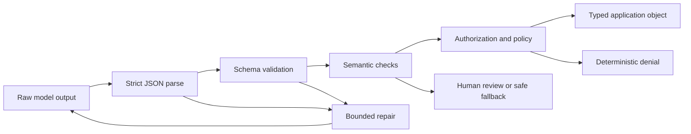

# 结构化输出是不可信的契约

> 合法 JSON 不等于合法的业务决策。解析字节、校验结构、核实含义，然后才允许执行动作。

**类型：** Build
**语言：** Python
**前置要求：** [验证主张，而非置信度](../../05-output-evaluation-and-validation/)、[Messages API 是一台状态机](../../08-messages-api-and-application-lifecycle/)
**预计时间：** 约 95 分钟

## 学习目标

- 区分 JSON 语法、schema 有效性、语义有效性和授权
- 设计窄 schema，让无效状态难以表达
- 在不做不安全清理或乐观强制转换的前提下解析 Claude 输出
- 通过次数受限、证据充分的重试修复无效响应
- 演进输出契约时不悄悄破坏消费者
- 在对抗性与流式边界测试结构化输出

## 本应失败的 JSON

你的客服应用要求优先级介于 1 到 5，返回结果如下：

```json
{
  "category": "billing",
  "priority": 9,
  "summary": "Customer reports a duplicate charge",
  "needs_human": false
}
```

JSON 解析器成功了。对象拥有全部预期键。应用把它路由为最高紧急优先级，跳过人工审核，并呼叫值班工程师。

模型没有违反 JSON。是你的应用没有执行契约。

结构化输出有四道关卡：

1. **语法：** 是否恰好有一个可解析的 JSON 值？
2. **结构：** 该值是否符合类型、必填字段、枚举、边界及额外属性规则？
3. **语义：** 字段是否与领域事实以及彼此一致？
4. **权限：** 所请求的下游动作是否被允许？

通过前一道关卡，绝不意味着通过后一道。



## 要求 JSON 输出不等于建立契约

“只返回 JSON”是一条指令。它能提高概率，却不能让无效输出绝无可能，也不能防止 schema 漂移或校验业务含义。

如果当前模型和 API 支持结构化输出，你可以提供 JSON Schema，并要求平台约束生成。这会减少语法和结构失败，但仍无法证明被引用的订单存在、退款已获授权，或分类是正确的。

产品说明，已于 2026-08-09 核实：结构化输出的可用性、支持的 schema 关键字、与其他功能的不兼容项以及模型支持情况都可能变化。上线前请检查[结构化输出](https://platform.claude.com/docs/en/build-with-claude/structured-outputs)。即使启用了受约束解码，也要保留应用侧校验。

应用拥有 schema。像管理 API 一样为它做版本管理。

```json
{
  "$id": "support-triage-v1",
  "type": "object",
  "required": ["category", "priority", "summary", "needs_human"],
  "additionalProperties": false,
  "properties": {
    "category": {
      "type": "string",
      "enum": ["billing", "bug", "account", "other"]
    },
    "priority": {
      "type": "integer",
      "minimum": 1,
      "maximum": 5
    },
    "summary": {
      "type": "string",
      "minLength": 1,
      "maxLength": 240
    },
    "needs_human": {
      "type": "boolean"
    }
  }
}
```

这个 schema 的严格性有其理由。消费者预期恰好四个字段。意外的 `debug_context` 字段可能把私密文本带入日志；整数边界能阻止 `9`；枚举能防止分类拼写分裂分析数据。

## 从消费者决策出发设计 Schema

设计 schema 时，先看下一个确定性组件必须决定什么。

若消费者需要选择队列，就给它枚举。若它要排序优先级，就给它有边界的整数。若不确定性会改变路由，就把它明确写进字段。

对比这两份契约：

```json
{"answer": "Probably a billing issue. It seems urgent."}
```

```json
{
  "category": "billing",
  "priority": 4,
  "evidence_ids": ["invoice-483", "message-12"],
  "uncertainty": "medium",
  "needs_human": true
}
```

第二个对象让路由和核验成为可能。它仍可能出错，但可以检查。

采用以下设计规则：

- 自由文本标签改用枚举。
- 仅当每个合法响应都能提供字段时，才将它设为必填。
- 有意使用 `null` 表达“已知不存在”，不要把它当作通用逃生口。
- 除非消费者有意支持扩展，否则拒绝额外属性。
- 限制字符串和数组长度，以控制成本和存储。
- 事实必须可追溯时，包含证据标识符。
- 动作字段只表示提案，不能作为授权证明。
- 为 schema 提供稳定的名称和版本。

不要用一个巨型 schema，通过几十个可选字段来表示无关模式。应使用带标签的联合类型或拆分端点契约。每个字段都可选时，无效状态会成倍增加。

## 严格解析

乐观清理会掩盖失败。看下面的模式：

```python
raw = raw.replace("```json", "").replace("```", "")
payload = json.loads(raw)
```

它看似友好，却在生成后改变了契约。含有说明文字、两个 JSON 对象或用户可控围栏文本的响应，可能被改造成模型从未作为单一值返回过的内容。

应优先使用严格解析：

```python
payload = json.loads(raw)
validate_against_schema(payload)
```

若契约要求一个 JSON 对象，就应拒绝 Markdown 围栏和尾随散文。记录失败类别，这样修复尝试才能收到精确错误。

不要悄悄强制转换：

- `"4"` 不是整数。
- `1` 不是布尔值。
- `"false"` 不是 false。
- 逗号分隔的字符串不是数组。
- 除非 schema 声明了安全默认值且应用有意应用它，否则缺失字段不等同于安全默认值。

Python 有一种情况尤其微妙：`bool` 是 `int` 的子类。天真的 `isinstance(True, int)` 检查会在需要整数的位置接受布尔值。可运行的校验器会明确拒绝它。

## 在结构之后校验含义

schema 可以证明 `invoice_id` 是字符串，无法证明该发票存在或属于已认证用户。

语义校验使用可信的应用数据：

```python
if payload["invoice_id"] not in invoices_for(authenticated_user):
    raise SemanticError("invoice is not visible to this user")

if payload["refund_amount"] > verified_charge_amount:
    raise SemanticError("refund exceeds verified charge")
```

跨字段规则同样重要。当 `uncertainty: high` 时，`needs_human: false` 可能无效。提议的 `action: close_account` 可能需要审批 token。引用 ID 必须能解析为确实支持该主张的来源。

模型可以协助产出提案。确定性代码则校验身份、所有权、金额边界、权限与状态迁移。

## 带预算地修复

无效输出不总是必须失败。若任务风险低，且修正不会编造缺失证据，语法或 schema 错误可以修复。

修复循环应包含：

1. 原始任务和未变更的可信上下文。
2. schema 或精确的契约摘要。
3. 带字段路径的机器生成校验错误。
4. 严格的最大尝试次数。
5. 终止回退或升级处理。

```text
Repair the previous output.
Return one JSON object and no surrounding text.
Validation errors:
- $.priority: expected integer from 1 through 5
- $.needs_human: required field is missing
Do not invent evidence that was not present in the source.
```

不要把原始异常转储、密钥、数据库记录或任意不可信字符串粘贴到更高信任级别的指令区。校验反馈也是数据，应对它划定边界，让可信修复指令保持独立。

两次尝试通常就能看出失败是随机格式问题，还是更深层的契约不匹配。无限重试会消耗预算，还可能放大 prompt-injection 载荷。应统计尝试次数、token、延迟和重复的错误指纹。

若来源缺少必需证据，修复 JSON 就是错误操作。应返回明确的不完整状态或升级处理。

## 工具输入与最终输出是不同的契约

Claude 的工具使用也会提供结构化输入，但它服务于不同边界。

- 工具输入 schema 帮助模型构造调用。
- 工具处理程序仍会校验值，并对调用者授权。
- 来自远程服务的工具结果是不可信的外部数据。
- 最终应用输出拥有面向消费者的独立 schema。

不要把宽泛的内部工具 schema 复用于公开响应契约。内部字段可能暴露实现细节或密钥。应把已核验的工具结果映射为最小化的最终对象。

同样，绝不要因为最终 JSON 含有 `"approved": true` 就执行动作。批准必须来自经过认证的应用状态；模型输出无权批准。

当工具使用作为结构化输出机制时，请了解 CCAR-F 指南使用的三种公开 `tool_choice` 决策：

| 选择 | 模型行为 | 适用场景 |
|---|---|---|
| `auto` | 模型可以调用工具，或返回对话文本 | 两条路径都有效 |
| `any` | 模型必须调用所提供工具之一 | 需要类型化工具结果，但有多个有效 schema |
| `{"type":"tool","name":"extract_metadata"}` | 必须选择指定工具 | 后续工作前必须执行一次已知提取 |

对于最终的机器可读响应，如果当前原生结构化输出能力支持所需 schema 与功能组合，应优先使用它。只有当工作流确实在选择或调用工具时，才使用工具 schema。无论哪一种，语义校验和授权仍是应用的职责。

## Pydantic 是校验器实现，不是契约

公开 CCAR-F 指南将 Pydantic 与 JSON Schema 校验、校验重试循环并列提及。在 Python 中，Pydantic 模型可以生成 schema，根据其配置强制转换或拒绝输入，并表达跨字段校验。它不能让模型主张变为事实，也不能授予下游权限。

本仓库保持 stdlib-first，因此可运行实验直接实现相关检查。如果生产应用已经使用 Pydantic，请显式映射同样的四道关卡：

```text
JSON parse -> Pydantic shape validation -> domain validation -> authorization
```

检查强制转换行为。将 `"4"` 静默变成 `4` 的校验器，可能适合某个外部边界，却在另一个边界不可接受。把有边界、字段级的校验错误反馈给修复流程；来源缺少必需证据时则升级处理。

## 流式传输产生不完整语法

通过流接收的 JSON，直到相关内容块结束之前都不完整。前缀 `{"category":"bill` 还不是无效内容，它尚未完成。

缓冲结构化块。不要反复解析每个字符，除非使用专为增量 JSON 设计、且确实理解其部分状态语义的解析器。不要在某个必填字段恰好较早出现时触发下游动作。

内容块完成后：

1. 确认流到达有效的终止事件。
2. 只解析一次。
3. 校验 schema。
4. 校验语义和策略。
5. 原子地提交下游状态迁移。

若流断开，丢弃或隔离部分对象。UI 可以显示暂定文本，但应用契约尚未完成。

## Schema 演进就是 API 迁移

假设版本 1 将 `priority` 作为整数返回，版本 2 用 `severity: "low" | "medium" | "high"` 替换它。先部署 prompt 会破坏旧消费者；先部署消费者则可能拒绝旧输出。

使用以下策略之一：

- 添加契约版本字段，在迁移期间同时支持两个版本。
- 为严格规划的兼容窗口部署宽容读取器。
- 在切换前并行生成并比较结果。
- 在适配器边界把新输出转换为旧内部类型。

绝不要悄悄修改 schema。在 trace 中记录 schema 版本、prompt 版本、模型版本和校验器版本。回归评估必须覆盖新旧示例、边界值、遗漏字段、意外字段、恶意字符串与大输入。

## 构建校验器与修复循环

`code/main.py` 在无外部依赖的情况下，实现了 JSON Schema 的实用子集。它校验对象、必填字段、额外属性、原始类型、枚举、数值边界、字符串边界、数组和嵌套路径；随后将校验器包装进一个有次数上限的提取器。

运行它：

```bash
cd certifications/claude/lessons/09-structured-output-and-defensive-parsing/code
python3 main.py
python3 -m unittest discover tests -v
```

第一个脚本响应在需要整数的位置使用 `"high"`，第二个响应修复该字段。测试证明：Markdown 围栏、缺失字段、布尔值充当整数、意外字段和重试耗尽都会显式失败。

在生产中，应优先使用应用技术栈支持的成熟校验器。手写子集用于展示库会执行哪些检查，不能替代完整 JSON Schema 实现。

## 交互实验

使用恢复图将候选输出依次送过语法、schema、语义和授权关卡。把修复预算花在一个结构错误上，再将结果与必须升级处理的缺失证据失败进行对比。

```figure
09-structured-output-recovery
```

## 实践实验

运行有次数上限的提取器，然后提交围栏包裹的 JSON、布尔整数、意外字段和两次无效尝试。确定每个失败归属语法、结构、含义还是权限。

## 交付产物

`outputs/validated-triage.json` 是无 provider 修复演示产出的已填充契约。运行 `python3 main.py` 重现它，然后运行单元测试套件。一个测试会比较已提交产物与 `demo()`；其余测试覆盖围栏、缺失字段、布尔整数、额外属性、次数受限的修复和耗尽的重试。

## 验证

```bash
cd certifications/claude/lessons/09-structured-output-and-defensive-parsing/code
python3 main.py
python3 -m unittest discover tests -v
```

## 综合项目关联

测验会检查每个失败归属哪道关卡。在 Developer 综合项目 30 与 Architect 综合项目 31、32 中使用已校验对象及修复证据。

## 考试决策规则

- 输出能解析但违反范围或枚举时，选择 schema 校验，而不是 prompt 清理。
- 输出符合 schema 却与可信记录冲突时，选择语义核验。
- 对象提议特权动作时，应根据应用身份和策略授权。
- 格式短暂失败时，使用带精确校验反馈的次数受限修复。
- 证据缺失时，升级处理或返回明确的不完整状态，不要修复事实。
- 流未完成时，不要解析，也不要当作契约已结束来执行动作。
- schema 变化时，应像任何公开 API 一样做版本化和迁移。
- 如果可使用受约束生成，可借它减少错误，但仍要保留下游校验。

## 练习

1. 将 `evidence_ids` 添加为有边界字符串组成的数组。为合法列表、整数项和超过你选择上限的列表编写测试。
2. 添加跨字段规则：`uncertainty: high` 要求 `needs_human: true`。
3. 创建一个语义校验器，确认发票属于已认证用户，同时不向模型暴露完整发票记录。
4. 添加 `contract_version` 字段，并实现从版本 1 到版本 2 的适配器。
5. 向校验器输入十个对抗性字符串：围栏、重复对象、意外字段、转义控制文本、超长摘要、布尔整数和嵌套的 prompt-injection 语言。
6. 在单独的生产沙箱中将分诊契约重建为 Pydantic 模型。对比严格模式和强制转换行为，但不要将 Pydantic 添加为本课依赖。

## 延伸阅读

- [Structured outputs](https://platform.claude.com/docs/en/build-with-claude/structured-outputs)
- [Messages API reference](https://platform.claude.com/docs/en/api/messages)
- [Tool use overview](https://platform.claude.com/docs/en/agents-and-tools/tool-use/overview)
- [Increase output consistency](https://platform.claude.com/docs/en/test-and-evaluate/strengthen-guardrails/increase-consistency)
- [JSON Schema specification](https://json-schema.org/specification)
- [Claude Certified Architect Foundations exam guide](https://everpath-course-content.s3-accelerate.amazonaws.com/instructor%2F6nizmqk8tpzpfjvt6qmmav7rh%2Fpublic%2F1783542750%2FClaude+Certified+Architect+%E2%80%93+Foundations+Exam+Guide.pdf)
