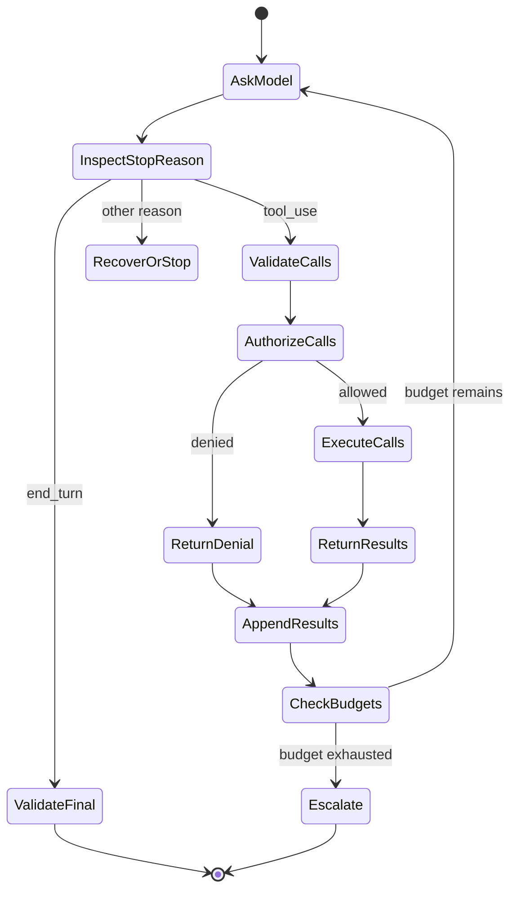

# 工具循环是受控委托

> Claude 可以提出动作建议。你的应用校验请求、授予能力、观察结果，并决定循环是否继续。

**类型：** Build
**语言：** Python
**前置要求：** [Messages API 是一台状态机](../../08-messages-api-and-application-lifecycle/)、[结构化输出是不可信的契约](../../09-structured-output-and-defensive-parsing/)
**预计时间：** 约 130 分钟

## 学习目标

- 实现完整的 `tool_use` 与 `tool_result` 协议循环
- 设计聚焦的工具契约，并选择其执行边界
- 将模型选择工具与确定性授权分开
- 比较手写循环、SDK Tool Runner 与托管 agent
- 将失败作为带类型的结果返回，并消费可操作的运行时事件
- 限制自主性；路径已知时选择固定工作流

## 重复付款的 Agent

一个账单助手收到“退还重复扣款”。Claude 请求 `issue_refund`，应用执行它。最终文本到达前响应连接中断，应用重试整个回合，Claude 再次请求该工具，客户收到了两次退款。

应用把语言生成与事务控制混为一谈，最终造成重复付款。

可靠的工具循环有两份契约：

1. 模型可以用结构化参数提出一个具名能力。
2. 确定性应用代码决定该能力是否、如何以及最多执行几次。

工具使用让 Claude 能触及能力，却不赋予 Claude 权限。

## 框架之前的线协议契约

客户端工具在请求中声明。每项声明向模型提供名称、描述和 JSON Schema 输入契约。

```json
{
  "name": "lookup_order",
  "description": "Look up one order by its exact public order ID. Returns status and last update. This tool never changes an order.",
  "input_schema": {
    "type": "object",
    "required": ["order_id"],
    "additionalProperties": false,
    "properties": {
      "order_id": {
        "type": "string",
        "description": "Order ID in the form A-12345"
      }
    }
  }
}
```

Claude 可能返回：

```json
{
  "stop_reason": "tool_use",
  "content": [
    {
      "type": "tool_use",
      "id": "toolu_7f3",
      "name": "lookup_order",
      "input": {"order_id": "A-12345"}
    }
  ]
}
```

客户端保留这整段 assistant 内容，校验并运行工具，再追加：

```json
{
  "role": "user",
  "content": [
    {
      "type": "tool_result",
      "tool_use_id": "toolu_7f3",
      "content": "{\"found\":true,\"status\":\"in_transit\"}"
    }
  ]
}
```

匹配 ID 用来把结果关联到具体请求。根据协议预期的对话历史，assistant 消息必须紧挨在结果序列之前。

请参阅[实现客户端工具](https://platform.claude.com/docs/en/agents-and-tools/tool-use/implement-tool-use)，了解当前 SDK 与 API 形态。

## 循环具有显式状态



每次状态转换都可能失败：响应可能遗漏工具 ID、工具名可能未知、参数可能违反 schema、授权可能拒绝调用、处理程序可能超时、结果可能过大，Claude 可能继续请求工具，最终答案也可能不符合输出契约。

不要用一个宽泛的 `try/except` 加通用重试隐藏这些状态。应分类，并按失败类别选择恢复方式。

## 工具设计就是接口设计

Claude 根据工具接口选择工具。人不读处理程序也应能判断每个工具何时使用。

### 每个工具只做一件事

`manage_customer` 很含糊：它可能搜索、编辑、退款、暂停或删除。窄工具目录更易选择，也更容易保护：

- `get_customer_profile`
- `list_customer_invoices`
- `propose_refund`
- `issue_approved_refund`

提案与执行之间的分离很重要。低风险工具可以计算建议金额；高风险工具需要模型之外生成的、已认证的审批 token。

### 写选择描述，不写内部文档

有用的描述会说明工具做什么、何时用、何时不用以及结果意味着什么。粘贴整本 API 手册没有帮助。

差：

```text
Calls GET /v3/orders/{id} in the Commerce service.
```

更好：

```text
Read the current status of one existing order from the commerce system.
Use only when the user supplies an exact order ID. This tool is read-only.
Do not use it to search by email or to modify shipment details.
```

描述中的示例能澄清棘手格式，但每个 token 都会随工具目录重复。衡量示例是否足以改善选择，从而值得付出上下文成本。

### 让无效调用难以表达

使用枚举、必填字段、边界和 `additionalProperties: false`；拆分互斥模式。若狭窄的领域值足以满足需求，不要使用自由形式 shell 命令、SQL、URL 或文件系统路径。

schema 引导生成，处理程序仍要校验。绝不能因为模型输入由 schema 生成，就认为它安全。

## 保持工具目录小且差异明显

更多工具不总会产生更多能力。重叠名称和冗长目录会造成选择歧义，并消耗上下文。

从真实任务需要的最少工具开始。评估发现能力缺口时再添加；轨迹显示混淆时删除或合并。

可以问：

- 两个工具从名称和描述看是否可互换？
- 通用代码或 CLI 工具是否已能在 sandbox 中完成此任务？
- agent 是否每一回合都需要这项能力？
- 该能力能否放进 Skill，仅在相关时加载？
- 是否应让单独的 subagent 获得这个工具，而非主 agent？
- 标准化 MCP server 是否能让多个 host 安全共享它？

评估架构时要看工具选择和执行控制，工具数量没有意义。

## 授权发生在校验之后

安全执行边界遵循以下顺序：

1. 通过 allowlist 解析工具名称。
2. 校验输入类型和边界。
3. 从应用绑定已认证身份与租户上下文，不能从模型参数取得。
4. 检查能力范围和资源所有权。
5. 对后果重大的动作要求审批。
6. 应用幂等、超时、速率和大小限制。
7. 在可用的最窄 sandbox 中执行。
8. 返回 Claude 或日志前对结果脱敏。

若工具参数中含有 `user_id`，不要把它当作身份。将它与认证会话比对，或完全移出模型控制。

对于变更操作，审批记录应绑定用户、动作、规范化参数、过期时间和操作 ID。对话文本里的“用户之前说过同意”不是安全审批 token。

## 将失败作为结果返回

处理程序失败并不自动意味着应用崩溃。若收到简洁、真实的工具结果，Claude 可能恢复。

```json
{
  "type": "tool_result",
  "tool_use_id": "toolu_7f3",
  "is_error": true,
  "content": "Order service timed out. No order state was changed. Retry is allowed once."
}
```

好的错误内容会告诉模型：

- 什么失败了。
- 是否发生了副作用。
- 重试是否安全。
- 可以采取何种修正。

不要暴露堆栈跟踪、环境值、数据库查询、访问 token 或内部主机名。将它们保留在具有脱敏与访问控制的受保护遥测中。

校验失败可包含字段路径。策略拒绝不应诱导模型寻找绕过办法。“此 agent 不能发起退款”比罗列所有安全规则更安全。

未知工具应按你的设计成为关联错误结果或终止协议错误。绝不要动态导入并运行模型指定的处理程序。

## 多个与并行工具调用

Claude 一次响应可请求多个工具。只有调用彼此独立、只读且重排安全时，才并行执行。

两次搜索通常能并发。“创建发票”再“发送发票”存在依赖，必须保持顺序；对同一记录的两次写入可能冲突；付款和邮件可能需要事务或补偿工作流。

每个请求的 `tool_use` ID 都要返回一个 `tool_result`。保留足够顺序来重建轨迹。若一次并行调用失败，应报告每个结果，不要假装整批都成功。

产品说明，已于 2026-08-08 核实：自动工具执行和并行调用的辅助 API 随 SDK 而异，不会移除应用的授权责任。请检查当前[工具使用概览](https://platform.claude.com/docs/en/agents-and-tools/tool-use/overview)。

## 限制 Agent

agent 循环除 `end_turn` 外还需要终止条件：

- 最大模型回合数。
- 全局和按工具计算的最大调用数。
- 墙钟截止时间。
- token 与金额预算。
- 最大连续错误数。
- 最大重复相同调用数。
- 用户取消。
- 必需的人工审批。
- 已验证的最终状态谓词。

最终状态谓词比判断响应是否“听起来完成”更可靠。部署 agent 只有在预期版本健康时才算成功；研究 agent 只有在必需主张都有可解析来源时才算成功。它们的自述和报告长度都不能证明任务完成。

记录轨迹：prompt 版本、模型、停止原因、工具名、规范化参数指纹、决策、延迟、结果类别和状态变化。对敏感值脱敏。

## 工作流还是 Agent

步骤与分支已知时用固定工作流；路径依赖观察且模型必须在工具间选择时用 agent。

| 任务 | 更好的默认选择 | 原因 |
|---|---|---|
| 提取字段、校验、存储 | 工作流 | 顺序已知，契约清晰 |
| 分类后路由到一个队列 | 工作流 | 分支集合有限 |
| 调查陌生仓库缺陷 | Agent | 搜索路径取决于发现 |
| 核验重复扣款后的退款 | 带审批的工作流 | 动作后果重大，控制已知 |
| 在变化的内部系统间收集证据 | 受限 agent | 工具选择取决于缺失证据 |

任务有价值、环境可被工具访问、错误可检测且可恢复时，自主性才有理由。若错误无法检测，增加 agent 回合只会掩盖风险。

## 选择要自行拥有多少循环

通过工作流关卡后，选择满足运行需求的最小 harness。

| Runtime | 它处理什么 | 应用仍需处理什么 | 适合场景 |
|---|---|---|---|
| 手写 Messages 循环 | 仅你实现的协议工作 | 完整历史、停止原因、schema 与策略、执行、重试、预算、trace 和恢复 | 需要线协议控制、受限 runtime、自定义状态机，或协议教学和测试 |
| SDK Tool Runner | 工具声明辅助、`tool_use`/`tool_result` 顺序、消息状态更新和可选逐回合流 | 授权、sandbox、幂等、错误披露、迭代上限、可观测性和最终状态证明 | 支持的 SDK 合适，且客户端工具仍在应用控制下运行 |
| Claude Managed Agents | 配有 sandbox、内置工具和事件驱动执行的远程 agent/session/environment harness | agent 配置、数据边界审批、自定义工具执行、确认决策、事件持久化、业务授权和结果核验 | 需要托管 session 与 sandbox 边界，并接受当前 beta、平台和事件契约 |

本课代码有意采用第一种。它暴露每次转换。迁移到 [Tool Runner](https://platform.claude.com/docs/en/agents-and-tools/tool-use/tool-runner) 会移除重复的循环样板，却不会让退款变安全。设置迭代上限，拦截或包装工具执行，保留应用审批，并校验最终状态。

产品说明，已于 2026-08-09 核实：[Claude Managed Agents](https://platform.claude.com/docs/en/managed-agents/overview) 当前为公开 beta，使用带版本的 beta 契约。它提供托管 agents、environments、sessions、内置工具和 server-sent event 流。应将 header、资源、事件类型、工具集、限制和 provider 可用性视为易变项；不要仅因为任务被称作 agent 就选择它。

托管 agent 集成是事件消费者，不是最终文本调用。应用发送用户事件，消费持久化的 session 与 agent 事件，并跟踪状态。自定义工具调用或需权限的工具会使 session 以 `requires_action` 暂停；应用用结果或确认决策解析被引用的事件 ID。断开的 SSE 连接并不代表成功。应对账持久化事件与终止状态。第 12 课用离线事件 fixture 实现该边界；当前来源见[Session event stream](https://platform.claude.com/docs/en/managed-agents/events-and-streaming)。

## 第一方能力也有多种执行边界

按代码和数据在哪里执行、谁授权以及如何发现来分类能力。

| Surface | 执行和数据边界 | 适用场景 | 不要假设 |
|---|---|---|---|
| Messages server tool | Anthropic 执行 web search、web fetch、code execution、tool search 等支持的工具 | provider 端执行和数据策略符合要求的第一方能力 | 普通场景下应用会收到待执行的客户端 `tool_use` |
| Anthropic-schema client tool | Anthropic 定义训练内 schema；应用执行 bash、text editor、memory 或 computer use 等工具 | 标准 schema 能提升模型熟悉度，但客户端必须拥有执行权的常用操作 | 第一方 schema 表示 provider 执行或自动授权 |
| Managed-agent built-in | 配置的托管或自托管 agent environment 执行其工具集 | 符合该 runtime sandbox 与权限策略的仓库和 web 工作 | 启用工具集会授予业务权限或免去确认工作 |
| Custom client tool | 应用校验并执行你的 JSON Schema 契约 | 私有业务操作、狭窄领域 API 与精确应用策略 | schema 合法输入就是身份、授权或幂等证据 |
| Skill | 支持的 runtime 加载可复用指令、参考、脚本或资产 | 仅在相关时披露的流程 | Skill 本身是执行或授权边界 |
| MCP | MCP client 或连接器调用标准化外部 server | 由显式 server、身份与传输边界在兼容 host 间共享的能力或上下文 | server 发现会让每个返回工具都安全或相关 |

Skill 和工具往往互补。退款审核 Skill 可以传授流程，custom client tool 则暴露获批操作；当多个 host 需要同一标准接口时，MCP 可以承载该操作。只有网络、保留和结果语义符合数据要求时，才选 provider 执行的 server tool。只有 sandbox 与动作校验器已准备好执行时，才选 Anthropic-schema client tool。

当前执行分类记录于[工具使用的工作方式](https://platform.claude.com/docs/en/agents-and-tools/tool-use/how-tool-use-works)，托管 harness 另有[工具配置](https://platform.claude.com/docs/en/managed-agents/tools)。版本与模型兼容性会变化，因此在 trace 中持久化所选工具类型和版本。

## 构建循环

`code/main.py` 实现工具注册表和原始循环，支持多调用、schema 检查、变更工具审批、处理程序错误、未知工具、关联 ID 和回合预算。离线决策实验根据显式需求分别选择工作流、手写循环、SDK Tool Runner 或 managed agents；它还可选配 Skill 来组合执行 surface，Skill 本身不充当工具。

```bash
cd certifications/claude/lessons/10-tool-use-and-agentic-loops/code
python3 main.py
python3 -m unittest discover tests -v
```

阅读 demo 打印的 transcript，找到 assistant `tool_use` 块及其后 user `tool_result`。再检查后面打印的决策 fixture。将 managed-agent case 改为不接受 beta，使决策在任何 runtime 启动前失败。协议与架构正确性应可见，不能想当然。

## 交互实验

使用工具循环图分配回合、工具调用、时间和审批预算。触发重复调用或被拒绝的变更，观察哪项确定性终止条件停止循环。

```figure
10-tool-loop-budget
```

## 实践实验

运行工具循环，然后测试未知工具、无效参数、被拒绝的变更、多调用、处理程序错误和耗尽的回合预算。确认每个结果保留它的 tool-use ID。接着按执行边界与授权所有者，分类 provider server tool、Anthropic-schema client tool、私有 custom tool、Skill 支持的流程和 MCP 服务。

## 交付产物

`outputs/tool-loop-transcript.json` 是 `demo()` 产出的已填充、关联执行 transcript。 `outputs/runtime-and-tool-surface-decisions.json` 是截至某日期、无 provider 依赖的四种 runtime 与四种能力组合比较。运行 `python3 main.py` 查看二者，并执行单元测试来核验产物、schema 边界、审批拒绝、runtime gate、执行边界、处理程序失败和失控预防。

## 验证

```bash
cd certifications/claude/lessons/10-tool-use-and-agentic-loops/code
python3 main.py
python3 -m unittest discover tests -v
```

## 综合项目关联

测验测试提案与授权、工具描述、幂等、并行、最终状态检查和工作流选择。将已验证 transcript 带入 Developer 综合项目 30 和 Architect 综合项目 31、32，作为工具边界证据。

## 考试决策规则

- Claude 选择工具只是提案，绝不是授权。
- schema 校验在策略之前，策略在执行之前。
- 使用能清楚区分适用时机的窄名称和描述。
- 可以安全恢复时，返回简洁、关联的错误。
- 可重试的副作用要求幂等或对账。
- 只并行化顺序无关的独立调用。
- 在预算、重复调用、取消或无法识别的控制状态下停止。
- 路径已知时优先确定性工作流。
- 客户端执行合适且自定义线协议控制没有价值时，优先 SDK Tool Runner。
- 只有存在具体托管 runtime 需求、且接受 beta 与数据边界时才选择 managed agents。
- 将托管 session 视为事件状态机；按事件 ID 解析 `requires_action`，绝不根据断开的流推断成功。
- 按执行地点区分 server-executed tools、Anthropic-schema client tools、managed built-ins 和 custom client tools。
- 将 Skills 视为流程、MCP 视为连接边界；二者都不授予授权。
- 同时评估工具轨迹与最终状态。

## 练习

1. 添加必须含审批 token 的 `issue_refund`。证明对话文本无法替代该 token。
2. 在一个响应中添加两个只读调用并发执行，保留确定性结果关联。
3. 让一个工具在发生副作用后超时。重试前添加幂等键和对账检查。
4. 添加重复调用检测器，在同一规范化工具请求出现两次后停止。
5. 将一个私有 custom tool 改为由两个 host 共享的 MCP 能力。确定认证、同意、结果过滤和可用性责任哪些移到 server 边界，哪些仍留在各 host。

## 延伸阅读

- [Tool use overview](https://platform.claude.com/docs/en/agents-and-tools/tool-use/overview)
- [Implement client tools](https://platform.claude.com/docs/en/agents-and-tools/tool-use/implement-tool-use)
- [Handle tool errors](https://platform.claude.com/docs/en/agents-and-tools/tool-use/implement-tool-use#handling-tool-use-and-tool-result-content-blocks)
- [Tool Runner](https://platform.claude.com/docs/en/agents-and-tools/tool-use/tool-runner)
- [How tool use works](https://platform.claude.com/docs/en/agents-and-tools/tool-use/how-tool-use-works)
- [Claude Managed Agents](https://platform.claude.com/docs/en/managed-agents/overview)
- [Session event stream](https://platform.claude.com/docs/en/managed-agents/events-and-streaming)
- [Managed-agent tools](https://platform.claude.com/docs/en/managed-agents/tools)
- [Building effective agents](https://www.anthropic.com/research/building-effective-agents)
- [Handling stop reasons](https://platform.claude.com/docs/en/build-with-claude/handling-stop-reasons)
