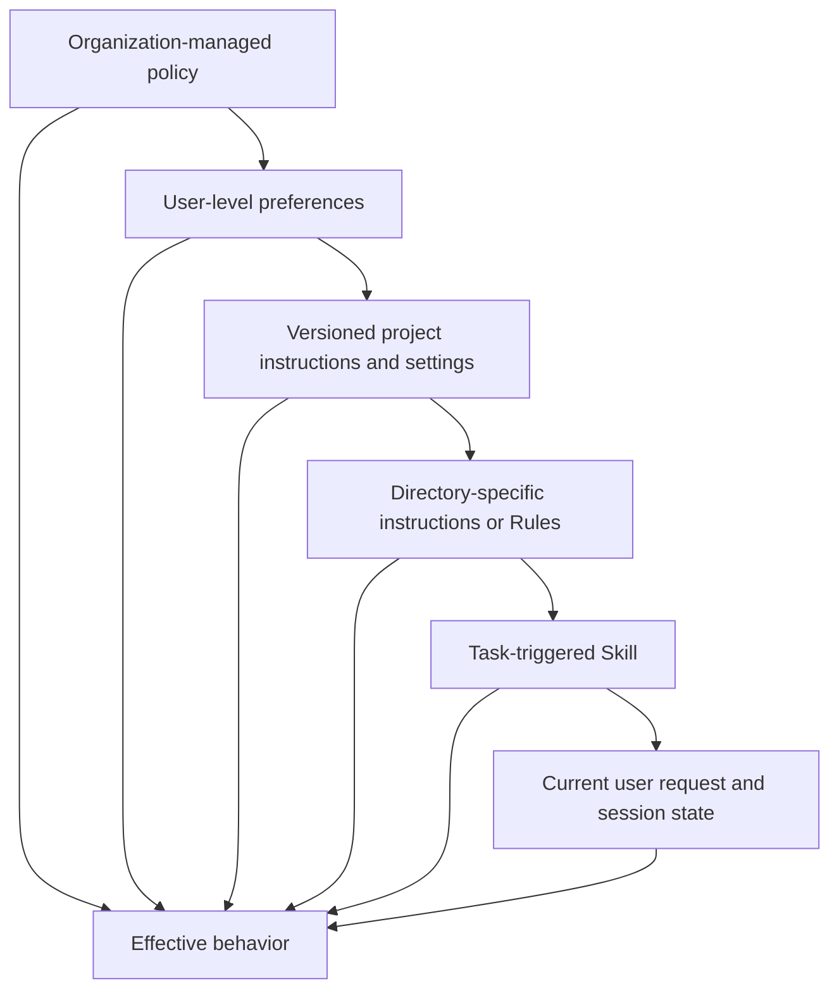
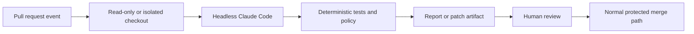

# Claude Code 靠共享约束支持规模化协作

> 团队协作应依靠精简的项目合约、可复用流程、确定性检查与版本化配置，别把所有内容塞进一份巨型 prompt。

**类型：** Learn
**语言：** Python
**前置要求：** [Agent SDK 提供运行框架，权限另行控制](../../12-claude-agent-sdk-and-hooks/)、[Eval 将 Agent 行为变成工程证据](../../14-evals-testing-debugging-and-observability/)
**预计时间：** 约 170 分钟

## 学习目标

- 设计精简的 `CLAUDE.md`，让它发挥项目上手指南的作用
- 把指令、settings、Rule、Skill、agent、hook 与 MCP 配置放在正确作用域
- 在不丢失批准边界的前提下使用 permission mode、上下文恢复、goal、loop、worktree 与 schedule
- 对模型、prompt、plugin 与团队配置变更进行版本管理
- 把 Claude Code 作为受约束的 contributor 接入 CI，而不是不受审查的 deployer
- 通过产物、测试、trace 与恢复点评估团队 workflow

## 900 行的指令文件

某个团队把每次纠错都添加到 `CLAUDE.md`。文件里塞满了架构历史、API 文档、风格偏好、发布步骤、安全规则、示例、故障排查和任务专用 playbook。

Claude 每个 session 都要读取它。重要命令与过时散文争夺上下文。文件太大，开发者不再审查改动。某一行旧指令要求使用已淘汰的测试命令，agent 于是反复运行错误测试套件，再报告成功。

这份文件最终成了上下文债务。

`CLAUDE.md` 应当像一份准确的上手脚本：这个仓库是什么，怎样浏览、构建和测试，有哪些不直观的约束，更深入的文档又在哪里。

## 把信息放在最窄且持久的作用域

Claude Code 可以从多个作用域加载配置与指令。具体层级和文件名属于产品细节，但设计原则很稳定：宽泛策略放在宽泛作用域；项目事实放在仓库中；任务流程只在相关时加载。



项目任务不应轻易削弱宽泛控制，范围较窄的指令也不应复制到全局。请查阅当前 [Claude Code settings](https://code.claude.com/docs/en/settings) 与 [Memory](https://code.claude.com/docs/en/memory) 文档，确认已安装版本的准确优先级、受管理策略位置、import 与发现行为。

来源发生冲突时，把优先级写清楚。不要依赖两句互相矛盾的话，再期待模型自己选中更安全的一句。

## 编写精简的 CLAUDE.md

先写 Claude 反复需要的事实：

```markdown
# Repository guide

## Purpose
This repository is a Python service that routes support tickets.

## Commands
- Install: `python3 -m venv .venv && .venv/bin/pip install -r requirements.txt`
- Focused tests: `python3 -m unittest discover tests -v`
- Full validation: `./scripts/validate.sh`

## Layout
- `src/`: application code
- `tests/`: unit and integration tests
- `docs/architecture.md`: boundaries and decision records

## Constraints
- Never commit credentials or `.env` files.
- Preserve public API compatibility unless the task explicitly changes it.
- Require explicit approval before deployment or external messages.
```

应包括：

- 目的与技术栈。
- 标准构建、测试、lint 与运行命令。
- 重要目录地图。
- 仓库特有的风格或架构规则。
- 安全与公开操作边界。
- 指向权威深入文档的链接。

应排除：

- Claude 已经知道的通用建议。
- 完整 API 参考文档。
- 临时任务状态。
- secret 或环境变量值。
- 只有一个专用 workflow 才使用的指令。
- 无人执行、无人审查的规则。

从小处开始。同一种纠错在多个 session 中反复出现时，再判断它应该进入 `CLAUDE.md`、Rule、Skill、hook、测试还是实际代码。对于“始终运行 formatter”，最有效的修复或许是 post-edit hook 与 CI 检查，而不是再加一句话。

## Rule、Skill、Command 与 Agent

这些机制解决的问题不同。

### Rule

一组文件或仓库区域需要遵守某项约束时，使用 Rule 或目录作用域指令。编辑数据库迁移时，不应让前端规则占用上下文。

每条规则都应完整且可测试，并说明机制与事实来源。不要在根目录和目录文件里重复同一条指令，漂移不可避免。

### Skill

Skill 封装可复用流程、参考资料、脚本和资源。它的简短描述帮助 Claude 判断何时加载完整材料。

数据库迁移审查、release note 生成、安全威胁建模或内部文档风格都适合用 Skill。核心 session prompt 要保持精简。Skill 应随仓库或获批的分发机制一起做版本管理。

渐进式披露的价值在于按需加载。如果一个 Skill 始终加载整本手册，它就退化成了另一份 system prompt。

### Command

Command 提供由用户明确调用的 workflow，适合必须由开发者主动启动的操作，例如 `/release-check` 或 `/review-migration`。

command 参数是不可信输入。command 不会绕过 tool 授权或批准。

### Agent

自定义 agent 或 subagent 定义隔离的角色、tool 集合与指令。它们适合独立审查、范围明确的专长，或职责互不重叠的并行工作。

只读 reviewer 不应继承 edit 与 deploy tool。需要独立性时，generator 与 evaluator 不应共享隐藏推理。

产品说明（核验于 2026-08-09）：具体文件系统位置、frontmatter 字段、command 行为与 agent 配置都在演进。请使用当前 [Claude Code 文档](https://code.claude.com/docs/en/overview)，并为仓库示例标注它所针对的版本。

## 按代码标准审查 Settings

团队 settings 控制权限、环境、hook、模型行为、MCP server、plugin 与其他产品能力。要像审查生产代码一样审查它们。

区分作用域：

- 组织策略保存不可妥协的限制。
- 提交项目 settings，提供团队共享的安全默认值。
- 本地 settings 保存不应提交的机器特有路径或实验。
- 环境变量保存 secret 名称和部署特有值。

绝不要在 settings 中提交 token。绝不要把 deny pattern 当成沙箱。用无害 fixture 测试权限行为。

变更 settings 时：

1. 说明预期行为。
2. 固定或记录相关 Claude Code 版本。
3. 添加聚焦验收测试或手动验证脚本。
4. 分别运行一项应拒绝操作与一项应允许操作。
5. 审查最终合并后的有效配置。
6. 提供回滚说明。

settings 文件能被解析，并不能证明已安装版本会执行其中每个 key。

## Permission Mode 设定基线

permission mode 决定 Claude 提出 tool 调用时会发生什么。它不会改变仓库策略、授予凭证，也不会让外部操作变得可逆。

产品说明（核验于 2026-08-09）：当前 Claude Code 文档定义了以下确切 mode。不同产品接口、套餐、服务商、模型、管理员策略与安装版本提供的 mode 和 UI 标签可能不同。

| Mode | 实际边界 | 适用场景 |
|---|---|---|
| `default` | 读取直接进行；编辑与命令可能请求批准 | 初次使用、敏感仓库 |
| `acceptEdits` | 文件编辑与常见文件系统操作直接进行；其他命令仍可能请求批准 | 本地代码迭代，并审查 diff |
| `plan` | 读取与探索直接进行；auto mode 可用时，经 classifier 批准的命令可能执行，但源代码编辑仍被阻止 | 先批准范围与方案 |
| `auto` | 单独的 classifier 评估操作；显式 ask 控制仍可要求批准 | 在可信方向上进行 research-preview 自主操作 |
| `dontAsk` | 凡是需要询问的操作一律拒绝，只执行预先批准的工作 | 锁定的 CI 与脚本 |
| `bypassPermissions` | 绕过内置权限检查；已配置的 deny、ask 与用户交互控制仍生效 | 不含有价值凭证的隔离容器或虚拟机 |

在支持时，可为 session 使用 `--permission-mode <mode>`，或设置 `permissions.defaultMode`。permission rule 再通过 `deny`、`ask` 与 `allow` pattern 缩小调用范围。显式 deny 与 ask 规则、组织级连接器控制和必需的用户交互在所有 mode 中都会评估，包括 `bypassPermissions`。硬边界应放在 deny rule、沙箱、凭证 scope、分支保护或 hook 中。写在对话里的句子，可能在 auto mode transcript 后续 compact 时丢失。

`acceptEdits` 的含义仅仅是编辑时少一道手续，并不会自动接受发布、部署、任意 shell 命令或消息。`auto` 是 research preview，不是安全证明。普通笔记本上不应使用 `bypassPermissions`，仅仅因为 session 位于 Git worktree 也不足以成为理由。

## Hook 把建议变成检查

使用 hook 执行确定性的生命周期操作：

- 在 tool 执行前阻止读取 secret 路径。
- 阻止向受保护分支提交。
- 外部写入必须获得批准。
- 编辑后格式化变更文件。
- 代码变更后运行聚焦测试。
- 对 tool 输出脱敏。
- 记录审计事件。
- 在必需检查没有证据时阻止完成。

hook 要快。缓慢的 hook 会反复运行，彻底拖垮交互延迟。设置超时与明确的失败行为。安全 hook 无法评估请求时应 fail closed。

Claude Code 把 hook 输入作为 JSON 传递。command hook 有两条不同的控制路径：

- 退出码为 `0`，并向 stdout 打印一个 JSON 对象，执行结构化控制。
- 退出码为 `2`，并向 stderr 打印原因，执行该事件特有的阻止操作。

不要混用两者。Claude Code 只会在退出码为 `0` 时处理结构化 JSON；退出码为 `2` 时打印的 JSON 会被忽略。对于多数事件，退出码 `1` 只是非阻塞错误，因此策略 hook 不能依赖普通 Unix 失败语义。

`PreToolUse` 与 `PermissionRequest` 的输出形状也不同。`PreToolUse` hook 可以通过 `hookSpecificOutput.permissionDecision` 允许、拒绝、询问或延后：

```json
{
  "hookSpecificOutput": {
    "hookEventName": "PreToolUse",
    "permissionDecision": "deny",
    "permissionDecisionReason": "Publishing requires a human-controlled workflow"
  }
}
```

`PermissionRequest` hook 只在 Claude Code 准备询问，或因无法询问而不得不拒绝时运行。它使用嵌套 decision 对象：

```json
{
  "hookSpecificOutput": {
    "hookEventName": "PermissionRequest",
    "decision": {
      "behavior": "deny",
      "message": "External publishing requires interactive human approval",
      "interrupt": false
    }
  }
}
```

allow decision 无法覆盖命中的 deny 或 ask rule。退出码 `2` 会阻止 `PreToolUse` 调用并拒绝 `PermissionRequest`，但事件行为并不相同。例如，`PostToolUse` hook 在操作后运行，无法撤销它。把 hook 当作强制控制前，先阅读事件表。

适合时，把共享 hook 放进经过审查的项目代码，但要保证受约束 agent 无法悄悄重写策略后再执行禁止操作。hook 层必须受到组织控制、仓库权限与沙箱边界保护。

## MCP 与 Plugin 都是已安装能力

MCP server 或 plugin 可以添加 tool、prompt、hook、agent、Skill、command 或语言智能。安装会同时改变攻击面与上下文面。

团队审查应覆盖：

- 发布者与源代码仓库。
- 准确版本与更新策略。
- 安装的组件。
- tool 与文件系统权限。
- 网络目标。
- 请求的 secret 与环境变量。
- 在 headless 或 CI 环境中的行为。
- 卸载与回滚步骤。

优先使用小型获批目录；支持时固定版本；在有代表性的仓库和 eval 数据集上测试升级。不要只为使用一小套可以实现成已审查本地 Skill 的流程，就安装大型 plugin。

plugin 与 MCP 不可互换。MCP 标准化外部能力连接；plugin 打包 Claude Code 扩展；Skill 携带流程与配套材料。根据需求选择，不要根据机制流行度选择。

## Session 需要恢复纪律

Claude Code session 帮助开发者恢复工作、fork 调查并保留本地上下文，但 session 历史不是 system of record。

恢复有后果的工作之前：

- 检查当前 Git status 与 diff。
- 重新运行相关测试。
- 核对外部副作用。
- 确认分支与仓库根目录。
- 审查待处理批准。
- 检查指令、tool 或模型配置是否变化。

上下文累积造成偏移，或将要跨越 tenant 或保密边界时，应 clear 或启动新 session。compaction 用于保持连续性，不能证明每项约束都保留下来。

仓库策略允许时，提交小型恢复点。session 摘要无法取代版本控制。

不同 session command 用于不同工作：

| 机制 | 效果 | 适用场景 |
|---|---|---|
| `/context` | 显示上下文窗口的占用来源 | 诊断 memory、Skill、tool 与消息膨胀 |
| `/compact [focus]` | 用聚焦摘要替换之前的对话 | 减少历史后继续同一任务 |
| 自动 compaction | 接近上限时清除旧 tool 输出，再总结 | 正常长 session 连续性 |
| `/clear` | 启动空对话；旧对话仍可恢复 | 切换到无关工作或新的信任边界 |
| `/rewind` 或双击 `Esc` | 从 checkpoint 恢复代码、对话或摘要 | 恢复受追踪的编辑，或移除错误对话分支 |

compaction 可能丢失普通 transcript 指令。项目根 `CLAUDE.md` 与自动 memory 会重新加载，路径作用域 rule 则在再次读取匹配文件时重载。持久约束应放进版本化配置，并在 compaction 后重申当前验收边界。

rewind 提供便捷恢复，但不能替代版本控制。它会追踪 Claude Code 直接进行的文件编辑，但不会追踪 shell 命令、外部系统或大多数 subagent 产生的变更。以 `context: fork` 运行的前台 Skill 是例外，其直接编辑会被追踪。重试操作前，要检查 Git 与外部状态。

## 自主操作有不同的停止条件

不要把所有重复 workflow 都视为同一种循环。

### Goal Session

`/goal <condition>` 会在上一轮结束时继续启动下一轮，直到另一个小模型 evaluator 判断条件已满足。evaluator 读取对话证据，不会独立运行测试或检查文件。目标中要写出可测量结果、证明结果的命令，以及必须始终成立的约束。时间或轮数条款对 evaluator 可见，却不是硬 runtime 上限；硬限制要在 goal session 外执行。

```text
/goal tests/auth exits 0 and lint is clean, without changing fixtures, or stop after 15 turns
```

一个 session 只能有一个活跃 goal，`/goal clear` 会停止它。goal 不会改变权限，因此 default mode 仍可能询问。将 goal 与 auto mode 组合能减少普通询问，但显式 ask 控制仍可要求批准。这也更需要隔离环境、deny rule、预算和可观察证据。

### Session 内 Loop 与 Scheduled Prompt

`/loop 5m check whether CI finished` 会在当前 CLI session 保持打开时定期发出 prompt。没有固定间隔时，Claude 可以自行选择下次延迟。这些任务继承 session 的 tool 与权限，在各轮之间运行，不能充当持久化任务基础设施。

选择合适的持久化 scheduler：

- cloud Routine：用于已保存 prompt、指定仓库、连接器与 schedule、API 或 GitHub trigger。Routine 是 research preview，会在没有批准 prompt 的情况下自主运行，因此要移除所有不需要的连接器，并缩小分支权限。
- Desktop scheduled task：机器与本地未提交文件属于预期边界时使用。
- GitHub Actions：trigger 与权限应放在经过审查的仓库 workflow 配置中时使用。

在支持的环境中，`/schedule` 用于创建或管理 cloud Routine。产品 flag、限制、账户资格和具体调度行为都与版本有关；持久设计应包含自给自足的 prompt、明确的成功条件、最小身份和可审计结果。

## 并行工作需要隔离文件

两个 agent 即使在 prompt 中指定了不同任务，同时编辑同一个 checkout 仍可能互相覆盖。应在 worktree 中启动独立 Claude Code session：

```bash
claude --worktree auth-hardening
claude --worktree docs-refresh
```

当前 Claude Code 默认在单独的 `worktree-<name>` 分支上创建 `.claude/worktrees/<name>/`。为每个 session 指定 owner、文件边界、验收测试与集成合约。必须并行编辑时，自定义 subagent 可以声明 `isolation: worktree`。

worktree 隔离工作文件与分支，却共享仓库 Git metadata、项目 plugin 和已保存的权限批准，而且不会隔离网络、凭证、数据库或其他副作用。把一次运行称为已隔离前，要审查这些共享面。应通过普通 Git 审查集成，不要在活跃 checkout 之间复制文件。

## Managed Review 与 GitHub Action 并不相同

产品说明（核验于 2026-08-09）：Anthropic 的 managed Code Review GitHub 集成是面向 Team 与 Enterprise 套餐的 research preview。它让一组专门 agent 审查 pull request，并可留下带严重度标签的行内 finding。它能读取 `CLAUDE.md` 与 `REVIEW.md` 中的审查指导，但 finding 不会批准或阻止 pull request；merge gate 仍由分支保护与确定性检查决定。

官方 `anthropics/claude-code-action@v1` 在团队自己的 GitHub Actions workflow 中运行 Claude Code。它可以响应获授权的 `@claude` mention，也可以在仓库事件与 cron schedule 上运行固定 prompt。workflow 控制 checkout depth、GitHub token 权限、secret 来源、tool、settings、模型与轮数上限。

```yaml
name: bounded-claude-review
on:
  pull_request:
    types: [opened, synchronize]
permissions:
  contents: read
  pull-requests: read
  id-token: write
jobs:
  review:
    runs-on: ubuntu-latest
    steps:
      - uses: actions/checkout@v6
      - uses: anthropics/claude-code-action@v1
        with:
          anthropic_api_key: ${{ secrets.ANTHROPIC_API_KEY }}
          prompt: "Review this pull request and emit evidence-backed findings only."
          claude_args: "--max-turns 6 --allowedTools Read,Grep,Glob"
```

凭证应保存在 GitHub Secrets 或 workload identity 中，workflow 只授予必要权限，所有变更 merge 前都要审查。需要更强供应链固定能力的组织，可以把 action 固定到经过审查的 commit SHA，同时追踪文档中的主要 release。

## 在 CI 中以 Headless 方式运行 Claude Code

headless execution 可以在自动化中分析代码、生成结构化输出或提出 patch，同时也失去了通常能发现危险请求的交互式监督。

把 CI 用例设计成受约束 job：



控制包括：

- 最小仓库与 token 权限。
- 无权访问无关 secret。
- 固定依赖与配置。
- 网络 allowlist。
- 轮数、时间与成本上限。
- 结构化输出 schema。
- 产物与 trace 保留。
- 不直接 push 受保护分支。
- merge、部署、消息或 issue comment 前人工审查。

使用短期自动化凭证。把 pull request 文本与仓库文件视为不可信。不要向评估不可信 contribution 的 job 提供高权限 token。

当前 headless flag、结构化 streaming mode 与权限选项会变化。请查阅已安装 CLI 的官方 [Headless mode](https://code.claude.com/docs/en/headless) 文档。在自己的仓库中为命令示例标注版本。

## 从计划到证据的团队 Workflow

可靠的开发循环如下：

1. Claude 读取精简的项目合约。
2. 它检查相关代码，在大范围编辑前编写计划。
3. 选择会产生外部影响时，由开发者确认范围。
4. Claude 完成小而完整的改动。
5. hook 格式化并运行聚焦检查。
6. Claude 检查失败并修复根因。
7. 构建出的产物端到端运行。
8. 独立审查检查 diff 与证据。
9. merge 与部署遵循正常的源代码控制保护。

视觉变更应启动真实构建并检查截图；API 应检查真实线上报文与序列化；CLI 应运行构建产物。如果这些证据要求是仓库特有的，就写进团队指令。

## 对一切会改变行为的内容做版本管理

记录：

- Claude Code 版本。
- 模型配置或 alias。
- 根目录与目录指令。
- settings 与 hook。
- Skill、command、agent、plugin 与 MCP server。
- 自动化使用的 prompt 和输出 schema 版本。

其中任一项变化时，运行有代表性的 workflow eval。比较正确性、安全性、轮数、延迟与成本。模型升级可能改善整体推理，却改变某个关键 workflow 的 tool 选择。

采用受控升级，避免长期锁死版本。准备兼容窗口、canary 仓库、回归测试套件与回滚路径。

## 团队配置审查

审查以下假设变更：

```json
{
  "permissions": {
    "allow": ["Bash(*)", "Read(**)"]
  },
  "mcpServers": {
    "company": {
      "command": "npx",
      "args": ["latest-company-server"]
    }
  }
}
```

问题包括 shell 与文件系统权限过宽、package 未固定、server 来源不清、缺少网络边界、没有 secret 方案，也没有批准策略。能力更强的配置并不自动等于更好的团队配置。

reviewer 应要求提供能力清单，把每项权限缩到真实 workflow 需要的范围，再使用实际安装版本分别测试一项允许操作和一项拒绝操作。

## 交互实验

```figure
15-team-agent-loop
```

使用交互循环，让一项团队变更提议依次经过指令、执行、确定性验证、审查与恢复。改变作用域与强制控制，观察只靠 prompt 的规则在哪个环节开始无法充当可靠的团队边界。

## 实践实验

审计上面的假设变更，缩小 shell 与文件系统范围，并定义一项允许 fixture、一项拒绝 fixture 和一个回滚条件。

## 交付产物

填写完整的 [`outputs/team-configuration-review.md`](../outputs/team-configuration-review.md) 将审查转化为可复用的能力、权限、上下文、自主操作、隔离、调度、强制执行与恢复记录。[`outputs/permission-request-decision.json`](../outputs/permission-request-decision.json) 是经过校验的 `PermissionRequest` hook decision，用于拒绝外部发布。

## 验证

为自己的仓库编辑一份副本，再运行确定性 verifier：

```bash
cd certifications/claude/lessons/15-claude-code-for-development-teams
python3 code/main.py
python3 -m unittest discover -s code/tests -v
```

verifier 检查必需的 ownership、允许与拒绝 fixture、版本化配置和回滚证据。完成证据产出后，本课六道测验题检查这些决策规则。

## 综合项目关联

把完成的审查带入 Developer 综合项目，作为团队配置与 CI 控制附录。

## 考试决策规则

- `CLAUDE.md` 要精简且仅包含项目特有内容。
- 把信息放在最窄且持久的作用域。
- Skill 用于可复用任务流程，hook 用于确定性生命周期检查。
- 把 settings、plugin 与 MCP server 当作经过审查的代码和能力。
- 使用 `acceptEdits` 加快编辑，使用 `dontAsk` 执行预先批准的自动化，只在一次性隔离 runtime 中绕过权限。
- `/context`、聚焦 `/compact`、`/clear` 与 `/rewind` 分别用于不同的恢复工作。
- 用证据、权限、时间与成本约束 `/goal`、`/loop`、Routine 和 scheduled job。
- 为并行 writer 提供单独 worktree 与明确 ownership。
- 把 secret 留在受保护环境或 secret manager 边界内。
- 恢复 session 前核对 Git 与外部状态。
- headless CI 只获得最少 token、tool、网络、时间与权限。
- agent 自动化完成后，仍要经过正常审查与受保护的 merge 路径。
- 对配置变更进行版本管理与评估。

## 练习

1. 分别在 `default`、`acceptEdits`、`plan` 与 `dontAsk` 下执行同一项无害编辑，记录哪个边界发生变化。
2. compact 一个 fixture session，再验证哪些项目、路径与 Skill 指令会重载。
3. 为同一个 CI 任务分别编写受约束的 `/goal` 条件与 `/loop` prompt，并解释它们不同的停止条件。
4. 启动两个 owner 范围不重叠的一次性 worktree session，再通过经过审查的 diff 集成。
5. 分别实现 `PreToolUse` JSON 拒绝与 `PermissionRequest` 拒绝，并分别证明退出码 `0` 与 `2` 的行为。
6. 针对同一个 pull request，比较 managed Code Review 与只读 `anthropics/claude-code-action@v1` workflow。

## 延伸阅读

- [Claude Code 概览](https://code.claude.com/docs/en/overview)
- [Claude Code memory](https://code.claude.com/docs/en/memory)
- [Claude Code settings](https://code.claude.com/docs/en/settings)
- [Claude Code hooks 指南](https://code.claude.com/docs/en/hooks-guide)
- [Claude Code permission mode](https://code.claude.com/docs/en/permission-modes)
- [Claude Code command](https://code.claude.com/docs/en/commands)
- [Claude Code checkpoint](https://code.claude.com/docs/en/checkpointing)
- [Claude Code goal](https://code.claude.com/docs/en/goal)
- [Claude Code scheduled task](https://code.claude.com/docs/en/scheduled-tasks)
- [Claude Code Routine](https://code.claude.com/docs/en/routines)
- [Claude Code worktree](https://code.claude.com/docs/en/worktrees)
- [Claude Code managed Code Review](https://code.claude.com/docs/en/code-review)
- [Claude Code GitHub Actions](https://code.claude.com/docs/en/github-actions)
- [Claude Code headless mode](https://code.claude.com/docs/en/headless)
- [Claude Code 安全](https://code.claude.com/docs/en/security)
- [Agent Skills](https://platform.claude.com/docs/en/agents-and-tools/agent-skills/overview)
