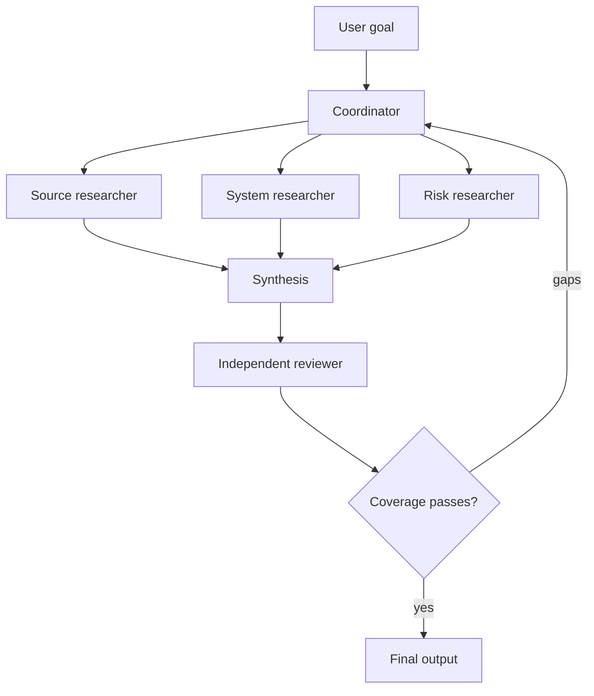

# 多 Agent 编排与委派

> 委派范围应是一个边界清楚的问题，别把全部不确定性一起甩出去。

**类型：** Reference
**语言：** Python
**前置要求：** [工具循环是受控委派](../../10-tool-use-and-agentic-loops/)；阶段 14 第 12 课和第 28 课
**预计时间：** 约 135 分钟

## 学习目标

- 在单 agent、coordinator、pipeline、并行和 reviewer 模式之间作出选择
- 编写包含范围、tool、输出与完成标准的委派任务
- 使用上下文隔离减少膨胀并保护独立判断
- 区分确定性前置条件与自适应模型决策
- 合并部分结果，同时保留来源、错误与未解决缺口

## 问题所在

一个 research agent 使用一份巨型 prompt。它搜索六个来源、比较主张、计算置信度、撰写报告、审查 citation，并判断是否还要继续研究。任务不断变大后，它开始忘记早期约束并重复搜索。团队于是把工作拆给五个拥有宽泛 tool 的 agent，只给出一句指令：“协作到报告足够优秀为止。”

新系统成本更高，也更难调试。两个 agent 研究了同一个主张；coordinator 期待 JSON，其中一个 agent 却返回散文；reviewer 看到 generator 的推理后复述了相同假设；某个 agent 悄悄失败，最终 synthesis 却把缺失结果当成反面证据。

多 agent 架构没有解决拆分问题，只是让缺失合约的代价更高。

## 核心概念

### 先说明为什么需要另一个上下文

只有能带来具体收益时，才创建 subagent：

- 为范围明确的问题隔离上下文
- 并行执行相互独立的工作
- 使用专用 tool 或指令
- 在不包含 generator 上下文的情况下独立审查
- 保护 coordinator 的上下文预算

如果子任务只是一个确定性函数，就使用 tool；如果它是按需加载的可复用指导，就使用 Skill；如果它需要独立的推理循环、证据与停止条件，才可能适合 subagent。

### 从五种模式开始



#### 单 Agent

一个上下文能容纳所有必需证据，且 tool trajectory 很短时最合适，也是最容易评估的系统。

#### 顺序 Pipeline

每个阶段都有固定前驱。顺序与前置条件已知时使用，例如依次提取、校验、审查和渲染。

#### 并行 Fan-Out 与 Reduce

独立任务同时运行，再由 reducer 合并结构化结果。适合逐文件审查或独立来源研究。后一步依赖前一步发现时，不能并行。

#### Coordinator 与 Specialist

coordinator 根据当前缺口选择并委派工作。无法在开始时完整确定拆分方式时使用。

#### Generator 与独立 Reviewer

一个上下文负责生成，另一个只接收产物、证据与 rubric，不接收 generator 有说服力的内部叙述。独立性来自上下文隔离，在同一对话里再问一次没有作用。

### 编写委派合约

一项有效的委派任务应包含：

```text
Goal: one outcome the subagent owns
Scope: files, sources, claims, or systems included and excluded
Inputs: authoritative evidence and current state
Allowed tools: minimum necessary capabilities
Constraints: time, turns, cost, safety, and format
Output: machine-checkable schema with provenance and errors
Completion: observable conditions for done, partial, or blocked
Handoff: what the coordinator should do with each state
```

“彻底研究这个主题”没有定义完成。可以改成：“最多返回五项有依据的主张，每项附带来源 ID、日期、引用片段位置、置信度类别、冲突列表和未解决问题。”

### 把确定性顺序放在模型之外

必须在测试后审查，就由代码强制执行顺序。每个文件都必须先接受本地审查、之后才能进行跨文件一致性审查，就由编排层跟踪 manifest，在第一轮完成前阻止第二轮。

不要依赖 coordinator prompt 在上下文压力下记住硬前置条件。

Claude 判断哪些缺失主张需要继续研究等语义问题；代码决定最大并发数、必需输出、批准状态与阶段顺序等 invariant。

### 有意识地使用任务边界

在 Claude Code 与 agent 运行框架中，任务或 subagent 边界可以提供隔离上下文和受限 tool 集合。具体配置会随时间变化，因此需要查阅当前文档。持久的设计原则是：

- 只传入 subagent 实际需要的证据
- 使用显式 allowlist 限制 tool
- 要求结果附带结构化 metadata
- 只有调用互不依赖时才并行运行
- coordinator 始终负责全局约束与最终状态
- 探索替代方案不能改变原路径时，fork session

隔离可以防止上下文膨胀，但无法保证事实独立。如果所有 agent 都接收相同的错误证据或 rubric，结果仍会一起偏离。

### 保留三种结果状态

每个子任务都应返回：

- complete：满足请求的合约
- partial：有效工作，以及具名缺口或失败来源
- blocked：没有新权限或状态就无法安全推进

不能因为部分字段已有值，就把 partial 转成 complete。coordinator 必须把缺失证据与结构化错误继续传给 synthesis。

### 按标识与来源合并

reducer 需要稳定 key。代码审查使用文件与 finding ID；研究使用主张与来源 ID；客服使用工单与操作 ID。

合并规则应说明：

- 如何处理重复项
- 如何保留冲突
- 是否存在来源优先级
- 如何比较新鲜度
- 如何处理不完整输入
- 如何聚合置信度
- agent 意见不一致时如何升级处理

不要为了让散文更顺滑，就让 synthesizer 隐藏冲突。

### 评估执行轨迹

最终输出看似正确时，编排仍可能浪费工作或越过边界。需要测试：

- subagent 选择正确
- tool 使用在允许范围内
- 任务 ownership 不重复
- 前置条件顺序正确
- 结果 schema 与错误传递正确
- 轮数与成本符合预算
- reviewer 保持独立
- 最终状态完整

用合成 tool 故障和 partial 结果测试。只测 happy path 远远不够。

## 动手构建

## 交互实验

```figure
16-multi-agent-topology
```

增加 agent 前先使用拓扑探索器。比较单一上下文、顺序 pipeline、并行 fan-out、coordinator 和独立 reviewer；图中会展示协调成本、前置条件与 partial 结果风险。

## 实践实验

设计下面这条有边界的 research pipeline，再移除一个不必要的上下文，并说明可测量结果是否改变。

## 交付产物

填写后的 [`outputs/orchestration-contract.md`](../outputs/orchestration-contract.md) 应成为一份具体的 research pipeline 交接，不能只是空白 worksheet。

## 验证

在本地校验任务身份、依赖顺序、预算、partial 状态和 reviewer 隔离：

```bash
cd certifications/claude/lessons/16-multi-agent-orchestration-and-delegation
python3 code/main.py
python3 -m unittest discover -s code/tests -v
```

修改一项依赖或删除 partial 状态规则，确认 verifier 会阻止该数据包。构建完成后，课程 quiz 用于测试拓扑决策。

## 综合项目关联

把经过验证的合约复用为 Architect Foundations 场景综合项目的编排章节。

设计一条用于技术决策的多 agent research pipeline。

### 第 1 步：定义最终合约

在定义 agent 前，先说明决策 brief、主张 schema、来源要求与未解决缺口的表示方式。

### 第 2 步：先尝试单 Agent 基线

测量质量、成本、延迟、重复工作与上下文增长。没有基线故障，就不要增加 agent。

### 第 3 步：识别上下文边界

只拆分确实能从隔离、并行、专门化或独立审查中受益的问题。记录每个新上下文预期带来的改善。

### 第 4 步：编写任务合约

创建表格：

| 任务 | 范围 | 允许的 tool | 输出 | 完成 | 部分完成 | 预算 |
|------|-------|---------------|--------|------|---------|--------|

### 第 5 步：编码前置条件

使用依赖图或状态机。所有必需 research 状态达到 complete 或明确的 partial 之前，reviewer 不得运行。

### 第 6 步：对合并流程做 Red Team

注入重复主张、日期冲突、一个失败 agent、陈旧证据和一份 schema 错误的结果。验证 synthesis 不会悄悄抹掉故障。

## 上手使用

对于代码库审查，可靠的结构是：

1. 建立文件与跨文件问题的 manifest。
2. 使用只读 tool 并行执行范围明确的逐文件审查。
3. 把 finding 规范成共享 schema。
4. 基于 manifest 与规范化 finding 执行一次跨文件审查。
5. 使用独立 reviewer 拒绝证据薄弱和重复的 finding。
6. 只有通过确定性测试与范围 gate 后才应用已接受的改动。

不要让每个 agent 都检查整个仓库。这会复制上下文，也会让 ownership 变得模糊。

对于客服工作，角色要按权限和专长共同划分。policy researcher 可以读取文档；refund recommender 可以分析 case；只有单独获批的 executor 才能获得写权限。

## 考试决策模式

前置条件与权限使用结构化强制机制，隔离推理使用 subagent，而不是用 subagent 执行确定性工具调用。

可靠选项通常会：

- 使用 coordinator 与范围明确的 specialist
- 按角色限制 tool
- 返回结构化结果与 partial 状态
- 并行执行独立任务
- 在全新上下文中执行独立审查
- 保留来源与错误 provenance
- 只重新委派已识别的缺口

薄弱方案只会让更多 agent 共享相同的宽泛 prompt 与 tool 集合。

## 常见坑

### 每个步骤一个 Agent

固定步骤不需要自主上下文。操作是确定性的，就使用代码或 tool。

### 默认并行

让存在依赖的任务并行，会使用陈旧假设并造成昂贵的合并修复。

### 把 Coordinator 当作数据仓库

原始 subagent transcript 会挤占全局上下文。返回精简的结构化结果，把详细证据保留在 prompt 之外。

### Reviewer 携带 Generator 上下文

reviewer 会继承相同 framing，最后变成文案编辑。应在干净的上下文中提供产物、证据和 rubric。

## 练习

1. 把过度膨胀的单 agent prompt 拆成 tool、Skill 与 subagent 职责，并说明每条边界的理由。
2. 设计三名 source researcher 中一名超时时的 partial 结果行为。
3. 为逐文件和跨文件审查 pipeline 添加确定性前置条件。
4. 在同一 eval 数据集上比较顺序拆分与自适应拆分。
5. 创建 trajectory 测试，在两个 agent 的任务 ownership 重复时失败。

## 关键术语

| 术语 | 人们常说 | 实际含义 |
|------|-----------------|------------------------|
| Coordinator | 最聪明的 agent | 负责拆分、全局约束、合并与完成状态的上下文 |
| Subagent | 函数调用 | 拥有有界任务与 tool 的隔离推理循环 |
| Fan-out | 使用多个 agent | 并发运行相互独立且有边界的任务 |
| Reduce | 总结一切 | 按明确的冲突与 partial 状态规则合并结构化结果 |
| Handoff | 发送散文 | 移交类型化状态、证据、错误与下一责任方 |
| Independent reviewer | 再问一遍 | 在与 generator 说服性内容隔离的上下文中评估产物与证据 |

## 延伸阅读

- [Claude Agent SDK 文档](https://platform.claude.com/docs/en/agent-sdk/overview)：查看当前 subagent 与 session 能力
- [构建高效 agent](https://www.anthropic.com/research/building-effective-agents)：了解编排模式
- 阶段 14 第 28 课：更广泛的编排对比
- 阶段 14 第 39 课：独立 reviewer 设计
