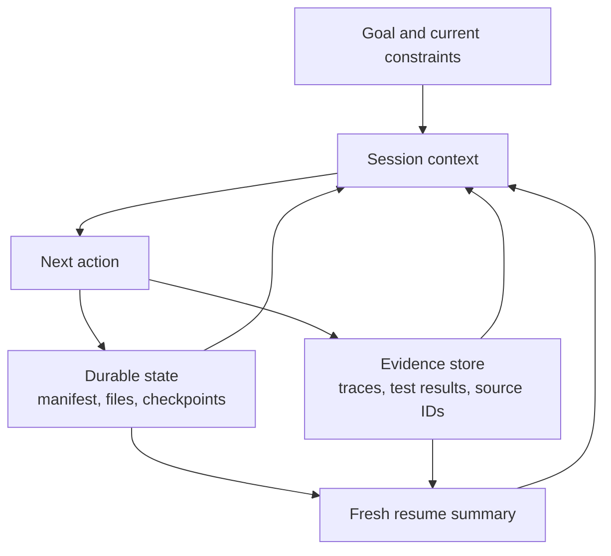

# Agent SDK Session、Subagent 与上下文

> 连续性有价值时就恢复状态；继承的假设开始构成风险时，就 fork 上下文。

**类型：** Reference
**语言：** Python
**前置要求：** [Agent SDK 提供运行框架，权限另行控制](../../12-claude-agent-sdk-and-hooks/)、[多 Agent 编排与委派](../../16-multi-agent-orchestration-and-delegation/)；阶段 14 第 17 课
**预计时间：** 约 120 分钟

## 学习目标

- 将持久任务状态与对话上下文分开管理
- 根据失败风险，在新建、恢复、fork 与压缩 session 之间选择
- 用 subagent 隔离上下文和 tool
- 围绕确定性的生命周期事件放置 hook
- 设计不会重放陈旧假设或重复副作用的恢复机制

## 问题所在

一个仓库迁移 agent 连续运行了数小时。它的上下文包含原始计划、tool 输出、失败实验、未完成的 patch、测试日志和几份摘要。某个依赖变更后，团队恢复同一 session，并说：“从你停下的地方继续。”

agent 沿用了过时计划。它重复执行了一项在超时前其实已成功的写操作。压缩保留了大致脉络，却丢掉一项关键测试失败。一个 reviewer subagent 收到完整的 parent 历史，并假定旧版依赖的行为仍然成立。

系统混淆了三件事：

- 持久的外部状态
- 当前对话上下文
- 执行历史

它们彼此相关，却不应被当作同一个存储系统。

## 核心概念

### 上下文是工作集

模型上下文应只包含下一步决策所需的信息。它不是已完成工作、批准、文件、checkpoint 或 tool 副作用的权威数据库。



把持久事实存储在上下文之外：

- 当前任务 manifest 与状态
- 已完成产物及其版本
- 幂等键与外部操作 ID
- 批准及其失效时间
- 最近一次已验证的测试与 deploy 结果
- 未解决的 blocker
- 来源与 trace 引用

session 启动或恢复时，再从这些状态重建精简且最新的工作集。

### 在四种 Session 操作之间选择

#### 新建 Session

目标或信任边界变更、继承的上下文不再可靠，或前一任务已完成时，使用干净的 session。输入应来自权威状态，并组织成结构化 brief。

#### 恢复 Session

任务、约束和证据仍然有效，并且对话连续性有价值时，恢复 session。先重新验证外部状态。session ID 不代表外部世界没有变化。

#### Fork Session

探索替代方案但必须保留原分支时，fork session。适合竞争性的架构计划、独立的调试假设或高风险迁移选项。fork 继承一个起点，但未经明确协调，不得修改共享状态。

#### 压缩 Session

上下文不断增长，但当前工作仍能从连续性中获益时，压缩 session。一份好的压缩摘要会保留决策、约束、产物 ID、测试状态、待解决缺口和下一步操作。大型证据存到外部，只在摘要中保留引用。

压缩只能节省上下文。它不会形成持久执行记录，也不能保证关键事实留存或验证信息的新鲜度。

### 使用结构化恢复数据包

```json
{
  "goal": "Migrate the request client without changing public behavior",
  "scope": ["src/client.py", "tests/test_client.py"],
  "completed": [
    {"task": "inventory", "artifact": "work/inventory.json", "verified": true}
  ],
  "current_state": {
    "branch": "migration/client-v2",
    "dependency_version": "verified-at-resume",
    "tests": "12 passed, 1 blocked"
  },
  "open_gaps": ["timeout retry semantics need decision"],
  "constraints": ["no public API change", "no production writes"],
  "next_action": "compare retry behavior against the contract tests"
}
```

数据包应直接报告当前真实状态，无须逐条概括每一轮对话。

### 按职责隔离 Subagent 上下文

subagent 应接收：

- 一个目标和范围
- 最少量的相关证据
- 受限的 tool
- 明确的输出与错误 schema
- 回合、时间与成本 budget
- 完成与升级规则

它不应接收无关的 parent 历史。隔离能保护注意力，也能维护 reviewer 的独立性。

coordinator 保留全局状态，并在合并前校验返回的合约。

### 用 Hook 处理确定性的生命周期工作

hook 会在 session 或 tool 周围的既定事件上运行。具体事件名和配置会变化，因此请查阅当前的 Agent SDK 与 Claude Code 文档。持久有效的放置原则是：

- pre-action hook 负责校验或阻止
- post-action hook 负责规范化、记录或验证
- stop hook 检查完成情况并清理
- session hook 读取或持久化受控状态

例如：

- 阻止声明范围之外的写操作
- 在破坏性 tool 前要求最新批准
- 截断过大的 tool 输出，或将其外置
- 将 tool 错误规范为统一 schema
- 编辑后运行 formatter 或聚焦测试
- 写入不可变 trace 引用

需要模型推理的语义判断，不要塞进脆弱的 shell 逻辑。硬授权边界也不要只放在 prompt 中。

### 让副作用具备幂等性

超时后恢复时，如果结果丢失，操作可能被重复。每一次外部写入都需要幂等或对账策略。

例如：

- 使用唯一请求键创建退款
- patch 前记录预期文件 hash
- 重试前检查 deploy 版本
- 持久化 tool 调用 ID 与结果状态
- 在再次写入前核对未知结果

决定“再试一次”之前，先完成错误分类。

### 在边界处重新验证

继续前：

1. 解析当前文件、依赖版本、分支和服务状态。
2. 与 checkpoint 对比。
3. 标记陈旧假设。
4. 运行能建立安全下一步的最小验证。
5. 创建新的当前状态摘要。

环境发生实质偏离时，应基于新计划启动或 fork。不要强迫旧 session 重新解释自身。

### 规划上下文 Budget

为以下内容分配上下文：

- 目标和硬约束
- 当前计划和 manifest
- 做出下一项选择所需的近期证据
- 精简的相关 tool 输出
- 最终输出合约

大段原始日志、整个仓库和重复的 tool schema 应留在活跃工作集之外，或通过渐进发现按需读取。

把范围明确的搜索交给 subagent，并返回带引用的摘要。即使标称窗口很大，上下文仍是稀缺的推理界面。

## 动手构建

## 交互实验

```figure
17-session-context-budget
```

使用上下文 budget 模拟器，在目标、约束、证据、tool 结果与输出合约之间分配工作集。它会直观展示：压缩可以减小体积，却不能证明状态仍然最新。

## 实践实验

使迁移练习中的一个 checkpoint 失效，在不信任对话历史的前提下修复恢复数据包。

## 交付产物

填写完整的 [`outputs/session-recovery-packet.md`](../outputs/session-recovery-packet.md) 记录了一次中断的迁移，包含 hash、一次未知副作用和安全的下一步操作。

## 验证

验证其中是否包含持久状态、重新验证、幂等键和独立审查：

```bash
cd certifications/claude/lessons/17-agent-sdk-sessions-subagents-and-context
python3 code/main.py
python3 -m unittest discover -s code/tests -v
```

quiz 用于检查 session 选择与恢复规则。

## 综合项目关联

将验证过的数据包附到 Architect Foundations 综合项目，作为其恢复和上下文管理证据。

创建一项持久化的三 session 迁移练习。

### Session 1：清点与规划

产出文件、测试、公开合约、依赖和风险的 manifest。将其持久化到对话之外，暂不实施。

### Session 2：实施与验证

从 manifest 和当前仓库状态开始。使用受限的文件 tool。持久化已完成任务 ID、文件 hash、测试输出引用与未解决缺口。

中途模拟一次文件写入后的超时。恢复时，在任何重试前先核对文件 hash。

### Session 3：独立审查

fork 一个全新的审查上下文。提供 diff、需求、测试和 rubric，不提供实施 transcript。reviewer 返回带有证据的结构化 finding。

### Hook 要求

- pre-write 范围 gate
- post-write 聚焦验证
- 带外部证据引用的 tool 输出大小限制
- 结构化 trace 记录
- 要求 manifest 完成或显式 partial 状态的 stop 检查

## 上手使用

对于客服 agent，将工单状态、已检索证据 ID、批准和 tool 结果存入持久的 case 记录。session 上下文只包含当前问题和相关证据。数小时后人工返回时，从 case 记录重建工作集，并重新验证 policy 的新鲜度。

对于 CI，每次运行都应从 commit 和已声明输入开始。复用交互式 session 可能引入未声明状态。应改为将持久化 finding 或结构化摘要显式作为输入。

## 考试决策模式

连续性仍然有效时选择恢复；需要隔离替代方案时选择 fork；陈旧上下文构成风险时选择新 session。压缩只能减小体积，真实性仍需外部证据。

优先选择以下方案：

- 在 prompt 之外持久化状态
- 恢复时重新验证当前环境
- 隔离 subagent 上下文和 tool
- 用 hook 实施确定性 gate 与规范化
- 重试前核对未知副作用
- 传递带产物引用的结构化摘要

避免把完整旧 transcript 送进每一个新 agent。

## 常见坑

### Session 等于状态

对话历史不提供事务、幂等性、版本控制或权威外部事实。

### 压缩等于恢复

摘要可能漏掉最关键的一次失败。恢复依赖持久状态与验证。

### Fork 等于独立

fork 可能继承有缺陷的证据。reviewer 的独立性还需要干净的 rubric 与受控输入。

### 到处使用 Hook

过多不透明的 hook 会让行为难以调试。应让它们小而可观测、经过版本控制，并且各自对应一个具名 invariant。

## 练习

1. 为一个 deploy 过程中中断的 agent 设计恢复数据包。
2. 为一项高影响 tool 调用加入幂等性与对账机制。
3. 判断五种情形分别需要恢复、fork、压缩还是新 session。
4. 创建一张 hook 图，分开语义模型工作与确定性 gate。
5. 分别测试 reviewer 是否带有 generator transcript 上下文，并比较重复的假设。

## 关键术语

| 术语 | 人们常说 | 实际含义 |
|------|-----------------|------------------------|
| Session | 持久 memory | 对话工作上下文，不是权威系统状态 |
| Resume | 盲目继续 | 在核对当前外部状态后复用有效上下文 |
| Fork | 复制一切 | 为隔离的替代工作从既有上下文分出分支 |
| Compaction | 保存所有细节 | 压缩当前上下文，权威证据仍由外部状态保留 |
| Hook | 一条 prompt | 附着于生命周期事件的确定性代码 |
| Idempotency | 重试一次 | 同一请求身份重复操作也不产生额外影响 |

## 延伸阅读

- [Claude Agent SDK session 文档](https://platform.claude.com/docs/en/agent-sdk/sessions)：查看当前 session 行为
- [Claude Agent SDK hook 文档](https://platform.claude.com/docs/en/agent-sdk/hooks)：查看当前生命周期事件
- 阶段 14 第 40 课：多 session 交接
- 阶段 15 第 12 课：持久执行
