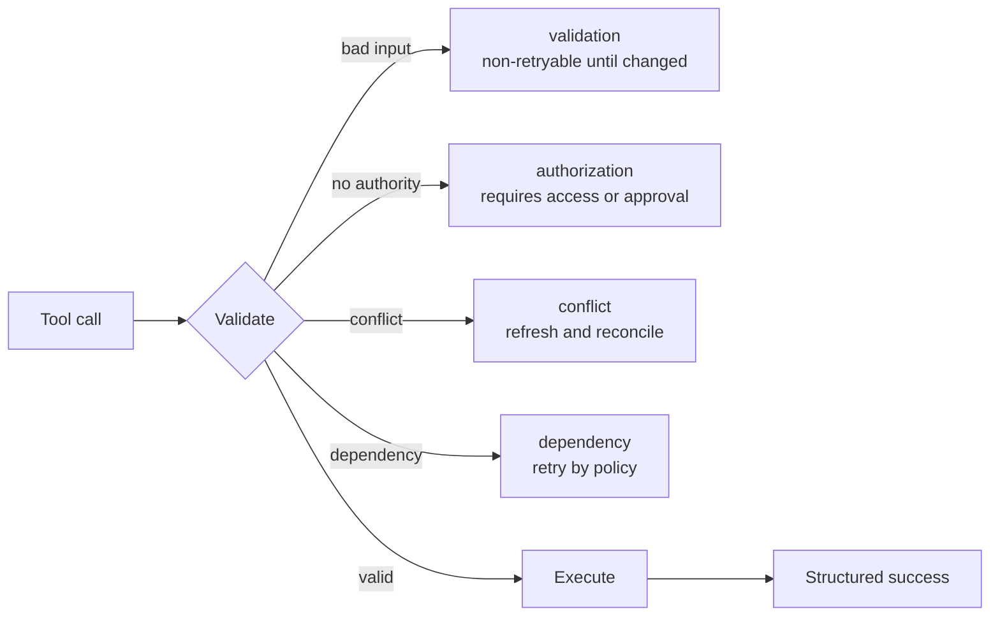

# Tool 合约、错误与渐进式发现

> 模型只能从你描述的接口中做选择。含糊的 tool 会带来含糊的行为。

**类型：** Reference
**语言：** Python
**前置要求：** [工具循环是受控委派](../../10-tool-use-and-agentic-loops/)、[MCP 将能力与宿主解耦](../../11-mcp-server-design-and-integration/)；阶段 13 第 05 课
**预计时间：** 约 120 分钟

## 学习目标

- 编写边界不重叠的 tool 名称、描述和 schema
- 设计能引导安全恢复的结构化 tool 与 MCP 错误
- 有意识地使用 tool choice 和精简的 tool 分发
- 为用户和项目使用划分 MCP 配置与 secret
- 对大型 tool 目录应用渐进式发现，同时不丢失授权控制

## 问题所在

一个 agent 看到了三个 tool：

- `search`
- `find`
- `lookup`

它们的描述全是“查找信息”。其中一个搜索公开网页，一个查询内部客户记录，还有一个检索已批准的 policy。它们的 schema 都只接受一个字符串，错误则返回任意文本。

模型的选择变得不一致。一次公开 research 查询了私有数据；一个 policy 问题却去搜了网页。tool 返回“失败”时，agent 不断重试，直到耗尽 budget。

问题出在接口：它抹掉了模型安全选择所需的区别。

## 核心概念

### Tool 描述是决策界面的一部分

一份可靠的 tool 合约应说明：

- 一个动作和对象
- 何时使用
- 何时不该使用
- 权威数据边界
- 所需身份或批准
- 参数的含义和约束
- 结果与错误形态
- 副作用与可逆性

对比：

```json
{
  "name": "search",
  "description": "Search for information",
  "input_schema": {
    "type": "object",
    "properties": {"q": {"type": "string"}}
  }
}
```

再看：

```json
{
  "name": "search_active_support_policy",
  "description": "Search approved active support-policy text for the caller's region. Use for policy questions. Do not use for customer-account facts or public web research. Returns versioned policy passages with source IDs.",
  "input_schema": {
    "type": "object",
    "properties": {
      "query": {"type": "string", "minLength": 3},
      "region": {"type": "string", "enum": ["uk", "eu", "us"]},
      "top_k": {"type": "integer", "minimum": 1, "maximum": 8}
    },
    "required": ["query", "region", "top_k"],
    "additionalProperties": false
  }
}
```

第二个接口给出了选择边界和结果承诺。服务在执行时仍必须验证身份与地区。

### 避免 Tool 重叠

当模型无法推断哪个 tool 应负责一项请求时，两个 tool 就发生了重叠。可通过以下方式修复接口：

- 将完全相同的动作合并到一个 tool 后面
- 按可见对象或权限边界拆分
- 在名称中标明来源或副作用
- 补充正向和反向使用条件
- 在当前 API 支持时提供输入示例
- 对易混淆的 tool 对测试选择结果

不要用 prompt 规则来弥补目录本身的不连贯。

### 让 Schema 承载 Invariant

使用类型、enum、必填字段、边界、pattern 和封闭对象。名为 `options` 的字符串会把验证推给自然语言；带类型的字段则让无效状态更难表达。

schema 有效不等于语义有效。服务仍必须检查账户是否存在、金额是否符合 policy、用户是否有权限，以及引用的资源是否属于该 tenant。

### 将错误作为数据返回



错误合约应包含：

- 类别
- 是否可重试的标记
- 安全消息
- 适用时提供字段错误
- 部分结果及其 provenance
- 建议的安全下一步操作
- trace 或 incident 引用

不要暴露 stack trace、secret、原始凭证或内部路径。也不要把每种错误都标为可重试。

对于 MCP tool，使用协议的结构化错误信号和 client 可解释的内容体。传输成功与 tool 成功是两回事；具体字段请核对当前规范。

### 有意识地使用 Tool Choice

按当前 API 的能力，tool-choice 控制可要求调用 tool、允许自动选择、指定某个 tool，或禁止 tool use。

应用需要类型化结果时，强制使用结构化输出 tool。是否使用或使用哪个 tool 应由模型决定时，允许自动选择。不要只为获得 JSON 就强制执行现实世界中的操作，应把提取和执行分开。

允许并行 tool use 时，要确保各调用相互独立，且 harness 能将每个结果关联到正确的调用标识。

### 分发更少的 Tool

tool 列表会消耗上下文，也会制造选择。每个角色只给它所需的最小目录：

- Research agent：只读网页和来源 tool。
- Policy agent：当前 policy 资源和搜索。
- Refund recommender：读取 case 并计算建议。
- Approved executor：一个需要最新批准的有界写 tool。

不要图方便，把四套目录都交给同一个 agent。

### 渐进式发现大型目录

先提供常用 tool 和能力搜索机制，只有当任务证明确有需要时，再加载专用定义。

渐进式发现可改善：

- 上下文使用
- tool 选择
- prompt-cache 稳定性
- 安全审查边界

发现过程必须应用身份与范围，不得泄露受限能力的名称或描述。

### 划分 MCP 配置作用域

项目配置会为团队做版本管理；用户配置适用于一个账户或设备上的多个项目。共享 server 声明和安全默认值应放在项目作用域；个人路径、本地选择和用户特定凭证应留在已提交文件之外。

secret 使用环境变量引用，绝不提交具体值。审查 server 命令、参数、环境、传输、origin 和 tool 面。

MCP server 可以暴露 tool、resource 与 prompt。根据控制方向选择原语：

- tool：模型请求一个动作
- resource：host 或模型读取上下文数据
- prompt：用户或 host 调用可复用模板

不要把每一份静态文档都包装成动作 tool。

### 按意图选择 Claude Code 内置 Tool

持久有效的边界如下：

- 已知文件内容用 Read
- 路径发现用 Glob
- 文本和符号搜索用 Grep
- 对既有文件做有界修改用 Edit
- 创建或完整替换文件用 Write
- 命令、测试和没有更安全专用接口的操作用 Bash

按任务限制 Bash 和写入 tool。选择能表达预期操作、且会生成可检查证据的最具体接口。

## 动手构建

## 交互实验

```figure
18-tool-discovery-contract
```

使用 discovery-contract 图，对比重叠 tool、渐进加载的 tool 与执行授权。改变错误类别，观察不同故障分别该重试、变更输入、请求批准还是升级处理。

## 实践实验

引入一个重叠描述和一个标为可重试的授权错误，观察两种失败，再修复接口与恢复合约。

## 交付产物

填写完整的 [`outputs/tool-catalog-review.md`](../outputs/tool-catalog-review.md) 包含明确的 policy、账户和公开搜索边界，以及一份失败矩阵。

## 验证

运行确定性的合约审查：

```bash
cd certifications/claude/lessons/18-tool-contracts-errors-and-progressive-discovery
python3 code/main.py
python3 -m unittest discover -s code/tests -v
```

quiz 会测试同一套选择规则。

## 综合项目关联

将该产物带入 Architect Foundations 综合项目，作为 tool 与 MCP 合约索引。

用这份清单审计一个 tool 目录。

| 问题 | 证据 |
|----------|----------|
| 每个名称是否标识一个动作和对象？ | 选择测试 |
| 正向与反向用例是否明确区分？ | 易混淆 pair eval |
| schema 是否拒绝无效形状？ | 验证器测试 |
| 服务是否执行语义与 auth 规则？ | 集成测试 |
| 错误是否分类且可感知重试性？ | 失败 fixture |
| 每个副作用是否都已命名且有边界？ | 威胁模型 |
| 每个角色的 tool 是否最小化？ | 能力矩阵 |
| 大型目录能否渐进加载？ | 上下文与缓存测量 |
| 项目和用户配置是否分开？ | 配置审查 |
| secret 是否仅引用而从不存储？ | 仓库扫描 |

至少创建 12 个选择案例，其中包括可能匹配两个 tool 的查询。只有模型选择正确 tool，或正确地选择不用 tool 时，eval 才通过。

注入 validation、authorization、conflict、rate-limit、timeout 和 partial result 故障。断言 harness 会按照类别改变行为。

## 上手使用

对于结构化提取，定义一个无副作用 tool，用它的 schema 表达目标记录。需要结构化记录时强制该 tool，再验证语义约束与 provenance。不要把生产写 tool 复用成输出 schema。

对于大型企业目录，使用 registry 按任务和范围查找能力，只加载选中的定义。监控目录大小、发现精度、tool 选择、缓存命中和未经授权的发现尝试。

## 考试决策模式

tool 问题往往是接口问题。在增加 prompt 复杂度之前，先修复描述、边界、schema、分发和错误合约。

优先选择以下方案：

- 给 tool 不同的名称和反向使用指引
- 返回具有重试语义的结构化 `isError` 风格结果
- 适当时用 tool choice 强制类型化输出
- 把项目配置和用户 secret 分开
- 用 resource 提供上下文数据，用 tool 执行动作
- 对大型目录应用渐进式发现

## 常见坑

### 把 Tool 描述当成授权

“仅管理员”只是文本，服务仍需要经过认证的范围和 policy。

### 把错误文本当成恢复策略

模型无法猜出“失败”意味着重试、变更输入、升级还是停止。应返回明确类别和重试状态。

### 一个 Tool 负责所有操作

巨大的 schema 和条件行为会难以选择、验证和授权。应沿有意义的边界拆分。

### 在共享配置中保存 Secret

项目文件面向协作，应引用环境名称，并在版本控制之外配置值。

## 练习

1. 将五个含糊的 tool 定义改写成边界清晰的定义。
2. 为内部、公开和 policy 搜索构建易混淆 pair 评估。
3. 为多来源搜索超时设计结构化 partial result。
4. 将单体 MCP server 拆成 tool、resource 和 prompt。
5. 创建不含 secret 值的项目与用户配置示例。

## 关键术语

| 术语 | 人们常说 | 实际含义 |
|------|-----------------|------------------------|
| Tool contract | 函数名 | 选择指引、schema、结果、错误、权限与副作用边界 |
| Negative-use guidance | 额外 prompt 文本 | 明确说明何时由另一接口负责请求 |
| Tool choice | Tool 权限 | 请求级控制：Claude 是否必须调用 tool 或调用哪个 tool |
| Progressive discovery | 动态授权 | 在限定范围的发现之后按需加载相关能力 |
| MCP resource | 一个读 tool | 通过 resource 原语标识并读取的上下文数据 |
| Project scope | 全局配置 | 面向一个仓库或团队的版本化配置 |

## 延伸阅读

- [Claude tool use 文档](https://platform.claude.com/docs/en/agents-and-tools/tool-use/overview)
- [MCP 规范](https://modelcontextprotocol.io/specification/latest)
- [Claude Code MCP 文档](https://docs.anthropic.com/en/docs/claude-code/mcp)
- 阶段 13 第 05 课：tool schema 设计
- 阶段 13 第 15 课：tool poisoning 威胁
