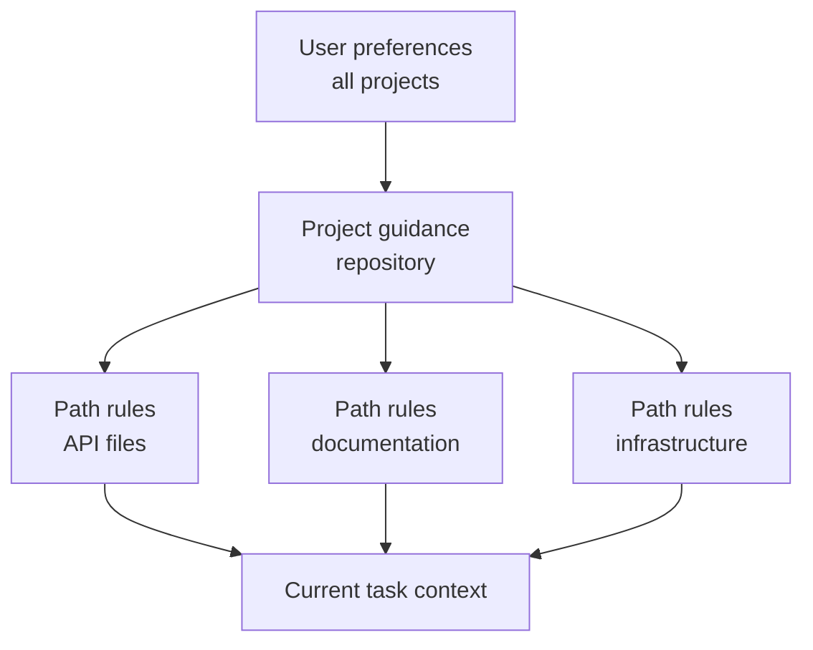

# Claude Code Memory、Rule、Skill 与 CI

> 稳定的指引应放在其适用范围真实成立的位置；不能容忍失败的约束应当可执行。

**类型：** Reference
**语言：** Python
**前置要求：** [Claude Code 靠共享约束支持规模化协作](../../15-claude-code-for-development-teams/)、[Agent SDK Session、Subagent 与上下文](../../17-agent-sdk-sessions-subagents-and-context/)
**预计时间：** 约 210 分钟

## 学习目标

- 在不造成上下文膨胀的前提下设计项目与用户指令层级
- 按用途选择 CLAUDE.md、路径 Rule、Skill、command、agent、hook 与 settings
- 编写并分发一个具有窄 tool 授权的真实多文件 `SKILL.md` 包
- 用 plan、直接执行和有边界的 subagent，并要求明确报告障碍
- 为可复现的 CI 证据配置无头 Claude Code
- 防止陈旧 memory、宽泛权限和隐藏本地配置控制团队工作

## 问题所在

一个团队把每条指令都塞进根 `CLAUDE.md`：架构历史、格式、数据库规则、deploy 步骤、个人偏好、命令，以及六种语言的示例。每项任务都会复制这份文件。

开发者再加私有覆盖项，CI 又有另一套配置。一条 command 假定自己有写权限；一个宽泛 hook 重格式化了无关文件。指令写着“始终跑全部测试”，于是一次小文档编辑触发 40 分钟测试套件。agent 忽略安全规则时，团队只会再加更多粗体字。

根因是作用域和优先级混乱、没有渐进式披露，还把指引与强制机制混在了一起。

## 核心概念

### 为不同工作选择正确机制

| 机制 | 最适合 | 避免 |
|-----------|----------|-------|
| `CLAUDE.md` | 简练稳定的仓库指引和入口 | 完整手册、临时状态、secret |
| 导入文件 | 靠近 owner 的共享辅助指令 | 循环或不可见的指令图 |
| 路径 Rule | 仅对匹配文件成立的指引 | 复制到每项任务的全局规则 |
| Skill | 相关时加载的可复用流程或领域 playbook | 一次性事实或硬授权 |
| Command | 用户显式调用 workflow 的兼容名称 | 没有 Skill 结构的新多步骤包 |
| Agent | 有隔离上下文和 tool 的有边界角色 | 确定性的工具函数 |
| Hook | 确定性的校验、阻止、规范化或自动化 | 开放式语义判断 |
| Settings | 权限、模型、plugin 和运行时配置 | 提交到仓库的 secret 值 |

产品说明（核验于 2026-08-09）：custom command 已并入 Skill。`.claude/commands/` 下的文件仍兼容，而 `.claude/skills/<name>/SKILL.md` 是新 workflow 的首选包。具体字段、优先级和产品可用性会变化，实施前应核对当前 Claude Code 文档。2026 年 7 月 CCAR-F blueprint 要求理解层级、Rule、command、Skill、agent、memory、规划与无头 workflow。

### 保持根指令文件精简

根文件应帮助有能力的新 contributor 正确起步。

应包含：

- 项目用途和不直观的架构边界
- 规范的构建、测试和格式化命令
- source-of-truth 文件
- 安全和范围约束
- 指向深入指引的链接或 import
- 验证和贡献预期

应排除：

- 临时任务状态
- 生成的清单
- 很长的 API 参考
- 个人编辑器设置
- secret 值
- 只适用于一个目录的指令

把它写成上手路由，别往里倾倒知识。

### 在最窄的真实作用域放置指令



用户作用域保存不应定义团队行为的个人默认值；项目作用域保存经过版本管理的共享决定；路径特定 Rule 只在文件 pattern 匹配时加载；任务指令包含当前请求。

两条 Rule 冲突时，调查文档化的优先级，并明确项目 source of truth。关键 workflow 不要依赖隐藏的本地覆盖项。

### 导入稳定的辅助指引

用 import 保持根文件简洁，同时维护模块化 owner。例如，数据库迁移 policy 应放在数据库文档附近，而根文件中的指针让它仍可发现。

审计 import 图：

- 每个目标都存在
- 没有循环
- 宽泛文件 import 不泄露 secret 或无关文本
- owner 与更新触发条件明确
- 删除或重命名的指引会明显失败

memory 检查命令可帮助发现哪些指令处于激活状态。用它们调试配置，不要存放不可恢复的项目状态。

### 用 Skill 实现渐进式披露

Skill 将可重复的方法、参考资料、脚本和产物打包。它的 description 帮助 agent 判断何时适用；完整正文只在被选中时加载，为无关工作保留上下文。

好的 Skill 包括：

- 数据库迁移审查
- 事故分诊
- release note 生成
- 威胁模型清单
- 架构决策访谈

Skill 应定义输入、顺序、证据、输出和停止条件，但不应嵌入 secret 或授予权限。

真实项目 Skill 位于 `.claude/skills/<skill-name>/SKILL.md`。入口文件包含 YAML frontmatter 和 Markdown 指令：

```yaml
---
name: migration-review
description: Review database migration files when a change adds or modifies paths under migrations/. Use it before merge to collect forward, rollback, locking, and data-safety evidence.
allowed-tools: Read Grep Glob Bash(python3 ${CLAUDE_SKILL_DIR}/scripts/check_scope.py *)
---
```

description 是触发合约。用开发者实际会说的语言说明 Skill 做什么、何时适用。测试应触发的请求和不应触发的近似请求。只有显式 `/skill-name` 调用才应加载时，使用 `disable-model-invocation: true`。

`allowed-tools` 会为调用的那个回合预先批准匹配 tool。它不会限制可用 tool 集合、覆盖 deny Rule，或变成 session 级长期授权。pattern 应和打包流程一样窄，并在接受文件夹信任前审查项目 Skill。

将细节从 `SKILL.md` 中移出，并有意识地路由过去：

| Skill 文件 | 用途 | 加载条件 |
|---|---|---|
| `SKILL.md` | 触发、核心顺序、停止条件、输出合约 | 调用 Skill 时 |
| `references/review-checklist.md` | 详细领域证据 | 核心顺序进入审查时 |
| `scripts/check_scope.py` | 确定性路径校验 | 读取请求的迁移文件之前 |
| `examples/accepted.md` | 一种有代表性的输出形态 | 格式存在歧义时 |

从 `SKILL.md` 引用每个辅助文件，让 Claude 知道为何以及何时打开它。打包路径通过 `${CLAUDE_SKILL_DIR}` 解析，不要假设当前工作目录。位于 [`outputs/migration-review-skill/`](../outputs/migration-review-skill/) 的包是一个可运行示例。

### 使用 Command 表达显式用户意图

用户有意调用可重复 workflow 时，command 很有用。定义参数提示、allowed tool 和执行上下文；当 command 需要隔离时，在支持且适当时使用 fork 的上下文。

例如：

- 审查一个迁移文件
- 从访谈生成 ADR
- 运行聚焦测试计划
- 检查失败的 CI trace

避免会静默写入、deploy 或使用宽泛 Bash 权限的 command。名称和参数合约应让后果一目了然。

对于新工作，将这种显式 workflow 实现为用户可调用 Skill。既有 `.claude/commands/<name>.md` 仍会创建 `/<name>`，可在不破坏用户的情况下迁移。流程需要脚本、参考、模板、调用控制或经 plugin 分发时，优先使用 Skill 目录。

### 将 Subagent 用作有边界的证据收集者

运行 `/agents` 创建和管理可复用 subagent 定义。项目 agent 放在 `.claude/agents/` 下，使它的角色能随代码库被审查。`description` 告诉 Claude 何时委派；`tools` 限制 tool 池；`maxTurns` 提供硬回合 budget；`isolation: worktree` 为编辑型 agent 提供独立 checkout。

```markdown
---
name: migration-auditor
description: Audit migration safety when a change touches migrations/. Return evidence and blockers; do not edit.
tools: Read, Grep, Glob, Bash
maxTurns: 10
isolation: worktree
---

Inspect only the assigned migration and adjacent schema code.
Stop after ten turns or twenty minutes, whichever comes first.
Return JSON with status, evidence, blockers, and next_step.
Never replace missing evidence with an assumption.
```

回合或时间 box 只定义停止点，不构成完成证据。parent session 校验结果并负责集成。要求结构化障碍报告：无法访问文件的 subagent 必须返回 `status: blocked`、准确障碍、已尝试的证据和狭窄的 `next_step`，不得静默扩大 tool 或范围。

只有 subagent 编辑时才使用 worktree 隔离；只读 researcher 通常只需要独立上下文。worktree 隔离文件和分支，不隔离网络、凭证、共享 Git metadata 或外部系统。

### 通过最小共享面分发

根据受众选择分发方式：

- 单一仓库提交 `.claude/skills/` 与 `.claude/agents/`。
- 多个仓库需要同一版本 bundle 时，把 Skill、agent、hook 与 MCP 定义放进 plugin。
- 通过经过审查的 marketplace 发布 plugin，并固定 release 或 commit。
- 用 managed settings 保存组织 policy 与 marketplace 限制，避免把它们堆入每个团队的流程。

项目可在 `.claude/settings.json` 中声明 marketplace 并启用已审查 plugin：

```json
{
  "extraKnownMarketplaces": {
    "company-tools": {
      "source": {"source": "github", "repo": "company/claude-plugins"},
      "autoUpdate": false
    }
  },
  "enabledPlugins": {
    "migration-review@company-tools": true
  }
}
```

文件夹信任仍然重要，managed `strictKnownMarketplaces` 可在任何网络或文件系统操作前限制用户可添加的来源。审查发布者、版本、组件、脚本、hook、MCP server、权限、更新和回滚。项目默认值属于团队配置；managed settings 是不可覆盖的组织 policy。

### 将路径 Rule 用作本地 Policy

路径 glob 可表达以下 Rule：

- API 变更需要合约测试
- 迁移文件只可追加
- docs 使用特定风格
- 生产配置不得含字面 secret

测试 glob 行为。永远不匹配的 Rule 会带来虚假的信心；匹配整个仓库的 glob 会重新造成根文件膨胀。

### 区分规划、探索与执行

范围或策略需要在变更前获批时，使用 plan mode。否则会使主任务膨胀的只读代码库问题，交给探索型 subagent。改动已受限且下一个安全操作已经明确时，直接执行。

需求缺失时，访谈模式很有用。提出会实质改变实现的问题，记录决定，再构建。

示例和测试只有在展示真实验收边界时才会提升一致性；不要添加只会重复指令的示例。

### 将测试作为对话合约的一部分

对于代码任务：

1. 识别行为与最小相关验证。
2. 可行时先建立或编写失败测试。
3. 做出有边界的改动。
4. 运行聚焦测试。
5. 按风险运行更广泛 gate。
6. 检查真实产物或行为。
7. 报告精确证据与剩余不确定性。

Claude 可以提出并执行这条循环，但是否通过 gate 由确定性 CI 决定。

### Hook 决策需要精确合约

Claude Code 将 JSON 发送给 hook。command hook 要么以 `0` 退出并向 stdout 打印一个结构化 JSON 对象，要么以 `2` 退出并向 stderr 写入阻止原因。两者不能混用，因为 JSON 只会在 exit `0` 时解析；对多数事件，exit `1` 不会阻止操作。

事件 schema 不能互换。`PreToolUse` 使用带有 `allow`、`deny`、`ask` 或 `defer` 的 `hookSpecificOutput.permissionDecision`；`PermissionRequest` 使用带有 `allow` 或 `deny` 的 `hookSpecificOutput.decision.behavior`。已配置的 deny 和 ask Rule 仍会评估；allow 结果不能覆盖匹配到的 deny Rule。

```json
{
  "hookSpecificOutput": {
    "hookEventName": "PermissionRequest",
    "decision": {
      "behavior": "deny",
      "message": "Production access requires interactive approval"
    }
  }
}
```

确认 exit `2` 是否能阻止选定事件。它可阻止 `PreToolUse` 并拒绝 `PermissionRequest`，但不能撤销 `PostToolUse` 已观察到的动作。

### 将无头 CI 设计为全新 Reviewer

无头 Claude Code 能以 print mode 和结构化输出非交互运行。使用前核对当前 flag 与 schema。持久有效的原则是：

- 从干净 commit 和已声明输入开始
- 使用最小权限的 tool 与 settings
- 固定或记录模型和配置
- 设置时间、回合与成本上限
- 请求 JSON 或受 schema 约束的输出
- 分开生成 finding 和应用改动
- 需要时运行独立审查
- 检查修复时显式提供之前的 finding
- 让确定性测试和 policy gate 保持权威

CI 不应继承交互式开发者 session。可复现性需要全新状态。

产品说明（核验于 2026-08-09）：Anthropic 的 managed Code Review 是 Team 和 Enterprise 方案的 research preview，它与官方 GitHub Action 是不同的运行选择。managed Code Review 报告 pull request finding，但不会批准或阻止。`anthropics/claude-code-action@v1` 在仓库 workflow 中运行，并显式配置事件、GitHub 权限、secret 来源、settings、tool、模型与回合上限。两者都不能代替确定性 gate 或受保护的 merge 路径。

### 跨运行保留 Finding

一次运行发现问题、另一次验证修复时，应把 finding 存为带稳定 ID、文件、证据、严重性和状态的结构化产物。只传自然语言摘要可能丢失正在验证的精确主张。

修复审查应接收原始 finding、当前 diff、相关测试与验收 Rule，不需要整段原始对话。

## 动手构建

## 交互实验

```figure
19-memory-rule-precedence
```

使用优先级探索器，将稳定项目事实、路径特定指引、可复用 Skill、command 和确定性 hook 路由到最窄的真实作用域。冲突层会展示：隐藏本地 policy 为什么不能治理 CI。

## 实践实验

破坏一个已文档化的路径 glob，检查哪些 fixture 路径加载 Rule，然后修复作用域，不要将窄指引移回根文件。接着使用一条迁移路径和一次 traversal 尝试，运行随附 Skill 检查器：

```bash
python3 outputs/migration-review-skill/scripts/check_scope.py migrations/2026_add_index.sql
python3 outputs/migration-review-skill/scripts/check_scope.py ../secrets.sql
```

## 交付产物

填写完整的 [`outputs/configuration-scope-audit.md`](../outputs/configuration-scope-audit.md) 记录已测试的 glob fixture、一个 allow 和 deny 边界、有边界的 subagent、plugin 分发、精确 hook 输出，以及全新的 CI 合约。目录 [`outputs/migration-review-skill/`](../outputs/migration-review-skill/) 提供真实 `SKILL.md`、确定性脚本和按需参考。

## 验证

不使用 Claude、网络或凭证进行验证：

```bash
cd certifications/claude/lessons/19-claude-code-memory-rules-skills-and-ci
python3 code/main.py
python3 -m unittest discover -s code/tests -v
```

quiz 会测试机制选择和 CI 修复流程。

## 综合项目关联

在 Architect Foundations 综合项目的 Claude Code 配置部分复用这一结果。

为一个含 Python API 代码、数据库迁移和文档的仓库设计团队配置。

### 根指引

将它保持在一页可读篇幅内，包含项目地图、规范命令、安全约束和路径 Rule 链接。

### 路径 Rule

创建独立 Rule：

- `src/api/**`：合约和授权测试
- `migrations/**`：只追加与回滚要求
- `docs/**`：风格和链接检查

### Skill 与 Command

将随附 migration-review 包安装为 `.claude/skills/migration-review/`，测试一个触发和一个近似不命中，并保留其狭窄的 `allowed-tools` 授权。当显式 `/adr` command 需要模板或脚本时，将它迁移到 Skill。

通过 `/agents` 定义一个只读 migration-auditor。赋予它 `maxTurns`、结构化 `status` / `evidence` / `blockers` / `next_step` 结果，以及证据缺失时停止而不假定的 Rule。

### Hook

- pre-write：阻止声明范围外的文件
- post-edit：只对已编辑文件运行 formatter
- pre-Bash：拒绝破坏性或打印 secret 的命令
- stop：要求精确验证证据

### CI 审查

运行产生 JSON finding 的全新只读审查。独立 job 应用确定性测试和 policy 检查，保存两个产物。

接着测试配置调试：引入一个无法匹配的路径 glob，并证明审计能捕捉到它。

## 上手使用

配置应像代码一样接受审查。配置改动会改变权限、上下文、tool 和自动化行为。

以下变更必须审查：

- 新 MCP server 或 plugin
- 更宽泛的 tool 权限
- 具有写入或命令效果的 hook
- 模型或 provider 变更
- 新 import 与路径 pattern
- 触达外部系统的 Skill
- tool 更宽、回合上限更高或带 worktree 隔离的 agent
- plugin marketplace、已启用 plugin 和自动更新 policy
- 能应用改动的 CI workflow

用小 fixture 任务记录当前行为。一项配置测试可以断言：迁移指引只为迁移路径加载，危险命令被阻止，审查 command 返回预期 schema。

## 考试决策模式

指令过大或只适用于部分文件时，将其移到有范围的 Rule 或 Skill。无法容忍违反的条件必须由确定性的 settings、权限、hook 或 CI 强制执行，强化 prompt 措辞不解决问题。

优先选择以下方案：

- 保持 `CLAUDE.md` 精简且版本化
- 对窄指引用 import 和路径特定 Rule
- 将可复用 workflow 打包成 Skill 或显式 command
- 编写 Skill 触发 description、辅助文件和窄调用授权
- 按 tool 集、回合、ownership 和结构化障碍报告约束 subagent
- 直接分发单项目配置，将跨项目 bundle 做成经过审查的 plugin
- 需要时 fork 上下文以隔离 command 工作
- 大范围编辑前使用 plan 或探索
- 从干净状态运行带结构化输出的无头 CI
- 对照先前 finding ID 验证修复

## 常见坑

### 把根文件当百科全书

所有内容到处加载。重要约束与无关细节竞争，没有 owner 就会腐化。

### 将私有配置当团队 Policy

本地行为无法在 CI 中审查或复现。共享决定应放在项目作用域。

### 将 Hook 当隐藏构建系统

不透明自动化会让命令出人意料、失败难以定位。hook 应小而可观测。

### AI 审查是唯一 Gate

模型 finding 供人判断；确定性测试、schema、安全 policy 和批准负责强制 invariant。

## 练习

1. 将膨胀的根指令文件精简成一页路由。
2. 设计路径 Rule，并编写 fixture 路径证明每个 glob 匹配。
3. 将 200 行 workflow prompt 改造成多文件 Skill，包含触发测试、参考文件和确定性脚本。
4. 通过 `/agents` 创建只读 subagent；限制回合并测试其 blocked 障碍报告。
5. 使用各自不同的 JSON 形态验证一次 `PreToolUse` 拒绝和一次 `PermissionRequest` 拒绝。
6. 将 Skill 和 agent 打包成 plugin，在测试 marketplace 固定它，并记录回滚。
7. 创建带稳定 finding ID 的只读无头审查 schema。

## 关键术语

| 术语 | 人们常说 | 实际含义 |
|------|-----------------|------------------------|
| CLAUDE.md | 永久模型 memory | 按文档化作用域加载的版本化项目指引 |
| Path rule | 额外 prompt | 只为匹配文件路径激活的指引 |
| Skill | command 别名 | 按需加载的可复用流程，含指令、参考、tool 和输出 |
| Command | 自动化魔法 | 用户显式调用的 workflow，具有参数、tool 和上下文行为 |
| `allowed-tools` | 沙箱 | Skill 调用回合中对匹配 tool 的临时预批准 |
| Subagent | 无限并行 worker | 具有声明角色、tool、回合 budget 和结果合约的独立上下文 |
| Plugin | prompt 文件 | Skill、agent、hook、MCP server 和相关配置的版本化 bundle |
| Hook | 模型指令 | 围绕生命周期事件运行的确定性代码 |
| Headless mode | 没有 UI 的交互聊天 | 从已声明输入非交互执行，并输出机器可读结果 |

## 延伸阅读

- [Claude Code memory 文档](https://code.claude.com/docs/en/memory)
- [Claude Code Skill](https://code.claude.com/docs/en/skills)
- [Claude Code subagent](https://code.claude.com/docs/en/sub-agents)
- [Claude Code worktree](https://code.claude.com/docs/en/worktrees)
- [Claude Code settings](https://code.claude.com/docs/en/settings)
- [Claude Code plugin marketplace](https://code.claude.com/docs/en/plugin-marketplaces)
- [Claude Code hook](https://code.claude.com/docs/en/hooks)
- [Claude Code managed Code Review](https://code.claude.com/docs/en/code-review)
- [Claude Code GitHub Actions](https://code.claude.com/docs/en/github-actions)
- [Claude Code headless mode](https://code.claude.com/docs/en/headless)
- 阶段 14 第 33 至 38 课：可执行指令、状态、作用域与验证
