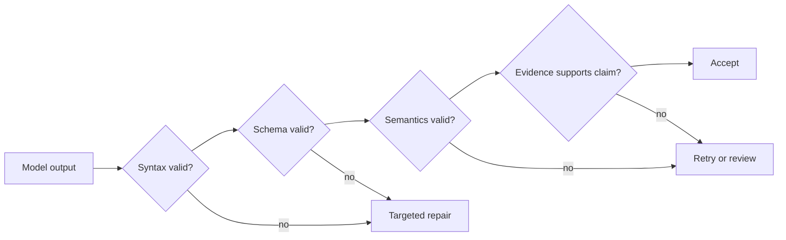

# 可靠提取、Batch 与独立 Reviewer

> JSON 有效只能证明结构完好，不能证明事实无误。

**类型：** Reference
**语言：** Python
**前置要求：** [验证主张，而非置信度](../../05-output-evaluation-and-validation/)、[结构化输出是不可信合约](../../09-structured-output-and-defensive-parsing/)；阶段 14 第 39 课
**预计时间：** 约 135 分钟

## 学习目标

- 定义能减少误报和模糊标签的提取标准
- 有意识地使用 schema、示例、nullable 字段、enum 和证据片段
- 将语法、schema、语义和 provenance 验证分开
- 设计有边界的重试与独立 reviewer 轮次
- 按 workflow 需求选择实时或 batch 处理

## 问题所在

一条 pipeline 将合约义务提取成有效 JSON，每条记录都匹配 schema，法律 reviewer 却仍拒绝 18%。

模型会为缺失日期填入看似合理的值，把背景陈述标为义务，并把陌生类别映射到最接近的 enum。重试循环不断把相同 prompt 送回去，直到验证通过。验证只检查类型，于是编造的值只是格式越来越自信。

团队解决了序列化，却把它误当成正确性。

## 核心概念

### 在 Schema 之前定义判断标准

schema 说明有哪些字段，标准说明什么才算合格。

对于义务提取器，应定义：

- 义务方必须明确出现或可无歧义关联
- 必须陈述了所需动作，而非仅仅讨论它
- 触发条件和截止时间只能在有证据支持时提取
- 证据片段必须包含该主张
- 未知值保持为 `null`
- 不受支持类别使用 `other` 加备注，或触发审查
- 例外和否定会改变结果

没有这些 Rule，标注人员、模型和 evaluator 实际做的是不同任务。

### 用 Few-Shot 示例刻画边界

示例在合理的人会做出不同判断的地方最有价值。

应包括：

- 清晰正例
- 近似不命中
- 被否定的义务
- 用 `null` 表示缺失日期
- enum 以外的类别
- 一个段落中的两项义务
- 相互冲突的条款

每个示例除答案外还应说明理由。不要用重复的简单案例淹没上下文。

### 让缺失可表达

字段可能未知时，schema 必须提供显式状态。强制字符串会鼓励编造。

```json
{
  "type": "object",
  "properties": {
    "party": {"type": ["string", "null"]},
    "action": {"type": "string"},
    "deadline": {"type": ["string", "null"]},
    "category": {
      "type": "string",
      "enum": ["payment", "delivery", "reporting", "other"]
    },
    "evidence_span": {"type": "string"},
    "needs_review": {"type": "boolean"}
  },
  "required": ["party", "action", "deadline", "category", "evidence_span", "needs_review"],
  "additionalProperties": false
}
```

`required` 与 nullable 结合后，字段必须明确表示为有证据的值或已知缺失，不能被静默省略。

### 用 Tool Use 获得类型化输出

无副作用的提取 tool 可以承载 schema。应用需要时，tool choice 可要求这个类型化记录。当前 API 支持时，严格 schema 特性可保证有效结构。

不要仅为获得结构化输出就调用真实动作 tool。提取与执行具有不同权限。

### 在四层中验证



#### Syntax

payload 能否解析？

#### Schema

字段、类型、enum 和边界是否有效？

#### Semantics

跨字段关系是否成立？领域禁止时，deadline 不能早于生效日期；不受支持类别不能同时标记 `needs_review` 为 false。

#### Provenance

证据片段是否真的支持提取的主张，并且来自正确来源版本？

语义与 provenance 这两层负责发现许多高置信幻觉。

### 反馈最小有用错误

修复时返回结构化验证反馈：

```json
{
  "category": "semantic_validation",
  "field": "deadline",
  "message": "The extracted date does not appear in the evidence span.",
  "allowed_action": "Set deadline to null or select a supported span."
}
```

不要只说“再试一次”。保留原始来源和先前结果，限制重试。反复出现语义失败时应升级处理，以免把不确定性变成延迟和成本。

### 分开 Generator 与 Reviewer

generator 提取，reviewer 接收来源、候选记录和 rubric，并检查：

- 存在必要证据
- 片段支持每个非 null 主张
- 处理了否定和例外
- 类别符合定义
- 未编造未知值
- 标记了冲突和歧义

用全新上下文获得更强独立性。reviewer 返回 finding ID、字段、证据和处置，不会静默重写记录。

用人工标签衡量 reviewer 的 precision 和 recall。模型 judge 只是测量工具，ground truth 仍来自可信标签。

### 按 Workflow 选择 Batch

2026 年 7 月 CCAR-F 公开指南规定：Message Batches 成本降低 50%，处理窗口最长 24 小时且不保证延迟 SLA，同一 batch 请求中不支持多回合 tool calling。这些是有日期的考试参考事实，不承诺价格或服务限制不会变化。部署前请核对当前 [Message Batches 文档](https://platform.claude.com/docs/en/build-with-claude/batch-processing) 的价格、限制、保留和功能兼容性。

batch 适合：

- 大规模离线提取
- 评估数据集
- 夜间分类
- 回填和重新处理
- 生成后的独立审查

实时处理适合：

- 交互式用户响应
- 有严格短延迟上限的任务
- 同一请求中的自适应 tool use
- 需要立即批准或反馈的 workflow

下一步依赖模型在请求中途观察外部动作时，不要使用 batch。应预计算输入或将 workflow 拆成 job。

### 让 Batch Job 可对账

为每项分配稳定 `custom_id`，持久化来源版本、schema 版本、prompt 版本和预期输出位置。结果可能乱序返回。

处理：

- 成功
- 验证失败
- provider 失败
- 过期
- 重复提交
- job 部分完成
- 来源变更后的重试

绝不按数组位置将结果关联到输入。

### 评估真正关心的错误

对于提取，关注：

- 字段 precision 和 recall
- 适当时做精确或规范化匹配
- 证据支持率
- 高风险字段误报率
- null 校准
- 类别混淆矩阵
- reviewer 分歧
- 每条已接受记录的成本和延迟

平均值会掩盖危险的误报类别。按文档类型、语言、长度和风险分层。

## 动手构建

## 交互实验

```figure
20-batch-review-confidence
```

使用置信度和审查模拟器，让记录经过 syntax、schema、semantic 与 provenance gate。调整误报成本和 reviewer 覆盖率，观察为何有效 JSON 与模型置信度不足以构成发布标准。

## 实践实验

将一个有证据支持的日期改成编造值，运行四层验证，再把失败记录路由到 adjudication，停止盲目重试。

## 交付产物

填写完整的 [`outputs/extraction-review-report.md`](../outputs/extraction-review-report.md) 包含稳定 `custom_id` 的 batch job、nullable unknown、乱序结果、review finding 和 adjudication 状态。

## 验证

运行确定性验证器：

```bash
cd certifications/claude/lessons/20-reliable-extraction-batch-and-reviewers
python3 code/main.py
python3 -m unittest discover -s code/tests -v
```

quiz 会测试修复、batch 与 reviewer 决策。

## 综合项目关联

将通过验证的报告带入 Architect Foundations 提取场景，作为四层验证的证据。

为客服 policy 变更创建一条提取 pipeline。

### 输出合约

提取 policy ID、生效日期、受影响地区、动作类型、阈值、证据片段、来源版本和审查状态。每个不确定字段都可为 nullable，或有显式 `other` 状态。

### 数据集

至少构建 40 个示例：

- 15 个清晰变更
- 10 条不含变更的背景陈述
- 5 个否定或例外
- 5 个缺失日期或阈值
- 5 个冲突版本

### 轮次

1. 带严格 schema 的 generator
2. 确定性 syntax 和 schema 验证
3. 语义关系验证
4. 独立证据 reviewer
5. 对分歧进行人工 adjudication

### 实验

比较 zero-shot 标准、few-shot 边界示例，以及 generator 加 reviewer。报告误报、证据支持、成本和延迟。

### Batch 设计

用稳定 ID 提交记录，在测试中随机化结果顺序。注入部分失败，证明对账能保留已完成记录且只重试安全项目。

## 上手使用

生产中，将原始来源与规范化提取分别存储，并保留来源版本和证据偏移。标准或 schema 变更时创建新输出版本，不要覆盖历史决定。

人工纠正记录时，保存原因代码。利用分歧改进标准和评估集，再修改 prompt。

高风险提取可以分层审查：每个高影响字段、低证据记录、新文档类型，以及普通 case 的随机样本。

## 考试决策模式

JSON 有效但内容错误时，增加语义与证据验证；判断边界的一致性不足时，使用明确标准与 few-shot 示例。

优先选择以下方案：

- 使用 `null` 或 `other`，而非编造
- 强制类型化输出，不触发现实动作
- 反馈特定验证错误，并限制重试
- 分开 generator 与 reviewer
- 为异步、tool 独立的工作使用 batch
- 用稳定 ID 对账结果

## 常见坑

### Schema 等于事实

类型不能证明一个值出现于来源中，或可由来源推出。

### 必填且不可空字段

合约没有表达缺失的能力，模型就会编造看似合理的值。

### 无限修复

同一歧义来源不断产生猜测，有界尝试后应升级。

### Reviewer 静默重写

系统会丢失失败的主张和原因。任何受控纠正前先返回结构化 finding。

## 练习

1. 加入一条关联 threshold 和 currency 的语义 Rule。
2. 设计减少误报义务的负例。
3. 用人工标签校准 reviewer 并报告分歧。
4. 为乱序 batch 结果构建稳定 ID 对账。
5. 比较单次与 reviewer pipeline 每条已接受记录的成本。

## 关键术语

| 术语 | 人们常说 | 实际含义 |
|------|-----------------|------------------------|
| Structured output | 正确数据 | 匹配机器可读形状的数据 |
| Semantic validation | Schema 验证 | 检查值和关系是否符合领域意义 |
| Provenance validation | 有效 citation | 证明来源证据支持精确提取的主张 |
| Nullable | 可选字段 | 对未知或不存在值的显式受支持状态 |
| Batch | 更快 API | 针对离线量和不同成本或延迟约束优化的异步处理 |
| Adjudication | 重试 | 解决 evaluator 或标签分歧的合格决定 |

## 延伸阅读

- [Claude structured output 文档](https://platform.claude.com/docs/en/build-with-claude/structured-outputs)
- [Claude Message Batches 文档](https://platform.claude.com/docs/en/build-with-claude/message-batches)
- 阶段 11 第 03 课：从第一性原理理解结构化输出
- 阶段 14 第 39 课：reviewer agent
- 阶段 17 第 15 课：batch 架构
