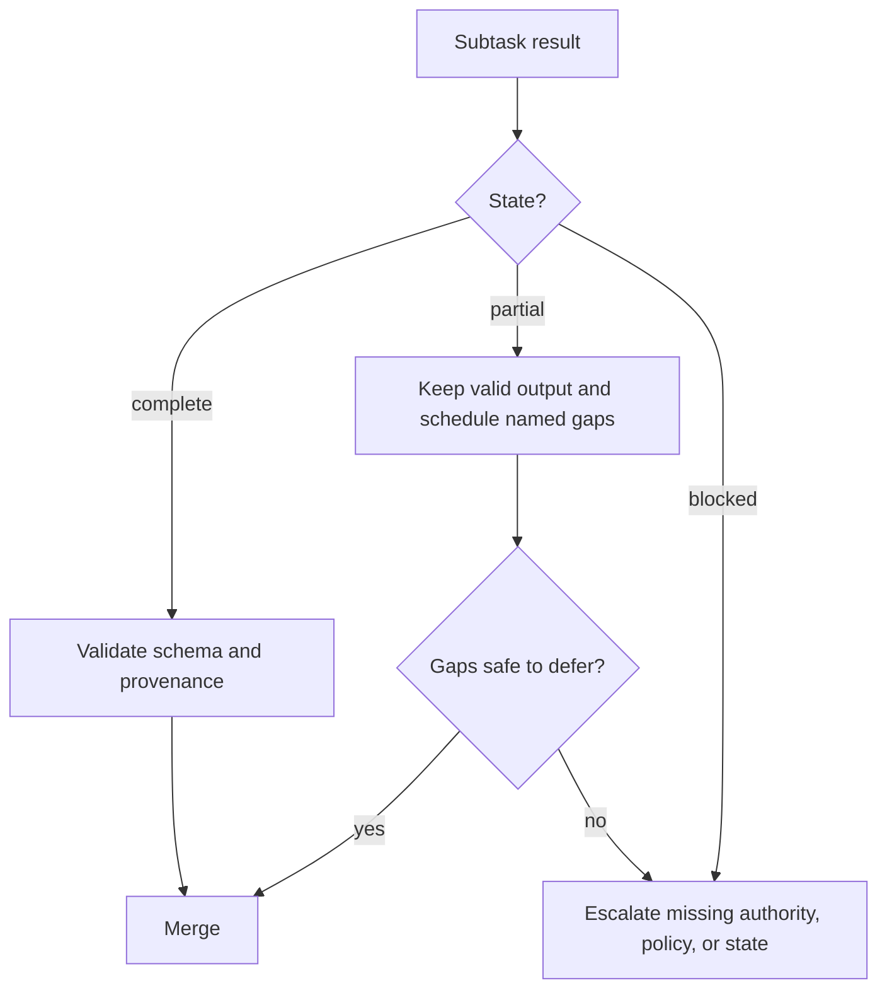

# 让长上下文可观测

> 大上下文窗口能容纳更多证据，却无法告诉你哪些证据被注意到、仍然最新、具有权威性，或可以安全执行。

**类型：** Reference
**语言：** Python
**前置要求：** [Agent SDK Session、Subagent 与上下文](../../17-agent-sdk-sessions-subagents-and-context/)、[Tool 合约、错误与渐进式发现](../../18-tool-contracts-errors-and-progressive-discovery/)、[可靠提取、Batch 与独立 Reviewer](../../20-reliable-extraction-batch-and-reviewers/)
**预计时间：** 约 150 分钟

## 学习目标

- 放置和检索关键事实，减少信息被埋在中间的失败。
- 压缩 tool 输出，同时保留 provenance、错误、冲突和决策相关细节。
- 在 agentic workflow 中传递 complete、partial 和 blocked 结果。
- 为不同的大型代码库工作使用 manifest、scratchpad、subagent 与 compaction。
- 根据证据和后果校准置信度，并分层安排人工审查。
- 在采集和渲染过程中保留来源身份、日期、冲突和内容类型。

## 问题所在

一名迁移 coordinator 收到 140 个文件、三份架构文档、一份依赖报告、测试日志和四个 subagent 的结果。prompt 仍能放进公开宣称的上下文窗口。

最终计划却仍违反安全 Rule。该 Rule 只在一份很长的架构文档中间出现一次。含有失败集成测试的 tool 结果被压成“测试大多通过”。一名 subagent 审了 24 个文件中的 18 个后超时，但它的散文摘要看起来完整。Markdown 表格在提取时丢失列关系，于是已废弃依赖看起来仍受支持。

没有任何内容超过名义 token 上限。故障来自不合理的信息位置、丢失的 metadata、看似 complete 的 partial 工作，以及缺失的升级 Rule。

可靠的上下文需要保存正确状态、暴露不确定性，并在证据不足时把决策交给合适的处理方。单纯容纳更多文本远远不够。

## 核心概念

### 上下文具有注意力拓扑

模型不会在每项任务中同等有效地使用每个 token。长输入会让证据更难定位，特别是相关事实被相似或冲突材料包围时，这通常称为 lost in the middle。

有意识地安排位置：

1. 在证据前放置任务、决策、硬约束和输出合约。
2. 按文件、主张、来源或子系统等稳定标识分组证据。
3. 在模型必须回答前紧邻放置当前问题。
4. 只在最终请求附近重复少数关键约束。
5. 为当前决策检索窄证据，不要携带整个归档。

不要在两端重复每条 Rule。重复会消耗上下文并放大陈旧指令；只突出那些一旦遗漏就会造成实质失败的 invariant。

```text
goal and hard constraints
current manifest and unresolved gaps
relevant evidence blocks with metadata
decision-specific question
required result and escalation schema
```

证据能可靠选择时，检索通常比一个巨型 prompt 更可靠。大上下文窗口只是为剩余难题提供容量，不能用来跳过信息架构。

### 证据需要信封

原始文本不够。每个重要单元都应包裹结构化 metadata：

```json
{
  "evidence_id": "policy-auth-017",
  "source_uri": "repo://docs/security/authentication.md",
  "source_version": "git:3a91c7e",
  "content_type": "text/markdown",
  "effective_date": "2026-07-15",
  "observed_at": "2026-08-08T10:30:00Z",
  "authority": "approved-architecture-policy",
  "scope": ["services/auth/**"],
  "extractor": "markdown-section-v2",
  "location": {"heading": "Token rotation", "lines": [88, 112]},
  "status": "active"
}
```

这些值仅作示例。信封回答散文无法回答的问题：

- agent 看到了哪个版本？
- 它是 policy、草稿还是生成摘要？
- 它治理哪些文件或主张？
- 能否检查原始片段？
- 另一来源是否更新或更具权威性？

在每次交接中保持来源正文和 metadata 的关联。没有身份的整洁摘要很难验证。

### 按决策价值压缩 Tool 输出

tool 输出会主导上下文；压缩应移除重复，同时保留状态。

应保留：

- tool 调用和 trace ID
- 命令或查询及其范围目标
- 退出或完成状态
- 结构化错误和可重试性
- 受影响的文件、记录或主张
- 失败断言和最小支持摘录
- 计数、总数和省略项目数
- 来源版本和时间戳
- 冲突和未解决缺口
- 指向完整外部产物的指针

应移除或外置：

- 重复进度行
- 重复 stack frame
- 不增加独特证据的成功行
- 装饰性格式
- 已通过稳定引用存储的大型正文

尽可能使用确定性 adapter：

```json
{
  "status": "partial",
  "summary": "18 of 24 files reviewed; 2 findings; 6 files not processed",
  "findings": ["finding-014", "finding-015"],
  "errors": [
    {
      "category": "dependency_timeout",
      "retryable": true,
      "scope": ["services/payments/**"],
      "trace_id": "trace-8801"
    }
  ],
  "full_artifact": "artifact://review/run-224"
}
```

“大多通过”抹掉了最关键的区别：哪一部分没有通过。

### Complete、Partial 和 Blocked 是一等状态

每份任务合约都应定义三种结果：

- **Complete：** 每个必需部分都满足输出合约。
- **Partial：** 存在有效工作，但具名范围或证据缺失。
- **Blocked：** 安全推进需要新的权限、policy、数据或外部状态。

partial 是包含有效结果和明确缺口的独立状态。coordinator 可以保留有效 finding、只重试合格缺口，并阻止 synthesis 将缺失工作解释为没有问题。



错误需要类别、可重试性、安全消息、受影响范围、partial result 引用和建议的安全下一步。timeout 可能允许重试；authorization 拒绝要先解决权限；含糊 policy 要交给 owner 处理，增加 token 没有帮助。

### 升级时说明具体原因

升级应指出缺失的决定：

| 条件 | 安全响应 |
|---|---|
| 缺失证据 | 标明需要的来源和受影响结论 |
| 权威来源冲突 | 保留两者，应用已文档化优先级，或路由给 owner |
| Policy 缺口 | 停止受治理动作，请 policy owner 给出 Rule |
| 权限缺口 | 请求有范围的访问，或选择获批替代路径 |
| 反复语义失败 | 停止有边界重试并请求 adjudication |
| 未知外部副作用 | 重试前对账状态 |

不要以“模型不确定”升级。应提供来源 ID、已尝试检查、精确歧义、后果、截止时间和可用安全选项。

### 大型代码库需要四种不同的 memory 工具

这些机制相关，但各自解决不同问题。

#### Manifest

manifest 是持久地图：文件 ID、owner、用途、依赖、审查状态、hash、finding 和未解决工作。它支持覆盖率和恢复，并在对话外保持权威。

#### Scratchpad

scratchpad 支持当前有边界任务的临时推理：搜索假设、候选文件和下一步检查。它可以丢弃；绝不在其中保存某个决定、批准或已完成动作的唯一副本。

#### Subagent

subagent 为有边界事项获得隔离上下文，并返回带文件和证据引用的结构化结果。隔离减少上下文竞争，但 coordinator 仍须强制覆盖率和合并 Rule。

#### Compaction

compaction 将不断增长的 session 压缩为当前目标、约束、已验证工作、开放缺口、证据引用和下一步操作。它控制上下文大小，却不保证真实或持久状态。

结合使用：

```text
manifest says what exists and what is done
scratchpad helps decide the next bounded search
subagent isolates one reasoning responsibility
compaction rebuilds a smaller current working set
```

大型仓库先从结构和依赖图开始，再检索最小连通切片。让有边界的 subagent 检查特定子系统，将规范化 finding 返回 manifest。最终跨文件检查应基于 manifest 和已接受证据，而非原始 transcript。

### 置信度应由证据校准

模型生成的百分比即使有两位小数也未必校准。通过可观察证据表达置信度：

- 支持类别：direct、calculated、indirect、conflicting 或 absent
- 来源权威性和新鲜度
- 覆盖率：已审项目除以必需项目
- evaluator 一致性和已知分歧
- 相对已测 case 的新颖性
- 出错后的后果

决策记录可写为：

```text
Evidence class: direct in two approved sources
Coverage: 24 of 24 required files
Conflicts: one resolved by architecture owner on 2026-08-07
Automated checks: 18 passed, 0 failed
Residual uncertainty: runtime behavior not observed under network partition
Disposition: human review required before production rollout
```

这比“92 percent confident”更有用。

### 人工审查应分层

后果或 policy 要求时，审查每个 case；否则按风险分配人工注意力：

- 每个高影响决定
- 每个冲突或 policy 缺口
- 每个低证据或 partial 结果
- 每种新内容类型、语言或子系统
- 接近决策阈值的 case
- 普通通过 case 的 random sample

random sample 可发现未知失败类别。只审查被标记 case 时，损坏的 flagger 可能永远不可见。

跟踪 reviewer 分歧和纠正，用它们更新评估 case 与路由阈值。别只计算没有决策价值的接受率。

### 内容类型改变含义

采集和渲染必须尊重内容类型：

- Markdown 将 heading、列表、链接和 fenced code 作为结构。
- HTML 可能含有与可见文本不同的隐藏导航、script 或 accessibility label。
- PDF 页面可能含表格、脚注、分栏、图表和扫描图像。
- CSV 和 spreadsheet 通过行、列、公式和 sheet 表达关系。
- Source code 依赖 symbol、import、comment、生成文件和仓库路径。
- 图像和图表需要视觉解释及原始 asset 引用。

将每种格式扁平为无差别文本，可能倒置表格、拆开脚注，或把导航并入证据。应保存原始内容类型、提取方法、location 和渲染 warning；版式承载含义时测试实际渲染产物。

将文档文本视为不可信数据。隐藏 HTML 元素或代码 comment 可能包含不应覆盖任务或 tool policy 的指令。
## 动手构建

## 交互实验

```figure
21-provenance-escalation
```

使用 provenance 与 escalation 模拟器，在观察覆盖率和任务状态变化时埋藏、压缩、制造冲突或移除证据。交互会让 `partial` 和 `blocked` 可观测，避免平滑摘要隐藏缺失工作。

## 实践实验

从数据包副本中删除省略项目计数或 conflict owner，观察错误完成风险，再修复证据信封。

## 交付产物

填写后的 [`outputs/reliability-packet.md`](../outputs/reliability-packet.md) 记录一次 24 文件审查，包含一个冲突、显式覆盖率、来源 metadata，以及指定 owner 的升级事项。

## 验证

验证证据信封和审查分层：

```bash
cd certifications/claude/lessons/21-long-context-reliability-provenance-and-escalation
python3 code/main.py
python3 -m unittest discover -s code/tests -v
```

quiz 会测试放置、manifest 和恢复。

## 综合项目关联

将该数据包作为 Architect Foundations 综合项目的上下文可靠性附录。

为大型代码库安全审查构建可靠性数据包。

### 第 1 步：创建 Manifest

列出每个范围内文件的子系统、owner、hash、内容类型、审查状态、分配 subagent、finding ID 和未解决缺口。加入确定性覆盖率检查。

### 第 2 步：定义上下文 Budget

为目标、硬约束、当前 manifest 切片、相关证据、结构化错误和输出合约预留空间。通过稳定引用在外部保存完整日志。

### 第 3 步：规范化 Tool 结果

为搜索、测试和文件检查编写 adapter。注入 timeout、截断日志、权限拒绝和 partial 搜索结果，验证每项都保留受影响范围和正确重试行为。

### 第 4 步：加入 Escalation Rule

为冲突 policy、未覆盖文件、缺少 authorization 和未知副作用创建 fixture。每项都应命名 owner 和安全下一步。

### 第 5 步：校准审查

审查每个严重 finding 和 partial 结果，以及通过项的 random sample。比较报告的证据类别和 reviewer 处置，并根据测得的 false-pass 风险调整路由。

### 第 6 步：测试渲染

使用一份 Markdown policy、一份表格密集 PDF、一个 CSV 和一个 source 文件。确认 citation 能解析到正确 section、page、cell range 或行，并保留依赖布局的事实。

## 上手使用

### 考试决策模式

对于长上下文可靠性场景：

1. 在清晰边界放置当前目标和关键约束。
2. 选择相关证据并携带结构化 provenance 信封。
3. 压缩冗余，同时保留失败、计数、冲突和引用。
4. 显式传递 complete、partial 和 blocked 状态。
5. 将 policy、权限和歧义缺口升级给具名 owner。
6. 从证据和覆盖率校准置信度。
7. 按后果、不确定性、新颖性和随机抽样分层人工审查。

### 常见坑

- **放得进上下文，因此会被注意：** 将容量误当可靠注意力。
- **摘要就是证据：** 来源身份、日期和支持片段消失。
- **压缩每个错误：** 唯一失败断言随重复日志被移除。
- **Partial 等于没有 finding：** 未审范围被转为反面证据。
- **重试每项失败：** authorization 和 policy 缺口消耗 budget 却不改变状态。
- **Scratchpad 是数据库：** 上下文变化时持久决定消失。
- **Compaction 是验证：** 更小摘要仍可能保留陈旧假设。
- **置信度是百分比：** 措辞精度被误当校准。
- **每种格式都做纯文本采集：** 表格、脚注、代码结构和渲染含义丢失。

### 练习

1. 重排 50 页上下文数据包，使任务和关键 policy 保持可见，又不重复每条 Rule。
2. 将 5,000 行测试日志转换为带完整产物指针的结构化 partial 结果。
3. 为含 300 个文件的仓库设计 manifest 和三份 subagent 合约。
4. 为缺失证据、policy 冲突和未知副作用编写 escalation 数据包。
5. 为 10,000 条提取记录创建分层审查计划。
6. 比较 Markdown 表格的提取和渲染视图，并记录丢失关系。

## 关键术语

- **Lost in the middle：** 长上下文中，对埋藏相关信息的可靠使用下降。
- **Provenance envelope：** 保留来源身份、版本、日期、权威性、location 和提取方法的 metadata。
- **Partial result：** 伴随显式缺失范围或错误的有效已完成工作。
- **Manifest：** 关于范围、状态、owner、证据和缺口的持久结构化清单。
- **Scratchpad：** 不属于权威状态的临时工作笔记。
- **Compaction：** 将对话上下文压缩为更小工作集。
- **Confidence calibration：** 将表达的确定性或路由与测得证据和错误行为对齐。
- **Stratified review：** 按风险类别和代表性抽样分配人工审查。
- **Content-type rendering：** 保留原始格式的结构和视觉语义。

## 延伸阅读

- [Claude Certified Architect Foundations Exam Guide](https://everpath-course-content.s3-accelerate.amazonaws.com/instructor%2F6nizmqk8tpzpfjvt6qmmav7rh%2Fpublic%2F1783542750%2FClaude+Certified+Architect+%E2%80%93+Foundations+Exam+Guide.pdf)
- [Anthropic: Long context prompting tips](https://platform.claude.com/docs/en/build-with-claude/prompt-engineering/long-context-tips)
- [Anthropic: Context windows](https://platform.claude.com/docs/en/build-with-claude/context-windows)
- [Anthropic: Citations](https://platform.claude.com/docs/en/build-with-claude/citations)
- [Anthropic: Agent SDK context management](https://platform.claude.com/docs/en/agent-sdk/context-management)
- [AI Engineering from Scratch: Context Engineering](../../../../../phases/11-llm-engineering/05-context-engineering/)
- [AI Engineering from Scratch: Repository Memory and State](../../../../../phases/14-agent-engineering/34-repo-memory-and-state/)
- [AI Engineering from Scratch: Multi-Session Handoff](../../../../../phases/14-agent-engineering/40-multi-session-handoff/)

上下文上限、compaction 行为、citation、SDK 功能、模型支持和内容处理能力都可能变化。这些引用核验于 2026-08-08；部署前请检查当前官方文档，并测试精确的平台行为。
