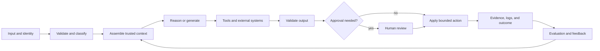

# 端到端架构与价值取舍

> 架构的要点，是只在能改变结果的地方引入复杂度。

**类型：** 参考
**语言：** Python
**前置要求：** [业务发现、需求与 SLA](../../22-business-discovery-requirements-and-slas/)；阶段 14，第 01、12 和 28 课
**预计时间：** 约 135 分钟

## 学习目标

- 绘制从输入到反馈和运维的完整 Claude 系统
- 在增强模型调用、工作流、agent 和多 agent 系统之间做出选择
- 围绕证据、权限和验证边界拆解复杂工作
- 为成本、延迟、质量、安全性和可维护性之间的取舍给出依据
- 识别模型能力增强也无法修复结构性设计缺陷的场景

## 问题所在

一个团队上线了合同审查助手。单个 prompt 中塞进了合同、政策库、提取 schema、谈判规则，
还要求输出最终修订稿。演示跑通了，生产环境却不行。

大合同超出了实际可用的上下文预算。政策版本彼此冲突。模型返回了有效 JSON，其中却包含
没有依据的法律结论。审核人看不出每项修改由哪个来源支撑。重试只会增加成本，并不能改变
故障。更大的模型改善了文风，却没有解决可追溯性、权限和生命周期责任问题。

故障根源在于系统把几种不同的职责压进了一个概率性步骤。再给 prompt 加一句话也解决不了。

## 核心概念

### 画出完整闭环

端到端架构不只有模型调用。



针对每条边，问清楚：

- 哪些数据会跨越边界？
- 使用哪个身份和哪些权限？
- 强制执行什么 schema 或契约？
- 超时、含义模糊或部分失败时怎么办？
- 留存哪些证据？
- 谁负责下一项决策？

没有故障路径的架构图，只是一张营销图。

### 选择能满足需求的最小模式

可以从四种实用模式开始。

#### 增强模型调用

单个请求使用选定的上下文、检索结果或工具，并返回有边界的输出。当步骤已知，而且单轮对话
能够容纳必要证据时，适合用来做分类、提取、起草或评分。

优点：

- 编排开销最低
- 最容易评估
- 延迟和成本可预测

局限：

- 不适合有分支的工作
- 对跨多个外部操作的故障恢复能力有限

#### 确定性工作流

代码控制执行顺序，并在指定步骤调用 Claude。如果业务流程稳定、可审计性很重要，或每次状态
转换都需要明确契约，就使用这种模式。

优点：

- 状态和重试显式可见
- 每个步骤的权限范围更窄
- 测试可以复现

局限：

- 无法预先知道执行路径时会变得脆弱
- 出现新的例外类别就需要修改工作流

#### 自适应 agent

Claude 根据观察结果选择下一项操作，直到满足停止条件。当证据发现过程决定执行路径，而且
逐一列举所有分支并不现实，就使用这种模式。

优点：

- 规划灵活
- 适合开放式研究和修复

局限：

- 延迟和成本不固定
- 权限面和评估面更大
- 存在循环、偏离目标和工具错误风险

#### 多 agent 系统

协调器把相互独立的关注点交给专家或独立审核人。当工作可以拆分、上下文隔离能提高质量，
或验证要求相互独立时，使用这种模式。

优点：

- 并行执行
- 每个角色的上下文更小
- 独立审核

局限：

- 交接损耗和重复工作
- 调用次数更多，追踪分析更困难
- 协调成本可能高于节省的成本

不要因为架构图看起来成熟就选择多 agent。只有具体的上下文、独立性、并行性或专业化需求
足以抵消协调成本时，才应该选它。

### 围绕契约拆解

糟糕的拆解只遵循文档章节或团队边界，却不考虑如何检查正确性。好的拆解会在每次交接处建立
契约。

对于合同审查系统：

1. 受理环节验证文件类型、身份和司法管辖区元数据。
2. 条款切分返回稳定标识符和来源范围。
3. 政策检索返回带可追溯信息的版本化证据。
4. 条款分析按照 schema 返回发现项。
5. 独立审核人检查证据覆盖情况和矛盾。
6. 仅使用已接受的发现项生成修订稿。
7. 重大变更由法务人员批准。
8. 系统记录决策证据和后续结果。

每个步骤的任务都比“审查这份合同”更窄。故障可以被定位。系统可以重新尝试检索，而不用
重新生成已被接受的条款分析；审核人也可以只驳回一项发现，而不必丢弃全部工作。

### 分开语义控制和确定性控制

Claude 适合处理含义模糊的判断，例如某项条款是否实质改变了责任。代码更适合处理不变量，
例如必填字段、权限检查、最高退款金额、允许的司法管辖区和文档版本。

使用下面这条规则：

```text
If a condition can be expressed as a stable predicate over trusted data,
enforce it outside the model.
```

prompt 指令可以引导行为，但无法建立安全边界。

### 为整条执行轨迹编制预算

成本不只是单次调用的输入和输出 token。一次系统执行轨迹可能包括检索、多次模型调用、工具
执行、重试、审核和人工劳动。

估算：

```text
expected task cost =
  model calls
  + retrieval and tool cost
  + retry probability times retry cost
  + human review minutes times labor rate
  + expected incident and correction cost
```

更小的模型如果导致更多重试，每个成功任务的成本反而可能更高。如果更大的模型可以省掉昂贵
的审核步骤，它也可能更便宜，但只有评估才能证明这一点。

### 把延迟视为一种分布

平均延迟会掩盖用户实际遇到的长尾。模型时间、工具时间、排队、重试和人工审批会叠加在一起。

至少要使用 P50、P95 和超时率。对于交互式工作，既要跟踪首次产生有用输出的时间，也要跟踪
总完成时间。对于后台工作，吞吐量和完成时限可能比首 token 延迟更重要。

并行执行只对相互独立的工作有帮助。如果并行调用争抢同一个速率限制，或输出结果还需要串行
协调，成本可能增加，端到端耗时却不会减少。

### 把反馈设计成产品界面

零散的点赞事件构不成反馈。每条反馈都要关联结果、输入、版本、执行轨迹和决策。

存储：

- 输入类别和风险等级
- prompt、模型、工具和知识版本
- 检索到的证据标识符
- 工具调用和结构化错误
- 输出和验证器结果
- 人工编辑和原因代码
- 下游结果

反馈闭环由此可以支持具体决策：修改 prompt、修复检索、调整路由、改进工具或缩小范围。

## 动手构建

## 交互实验

```figure
23-architecture-tradeoff
```

使用架构取舍探索器，按照有权重的质量、延迟、成本、安全性、可审计性和变更成本证据，比较
增强调用、工作流、agent 与多 agent 设计。总分再高，也不能抵消硬性约束。

## 实践实验

从决策副本中删除一个被否决的备选方案或硬性安全门禁，观察就绪检查失败，再修复架构理由。

## 交付产物

填写完成的 [`outputs/architecture-decision.md`](../outputs/architecture-decision.md) 选择了确定性的
合同审查工作流，并记录了故障路径和回退条件。

## 验证

运行确定性决策包校验器：

```bash
cd certifications/claude/lessons/23-end-to-end-architecture-and-value-tradeoffs
python3 code/main.py
python3 -m unittest discover -s code/tests -v
```

测验会检查相同的模式和控制决策。

## 综合项目关联

把 ADR 放入 Architect Professional 综合项目的架构方案部分。

为一个业务工作流创建架构包。

### 第 1 步：绘制三个候选方案

分别绘制增强调用、确定性工作流和自适应 agent 设计。使用相同的输入、输出和约束，保证比较
公平。

### 第 2 步：为明确的取舍评分

采用一到五分制，并写出证据。

| 评估标准 | 权重 | 增强调用 | 工作流 | Agent |
|----------|-----:|---------:|-------:|------:|
| 任务质量 | 25 | | | |
| P95 延迟 | 15 | | | |
| 每次成功的成本 | 15 | | | |
| 安全性和权限 | 20 | | | |
| 可审计性 | 15 | | | |
| 变更成本 | 10 | | | |

权重来自发现阶段，而不是习惯。如果受监管的操作使安全性成为硬性约束，就不能为了便利而用
平均分抵消它。

### 第 3 步：编写故障路径

为每个外部依赖项明确超时、重试、熔断行为、部分结果、用户消息和运维证据。对于 agent，
还要设定每轮总时长和成本预算。

### 第 4 步：定义评估

构建一个有代表性的集合，覆盖正常、含义模糊、对抗性和依赖故障场景。衡量最终质量、执行
轨迹质量、成本、延迟和安全性。

### 第 5 步：记录回退条件

明确哪些证据会促使团队切换模式。架构记录的是当前决策，可以随证据变化而调整。

## 上手使用

假设有一个研究系统，必须回答跨多家公司申报文件的问题。

如果一次检索查询就能稳定返回足够的证据，单次增强调用很合适。如果每项任务都遵循查询、
检索、排序、回答和引用的固定流程，工作流很合适。如果系统必须发现缺失的实体、改写查询，
并判断证据是否充足，agent 很合适。只有在并行研究来源或独立验证对目标指标的改善足以抵消
协调成本时，才应该采用多 agent 设计。

现在再加入一小时的答复时限和严格的成本预算。最优设计可能随之改变。架构选择始终受约束条件
影响。

## 考试决策模式

当各个选项的复杂度不同时，选择满足既定需求的最简单架构。先寻找结构性修复，再考虑修改
prompt。

有力的答案通常会：

- 在代码中强制执行确定性规则
- 隔离高风险工具和权限
- 对已知路径使用工作流，对真正需要自适应的路径使用 agent
- 在独立性属于需求时增加独立审核人
- 在每次转换中保留可追溯信息
- 定义停止、重试、部分结果和升级行为
- 优化每个成功结果的成本，而不是每次调用的成本

薄弱的答案往往只是添加更大的模型、更长的 prompt、更多 agent 或更多工具，却没有处理真正的
故障边界。

## 常见陷阱

### 能力膨胀

每个不必要的工具都会扩大 prompt 长度、选择歧义、攻击面和授权风险。只暴露当前角色所需的
最小工具集。

### 用 prompt 掩盖缺失的契约

如果两个步骤在标识符、schema 或错误行为上无法达成一致，更清晰的自然语言指令也无法建立
可靠接口。应该定义契约。

### 把自我审核当成独立审核

让同一个上下文“再检查一遍”，可能只会重复同一个假设。如果独立性很重要，应使用独立的
审核人、明确的评分规则和隔离的证据。

### 只优化演示路径

要判断系统能否用于生产，就看它如何处理含义模糊、数据过期、权限错误、超时和部分失败。
批准架构前必须覆盖这些场景。

## 练习

1. 为发票争议处理流程设计增强调用、工作流和 agent 三个候选方案。选择一个，并说明回退条件。
2. 找出 AI 工作流中应该用确定性代码实现的三个不变量。
3. 计算两个模型在重试率和审核率不同时，每个成功任务的成本。
4. 在多 agent 研究设计中加入一次工具中断，并明确部分结果的处理方式。
5. 编写一项评估，用于发现最终文案不错、执行轨迹却浪费资源或不安全的系统。

## 关键术语

| 术语 | 人们常说的意思 | 实际含义 |
|------|----------------|----------|
| 增强调用 | 一个能力较弱的 agent | 使用选定上下文或工具的有边界模型调用 |
| 工作流 | 步骤固定的 agent | 由代码负责、具有明确状态转换的编排 |
| Agent | 任意 LLM 应用 | 由模型主导、根据观察结果选择操作的循环 |
| 多 agent | 更高的智能 | 为隔离、并行或独立审核而协调多个模型上下文 |
| 契约 | 一条 prompt 指令 | 针对数据、错误和责任的机器可检查边界 |
| 每次成功的成本 | Token 价格 | 每个被接受结果预期承担的模型、工具、重试、审核和纠错总成本 |

## 延伸阅读

- [构建高效的 agent](https://www.anthropic.com/research/building-effective-agents)，了解工作流和 agent 模式
- [Claude Agent SDK 文档](https://platform.claude.com/docs/en/agent-sdk/overview)，了解当前 agent 框架的能力
- 阶段 14，第 01 课：从第一性原理理解 agent 循环
- 阶段 14，第 28 课：编排取舍
- 阶段 17，第 08 课：有效吞吐量和延迟测量
