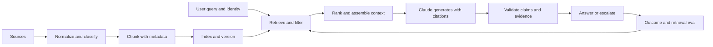

# RAG、检索与数据流水线

> 回答是否可信，取决于模型实际收到了什么证据。

**类型：** 构建
**语言：** Python
**前置要求：** [端到端架构与价值取舍](../../23-end-to-end-architecture-and-value-tradeoffs/)；阶段 11，第 06 和 07 课；阶段 5，第 23 课
**预计时间：** 约 150 分钟

## 学习目标

- 设计摄取、分块、索引、检索、生成和引用边界
- 根据数据形态选择稀疏、稠密、混合、过滤式和迭代检索
- 在修改模型或 prompt 之前诊断检索故障
- 分别衡量检索质量和答案质量
- 在整条流水线中保留新鲜度、访问控制和溯源信息

## 问题所在

一个政策助手稳定运行了几个月。文档刷新后，它开始依据旧的退款门槛给出自信满满的错误答案。
模型版本、prompt 和延迟都没有变化。

团队在 prompt 中加上“使用最新政策”，但毫无改善。模型不可能遵循它从未收到的证据。索引中
同时存在两个政策版本，元数据过滤器缺失，而旧文本块因为措辞与查询更接近，被检索器排在了
第一位。

这是检索事故。按模型事故处理会浪费时间，还可能掩盖已经失效的控制措施。

## 核心概念

### RAG 是数据系统

检索增强生成由两个相互连接的系统组成，它们有不同的故障模式。



模型本身可能很出色，系统仍会因为以下原因失败：

- 来源从未被摄取
- 解析时丢失了相关表格
- 分块把条件和例外拆开了
- 索引使用了过期或不兼容的表示
- 过滤器忽略了租户、司法管辖区、日期或权限
- 排序偏向关键词匹配，而不是权威来源
- 组装上下文时截断了最佳证据
- 生成结果引用了一个文本块，主张的内容却超出其支持范围

找到最早失效的边界。

### 围绕含义和检索设计文本块

固定 token 分块只是一种基线，不是通用答案。文本块的形态应该保留人们实际会引用的单元。

对于政策散文，标题和段落通常是实用的边界。对于 API 文档，应把方法签名与参数和错误放在
一起。对于表格，每组行都要保留表头。对于工单，一条消息可能需要对话上下文。对于源代码，
按函数和类分块比任意字符窗口更合适。

当一项事实跨越边界时，重叠会有帮助，但它也会复制证据、增大索引，并可能用近乎相同的文本
挤满最终上下文。要实际衡量。

每个文本块都需要元数据：

- 稳定的文档和文本块标识符
- 来源 URI 或记录系统标识符
- 版本和生效日期
- 租户、司法管辖区、产品或内容类型
- 访问控制属性
- 摄取和解析器版本
- 父标题和位置

元数据让检索遵守业务规则；相似度只是其中一个信号。

### 根据查询和数据形态选择检索方式

#### 稀疏检索

BM25 风格的检索匹配显式词项，擅长处理标识符、产品名称、错误代码和政策用语。它成本低，
而且容易解释。

#### 稠密检索

嵌入（embedding）匹配语义相似性。用户换一种说法表达概念，或查询与来源使用不同词汇时，
它很有帮助。但它可能漏掉精确标识符，也可能检索出语义相关却不具权威性的文本。

#### 混合检索

合并稀疏和稠密检索的候选结果，再做融合或重排。面对自然语言和标识符混合的查询时，混合
检索通常比单独使用其中一种效果更好。

#### 过滤式检索

在证据到达模型之前，根据可信元数据和授权进行过滤。不要让 Claude 去忽略用户无权查看的
文本块。禁止访问的数据根本不应该进入上下文。

#### 迭代检索

agent 可以改写查询、追踪引用或识别缺失的证据。只有发现过程确实需要自适应时才使用这种方式，
并设定查询次数、轮数、时间和成本预算。稳定的问答流水线不该默认承担 agent 式复杂度。

### 分开评估检索与答案

如果正确证据没有出现在排名靠前的候选结果中，答案质量就有上限。先衡量检索。

实用指标包括：

- recall@K：候选集合是否包含所需来源？
- precision@K：候选集合中有多少内容相关？
- MRR（平均倒数排名）：第一个相关来源出现得多靠前？
- nDCG：排序是否把高度相关的来源放在前面？
- 新鲜度覆盖率：结果是否使用当前有效版本？
- 授权泄漏：是否有结果违反调用方的访问权限？

然后评估生成：

- 引用证据对主张的支持程度
- 引用的正确性和完整性
- 答案完整性
- 证据不足时是否拒答
- 是否发现来源之间的冲突

单一端到端分数无法告诉你应该修复哪一层。

### 把溯源信息当作数据保留

不要让溯源信息只存在于答案生成后补写的散文中。让来源标识符贯穿检索、上下文组装、输出
schema 和日志。

针对每项主张，保留：

- 来源文档和文本块标识符
- 来源版本和生效日期
- 提供支持的确切文本范围
- 检索分数和排名
- 转换或总结步骤

如果来源互相冲突，应报告冲突。除非业务领域有明确的优先规则，否则不要默默选择日期最新的
内容。

### 让刷新具备原子性和可观测性

刷新文档可能产生新旧文本块共存的混合索引。更安全的模式是构建新版本，验证通过后再以原子
方式切换别名或指针。在新索引通过检索和新鲜度检查之前，保留回滚能力。

监控：

- 摄取成功率和延迟
- 解析内容的数量和大小
- 每个来源的当前有效版本
- 嵌入或索引版本
- 空结果率和低分结果率
- 检索分布变化
- 评估中失败最多的查询

## 动手构建

## 交互实验

```figure
24-rag-ranking
```

修改代码前，先在排序实验中比较词法匹配、元数据过滤、过期来源排除和 top-K 行为。实验会
列出排名结果，便于观察每次检索决策如何影响召回率、倒数排名、新鲜度和溯源信息。

## 实践实验

在测试数据的副本中加入一份过期或未授权文档，并证明它在生成之前无法进入候选集合。

## 交付产物

[`outputs/retrieval-evidence-report.json`](../outputs/retrieval-evidence-report.json) 是填写完成的
基线，其中包含已排序的文本块标识、当前有效的来源版本和检索指标。

## 验证

使用以下命令复现并验证：

```bash
cd certifications/claude/lessons/24-rag-retrieval-and-data-pipelines/code
python3 main.py
python3 -m unittest discover tests -v
```

六道测验题会检查故障诊断和检索方式选择。

## 综合项目关联

把证据报告带入 Architect Professional 综合项目的 RAG 评估和新鲜度门禁部分。

实验使用 Python 标准库实现了一个小型 BM25 风格索引，所有步骤都清晰可见。生产搜索系统速度
更快、能力更强，但评分逻辑和元数据边界仍应便于检查。

运行：

```bash
cd certifications/claude/lessons/24-rag-retrieval-and-data-pipelines/code
python3 main.py
python3 -m unittest discover tests -v
```

### 第 1 步：规范化 token

`tokenize` 会把文本转成小写并提取字母数字词项。生产流水线需要语言感知分词、字段处理
和解析器测试。本课只保留排序概念。

### 第 2 步：使用稳定标识进行分块

`chunk_document` 创建相互重叠的词窗口，同时保留文档 ID、位置、更新时间和稳定的文本块 ID。
无效的重叠设置会提前失败，而不是制造无限循环。

### 第 3 步：建立索引前排除非活动来源

`RetrievalIndex.build` 会忽略非活动文档版本。这是一道简化的新鲜度门禁。在生产环境中，激活
应该绑定到经过验证的索引版本和原子切换。

### 第 4 步：透明地评分

索引会计算词频、文档频率、长度归一化和逆文档频率分数。精确的查询词可以提高包含当前
有效政策用语的来源排名。

### 第 5 步：返回溯源信息

每个 `RetrievalHit` 都带有文档 ID、文本块 ID、更新日期、文本和分数。生成层应该使用这些
结构化证据，并返回指向它们的主张链接。

### 第 6 步：评估检索器

`evaluate_retrieval` 根据已标注案例计算 recall@K 和 MRR。修改排序之前，要加入正常、含义模糊、
过期版本、权限和对抗性查询。

## 上手使用

生产系统通常会组合文档解析器、对象存储、稀疏或向量索引、元数据过滤器、重排器和评估流水线。
即使托管服务隐藏了实现，也应保留相同的契约。

针对这起政策事故：

1. 复现查询，并检查检索到的文本块 ID。
2. 确认索引中哪些来源版本处于活动状态。
3. 检查门槛及其例外附近的解析和分块边界。
4. 验证身份和元数据过滤器。
5. 比较稀疏、稠密和混合检索的候选集合。
6. 修复前后都运行冻结的检索评估。
7. 以原子方式切换经过验证的索引，并保留回滚能力。
8. 在生成层重新运行主张支持度评估。

不要一开始就修改 temperature 或模型大小。两者都无法找回缺失或禁止访问的证据。

## 考试决策模式

如果答案在文档刷新后立即出错，而模型和延迟保持稳定，应先调查摄取、索引、过滤和检索。

有力的架构选择：

- 让检索同时适配精确标识符和语义改写
- 在生成前按身份和元数据过滤
- 对来源和索引进行版本管理
- 分别评估检索与最终答案
- 让溯源信息贯穿输出契约
- 显式表示证据不足或互相冲突

薄弱的选择：

- 让模型记住最新文档
- 把每个来源都塞进上下文
- 检查候选结果之前就替换模型
- 在没有来源标识符的情况下依赖生成式引用

## 常见陷阱

### 上下文越多，依据越充分

无关上下文会争抢注意力，并可能掩盖最佳证据。更好的检索和排序，往往胜过更大的上下文载荷。

### 相似就等于权威

语义相似性无法编码政策优先级、权限或生效日期。这些信息需要元数据和规则。

### 引用有效就代表主张有依据

引用可能指向真实来源，却不足以支持整项主张。应该评估蕴含关系和覆盖范围，而不只是链接是否
有效。

### 刷新就是追加

只追加新文本块而不停用旧版本，会制造互相矛盾的证据。把刷新当成一次版本化部署。

## 练习

1. 增加字段感知的加权，让标题匹配比正文匹配获得更高分数。
2. 增加司法管辖区过滤器，并编写测试证明未授权文本块永远不会出现在候选结果中。
3. 基于两个排序列表构建混合排名融合函数。
4. 创建十个检索案例，让精确标识符和语义改写分别需要不同策略。
5. 设计一份带验证和回滚步骤的原子索引刷新检查清单。

## 关键术语

| 术语 | 人们常说的意思 | 实际含义 |
|------|----------------|----------|
| 文本块 | 固定数量的 token | 带标识和元数据、可以检索和引用的单元 |
| 稀疏检索 | 老式关键词搜索 | 基于词项的排序，擅长处理精确词汇和标识符 |
| 稠密检索 | 语义真相 | 嵌入空间中的相似性，而不是权威性或事实依据 |
| 混合检索 | 两个数据库 | 结合精确和语义信号的候选结果融合 |
| recall@K | 答案准确率 | 所需证据是否出现在检索结果的前 K 项中 |
| 溯源信息 | 生成的脚注 | 从来源一路关联到主张的结构化记录 |

## 延伸阅读

- [Claude 引用文档](https://platform.claude.com/docs/en/build-with-claude/citations)，了解当前引用支持
- [Claude token 计数文档](https://platform.claude.com/docs/en/build-with-claude/token-counting)，了解上下文预算
- 阶段 11，第 06 课：从第一性原理构建 RAG 流水线
- 阶段 11，第 07 课：高级检索和重排
- 阶段 19，第 65 课：混合稀疏与稠密检索
