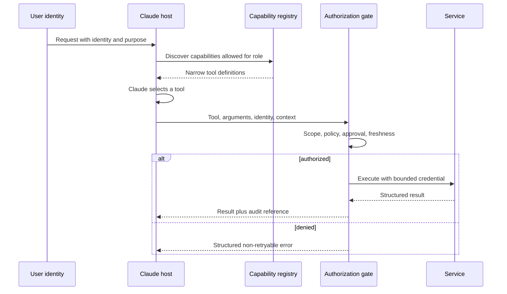

# 集成协议、身份与最小权限

> 工具安全取决于系统能否拒绝未授权调用；Claude 是否谨慎不能代替授权。

**类型：** 构建
**语言：** Python
**前置要求：** [端到端架构与价值取舍](../../23-end-to-end-architecture-and-value-tradeoffs/)；阶段 13，第 01、05、06、16 和 18 课
**预计时间：** 约 150 分钟

## 学习目标

- 根据需求选择直接 API、CLI、MCP 或 agent 间集成
- 将能力发现与执行授权分开
- 设计最小权限工具集和身份传递机制
- 返回结构化、可操作且不会泄露机密的错误
- 把审批、审计和撤销控制放在执行边界

## 问题所在

一个客服 agent 可以读取工单、起草回复、发放退款和删除用户账户。大多数客服人员只需要前两项
能力。团队却让四个工具始终启用，只增加了一条 prompt：“除非绝对必要，否则绝不退款或删除
账户。”

这不是最小权限。危险能力依然存在，模型依然能看到它，prompt 注入也依然可以把它当作目标。
确认文本可以减少误操作，却不能代替授权。

结构性修复很直接：移除角色不需要的能力，传递调用方身份，并在工具执行时强制检查
权限范围和审批状态。

## 核心概念

### 根据边界选择集成形态

这些协议的能力有重叠，但它们主要解决的问题不同。

| 形态 | 最适用场景 | 主要取舍 |
|------|------------|----------|
| 直接 API | 应用已知一个服务契约，并且需要低开销 | 服务耦合紧密，需要自定义发现机制 |
| CLI | 围绕可执行程序的本地或 CI 自动化 | 进程、环境和输出管理负担 |
| MCP | host 需要跨 server 以标准方式发现工具、资源或 prompt | 需要运维另一套协议边界和授权模型 |
| agent 间集成 | 一个 agent 把任务委派给另一个自主服务 | 信任、身份、进度和故障语义更难处理 |

MCP 不会取代所有 API。对于稳定的内部服务调用，直接 API 可能更清晰、更快。多个 host 需要
用统一方式发现和调用能力，或工具所有权需要留在 server 边界之后时，适合使用 MCP。

CLI 适合本地开发工作流和 CI，但长时间运行的任务需要持久状态、取消和结果获取能力，不能只
依赖脆弱的子进程。只有远程一方负责自主执行任务时，agent 间集成才合理；如果对方只是一个
函数端点，就不适合。

### 分开发现、选择与执行



发现控制模型能看到什么，授权控制实际会发生什么。两者缺一不可。

如果发现机制返回所有工具，模型会承担额外的上下文和选择成本，还会看到危险操作的说明。如果
缺少授权，隐藏工具只是一种遮掩，调用方仍可能直接访问端点。

### 传递身份，不要替换身份

应用 API key 标识的是应用。它不会自动代表发起请求的真人用户或服务。

传递：

- 身份主体 ID
- 租户或组织
- 经过身份验证的会话
- 角色和 scope
- 政策要求的用途或案件标识符
- 高权限操作的审批引用
- 请求 ID 和 trace ID

下游系统应依据可信身份声明自行作出授权决策。不要授予宽泛的服务凭证，再让 Claude 模拟用户
权限。

### 在四个层级应用最小权限

1. 工具集：只暴露当前任务和角色需要的能力。
2. 工具 schema：只接受必要参数，并约束参数值。
3. 凭证：只授予所需的服务 scope 和资源。
4. 操作：执行时重新检查当前政策、对象所有权和审批状态。

权限会变化，审批会过期，工具定义可能在几分钟前就已加载。执行时授权是最后一道控制。

### 把审批设计成一种能力

“先问用户”含义模糊。可靠的审批包含：

- 拟执行的确切操作和参数
- 预期影响和可逆性
- 请求方身份
- 审批方身份和权限
- 到期时间
- 单次使用或有限次数使用语义
- 审计引用

审批后，只执行获批的那项确切操作。如果参数变化，就重新申请审批。

### 返回结构化错误

工具的故障需要不同的恢复方式。

```json
{
  "ok": false,
  "error": {
    "category": "authorization",
    "retryable": false,
    "message": "refunds:write scope is required",
    "safe_details": {
      "required_action": "request authorized human review"
    }
  }
}
```

类别可以包括验证、授权、未找到、冲突、速率限制、依赖、超时和内部错误。告诉 agent 是否可以
安全重试，以及什么变化能改变结果。不要返回原始堆栈跟踪、token 或包含机密的上游消息。

### 渐进式发现减少能力膨胀

大型工具目录会消耗上下文，并增加选择错误。先加载一个小而稳定的工具集以及搜索或注册机制，
等任务明确需要时再加载专用工具。

渐进式发现仍应强制执行身份主体的 scope。搜索结果不能泄露调用方无权得知的能力名称或说明。

### MCP scope 不等同业务授权

MCP 对能力交换进行了标准化。身份、租户隔离、同意、审批、政策、审计和凭证管理仍由应用负责。
传输安全不等于授权，协议握手成功也不代表有权使用每个工具。

## 动手构建

## 交互实验

```figure
25-identity-permission-path
```

使用权限路径探索器，跟踪身份如何从通过身份验证的请求开始，依次经过能力发现、模型选择、执行时
授权、审批、服务调用和审计。改变 scope 可以说明发现和授权为何是两项独立控制。

## 实践实验

只授予发现 scope 并尝试执行，然后加入与操作绑定的审批，观察哪项决策发生了变化、哪道边界仍
在强制执行。

## 交付产物

填写完成的 [`outputs/least-privilege-review.json`](../outputs/least-privilege-review.json) 记录了可见工具，
以及一次被拒绝退款尝试的结构化结果。

## 验证

复现该行为，并运行所有授权测试：

```bash
cd certifications/claude/lessons/25-integration-protocols-identity-and-least-privilege/code
python3 main.py
python3 -m unittest discover tests -v
```

测验会检查协议、身份、审批和重试规则。

## 综合项目关联

把这份报告作为 Architect Professional 综合项目中身份与最小权限的证据。

该实验使用 Python 标准库，清楚呈现这条边界。

```bash
cd certifications/claude/lessons/25-integration-protocols-identity-and-least-privilege/code
python3 main.py
python3 -m unittest discover tests -v
```

### 第 1 步：选择主要形态

`select_protocol` 要求指定一种主要集成需求。动态发现对应 MCP，本地自动化对应 CLI，远程自主
委派对应 agent 间集成，已知服务调用对应直接 API。需求含糊时会失败，迫使架构师澄清边界。

### 第 2 步：定义身份主体和工具契约

`Principal` 携带 scope 和当前有效的审批。`ToolContract` 声明所需 scope、风险，以及是否要求
审批。说明文字负责解释行为，但不会授予权限。

### 第 3 步：过滤发现结果

`discover_tools` 会移除超出身份主体 scope 的能力。负责起草回复的客服永远看不到删除账户工具。

### 第 4 步：在执行时授权

`authorize` 检查当前 scope 和审批。检查失败时，`execute_tool` 会拒绝调用，并返回结构化、
不可重试的错误。

这个玩具系统没有实现基于密码学的身份机制、token 验证或政策引擎。这些能力属于生产基础设施，
但实验仍把授权决策放在正确的边界上。

## 上手使用

针对客服系统，为每个角色创建专属工具包：

- 分诊：读取分配的工单、分类、路由
- 回复人员：读取工单和政策、写入草稿
- 退款审核人：读取案件和建议、批准或拒绝
- 退款执行人：只执行一项明确获批的操作
- 管理员：在客服 agent 路径之外维护账户

不能因为一个服务有能力提供管理员工具，就把这些工具交给模型。高风险操作应该使用与获批操作
绑定的短期凭证，并产生不可变的审计记录。

选择 MCP 还是直接 API 时，编写一份 ADR 比较：

- host 的数量和多样性
- 是否需要动态发现
- 延迟预算
- 现有身份验证和 SDK 的成熟度
- 部署和所有权边界
- 流式或长时间运行行为
- 可观测性和支持负担

协议是否流行，不是需求。

## 考试决策模式

如果一个角色永远不需要某项能力，就把它从配置中移除。日志和确认属于补偿性控制，不是最小权限。

优先选择符合以下特征的答案：

- 传递已验证身份的用户或服务身份
- 严格限制工具和凭证的权限范围
- 执行时重新授权
- 高影响操作使用当前有效的审批
- 返回分类明确、指明能否重试的错误
- 根据集成边界选择协议
- 工具目录很大时采用渐进式能力发现

不要选择那些假定更好的 prompt、更大的模型或成功建立 MCP 连接就能解决授权问题的答案。

## 常见陷阱

### 所有用户共用一个服务账户

下游服务只能看到宽泛的应用权限。每个用户的限制会退化成 prompt 政策，而不是可强制执行的
政策。

### 确认没有绑定操作

用户批准退款 50 美元，之后参数却变成了 500 美元。审批必须与操作、参数、身份和时间绑定。

### 把工具说明当成控制措施

说明文字有助于选择工具。从安全角度看，它们是不受信任的文本，本身也可能携带 prompt 注入。

### 重试授权错误

重试不会创造权限。把错误标记为不可重试，并交给正确的审批或访问流程。

## 练习

1. 增加资源级授权，让身份主体只能读取分配给自己的工单。
2. 创建一条经过签名、仅能使用一次的审批记录，并拒绝发生变化的参数。
3. 定义渐进式发现接口，隐藏未授权工具的名称。
4. 在 200 毫秒延迟预算下，比较三个内部服务使用 MCP 和直接 API 的效果。
5. 对工具说明和结果进行红队测试，检查间接 prompt 注入。

## 关键术语

| 术语 | 人们常说的意思 | 实际含义 |
|------|----------------|----------|
| 身份验证 | 操作权限 | 身份的证明 |
| 授权 | 登录 | 决定该身份能否执行这项操作 |
| Scope | 一条 prompt 规则 | 由可信凭证或政策决策携带的有限权限 |
| 发现 | 授权 | 找到某项能力，与是否允许执行分开 |
| 最小权限 | 增加确认 | 移除不必要的能力，并尽可能收紧剩余权限边界 |
| 审批 | 用户同意了 | 针对确切操作参数、与身份和时间绑定的授权 |

## 延伸阅读

- [MCP 规范](https://modelcontextprotocol.io/specification/latest)，了解当前协议行为
- [MCP 授权规范](https://modelcontextprotocol.io/specification/latest/basic/authorization)，了解协议级授权要求
- [Claude 工具使用文档](https://platform.claude.com/docs/en/agents-and-tools/tool-use/overview)，了解当前工具契约
- 阶段 13，第 05 课：schema 设计
- 阶段 13，第 18 课：生产 MCP 身份验证
- 阶段 17，第 25 课：机密和审计控制
