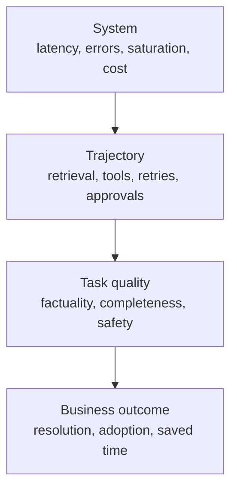

# 生产可观测性、延迟与成本

> API 调用显示正常，也可能掩盖失败的任务。

**类型：** 构建
**语言：** Python
**前置要求：** [RAG、检索与数据流水线](../../24-rag-retrieval-and-data-pipelines/)；阶段 11，第 10 课；阶段 17，第 08、13 和 27 课
**预计时间：** 约 150 分钟

## 学习目标

- 区分系统可靠性、任务质量和业务结果
- 为 Claude 请求和 agent 执行轨迹设计日志、指标和 trace
- 诊断模型、检索、工具、队列和重试各环节的延迟
- 衡量总成本和每个成功结果的成本
- 根据服务目标定义告警和上线门禁

## 问题所在

生产仪表盘显示 API 调用成功率为 99.9%，客户却仍在投诉。

模型返回 HTTP 200，但部分答案使用了过期来源。工具超时后，agent 一声不响地继续执行。长 prompt
因为开头附近放了时间戳而无法命中缓存。P95 延迟翻了一倍，平均值看起来却还能接受。更便宜的
模型降低了调用价格，却增加了重试和人工审核。

仪表盘衡量的是传输是否成功，产品成败取决于任务是否成功。可观测性必须把两者连接起来。

## 核心概念

### 观察四个层级



系统信号告诉你组件是否运行。执行轨迹信号告诉你应用做了什么。质量信号告诉你结果是否满足
任务要求。业务信号告诉你工作流是否创造了价值。

不要把它们压缩成一个“成功”字段。

### 日志、指标和 trace 各司其职

日志记录离散事件：请求已接受、检索未返回候选结果、工具拒绝授权、输出未通过 schema 验证、
审核人发起升级。使用结构化字段，方便运维人员分组和过滤。

指标聚合一段时间内的行为：请求率、错误率、P95 延迟、token 用量、缓存命中、检索召回率、
任务通过率和每次成功的成本。它们驱动仪表盘和告警。

trace 连接完整执行轨迹。一条 trace 应通过父子 span 串起模型调用、检索、工具执行、验证、
重试和人工审批。没有 trace，缓慢的请求看起来只是一个不透明的整体。

### 跟踪语义契约

捕获足够的信息，以便复现结果并进行分类：

- trace、请求、会话和不暴露用户敏感信息的标识符
- 应用、prompt、模型、工具、知识和 eval 版本
- 输入类别和风险等级
- token 数量及缓存读取或写入
- 停止原因和工具名称
- 工具耗时和结构化错误类别
- 验证与政策决策
- 评估器结果和人工编辑
- 最终状态和下游结果

不要记录机密、原始凭证或不必要的个人数据。对于敏感输入，存储哈希、类别、数量或受访问控制
的引用，而不是明文。

### 分开系统成功与任务成功

系统成功关注请求是否按照协议完成。任务成功关注输出是否满足既定评分规则。有效的 JSON 响应
可能在事实上是错的。agent 也可能正常结束，却没有完成请求的状态变更。

对于 agent 系统，两方面都要评估：

- 最终状态：预期产物或系统状态是否存在？
- 执行轨迹：工具、权限、证据和预算的使用是否正确？

单靠文本匹配无法判断这两点。

### 拆解延迟

端到端延迟包括：

```text
queue + context assembly + model + retrieval + tools + validation + retries + approval
```

为每个主要 span 跟踪 P50 和 P95。P50 描述典型路径，P95 暴露缓慢工具、长上下文、速率限制和
重试。

对于流式体验，还要包括首次产生有用输出的时间。首 token 时间可能很好看，但用户仍在等待引用、
工具结果或最终通过验证的答案。

对于后台和批处理系统，衡量是否按期限完成以及吞吐量。如果整个作业能在业务时间窗口内完成，
单个批处理项耗时 30 秒也可以接受。

### 根据证据优化

常见的延迟优化手段：

- 把简单工作路由给速度更快且能力合适的模型
- 减少无关上下文
- 把稳定的 prompt 前缀放在适合缓存的位置
- 检索更少、更优的候选结果
- 并发运行相互独立的工具调用
- 把非交互式工作负载移到批处理
- 强制执行时间、轮数和重试预算
- 在新鲜度允许时缓存确定性的工具结果

每种手段都可能改变质量或安全性。应在有代表性的评估集上评估这些取舍。

### 衡量每个成功结果的成本

token 价格只是其中一项。

```text
total cost = model + cache writes and reads + tools + infrastructure + review + correction
cost per success = total cost / accepted task outcomes
```

失败的请求仍会产生成本，安全拒绝、重试、审核时间和事故纠正也一样。分别报告输入、输出、缓存
和工具成本，让团队知道该从哪里着手。

选择模型或架构变体时，应比较每个成功结果的成本。

### 理解 prompt 缓存的形态

prompt 缓存会复用稳定前缀。靠前位置的变化可能导致后续所有内容失效。如果当前文档支持这种
缓存布局，应把稳定的工具定义、系统指令和大型参考材料放在动态用户内容之前。

跟踪缓存读取和缓存写入 token。只有缓存功能开关、没有命中率指标，算不上优化。

工具定义、模型设置、思考配置和其他请求变化都可能影响缓存行为。具体细节会变化，应以当前
官方文档为准进行验证。

### 构建可操作的告警

告警应服务于用户或运维人员需要作出的决策，别让指标稍有波动就触发告警。

好的告警包括：

- 任务通过率在有意义的时间窗口内低于 SLO
- 安全控制失效或出现未授权操作尝试
- P95 延迟超出用户容忍范围
- 检索新鲜度延迟
- 某类工具错误激增
- 部署后缓存命中率崩塌
- 每次成功的成本超出预算
- 评估器意见不一致或标签漂移

每条告警都需要负责人、runbook、证据链接和升级路径。如果没人知道收到告警后该做什么，它就
只是仪表盘上的装饰。

### 通过渐进上线控制证据风险

离线评估只能覆盖一部分情况。生产流量还会带来新的查询、数据、负载和集成。

采用：

1. 不影响用户的影子评估
2. 按租户或流量比例进行小范围 canary
3. 带自动回滚保护的逐步扩大
4. 质量、延迟、成本和安全门禁通过后全面上线

与稳定基线比较，并按任务类别分层。整体提升可能掩盖高风险分层中的严重回归。

## 动手构建

## 交互实验

```figure
26-latency-cost-slo
```

使用 SLO 探索器分别调整任务成功率、缓存率、重试成本、P50 和 P95。你会看到，有些变体的调用
价格更低或传输状态正常，却仍无法通过用户体验、质量或每次成功成本门禁。

## 实践实验

加入一条成本低但失败的 trace，观察单价下降时每次成功的成本如何上升。然后找出第一道应该
阻止上线的门禁。

## 交付产物

[`outputs/release-scorecard.json`](../outputs/release-scorecard.json) 填写了基线和候选方案对比，
并设置了相互独立的质量、延迟、缓存和经济性门禁。

## 验证

复现并测试聚合逻辑：

```bash
cd certifications/claude/lessons/26-production-observability-latency-and-cost/code
python3 main.py
python3 -m unittest discover tests -v
```

测验会检查故障诊断和上线决策。

## 综合项目关联

把这份评分卡带入 Architect Professional 综合项目的评估、可观测性和 canary 门禁部分。

实验只用 Python 聚合合成 trace 记录。

```bash
cd certifications/claude/lessons/26-production-observability-latency-and-cost/code
python3 main.py
python3 -m unittest discover tests -v
```

### 第 1 步：表示一条任务执行轨迹

`Trace` 存储紧凑的端到端记录：变体、延迟、token 数量、成本、系统结果、任务结果、缓存状态和
错误类别。生产 trace 应包含子 span 和受访问控制的引用，而不是单个扁平对象。

### 第 2 步：聚合时不隐藏故障

`summarize` 分别报告系统成功和任务成功。它计算最近秩 P50 和 P95、缓存读取率、错误类别、
总成本和每次任务成功的成本。失败尝试仍计入成本分子。

### 第 3 步：比较变体

`by_variant` 按变体拆分结果，避免启用缓存或路由的方案与基线混在一起取平均值。把质量、延迟
和成本放在一起比较。

### 第 4 步：评估服务目标

`evaluate_objectives` 应用任务成功率下限以及延迟和成本上限。变体必须通过每一道必要门禁。
不能用更低的成本抵消安全或质量故障。

## 上手使用

先提出一个生产问题：“为什么任务成功率在发布后下降？”

按应用和发布版本过滤 trace，再按输入类别分层。先检查系统错误，再检查检索和工具 span，接着
检查验证器和评估器结果。比较 prompt、模型、知识和工具版本，找出执行轨迹最早偏离基线的位置。

如果 P95 延迟上升而 P50 保持稳定，应检查慢路径行为：重试、速率限制、大输入、工具超时和等待
审批。如果 token 价格稳定而成本上升，应检查调用次数、上下文长度、缓存命中和审核。

维护一份发布评分卡：

| 门禁 | 基线 | 候选方案 | 要求 |
|------|------|----------|------|
| 任务通过率 | | | 高风险分层中不能回归 |
| 安全通过率 | | | 硬性控制达到 100% |
| P95 延迟 | | | 在 SLO 范围内 |
| 每次成功的成本 | | | 在预算内 |
| 检索召回率 | | | 在容许范围内 |
| 人工审核时间 | | | 不得隐藏工作流负担 |

## 考试决策模式

如果 API 成功率很高，但用户报告结果很差，应增加或检查语义质量和执行轨迹证据。如果错误答案
出现在文档刷新之后，应先追踪检索，再更换模型。

优先选择符合以下特征的答案：

- 结合使用日志、指标和 trace
- 分开传输成功、任务成功和业务成功
- 监控 P95，而不只看平均值
- 比较每个成功结果的成本
- 对 prompt、模型、工具和知识进行版本管理
- 以质量、延迟、成本和安全性作为上线门禁
- 为每条告警指定负责人和 runbook

## 常见陷阱

### 默认记录完整 prompt

这可能泄露个人数据、机密或受监管内容。只记录必要且安全的证据，并对敏感引用实施访问控制。

### 使用单一聚合质量分数

它可能掩盖不同语言、风险等级、任务或客户中的回归。应该分层分析。

### 使用平均延迟

少量慢请求可能在平均值保持稳定时破坏用户体验。跟踪尾部延迟和超时率。

### 使用每次调用的成本

它会奖励廉价的失败。使用每个被接受结果的成本，并把审核和纠正计入其中。

## 练习

1. 扩展实验，为检索和两个工具增加子 span。
2. 增加输入风险分层，并证明整体改善可能掩盖严重回归。
3. 创建缓存失效实验，衡量命中率、P95 和成本。
4. 为工具授权故障设计一条带负责人和 runbook 的告警。
5. 编写一项 canary 政策，任何硬性控制失败时自动回滚。

## 关键术语

| 术语 | 人们常说的意思 | 实际含义 |
|------|----------------|----------|
| 日志 | 调试文本 | 带有安全证据和标识符的结构化事件 |
| 指标 | 任意数字 | 用于理解或控制行为的一段时间聚合值 |
| Trace | 一个请求 ID | 完整执行轨迹中相互关联的耗时和结果 |
| 任务成功 | HTTP 200 | 请求的结果满足评分规则和约束 |
| P95 延迟 | 最慢请求 | 95% 的已测请求在该值或更低值内完成 |
| 每次成功的成本 | 模型价格 | 总预期成本除以被接受的任务结果数 |

## 延伸阅读

- [Claude 用量与成本 API 文档](https://platform.claude.com/docs/en/build-with-claude/usage-cost-api)，了解当前用量报告方式
- [Prompt 缓存文档](https://platform.claude.com/docs/en/build-with-claude/prompt-caching)，了解当前缓存行为
- 阶段 17，第 13 课：LLM 可观测性
- 阶段 17，第 27 课：LLM 财务运营
- 阶段 17，第 20 和 21 课：渐进式交付和 A/B 测试
