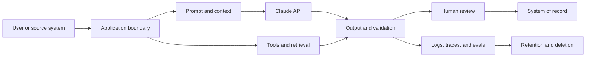

# 企业治理、合规与人工审核

> 治理体系要决定：谁可以使用谁的数据，以及可以承担哪些风险。

**类型：** 参考
**语言：** Python
**前置要求：** [为能力设置权限边界](../../06-governance-safety-and-responsible-use/)、[集成协议、身份与最小权限](../../25-integration-protocols-identity-and-least-privilege/)；阶段 17，第 26 课
**预计时间：** 约 150 分钟

## 学习目标

- 把政策和监管义务转化为有负责人的技术控制
- 对数据分类，并梳理它如何流经 prompt、工具、存储、日志和审核
- 根据风险、权限和可逆性设计人工审核
- 结合具体场景评估偏见、公平性、透明度和可申诉性
- 为审批、监控、事故响应和审计建立证据

## 问题所在

一个医疗团队提出了 Claude 工作流，用来总结患者消息、推荐路由类别并起草回复。设计文档中
写道：“模型不会保留数据，所有输出都会由人工审核，而且系统符合 HIPAA。”

这些陈述没有一条算得上架构。

数据可能出现在 API 载荷、文件、缓存、批处理存储、日志、trace、支持系统和审核工具中。“人工
审核”没有说明审核人的资质、证据、工作量或权限。是否合规取决于具体用途、合同、配置、区域、
控制措施和法律分析。架构师不能用一句话下结论。

应设计一套受治理的系统：建立数据地图，作出风险决策，为控制
措施指定负责人并留存证据；必要时升级给安全、隐私、法律、临床或合规专家。

本课讲的是架构判断，不构成法律意见。

## 核心概念

### 从风险决策出发

治理首先要明确：

- 系统会影响哪项决策或操作
- 哪些人可能受益或受害
- 涉及哪些数据类别
- 错误和滥用模式
- 可逆性
- 所需权限
- 适用的组织内部与外部义务
- 由谁接受剩余风险

不要从一份通用护栏清单开始。内容过滤器、审批队列或加密控制只有在特定边界上处理了明确风险，
才有价值。

### 梳理数据如何流经整个系统



针对每条边和每处存储，记录：

- 数据类别和用途
- 适用时记录来源和数据主体
- 必填字段与可选字段
- 身份和访问权限
- 加密和密钥所有权
- 服务提供商及其次级处理者边界
- 区域或数据驻留要求
- 保留和删除行为
- 是否用于改进或评估模型
- 事故和访问审计证据

不同产品功能可能有不同的数据保留和适用资格规则。文件、批处理、代码执行、MCP 连接器、
托管会话和标准 Messages 请求的边界可能各不相同。针对确切的功能组合，检查当前官方文档和
你方签订的合同。

### 先最小化，再保护

先排除不必要的数据，再保护剩余数据。

按以下顺序处理：

1. 删除任务不需要的字段。
2. 不需要身份时，使用假名化或聚合。
3. 根据明确需求限制功能或服务商边界。
4. 限制身份、scope、保留时间和日志。
5. 用加密、监控和事故控制保护剩余数据。

“告诉 Claude 不要记住”不是数据保留控制。数据如何保留，由配置和合同约定决定。

### 构建控制矩阵

控制措施分为几种类型。

| 类型 | 目的 | 示例 |
|------|------|------|
| 预防性 | 阻止不安全事件 | scope 门禁阻止未授权写入 |
| 检测性 | 揭示问题 | 对抽样输出中的敏感字段泄漏发出告警 |
| 纠正性 | 限制或修复损害 | 撤销访问权限、回滚模型路由、更正受影响的记录 |
| 治理性 | 分配和复核权限 | 用例发生重大变更后，由指定负责人重新审批 |

针对每项控制，记录负责人、实现、证据、测试、故障响应和复核频率。没有负责人和测试的控制，
只是愿望。

### 分层设置模型与系统护栏

使用多道边界：

- 输入验证和分类
- 将可信来源与不可信内容分开
- prompt 指令和示例
- 仅暴露必要工具
- 身份验证和授权
- schema 和语义输出验证
- 操作限制和审批
- 部署后监控和红队测试

prompt 护栏影响生成，系统护栏强制执行不变量。两者不能互相取代。

### 把人工审核设计成一项控制

人在环的前提是审核人有能力改善决策，并且具备所需的信息、时间、专业能力和权限。

定义：

- 触发条件：风险类别、证据不足、冲突、不确定性或抽样案例
- 审核人：角色和资质
- 证据包：来源证据、模型输出、工具执行轨迹、标记和拟议操作
- 决策：批准、编辑、拒绝、升级或要求补充证据
- 服务级别：时间预算和队列容量
- 回退：无法审核时的安全行为
- 审计：身份、理由、时间戳和最终操作

要避免自动化偏见。审核人需要理由去检查证据，而不是面对一份精美答案后直接走过场。可以先
展示来源摘录，再展示生成结论；也可以要求填写结构化原因代码。

### 根据风险匹配审核方式

| 风险 | 示例 | 审核模式 |
|------|------|----------|
| 低 | 容易撤销的内部草稿 | 自动检查加抽样审核 |
| 中 | 面向客户的建议 | 基于阈值或例外的审核 |
| 高 | 财务、法律、临床或破坏性操作 | 操作前由合格人员审批 |
| 未知 | 新用例或证据薄弱 | 暂停、升级并收集证据 |

同一个模型给出的置信度不能作为可靠的安全边界。应使用可观察证据、经过校准的评估器、确定性
条件和合格审核。

### 把公平性视为场景化需求

偏见是可能让某些人处于不利地位的系统性错误或表征。公平性不是一个通用指标。

需要问：

- 正在作出什么决策？
- 哪些群体可能遇到不同的错误率或访问待遇？
- 存在哪些明示、推断或代理的受保护属性与敏感属性？
- 哪种公平性定义适合法律和伦理语境？
- 它与准确性、隐私和个体待遇之间有哪些取舍？
- 谁有权选择并复核评判标准？

在适当情况下，测试有代表性的切片和交叉群体。样本量小会带来不确定性，应该明确报告，而不是
隐藏。

### 提供透明度和可申诉性

不同人需要不同的解释。

- 最终用户需要知道 AI 何时实质影响了交互，以及如何对有害结果提出异议。
- 审核人需要证据、不确定性和控制上下文。
- 运维人员需要版本、trace 和故障类别。
- 审计人员需要政策映射、测试、所有权和留存证据。
- 管理层需要剩余风险、业务影响和决策状态。

不要把思维链或敏感系统指令当作解释公开。应该提供基于来源的理由、适用规则、相关因素和人工
申诉渠道。

### 为变化做好准备

任何重大要素发生变化时，都要重新评估：

- 用例或受影响人群
- 模型或服务提供商
- prompt 或工具权限
- 数据来源、保留规则或区域
- 评估结果或事故模式
- 法律、政策或合同
- 部署规模

对风险评估和控制证据进行版本管理。一次上线审批不能覆盖未来无关的系统。

## 动手构建

## 交互实验

```figure
27-governance-approval-flow
```

使用审批流程探索器调整后果、可逆性、证据、审核人资质、队列容量和回退方案。它可以判断
“人工审核”能否有效控制风险，还是只会堵塞队列。

## 实践实验

从治理包副本中删除审核回退方案或一名控制负责人，观察系统进入阻塞状态，再修复治理设计。

## 交付产物

填写完成的 [`outputs/governance-control-packet.md`](../outputs/governance-control-packet.md) 包含风险
登记册、数据边界、预防性、检测性、纠正性和治理性控制，以及配足审核人员的审批流程。

## 验证

以确定性方式验证其所有权和故障响应：

```bash
cd certifications/claude/lessons/27-enterprise-governance-compliance-and-hitl
python3 code/main.py
python3 -m unittest discover -s code/tests -v
```

测验会检查治理和重新评估决策。

## 综合项目关联

把这份治理包带入 Architect Professional 综合项目的治理与人工审核部分。

为高影响 Claude 工作流创建治理包。

### 第 1 步：风险登记册

```markdown
| Risk | Cause | Affected party | Impact | Likelihood | Control | Owner | Residual risk |
|------|-------|----------------|--------|------------|---------|-------|---------------|
```

纳入意外故障、滥用、prompt 注入、内部人员访问、依赖故障、知识过期、不公平表现和审核人过载。

### 第 2 步：数据地图

列出每份载荷、每处存储、日志、缓存、评估集、人工界面和外部服务。标明数据用途、最少字段、
保留、删除、身份、区域和合同边界。

### 第 3 步：控制矩阵

```markdown
| Control | Risk addressed | Boundary | Owner | Evidence | Test | On failure |
|---------|----------------|----------|-------|----------|------|------------|
```

至少包含一项预防性、检测性、纠正性和治理性控制。

### 第 4 步：人工审核设计

明确触发条件、审核人资质、证据包、操作、队列 SLO、回退方案和审计记录。计算预期审核量。如果
队列无法满足 SLO，设计就不完整。

### 第 5 步：审批与重新评估

列出分别需要指定负责人的技术、安全、隐私、领域和业务决策。定义重大变更触发条件和下一次
复核日期。

## 上手使用

对于患者消息工作流，首个版本可以只为合格审核人起草路由建议，既不发送回复，也不修改医疗
记录。系统仅使用完成任务所需的最少字段和可信临床来源，严格执行租户和角色授权；输出链接到
来源，并检查高风险关键词和证据。审核队列不可用时，系统会安全回退。

随后，团队验证：

- 各消息类别的任务准确率
- 紧急病例的假阴性表现
- 在允许且适当时，按人口统计特征和语言切片
- 来源支持和过期数据处理
- 审核人一致性、耗时和改判情况
- 隐私、访问、保留和删除控制
- 事故、回滚和审计行为

法律、隐私、安全和临床负责人判断现有证据是否满足适用义务。架构师负责提供数据地图、控制、
测试和剩余风险陈述。

## 考试决策模式

当场景涉及受监管数据或敏感数据时，不能因为是内部使用就推断它一定获准。应先最小化和分类，
验证政策与合同，并让适当的权威人员参与。

优先选择符合以下特征的答案：

- 删除不必要的标识符或进行匿名化
- 梳理特定功能的数据边界和保留规则
- 分层设置模型控制和确定性控制
- 把高影响操作绑定到合格审批
- 测试有代表性的切片和不利案例
- 提供证据及申诉或升级路径
- 指定控制负责人和重新评估触发条件

不要把 prompt、模型置信度、泛泛的审核或供应商声明当成完整治理。

## 常见陷阱

### 凭产品名称判断合规

适用资格可能取决于功能、配置、协议、区域和数据流。应验证确切架构。

### 把人工审核当作打勾项

审核人不合格、超负荷或拿不到证据，就无法可靠降低风险。

### 为审计保留过量日志

冗长日志可能形成新的敏感数据存储。只在适当的访问和删除控制下保留最低限度的证据。

### 只用一项公平性指标

不同的公平性定义可能互相冲突。应根据场景、法律、伤害和利益相关方决策进行选择，并报告取舍。

## 练习

1. 为一个使用文件、MCP 连接器、批量评估和人工审核的客服工作流构建数据地图。
2. 为每天 10,000 个任务、触发率 5% 的场景设计审核队列，并计算人员配置假设。
3. 编写控制测试，证明未授权的租户数据永远不会进入模型上下文。
4. 为受到 AI 辅助决策伤害的用户定义申诉路径。
5. 创建强制触发治理重新评估的重大变更标准。

## 关键术语

| 术语 | 人们常说的意思 | 实际含义 |
|------|----------------|----------|
| 治理 | 一份政策文档 | 贯穿系统生命周期的决策、所有权、控制、证据和复核 |
| 数据最小化 | 加密所有内容 | 不收集、不发送实现目的所不需要的字段 |
| 人在环 | 有人看了输出 | 有明确触发条件、合格负责人、证据、权限和回退方案的控制 |
| 剩余风险 | 隐藏的问题 | 应用控制后依然存在、由授权负责人明确接受的风险 |
| 公平性 | 准确率相同 | 有具体场景、存在取舍并涉及受影响利益相关方的评判标准 |
| 可申诉性 | 客服支持 | 对结果提出异议、要求复核和纠正的有效路径 |

## 延伸阅读

- [Claude API 数据保留文档](https://platform.claude.com/docs/en/manage-claude/api-and-data-retention)，了解当前特定功能的边界
- [Anthropic Trust Center](https://trust.anthropic.com/)，了解当前安全与合规材料
- [Claude 宪法](https://www.anthropic.com/constitution)，了解 Anthropic 公开的模型行为框架
- 阶段 17，第 26 课：合规架构
- 阶段 18，第 20 和 21 课：偏见与公平性
