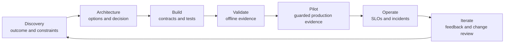

# 利益相关方沟通、ADR 与生命周期责任

> 下一位负责人能接手并落实这项决策，架构才算交付。

**类型：** 参考
**语言：** Python
**前置要求：** [业务发现、需求与 SLA](../../22-business-discovery-requirements-and-slas/)、[企业治理、合规与人工审核](../../27-enterprise-governance-compliance-and-hitl/)；阶段 17，第 23 课
**预计时间：** 约 135 分钟

## 学习目标

- 面向管理层、产品、工程和控制团队阐述同一套架构
- 编写保留取舍和回退条件的决策记录
- 把设计转化为实施指南、上线门禁和明确的责任归属
- 定义移交验收和运维就绪标准
- 在整个系统生命周期中管理反馈和变更

## 问题所在

一名架构师向管理层指导委员会展示了一张详细的多 agent 架构图。图中包含模型路由、MCP server、
向量索引、事件队列、评估器和 trace，却没人能回答三个基本问题：

- 要批准的业务决策是什么？
- 应用拟议控制后还剩什么风险？
- 系统上线后由谁负责？

后来，同一个设计以一张幻灯片的形式交给工程团队。关键选择只存在于参会者的记忆里。运维团队
没有收到 SLO 或回滚规则。政策团队不知道自己要负责知识新鲜度。审核人直到试点期间才发现还有
一条需要自己处理的队列。

设计在技术上可能正确，却仍然无法交付。沟通和生命周期责任本身就是架构职责。

## 核心概念

### 一个系统需要多种视图

不同的利益相关方要作出不同决策，但他们依据的事实必须一致。

| 受众 | 首要问题 | 最少证据 |
|------|----------|----------|
| 管理层 | 价值是否值得承担剩余风险和投入？ | 结果、基线、目标、方案、成本范围、风险决策 |
| 产品和运维 | 工作流和用户体验如何变化？ | 用户旅程、例外、审核、SLO、采用计划 |
| 工程 | 必须构建什么，边界如何运作？ | 组件、契约、身份、错误、版本、测试 |
| 安全和隐私 | 数据和权限在哪里跨越边界？ | 数据地图、威胁模型、控制、保留规则、证据 |
| 领域负责人 | 输出对真实任务是否有效？ | 评估案例、来源、政策、升级方式、变更责任 |
| SRE 和支持 | 如何发现、限制故障并恢复？ | 遥测、告警、runbook、回滚、依赖项 |

简化时不要删掉决策。应该把同一项决策转化成各类受众所使用的证据。

### 构建架构叙事

有效的评审遵循决策顺序：

1. 当前工作流和可衡量的问题。
2. 影响解决方案的约束和风险。
3. 考虑过的方案。
4. 推荐架构及其胜出原因。
5. 后果和被否决的备选方案。
6. 验证和上线计划。
7. 剩余风险和所需审批。
8. 运维和变更过程中的责任归属。

一开始就展示组件图，会迫使受众自行还原这套逻辑。先把逻辑讲清楚。

### 每张图只回答一个问题



上下文图回答谁和什么会跨越系统边界。数据流图回答敏感数据流向哪里。时序图回答单次执行轨迹
如何运作。部署图回答运行时归谁负责。控制地图回答在何处预防、检测和纠正风险。

一张塞满所有信息的图，什么都回答不好。

### 记录决策，而不是会议实录

ADR 应该短到有人愿意读，又完整到日后可以重新审视。

必填字段：

- 状态和决策负责人
- 上下文和约束
- 方案和证据
- 决策和理由
- 后果和剩余风险
- 被否决的备选方案
- 验证计划
- 回退条件和复核日期

被否决的备选方案很重要。没有它们，未来的团队会重复同样的分析，或在不清楚破坏了哪项约束
的情况下修改设计。

明确表达置信程度。未经测试的延迟或成本数字必须标为估算。

### 把架构转化为契约

实施指南需要机器可检查的边界：

- 请求和响应 schema
- 身份与授权要求
- 版本和兼容性规则
- 超时、重试、取消和幂等行为
- 结构化错误类别
- 数据分类和保留规则
- prompt、模型、工具和知识的责任归属
- 评估 fixture 和发布门禁
- 可观测性字段和脱敏

架构包应该指向这些契约，不应复制实现的每一行。

### 按决策划分责任

“由 AI 团队负责”范围太宽。

分别指定以下事项的负责人：

- 业务结果
- 产品工作流和用户沟通
- prompt 和输出契约
- 模型选择和路由
- 工具和集成服务
- 知识来源新鲜度
- 身份和权限
- 评估标签和验收阈值
- 安全与合规控制
- 运行时 SLO 和事故响应
- 供应商和成本管理
- 弃用和退役

提出变更建议的人，应与有权接受风险的人分开。

### 设计移交验收

移交完成的标准，是接收团队能安全地运维和变更系统。单发一个文档链接远远不够。

验收标准：

- 已确认负责人和升级联系人
- 架构和 ADR 处于最新状态
- 依赖项和访问权限已配置
- 仪表盘和告警已上线
- 通过故障演练排练了 runbook
- 评估套件可以运行，基线已经存储
- 回滚经过测试
- 数据保留和删除行为经过验证
- 审核队列人员配置到位
- 已沟通已知限制
- 已商定变更和事故处理流程

双方共同进行验收评审。接收方负责人应演示如何从模拟故障中恢复。

### 把采用计划纳入工作流

AI 系统会改变人们的工作方式，只培训界面操作并不够。用户需要知道：

- 哪些任务属于范围之内
- 要检查哪些证据
- 何时编辑、拒绝或升级
- 可以输入哪些数据
- 系统会记录什么
- 如何报告有害或错误行为
- 服务不可用时会发生什么

采用情况要与结果和质量一起衡量。登录量本身说明不了价值，高使用量也可能来自强制流程或反复
返工。

### 按影响和决策沟通事故

事故期间，要区分已确认事实、当前影响、缓解措施和未知项。

```text
Impact: Which users, tasks, or records may be affected?
Evidence: What telemetry or evaluation confirms it?
Containment: What capability is disabled or routed safely?
Recovery: What must pass before restoration?
Follow-up: Which control, owner, or assumption changes?
```

不要猜测模型意图。描述可观察的系统行为和控制响应。

### 保持生命周期证据相互连接

每项生产结果都应该能追溯到：

- 需求和决策
- 系统及配置版本
- 测试和审批证据
- 部署和运行时 trace
- 人工审核或改判
- 下游结果
- 证据暴露问题时发起的变更请求

这条证据链能够支持调试、治理和理性迭代。

## 动手构建

## 交互实验

```figure
28-adr-lifecycle
```

使用 ADR 生命周期探索器，让一项决策依次经过发现、构建、验证、试点、运维、事故和重新审视。
改变证据或回退条件，观察接下来应由哪位负责人采取行动。

## 实践实验

在检索结果过期的桌面演练中触发失败，沿变更后的证据追溯到决策负责人，并更新 ADR，而不是
只修改架构图。

## 交付产物

填写完成的 [`outputs/delivery-handoff-packet.md`](../outputs/delivery-handoff-packet.md) 把管理层决策、
ADR、工程契约、运维演练和责任地图连接起来。

## 验证

验证其中的决策、负责人、恢复证据和可衡量的回退触发条件：

```bash
cd certifications/claude/lessons/28-stakeholder-communication-adrs-and-lifecycle
python3 code/main.py
python3 -m unittest discover -s code/tests -v
```

测验会检查沟通与生命周期决策。

## 综合项目关联

把经过验证的交付包作为 Architect Professional 综合项目的最终移交部分。

创建一份包含五项产物的交付包。

### 1. 管理层决策简报

用一页说明问题、基线、目标、方案、建议、投入范围、主要风险、验证和请求作出的决策。

### 2. 架构决策记录

记录选定模式和至少两个被否决的备选方案，并包含回退条件。

### 3. 工程契约索引

```markdown
| Boundary | Contract | Owner | Version rule | Failure rule | Test |
|----------|----------|-------|--------------|--------------|------|
```

### 4. 运维就绪检查清单

包含仪表盘、告警、runbook、访问权限、评估、回滚、依赖项、审核容量和事故沟通。

### 5. 责任与变更地图

```markdown
| Decision or asset | Operating owner | Change approver | Evidence | Review trigger |
|-------------------|-----------------|-----------------|----------|----------------|
```

进行桌面演练。模拟过期检索导致不安全建议、授权服务故障和评估器漂移。接收团队应该识别影响、
限制相关能力、从已知安全版本恢复，并记录后续责任归属。

## 上手使用

对于企业研究助手，提供以下视图：

- 管理层：缩短分析师工作周期、证据质量目标、预算和剩余保密风险。
- 产品：查询旅程、证据不足状态、引用体验和反馈路径。
- 工程：检索、模型、工具、身份和评估契约。
- 安全：租户边界、来源权限、日志、保留规则和事故控制。
- 运维：新鲜度、延迟、成本、错误和质量仪表盘，以及回滚规则。

各视图使用同一组事实，只保留该受众作决策所需的细节。

试点结束时，不能只看准确率。还要比较分析师耗时、引用检查、审核人工作量、各任务类别的采用
情况、每份验收通过报告的成本和事故。随后决定扩大、修订、限制还是停止。

## 考试决策模式

当题目要求沟通取舍时，用适合受众的语言说明业务后果、技术证据、被否决的备选方案和剩余风险。

优先选择符合以下特征的答案：

- 承诺之前进行结构化发现
- 记录上下文、方案和后果
- 为 prompt、数据、工具、控制、指标和运维指定负责人
- 定义实施和故障契约
- 要求通过运维就绪和移交验收
- 把反馈连接到有版本记录的变更决策

不要选择只交付架构图，却没有 SLO、runbook、评估器、责任归属或回滚机制的答案。

## 常见陷阱

### 面向所有受众只用一份幻灯片

这样要么让管理层淹没在实现细节中，要么让工程团队只收到含糊主张。应该提供事实一致、针对
各自决策调整的视图。

### 把架构当成上线产物

架构会随着证据、规模、依赖项和风险变化。运维期间也要持续对决策和图表进行版本管理。

### 用团队名称代替责任归属

团队标签无法说明谁负责更新过期来源、接受 eval 变更或响应告警。应把责任落实到具体决策。

### 把采用等同于价值

使用量可能上升，质量、审核负担或总处理时间却变得更差。应该衡量结果。

## 练习

1. 把技术架构转化为一页管理层决策简报。
2. 编写一份带可衡量回退条件的 ADR。
3. 为开始返回部分结果的工具创建移交演练。
4. 为 RAG 应用中每项可变产物指定负责人。
5. 设计一份包含质量、返工和用户信任的采用评分卡。

## 关键术语

| 术语 | 人们常说的意思 | 实际含义 |
|------|----------------|----------|
| 利益相关方 | 受邀参会的任何人 | 负责、影响或承担某项决策或结果的个人或群体 |
| ADR | 架构文档 | 针对一项决策及其上下文、备选方案和后果的聚焦记录 |
| 移交 | 发送文档 | 以证据确认接收方具备运维能力并接受责任 |
| 运维就绪 | 部署成功 | 负责人、控制、可观测性、恢复、评估和支持均经过验证 |
| 采用 | 用户数 | 工作流得到持续使用，并产生预期结果且不隐藏额外负担 |
| 回退条件 | 缺乏信心 | 触发预定架构或范围变更的证据 |

## 延伸阅读

- [Claude Platform 文档](https://platform.claude.com/docs/en/home)，了解当前实施边界
- [构建高效的 agent](https://www.anthropic.com/research/building-effective-agents)，了解如何说明工作流与 agent 的选择
- 阶段 17，第 23 课：SRE 实践
- 阶段 14，第 40 课：结构化技术移交
- 阶段 17，第 24 课：事故响应与运维恢复
