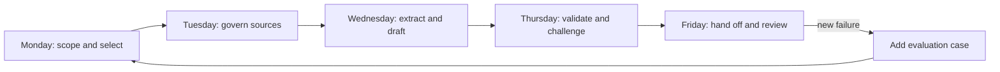

# 交付一周的完整工作流，别只打磨 prompt

> 这个综合项目要交付一套受治理的决策工作流：接收有来源的输入、核验主张、保留人工决策权，并把完整状态交给下一位负责人。

**类型：** 构建
**语言：** Python
**前置要求：** [选择足以承载工作的最小能力面](../../01-claude-product-and-model-landscape/)、[把需求转化为可测试契约](../../03-prompting-and-task-decomposition/)、[把每项事实放入正确的上下文](../../04-context-knowledge-memory-and-caching/)、[验证主张，而非置信度](../../05-output-evaluation-and-validation/)、[为能力设置权限边界](../../06-governance-safety-and-responsible-use/)、[在自动化之前设计移交](../../07-workflow-design-and-human-handoffs/)
**预计时间：** 在一个模拟工作周内完成，约 4 小时

## 学习目标

- 结合产品选择、prompt、知识管理、验证、治理、故障排查和移交设计。
- 构建有来源支撑、带明确 checkpoint 的每周简报工作流。
- 使用 Python 实现确定性校验器，检查来源、主张、治理和移交就绪情况。
- 在建议发布之前运行正常和故障案例。
- 用就绪证据说明工作流是否安全。

## 问题所在

你是虚构公司 Northstar Field Services 的运营主管，该公司有七个区域团队。每周五，管理团队都
需要一份简报，涵盖服务延误、影响客户的事故、政策例外，以及下周需要作出的两项决策。

现有流程很脆弱。各区域负责人用不同格式发送更新。一名分析师把事实复制进文档、核对互相冲突
的日期，再找三个人审批。最终简报有时会漏掉一个区域，或误用旧消息中后来已被纠正的数字。

管理层要求你“用 Claude 自动生成周报”。这项要求不是解决方案。简报会影响人员配置和客户沟通。
部分输入包含客户详情。政策例外需要获得授权的负责人。没有证据的自信草稿可能加速错误决策。

你的任务是设计一套有边界的 Claude 辅助工作流。Claude 可以提取、比较和起草；确定性检查负责
验证精确属性；发布和有重大后果的决策由获得授权的人负责。

## 核心概念

### 交付物是一条证据链

你将产出五项相互连接的产物：

1. 用例和产品选择记录。
2. 受维护的来源登记册和固定的每周快照。
3. 分阶段 prompt 契约。
4. 主张—证据与治理验证结果。
5. 带回退方案的人工移交包。



每天都以一道门禁结束。如果门禁失败，不要把不确定性继续推给下游。

### Python 校验器有意保持有限

综合项目代码不会调用 Claude。它明确划分了一项职责：精确的工作流属性应该交给确定性代码。

校验器检查：

- 是否存在所有必需的包章节。
- 每个活动来源是否有负责人、权威级别、日期、敏感度和稳定 ID。
- 主张是否引用已知来源。
- 有重大后果的主张是否使用直接或计算得出的证据支持。
- 过期和冲突证据是否清晰可见。
- 所选产品形态是否获准处理该数据类别。
- 高后果或不可逆工作是否有获得授权的人工负责人。
- 移交是否指定决策、期限、回退方案和下一位负责人。

它无法判断某项政策在伦理上是否充分、人工审核人是否胜任，或来源陈述是否真实。这些仍属于
组织和人的责任。

## 动手构建

## 交互实验

```figure
29-associate-capstone-readiness
```

在为期五天的构建过程中持续使用就绪看板。它把目的、来源、prompt 阶段、主张支持、权限、移交
和回退连接起来，防止一份精美简报掩盖失败的门禁。

## 实践实验

完成下面的五天工作流，再逐个故意破坏产品形态、来源、主张支持、权限和移交门禁。

## 交付产物

最终交付包括填写完成的清单和
[`outputs/demo-readiness-report.json`](../outputs/demo-readiness-report.json)。

## 验证

使用下面的命令复现通过的包和所有失败优先测试；不需要网络访问或凭证。本课测验是最后的个人
检查。

## 综合项目关联

完成的包是 Associate 路线的综合项目证据，需要由另一人审核。

### 星期一：界定决策和产品形态

用一句话描述这项决策：

```text
周五 15:00 前，运营总监将基于已批准的区域快照，为下一周选择不超过两项
人员配置或流程变更。
```

明确不在范围内的事项：

- 不自动发送客户消息。
- 不进行员工绩效排名。
- 不修改人员排班。
- 不作出法律或监管结论。
- 不使用受限数据。

比较候选产品形态。一次性聊天很简单，却不适合维护指令和反复使用同一组来源。如果 Project 的
现行条款、套餐控制和数据处理方式获批，它可能适合协作式重复工作。需要程序化摄取、验证和审计
集成时，API 可能更合适。Research 适合获取当前外部事实，不能取代已获批准的内部政策。

除了产品名称，还要记录这些决策：

```text
产品形态：
适用原因：
允许的数据类别：
已核对现行条款的日期：
不受支持的需求：
备用产品形态或人工路径：
```

门禁：负责人批准目的、产品形态、数据类别和禁止操作。

### 星期二：冻结并治理证据

为以下内容创建来源登记册：

- 七份区域状态文件。
- 事故系统导出。
- 已批准的服务政策。
- 人员容量表。
- 上周的决策记录。

每个来源都需要稳定 ID、负责人、权威类别、生效日期、复核日期和敏感度。把讨论笔记标为参考，
而不是政策。如果决策不需要客户姓名，就将其删除。

在有记录的时间点冻结每周来源快照。之后发生变化的事实应进入修订或例外流程。否则草稿、审核人
和负责人可能看到三个不同的世界。

定义权威顺序：

```text
1. 已批准的服务政策和已签署的事故状态
2. 截止时间前提交的当前区域状态
3. 之前的决策记录
4. 讨论笔记，仅供负责人参考，绝不能作为唯一依据
```

门禁：七个区域全部存在，或明确标记为缺失；来源通过新鲜度和权限检查；冲突有明确负责人。

### 星期三：拆解工作

不要一步就要求最终简报。使用四个有边界的阶段。

**阶段 1，提取：** 返回结构化行，包含区域、延误、受影响服务、事故 ID、政策例外、来源 ID 和
不确定性。不要建议操作。

**阶段 2，核对：** 检查区域覆盖、总数、重复事故、日期冲突和缺乏依据的字段。如果仍有阻塞项，
就停止。

**阶段 3，分析：** 识别模式，并提出不超过三个候选操作。每项操作都需要支持性发现、政策约束、
预期收益、潜在不利因素，以及有权批准它的负责人。

**阶段 4，起草：** 只根据经过验证的结构化行和获批分析生成管理层简报。包含所需决策、证据、
例外和已知不确定性。

每个阶段都使用 prompt 契约，其中包含来源层级、拒答行为、输出形态和验收标准。保存版本，以便
复现失败结果。

门禁：开始分析之前，结构化提取结果必须与快照核对一致。

### 星期四：验证和挑战

运行随附的校验器：

```bash
cd certifications/claude/lessons/29-associate-workflow-capstone
python3 code/main.py
```

演示包应返回 `ready_for_human_review` 状态。接下来故意破坏它：

- 将 `approved_surface` 设为 false。
- 删除一名来源负责人。
- 引用不存在的来源 ID。
- 把一项有重大后果的主张标为推测。
- 删除决策负责人。
- 把操作变成不可逆。

运行单元测试：

```bash
python3 -m unittest discover -s code/tests -v
```

然后为实际草稿创建主张—证据矩阵。引用必须支持确切主张。使用代码或电子表格验证总数，不要
使用模型评分器。把评分规则和证据交给另一名审核人，要求对方报告发现，而不是默默重写草稿。

使用发布等级：

- **阻塞：** 数据或产品形态未获批准、来源未知、总数无效、有重大后果的主张缺乏支持、缺少决策权限。
- **修订：** 覆盖不完整、冲突未解决、来源过期、不确定性不清楚。
- **质量改进：** 重复、标题薄弱或不重要的语气问题。

门禁：解决每个阻塞项。剩余不确定性要在人工审核包中清楚可见。

### 星期五：移交并闭环

填写 [`outputs/checklist.md`](../outputs/checklist.md)，构建审核包：

```text
决策：选择最多两项下周干预措施。
负责人：运营总监。
期限：周五 15:00。
快照：每周来源登记册版本和截止时间。
候选内容：简报版本和 prompt 版本。
证据：主张 ID、来源 ID、计算结果。
检查：通过、失败和人工审核的项目。
不确定性：缺失区域、日期冲突或支持不足。
选项：批准、修订、拒绝、升级。
回退方案：发布人工模板，或附带通知延后发布。
```

主管批准具体决策。记录谁基于哪个快照批准了什么。如果来源在审批后变化，使发布
门禁失效并审核差异。

模拟发布后，进行一次简短复盘：

- 哪个阶段消耗的人工时间最多？
- 哪项检查发现了最严重的缺陷？
- 是否有重要判断变得更困难？
- 哪个来源需要更清晰的责任归属？
- 哪项故障应该加入评估集？
- 工作流应该继续保持辅助模式、转向有限自动化，还是退回人工？

## 上手使用

### 完整的证据包

提交内容应包括：

- 带验证日期的产品形态选择记录。
- 包含十个来源的登记册，或规模更小但覆盖所有必需来源类别的等效登记册。
- 四个 prompt 阶段契约。
- 至少十个评估案例：四个正常案例、三个边界案例、三个治理或对抗案例。
- 覆盖每项有重大后果主张的主张—证据矩阵。
- 一个通过包和三个失败包的校验器输出。
- 通过的单元测试输出。
- 填写完成的人工移交清单。
- 一页复盘，其中包含一项具体工作流变更。

### 综合项目决策模式

审核工作或回答考试场景时，使用以下规则：

1. **目的未获批准，就停止。** 有能力不等于有权限。
2. **没有权威证据，就拒答或升级。** 增加 prompt 不会创造来源。
3. **精确属性，确定性检查。** 总数和 schema 不需要主观评分。
4. **后果重大，保留人工权限。** 给人提供证据和拒绝权。
5. **反复失败，修复系统。** 增加案例、控制或来源规则。
6. **产品事实会变化，在线核实。** 记录产品形态、日期和来源。

### 常见陷阱

- **从最终 prompt 开始：** 范围和来源故障会变成文案问题。
- **上传整个归档：** 已被取代的证据会与当前政策争抢注意力。
- **相信引用格式：** 被引用的来源可能无法蕴含该主张。
- **让审核人重新发现状态：** 移交时间会吃掉承诺节省的时间。
- **先自动发布：** 可逆性和权限被忽略。
- **把测试当成安全证明：** 单元测试只覆盖已实现规则，不覆盖组织事实。
- **在设计中固化当前产品细节：** 条款、功能、模型、成本和限制都会漂移。

### 练习

1. 用一个真实的周期性任务替换虚构场景，保留五天门禁。
2. 为你的工作流特有政策增加一条校验规则。
3. 实现规则之前先编写失败测试。
4. 在相同的十个案例上比较一个巨大 prompt 与四阶段工作流。
5. 要求一名审核人只使用你的包完成移交，记录对方不得不询问的每项事实。
6. 计算每份被接受简报的成本，包括审核和返工时间。

## 关键术语

- **决策工作流：** 把受治理证据转化为经过审核的操作或建议的一系列步骤。
- **来源快照：** 一次运行使用的固定、带版本的证据集。
- **重大后果主张：** 会实质影响决策或操作的主张。
- **验证包：** 发布前经过检查的结构化来源、主张、治理和移交状态。
- **发布等级：** 根据后果划分的阻塞、修订或质量状态。
- **决策负责人：** 对最终选择拥有权限并承担责任的人。
- **差异审核：** 重新验证早期审批后引入的变化。
- **就绪证据：** 用测试结果、故障案例、审批和回退证明系统已就绪。

## 延伸阅读

- [Claude Certified Associate Foundations 考试指南](https://everpath-course-content.s3-accelerate.amazonaws.com/instructor%2F6nizmqk8tpzpfjvt6qmmav7rh%2Fpublic%2F1783542847%2FClaude+Certified+Associate+%E2%80%93+Foundations+Exam+Guide.pdf)
- [Anthropic：构建高效的 agent](https://www.anthropic.com/research/building-effective-agents)
- [Anthropic：定义成功标准并构建评估](https://platform.claude.com/docs/en/test-and-evaluate/develop-tests)
- [Anthropic：API 和数据保留](https://platform.claude.com/docs/en/manage-claude/api-and-data-retention)
- [AI Engineering from Scratch：范围契约](../../../../../phases/14-agent-engineering/36-scope-contracts/)
- [AI Engineering from Scratch：验证门禁](../../../../../phases/14-agent-engineering/38-verification-gates/)
- [AI Engineering from Scratch：多会话移交](../../../../../phases/14-agent-engineering/40-multi-session-handoff/)

官方考试蓝图和 Claude 产品行为可能变化。本综合项目依据 2026 年 7 月生效的指南编写，来源于
2026-08-08 核验。依赖特定版本的事实之前，请确认当前指南、产品条款、模型、限制和控制措施。
