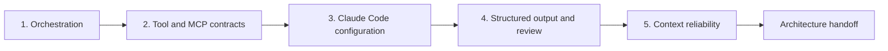

# 在六种场景中论证同一架构

> 架构是一组边界：即使场景变化、工具失败、证据不完整，它们依然成立。

**类型：** 构建
**语言：** Python
**前置要求：** [多 agent 编排与委派](../../16-multi-agent-orchestration-and-delegation/)、[工具契约、错误与渐进式发现](../../18-tool-contracts-errors-and-progressive-discovery/)、[Claude Code 记忆、规则、Skill 与 CI](../../19-claude-code-memory-rules-skills-and-ci/)、[可靠提取、批处理与独立审核人](../../20-reliable-extraction-batch-and-reviewers/)、[让大上下文可观测](../../21-long-context-reliability-provenance-and-escalation/)
**预计时间：** 在两次专注会话中完成，约 6 小时

## 学习目标

- 在所有五个 CCAR-F 领域中论证架构选择。
- 把同一套决策方法迁移到六种公开场景。
- 为编排、工具、Claude Code、结构化输出和上下文可靠性实现确定性检查。
- 构建测试部分结果、过期状态、不安全工具和无效输出的故障包。
- 产出一份带明确权衡与升级路径、可供审核的架构包。

## 问题所在

一名架构师为六个预期用例准备了六张图。客服场景图使用 agent 循环，代码场景图使用 Claude Code，研究场景图有 subagent，提取场景图使用 JSON。

审核时，架构师无法解释为什么某一步是工具而另一步是 subagent。图中遗漏了重试语义、配置范围、部分结果、来源版本和人工权限。每个设计都只在理想路径上有效。

基于场景的架构题考察迁移能力。名称和业务细节会变，但相同的决策会反复出现：

- 哪个顺序是确定的，哪种选择需要模型推理？
- 哪个上下文应拥有每项关注点？
- 哪些工具可见、已获授权并可重试？
- 共享的 Claude Code 指引应放在哪里？
- 类型化结果如何同时通过语义和证据验证？
- 哪些状态能在故障、压缩、恢复和人工移交后保留？

本综合项目构建一种架构方法，并将其应用到全部六种公开场景。

## 核心概念

### 六种场景是检验架构的透镜

2026 年 7 月公开 CCAR-F 指南列出以下场景：

1. 客户支持解决 agent。
2. 使用 Claude Code 的代码生成。
3. 多 agent 研究。
4. 使用 Claude 提升开发者生产力。
5. 用于 CI/CD 的 Claude Code。
6. 结构化数据提取。

本课程不复现考试场景。你将以虚构的软件与服务公司 Cedar Bridge 为背景，设计一套原创系统。每个透镜都强调同一架构的不同部分。

| 透镜 | 原创 Cedar Bridge 任务 | 需要设计的主要故障 |
|---|---|---|
| 支持 | 根据现行政策和案件证据起草解决方案 | 未授权操作或过期政策 |
| 代码生成 | 在 monorepo 中修复请求解析器 | 范围过宽或缺失跨文件契约 |
| 研究 | 比较三种迁移方案 | 重复工作、冲突或来源不完整 |
| 开发者生产力 | 将已批准决策转为 ADR 和任务计划 | 过期对话状态或隐藏的本地配置 |
| CI/CD | 从干净 checkout 审核 pull request | 无边界权限或不可复现的发现 |
| 提取 | 将变更通知标准化为记录 | schema 有效，但值是编造的或没有证据支持 |

六种场景共用一套核心架构，只在明确的变化点上分化。

### 使用五道门禁的决策栈



#### 门禁 1：agent 架构与编排

定义任务、前置条件、上下文边界、允许工具、完整或部分状态以及合并规则。固定顺序交给代码，语义选择交给模型推理。使用 subagent 必须有明确理由，例如隔离、专门化、独立审核或安全并行。

对于支持，在接收输入后，政策研究员和案件分析员可以独立工作。解决方案草稿依赖两者。获批准的执行者是独立权限边界，不属于只读建议循环。

对于研究，按不重叠的问题分发，按主张 ID 汇总。对于代码，使用清单和有边界的探索者，而不是把整个仓库分配给每个 agent。

#### 门禁 2：工具设计与 MCP 集成

每个工具都要有明确的动作和对象、何时该用或不该用的说明、闭合 schema、权限范围、副作用声明和结构化错误契约。写工具还需要当前有效的授权、幂等性和对账机制。

将 MCP 资源用于上下文数据、工具用于模型请求的操作、prompt 用于可复用的用户调用模板。渐进式发现可缩小目录，但必须保留访问范围。

在 CI 中，读取、搜索和测试接口应足以审核。不要仅因工作流在 pipeline 中运行就授予生产部署权限。

#### 门禁 3：Claude Code 配置与工作流

项目指引应简洁、版本化并由团队共享。把文件特定要求放在路径规则中，将可复用方法打包为 Skill，将明确的用户工作流打包为命令。使用 hook 强制执行确定性的范围和命令控制。

大范围修改前先规划。在隔离的只读上下文中探索。CI 从带已声明设置、有限工具、结构化发现和确定性测试的干净提交开始，不恢复交互式开发者会话。

#### 门禁 4：prompt 工程与结构化输出

在编写 prompt 前定义评估标准。为模糊判断使用边界示例，让未知值可表示。在支持时强制 schema，之后再验证语法、schema、语义和来源。

限制重试，并反馈最小的有用验证错误。分离生成器和审核人的上下文。批处理适合异步独立项目，不适合必须观察中间结果的自适应工具循环。

#### 门禁 5：上下文管理与可靠性

清楚放置硬约束和当前问题。用来源元数据检索最小相关证据切片。精简日志时不能删除故障或覆盖情况。将清单和副作用持久化在对话之外，传播完整、部分和阻塞状态。

置信度来自证据类别、覆盖度、冲突、新颖性和已测量错误。人工审核按后果与不确定性分层，并抽样普通通过案例。

### 通过故障行为判断架构质量

图展示组件，场景包展示压力下的行为：

- 一个来源在返回有效部分结果后超时。
- 一个工具返回冲突，不应盲目重试。
- 一个 subagent 违反其结果 schema。
- CI 收到仓库中不存在的隐藏本地指令。
- 一条提取记录是有效 JSON，却引用错误版本。
- 分支变化后，恢复的会话包含过时计划。
- 两项已批准政策冲突，却没有优先级规则。

对每个故障，指定检测、遏制、重试或升级、持久状态和人工负责人。

## 动手构建

## 交互实验

```figure
31-architect-foundation-readiness
```

使用就绪矩阵在六种场景透镜中测试全部五道架构门禁。改变工具、配置、验证或上下文不变量，观察哪些场景会被阻塞，由此检验共享架构能否覆盖这些变化。

## 实践实验

每个架构领域运行一个故障样本，并写出修复它的跨场景差异，同时不削弱共享不变量。

## 交付产物

最终交付包括架构包和填写完成的 [`outputs/demo-readiness-report.json`](../outputs/demo-readiness-report.json)。

## 验证

使用下列命令复现报告并运行故障优先测试。课程测验检查个人的迁移决策。

## 综合项目关联

完成的架构包、跨场景差异、ADR 和独立审核共同构成 Architect Foundations 综合项目提交物。

### 第 1 步：选择一个主要透镜

选择一个 Cedar Bridge 透镜，或用自己的原创场景替代。填写：

```text
支持的决策：
用户和受影响人群：
输入来源与敏感度：
允许的操作：
禁止的操作：
延迟与请求量：
故障后果：
人工权限：
```

不要从“使用多 agent 系统”开始。先从决策和边界开始。

### 第 2 步：完成架构包

复制 [`outputs/architecture-packet.md`](../outputs/architecture-packet.md)，填写每个领域章节。包中应包含：

- 背景与非目标。
- 任务依赖图和结果状态。
- 角色与工具能力矩阵。
- 带结构化错误的工具与 MCP 契约。
- Claude Code 指令、规则、Skill、命令、hook 和 CI 决策。
- prompt 契约、schema、校验器、重试限制和独立审核。
- 上下文预算、清单、来源、升级和人工审核。
- 威胁、备选方案、发布和恢复。

### 第 3 步：将包编码为 JSON

按随附 Python 校验器要求的结构编码。校验器有意检查架构不变量，不检查文案质量。

运行通过的示例：

```bash
cd certifications/claude/lessons/31-architect-foundations-scenario-capstone
python3 code/main.py
```

然后保存你的包并运行：

```bash
python3 code/main.py --input outputs/my-scenario.json
```

程序检查：

- 必需章节和已识别的场景上下文。
- 唯一任务、已知前置条件、无环依赖和分布式工具。
- 工具选择边界、结构化错误、授权和幂等性。
- 共享 Claude Code 指引、限定范围的规则和新鲜的结构化 CI 审核。
- 四层验证、有边界的重试、未知状态和审核人分离。
- 来源字段、结果状态、升级原因和分层审核。
- 完整的架构移交。

它无法证明模型总会正确选择、政策有效，或人工负责人合格。还需补充场景评估和组织审核。

### 第 4 步：运行故障优先测试

运行：

```bash
python3 -m unittest discover -s code/tests -v
```

每个领域至少创建一个额外样本：

| 领域 | 注入的故障 | 预期处置 |
|---|---|---|
| 编排 | 依赖循环或缺失部分状态 | 阻塞 |
| 工具与 MCP | 写工具缺少幂等性 | 阻塞 |
| Claude Code | CI 继承交互状态 | 阻塞 |
| 结构化输出 | schema 通过但缺少来源层 | 阻塞 |
| 可靠性 | 政策冲突没有升级路径 | 阻塞 |

不要削弱校验器来让损坏的包通过。修复设计，或说明为何该不变量不适用，并以等效控制替代。

### 第 5 步：迁移到全部六种透镜

对每个剩余上下文，写一页差异：

```text
保持不变的内容：
新的来源或权限边界：
新的工具或 MCP 要求：
新的 Claude Code 配置要求：
新的验证或输出要求：
新的上下文或升级风险：
移除的控制及原因：
新增的控制及原因：
```

有效变化示例：

- 支持在退款执行前增加政策新鲜度和批准。
- 代码生成增加仓库范围、路径规则和测试。
- 研究增加主张级合并和来源冲突保留。
- 开发者生产力增加简洁的项目记忆层级和明确命令。
- CI/CD 增加干净状态的无头审核和只读权限。
- 提取增加可空未知值、证据范围和批处理对账。

来源、错误处理、权限边界和验证这些核心要求，应在每种透镜中保留。

### 第 6 步：论证权衡

编写三份架构决策记录：

1. 单 agent 与协调者和 subagent。
2. 直接工具目录与 MCP 和渐进式发现。
3. 交互式处理与异步批处理。

每份 ADR 都要包含背景、选择、被否决的备选方案、后果、证据、变更触发条件和负责人，并说明该选择为何适合当前场景。

### 第 7 步：进行独立审核

给一名未参与设计的审核人提供架构包、校验器输出、威胁样本和评分规则。不要附上带倾向性的设计讨论记录。要求对方给出带稳定 ID、受影响领域、证据、严重级别和所需修复的发现。

架构师随后用证据解决或拒绝每项发现。再次运行确定性验证并保留最终移交。

## 上手使用

### 考试场景方法

阅读场景时：

1. 写下后果、证据和权限边界。
2. 选择 agent 前先画出确定性前置条件。
3. 给每个角色最小工具面。
4. 分离共享配置和用户本地上下文。
5. 区分结构有效性、语义有效性和来源有效性。
6. 传播部分工作，并升级不可重试的缺口。
7. 优先采用能保留所有必需不变量的最小架构。

不要因为一个选项提到更多 Claude 功能就选它。选择能修复命名故障、又不制造更大故障的控制。

### 提交证据

完整综合项目包含：

- 一份完成的主要架构包。
- 一份有效 JSON 包和校验器输出。
- 五页跨场景差异。
- 至少五个新增故障样本，每个领域一个。
- 三份带被否决备选方案的 ADR。
- 独立审核人发现及处置。
- 通过的测试输出。
- 一份剩余风险与人工所有权说明。

### 常见陷阱

- **先定拓扑：** 在需求和依赖之前选择 agent。
- **把 subagent 当函数：** 确定性工具接收不必要的推理上下文。
- **用工具描述代替授权：** 用自然语言替代服务端强制执行。
- **把个人配置当团队策略：** CI 和协作者无法复现行为。
- **把 schema 当真相：** 无支持的值能通过类型检查。
- **把续接会话当作系统恢复：** 过期对话取代外部状态对账。
- **每个场景名称一套设计：** 没有迁移共享架构原则。
- **把功能密度当成熟度：** 额外组件增加成本，却不闭合故障路径。

### 练习

1. 从设计中移除一个 subagent，并判断质量是否变化。
2. 当模型只需要上下文时，将一个动作工具替换为 MCP 资源。
3. 将一条全局指令移入经过测试的路径规则。
4. 增加一个语义校验器，捕获 schema 有效但为假的主张。
5. 将长会话压缩为恢复包，并证明外部状态仍具权威性。
6. 与另一位学习者交换架构包，并运行彼此的故障样本。

## 关键术语

- **场景透镜：** 用于检验共享架构决策的业务上下文。
- **变化点：** 预期随场景变化的组件或策略，而核心不变量保持不变。
- **能力矩阵：** 角色到允许工具、数据和操作的映射。
- **架构不变量：** 必须在组件和故障间成立的条件。
- **故障样本：** 证明检测和恢复行为的受控场景。
- **跨场景差异：** 将一个架构适配到另一上下文所需的明确变化。
- **剩余风险：** 控制后仍存在的已知风险，以及其负责人和处置。
- **架构移交：** 由安全实施所需的决策、证据、控制、缺口和下一位负责人组成的包。

## 延伸阅读

- [Claude Certified Architect Foundations 考试指南](https://everpath-course-content.s3-accelerate.amazonaws.com/instructor%2F6nizmqk8tpzpfjvt6qmmav7rh%2Fpublic%2F1783542750%2FClaude+Certified+Architect+%E2%80%93+Foundations+Exam+Guide.pdf)
- [Anthropic：构建高效的 agent](https://www.anthropic.com/research/building-effective-agents)
- [Anthropic：Claude Agent SDK](https://platform.claude.com/docs/en/agent-sdk/overview)
- [Anthropic：工具使用](https://platform.claude.com/docs/en/agents-and-tools/tool-use/overview)
- [Model Context Protocol 规范](https://modelcontextprotocol.io/specification/latest)
- [Anthropic：结构化输出](https://platform.claude.com/docs/en/build-with-claude/structured-outputs)
- [AI Engineering from Scratch：编排模式](../../../../../phases/14-agent-engineering/28-orchestration-patterns/)
- [AI Engineering from Scratch：持久执行](../../../../../phases/15-autonomous-systems/12-durable-execution/)
- [AI Engineering from Scratch：审核 agent](../../../../../phases/14-agent-engineering/39-reviewer-agent/)

Agent SDK、Claude Code、API、MCP、上下文、模型和批处理行为可能变化。公开蓝图和参考资料已于 2026-08-08 核验。冻结实现细节前，请确认当前官方文档和确切运行时。
