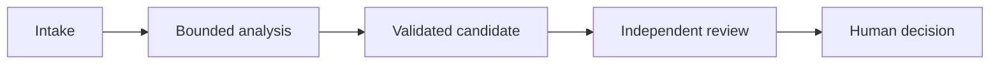

# Architect Foundations 场景包

为一个原创场景完成此包，再为其余五种公开上下文类别分别写出差异。用证据替换方括号中的提示。

## 1. 场景边界

```text
场景 ID：
公开上下文类别：
支持的决策：
用户和受影响人群：
允许的操作：
禁止的操作：
输入来源与敏感度：
延迟与请求量：
故障后果：
人工决策权限：
```

## 2. Agent 架构与编排

### Dependency graph



| 任务 ID | 独立上下文的原因 | 前置条件 | 允许工具 | 完整 | 部分 | 阻塞 |
|---|---|---|---|---|---|---|
| [任务] | [隔离、专门化、并行或审核] | [ID] | [名称] | [门禁] | [命名缺口] | [所需状态] |

```text
确定性前置条件：
自适应决策：
并行度限制：
合并标识与冲突规则：
恢复、分叉和压缩策略：
```

## 3. 工具与 MCP 契约

| 工具或原语 | 使用场景 | 禁止使用场景 | 闭合输入 schema | 结果与错误 | 授权范围 | 副作用 |
|---|---|---|---|---|---|---|
| [名称] | [正向规则] | [反向规则] | [对象 schema] | [完整、部分、阻塞] | [范围] | [无或有边界写入] |

将每个输入边界以 `input_schema` 录入校验器包。它必须标明每个属性类型，只要求已声明的属性，并将 `additionalProperties` 设为 `false`。无参数工具仍使用闭合对象 schema，其 `properties` 和 `required` 数组为空。

```json
{
  "type": "object",
  "properties": {
    "case_id": {"type": "string"}
  },
  "required": ["case_id"],
  "additionalProperties": false
}
```

```text
MCP 服务器范围：
资源：
工具：
Prompt：
渐进式发现策略：
写入授权：
幂等性与对账：
机密配置：
```

## 4. Claude Code 配置与工作流

```text
根项目指引：
导入的指引：
路径特定规则和已测试 glob：
Skill：
命令：
Agent 和允许工具：
Hook 和强制不变量：
计划或访谈边界：
从团队策略排除的用户本地配置：
```

### 无头 CI

- [ ] 从干净提交和已声明输入开始。
- [ ] 使用带版本的项目配置。
- [ ] 有边界的只读审核工具。
- [ ] 输出带稳定 ID 的结构化发现。
- [ ] 分别运行确定性测试和策略门禁。
- [ ] 接收之前的发现 ID 以进行修复审核。
- [ ] 记录当前模型和运行时配置。

## 5. Prompt 与结构化输出

```text
评估标准：
边界示例：
Prompt 契约版本：
Schema 版本：
未知或不支持值的表示：
工具选择策略：
语法校验器：
Schema 校验器：
语义校验器：
来源校验器：
重试限制和反馈契约：
独立审核人的输入与输出：
批处理或实时决策：
```

## 6. 上下文管理与可靠性

```text
关键事实放置：
上下文预算：
清单位置与 schema：
草稿本生命周期：
Subagent 上下文边界：
压缩和恢复包：
工具输出精简规则：
完整、部分和阻塞状态传播：
来源字段：
来源冲突与日期规则：
内容类型提取与渲染检查：
置信度证据类别：
人工审核分层与随机样本：
升级负责人：
```

## 7. 故障样本

| ID | 注入的故障 | 检测 | 遏制 | 重试或升级 | 持久证据 | 负责人 |
|---|---|---|---|---|---|---|
| [故障] | [条件] | [信号] | [安全停止] | [规则] | [产物] | [角色] |

必需覆盖：

- [ ] 编排前置条件、部分结果或过期恢复。
- [ ] 工具校验、授权、冲突、超时或未知副作用。
- [ ] Claude Code 规则范围、权限、hook 或干净 CI 故障。
- [ ] Schema 有效但语义或来源失败。
- [ ] 丢失事实、来源冲突、内容类型或升级故障。

## 8. 架构决策

为每个主要选择完成一份记录。

```text
决策 ID：
背景与驱动力：
选择的方案：
被否决的备选：
接受的权衡：
证据：
变更触发条件：
负责人：
```

## 9. 跨场景差异

对包括主要场景在内的全部六种上下文重复填写。

```text
上下文类别：
保留的核心不变量：
新的来源或权限边界：
新的工具或 MCP 要求：
新的 Claude Code 配置要求：
新的输出与验证要求：
新的上下文与升级风险：
移除或新增的控制及原因：
```

## 10. 审核与移交

```text
决策负责人：
实施负责人：
独立审核人：
校验器结果：
发现 ID 与处置：
证据产物：
剩余风险与负责人：
回退方案：
发布边界：
模型、API、SDK、Claude Code 或 MCP 的变更触发条件：
下次验证日期：
```

发布建议：

- [ ] 因权限、政策、证据或架构修正未完成而阻塞。
- [ ] 可进行影子或只读试点。
- [ ] 可进行有边界的人工审核使用。
- [ ] 可进行明确命名的低后果自动化。

理由：

```text
[说明测试了哪些场景与故障、哪些不变量通过、还存在哪些不确定性，以及谁负责决策。]
```
