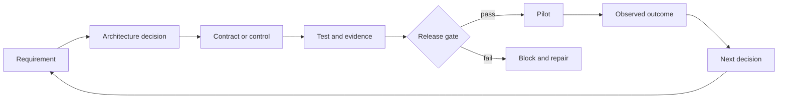

# Architect Professional 系统综合项目

> 构建一份证据包，让生产架构的每项决策都经得起审查。

**类型：** 构建
**语言：** Python
**前置要求：** [选择能承载工作的最小载体](../../01-claude-product-and-model-landscape/)、[把能力花在失败代价高的地方](../../02-model-selection-and-token-economics/)、[把请求变成可测试的合约](../../03-prompting-and-task-decomposition/)、[把每项事实放进正确的上下文](../../04-context-knowledge-memory-and-caching/)、[验证主张，而非置信度](../../05-output-evaluation-and-validation/)、[让能力受权责边界约束](../../06-governance-safety-and-responsible-use/)、[Messages API 是一台状态机](../../08-messages-api-and-application-lifecycle/)、[结构化输出是不可信的契约](../../09-structured-output-and-defensive-parsing/)、[工具循环是受控委托](../../10-tool-use-and-agentic-loops/)、[MCP 将能力与宿主解耦](../../11-mcp-server-design-and-integration/)、[Agent SDK 提供运行框架，权限另行控制](../../12-claude-agent-sdk-and-hooks/)、[安全边界在 prompt 之外](../../13-application-security-and-secrets/)、[Eval 将 Agent 行为变成工程证据](../../14-evals-testing-debugging-and-observability/)、[Claude Code 靠共享约束支持规模化协作](../../15-claude-code-for-development-teams/)、[多 Agent 编排与委派](../../16-multi-agent-orchestration-and-delegation/)、[Tool 合约、错误与渐进式发现](../../18-tool-contracts-errors-and-progressive-discovery/)、[业务发现、需求与 SLA](../../22-business-discovery-requirements-and-slas/)、[端到端架构与价值取舍](../../23-end-to-end-architecture-and-value-tradeoffs/)、[RAG、检索与数据流水线](../../24-rag-retrieval-and-data-pipelines/)、[集成协议、身份与最小权限](../../25-integration-protocols-identity-and-least-privilege/)、[生产可观测性、延迟与成本](../../26-production-observability-latency-and-cost/)、[企业治理、合规与人工审核](../../27-enterprise-governance-compliance-and-hitl/)、[利益相关方沟通、ADR 与生命周期责任](../../28-stakeholder-communication-adrs-and-lifecycle/)
**预计时间：** 约 8 至 12 小时

## 学习目标

- 为生产 Claude 系统交付从发现到运维的架构
- 论证模式、模型、上下文、RAG、集成与控制决策
- 用明确门禁证明质量、延迟、成本、安全性与信息安全
- 打包治理、发布、运行手册和生命周期责任
- 面向管理层、工程、控制和运维受众陈述同一项决策

## 任务

为一家跨区域运营的公司设计受治理的企业客服问题解决系统。

当前团队每周处理 40,000 张工单，其中大多数与账单和配送有关。首次响应时间中位数为 11 分钟。
政策每周都会在文档和内部系统中更新，审核发现引用不一致，之前的自动化还曾超出员工权限执行
退款。

拟议系统可以分类工单、检索现行政策、读取有边界的账户上下文、起草回复并建议操作，但不得删除
账户。执行退款需要明确权限和当前有效的人工审批。公司还要求分阶段发布、质量可衡量、按区域
处理数据，并把运维工作移交给客服平台团队。

请在这些约束下选出最佳系统，并用证据证明它已就绪。

## 必需交付物

使用 `outputs/architecture-packet-template.md` 模板。架构包必须包含十项相互关联的产物。

### 1. 发现简报

定义结果、基线、目标、护栏、用户、当前工作流、数据、权限、假设和非目标。

至少区分：

- 首次响应时间与总解决时间
- 系统完成与符合政策的任务成功
- 建议与执行权限
- 内部目标与合同承诺
- 已知事实与估算

### 2. 架构方案与 ADR

至少比较：

1. 检索辅助起草加完整人工审核
2. 包含有边界模型步骤的确定性工作流
3. 使用自适应工具的 agent

选择一项，记录证据、后果、被否决的备选方案和逆转条件。若使用多个 agent，要论证每个上下文
边界或独立审核人的必要性。组件更多不会提高得分。

### 3. 端到端系统视图

为以下内容创建 Mermaid 图：

- 系统上下文
- 数据与身份流
- 普通工单的处理时序
- 高风险退款的处理时序
- 部署与责任归属
- 故障与部分结果路径

每条外部边都必须说明 schema、身份、超时、重试、证据和负责人。

### 4. 模型、Prompt 与上下文计划

划分任务类别，并为每一类定义模型选择标准，包括质量、延迟、成本、上下文和思考需求。产品事实
必须带验证日期，不能直接固化在设计中。

设计内容包括：

- 系统指令与用户指令的边界
- 需要保持判断一致时使用的 few-shot 示例
- 稳定前缀与 prompt 缓存方案
- 上下文裁剪和压缩
- 结构化输出和语义验证
- prompt 与模型版本管理

### 5. 知识与 RAG 设计

明确来源负责人、解析方式、chunk 形态、元数据、稀疏或稠密检索、过滤、重排、上下文组装、
溯源信息、来源冲突、新鲜度、版本激活和回滚。

用正常、模糊、过期、未授权和对抗案例评估检索，并分别衡量检索质量与回答质量。

### 6. 集成与身份设计

根据需求选择直接 API、CLI、MCP 或 agent-to-agent 边界。在工具发现、schema、凭证和操作各层
落实最小权限。

退款审批必须绑定身份主体、金额、账户、原因、过期时间和单次使用限制。还要为校验、授权、
冲突、限流、依赖和超时定义结构化错误。

### 7. 评估与生产证据

建立有代表性的 golden set 和混合评估计划，至少覆盖：

- 检索召回率和新鲜度
- 主张支持度和引用覆盖率
- 政策遵循情况和完整性
- 工具和授权执行轨迹
- 防止不安全操作
- P50 和 P95 延迟
- 每项被接受任务的成本
- 审核人的一致性与耗时
- 高风险、区域或语言切片

比较基线与拟议系统，并定义不能被平均分抵消的硬门禁。

### 8. 治理与人工审核

产出风险登记册、数据地图、控制矩阵、审核设计、公平性计划、申诉路径、事故证据计划和重大变更
触发条件。

明确哪些问题需要安全、隐私、法律、合规、财务或领域负责人批准。架构师不能代替这些负责人
声称系统符合法律要求。

### 9. 发布与运维

规划影子评估、canary、受控扩展、回滚、仪表盘、告警、运行手册、容量、依赖故障和审核队列行为。

每项告警必须有负责人和对应操作，每个生产版本都必须能回滚到已知安全版本。针对过期政策、
授权故障、通过工单发起的 prompt 注入和评估器漂移进行桌面演练。

### 10. 利益相关方与移交包

准备：

- 一页管理层决策简报
- 产品工作流和采用计划
- 工程契约索引
- 安全和隐私控制摘要
- 运维就绪与移交清单

接收团队必须在验收前演示监控、安全关闭、回滚、评估和事故升级。

## 架构方法



整份架构包沿用同一条证据链。组件如果无法追溯到需求，就要重新判断它是否必要；需求如果没有
对应控制或测试，架构仍不完整；测试如果不影响发布决策，就只是一份报告。

## 动手构建

## 交互实验

```figure
32-architect-professional-readiness
```

使用系统就绪看板连接需求、决策、控制、证据、发布门禁、试点结果和生命周期负责人。无论加权就绪分数如何，硬授权、安全和回滚故障都必须可见。

## 实践实验

分别注入需求未通过、硬控制未验证、评估门禁失败和回滚演练失败，再由对应负责人修复。

## 交付产物

最终交付包括模板、完成的 [`outputs/reference-architecture-packet.md`](../outputs/reference-architecture-packet.md)、填写完成的 [`outputs/demo-readiness-report.json`](../outputs/demo-readiness-report.json) 和 [`outputs/scored-rubric.md`](../outputs/scored-rubric.md)。参考架构在其中列出的 live 硬门禁和移交证据通过前，不得发布到生产环境。

## 验证

Python 实验验证架构包结构，不判断业务决策是否正确。它捕获缺失负责人、不可测量需求、未验证硬控制、失败评估门禁、缺少回滚和没有逆转规则的决策。

```bash
cd certifications/claude/lessons/32-architect-professional-system-capstone/code
python3 main.py
python3 -m unittest discover tests -v
```

### 第 1 步：编码需求

每个 `Requirement` 有类别、可测试陈述、可测量标志和负责人；在你的包中用明确测量契约替代该标志。

### 第 2 步：编码决策

每个 `Decision` 记录背景、选择、被否决方案、后果、逆转条件和负责人。没有备选的建议无法展示权衡判断。

### 第 3 步：编码控制

每个 `Control` 命名风险、类别、负责人、证据、验证状态和是否为硬发布门禁。失败硬门禁会阻止发布，不受平均就绪度影响。

### 第 4 步：评估门禁

`EvaluationGate` 支持最小、最大和相等阈值，用于质量、延迟、成本和零容忍控制结果。真实门禁还需置信区间、样本要求和分段覆盖。

### 第 5 步：作出发布决策

`release_decision` 返回所有发现和阻塞项数量。玩具实现会报告遗漏的非目标，但不会因此阻塞；你的
审核委员会可以把它设为门禁。

复现报告并运行全部确定性门禁。六道题测验用于检查个人架构判断。

## 综合项目关联

完成的十产物包、答辩、演练和被接受的移交构成 Architect Professional 综合项目提交物。

## 架构答辩

在 20 分钟内展示该包，然后回答：

1. 为什么这个模式比最有竞争力的被否决方案更简单？
2. 每次模型和 agent 调用分别由哪项需求支撑？
3. 检索结果不足或互相冲突时，系统如何处理？
4. 哪个身份到达每项工具，权限如何检查？
5. 哪些证据会阻止发布？
6. 如何证明价格较低的方案按每个成功结果计算仍然更便宜？
7. 审核人能看到什么、决定什么，又能升级哪些问题？
8. 部署前需要重新核验哪些产品细节？
9. 每个来源、控制、指标、告警和事故分别由谁负责？
10. 哪些证据会让你推翻当前架构决策？

回答必须引用产物和证据。仅仅说明“模型有能力”不构成答辩。

## 评分规则

| 领域 | 权重 | 掌握证据 |
|---|---:|---|
| 解决方案设计 | 17 | 方案符合需求；分解和反馈明确 |
| 模型、prompt、上下文 | 13 | 选择和复用遵循测量的权衡 |
| 集成 | 19 | RAG、协议、身份和最小权限一致 |
| 评估与优化 | 16 | 代表性测试与运维信号驱动发布 |
| 治理与风险 | 14 | 数据、控制、审核、公平和批准有负责人 |
| 利益相关方生命周期 | 14 | 决策转化为交付、采用、移交和变更 |
| 开发者运维 | 7 | 团队配置、调试、运行手册和所有权可用 |

这份规则用于自审和独立审核，属于课程工具，并非官方考试评分模型。

## 考试决策模式

Professional 考试考查生命周期判断。多个方案都合理时，应选择能在正确系统边界处理既定约束，
并产出可供另一位负责人验证的证据的方案。

结构性优先级：

- 自动化前先澄清。
- 防护前先最小化。
- 生成前先检索和过滤。
- 在执行时授权。
- 验证语义主张，而非只验证语法。
- 评估完整轨迹和最终状态。
- 遇到硬控制即阻塞。
- 渐进式发布。
- 在变更和退役中指定负责人。

## 常见综合项目故障

### 没有决策的精美图

补充需求、备选、后果和逆转条件。

### 没有证据的长控制清单

为每个控制指定负责人、测试、结果、失败响应和审核触发条件。

### 只含理想路径的评估

增加模糊、过期数据、冲突来源、prompt 注入、授权故障、工具超时、高风险切片和审核人超载。

### 没有容量的人工审核队列

估计量、时间、资质、SLO、回退和升级。

### 没有恢复证明的移交

运行演练。运维团队应能在架构师不逐步讲解的情况下恢复已知安全状态。

## 练习

1. 用受监管的文档分析工作流替换支持场景，识别变化的控制和负责人。
2. 向 `EvaluationGate` 添加统计置信度和最小样本量。
3. 在机器可读包中将授权和过期来源控制设为硬门禁。
4. 让独立审核人找出五个没有测试或负责人的需求。
5. 在模拟金丝雀回归后记录一次真实的逆转决策。

## 关键术语

| 术语 | 人们的说法 | 实际含义 |
|---|---|---|
| 架构包 | 很长的设计文档 | 相连的决策、契约、证据、控制、所有权和恢复 |
| 硬门禁 | 高权重指标 | 无论平均数如何都阻止发布的条件 |
| 就绪 | 代码完成 | 已证明系统满足需求，并能在故障发生时安全运维 |
| 架构答辩 | 演示技巧 | 以证据支持的选择、后果和被否决方案说明 |
| 运维负责人 | 部署团队 | 对 SLO、事故、变更和退役负责的角色 |

## 延伸阅读

- [Claude Certified Architect Professional 考试指南](https://everpath-course-content.s3-accelerate.amazonaws.com/instructor%2F6nizmqk8tpzpfjvt6qmmav7rh%2Fpublic%2F1783542810%2FClaude+Certified+Architect+%E2%80%93+Professional+Exam+Guide.pdf)
- [Claude Platform 文档](https://platform.claude.com/docs/en/home)
- [构建高效的 agent](https://www.anthropic.com/research/building-effective-agents)
- Architect Professional 路线的每一课
