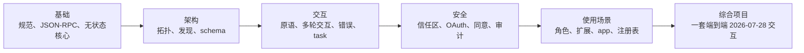

# MCPA 认证课程

> 通过构建考试所描述的协议，掌握考试真正考查的判断力。

**状态：** 本地预览
**指南版本：** 1.0
**指南生效日期：** 2026 年 9 月
**最后核验：** 2026-09-24

这套免费课程面向 Agentic AI Foundation 推出的 Model Context Protocol Associate（MCPA）考试；考试由 Linux Foundation Training and Certification 交付。

| 考试 | 认证 | 级别 | 时长 | 费用 | 核心路线 |
|---|---|---|---:|---:|---:|
| MCPA | Model Context Protocol Associate | 入门 | 90 分钟 | 250 美元 | 34 课 |

考试采用在线监考和选择题形式，对齐 2026-07-28 版 Model Context Protocol 规范；认证有效期两年，包含一次重考机会，报名资格窗口为十二个月。官方未公布正式考试题量和通过分数，所以本课程的三套 60 题模拟卷只是原创练习，练习百分比不能预测正式考试结果。MCPA 页面写明时长为 90 分钟，发布公告则写了 120 分钟。项目政策可能变化，预约前请在官方页面确认价格、形式、时长和资格要求。考试事实及检索日期记录在 [research/source-verification-ledger.md](research/source-verification-ledger.md)。

## 在 GitHub 中使用 AI 导师学习

这是一套 AI 原生课程。Claude Code、Codex、ChatGPT、Cursor 或其他 agent 可以按路线授课、运行仓库内实验、审阅你完成的产物、主持课程测验，并从保存的进度继续。

先阅读 [GitHub 学习指南](GETTING_STARTED.md)，或安装可移植的认证导师 skill：

```bash
npx skills add fancyboi999/ai-engineering-from-scratch-zh
```

然后让 agent 运行：

```text
/mcpa-certification
```

克隆仓库后，本地 Claude Code 会从 `.claude/skills/` 自动发现同一 skill。不支持斜杠命令的 harness 可以直接读取 `GETTING_STARTED.md` 和导师 skill。学习进度保存在 `MCPA-CERTIFICATION.md`，学习者产物保存在 `learning-artifacts/mcpa/`。仓库内置 `outputs/` 是参考产物，绝不能覆盖。本课程不进入 EPUB/PDF 图书构建流程。

## 你会构建什么

这条从第一性原理出发的单一路线，会逐步组装一套可工作的 MCP 交互：



每课都提供仅依赖 Python 标准库的可运行 MCP mock、测试套件、课程测验和可复用产物。课程把无状态的 2026-07-28 版本作为当前规范，`scripts/check_mcpa_wire.py` 会检查每个实验的 transcript 是否符合该线级结构。协议事实、主要来源和编写期间解决的来源冲突记录在 [research/mcp-2026-07-28-brief.md](research/mcp-2026-07-28-brief.md)。路线包含一套 30 题诊断和三套原创全真模拟卷，各有不同侧重，题目分布按公开蓝图权重做实用取整；它们不会模仿或复现真实考题。

MCPA 蓝图包含五个领域：

| 领域 | 权重 |
|---|---:|
| MCP 基础 | 16% |
| 架构与组件 | 14% |
| 交互与执行 | 26% |
| 安全与治理 | 24% |
| 使用场景与生态 | 20% |

## GitHub 课程索引

导师从 track 文件读取路线顺序。完整索引也方便直接在 GitHub 浏览每课。

| # | 课程 |
|---:|---|
| 00 | [MCPA 蓝图是学习预算，不是检查清单](lessons/00-mcp-exam-strategy/) |
| 01 | [阅读 MCP 规范](lessons/01-reading-the-specification/) |
| 02 | [MCP 解决的集成问题](lessons/02-the-integration-problem/) |
| 03 | [JSON-RPC 信封与元数据](lessons/03-json-rpc-and-meta/) |
| 04 | [MCP 的无状态核心](lessons/04-the-stateless-core/) |
| 05 | [区分现代 MCP 服务端与旧版服务端](lessons/05-protocol-eras-and-compatibility/) |
| 06 | [宿主、客户端和服务端：MCP 的进程拓扑](lessons/06-hosts-clients-and-servers/) |
| 07 | [发现服务端并协商能力](lessons/07-discovery-and-capability-negotiation/) |
| 08 | [工具定义中的契约](lessons/08-tool-schemas-and-structured-content/) |
| 09 | [像审阅者一样阅读服务端 manifest](lessons/09-reading-server-manifests/) |
| 10 | [模型交互流](lessons/10-model-interaction-flow/) |
| 11 | [工具原语：调用动作并读取结果](lessons/11-the-tools-primitive/) |
| 12 | [资源：无状态服务端的可寻址内容](lessons/12-the-resources-primitive/) |
| 13 | [Prompt 模板与参数补全](lessons/13-prompts-and-completion/) |
| 14 | [多轮请求与 elicitation](lessons/14-multi-round-trip-requests-and-elicitation/) |
| 15 | [已弃用但未移除：Roots、Sampling 与 Logging](lessons/15-deprecated-client-features/) |
| 16 | [订阅流：通知、进度与取消](lessons/16-notifications-and-subscriptions/) |
| 17 | [工具调用生命周期](lessons/17-tool-invocation-lifecycle/) |
| 18 | [请求失败的两种方式](lessons/18-error-handling/) |
| 19 | [传输与 HTTP 标头契约](lessons/19-transports-and-http-headers/) |
| 20 | [缓存新鲜度与基于 cursor 的分页](lessons/20-caching-and-pagination/) |
| 21 | [长任务与 Tasks 扩展](lessons/21-long-running-work-and-tasks/) |
| 22 | [MCP 交互中的信任区](lessons/22-trust-boundaries/) |
| 23 | [为 MCP 服务端授权访问](lessons/23-oauth-authorization/) |
| 24 | [向授权服务器证明客户端身份](lessons/24-client-registration-and-identity/) |
| 25 | [同意与最小权限](lessons/25-consent-and-least-privilege/) |
| 26 | [MCP 工具调用的风险与安全控制](lessons/26-risk-and-safety-controls/) |
| 27 | [用一个 trace id 串起审计与可观测性](lessons/27-auditability-and-observability/) |
| 28 | [每个 MUST 都要有责任人](lessons/28-roles-and-adoption/) |
| 29 | [为任务选择合适的 MCP 形态](lessons/29-operational-use-cases/) |
| 30 | [扩展框架](lessons/30-the-extensions-framework/) |
| 31 | [对话中的交互界面](lessons/31-mcp-apps/) |
| 32 | [发现、路由与信任服务端](lessons/32-registry-gateways-and-sdk-tiers/) |
| 33 | [端到端阅读一套 MCP 交互](lessons/33-mcpa-capstone-readiness/) |

## 独立性声明

这是独立社区课程，与 Agentic AI Foundation 或 Linux Foundation 没有隶属、认可、赞助或授权关系，也不包含真实考题。官方考试页面与现行项目政策始终优先。
