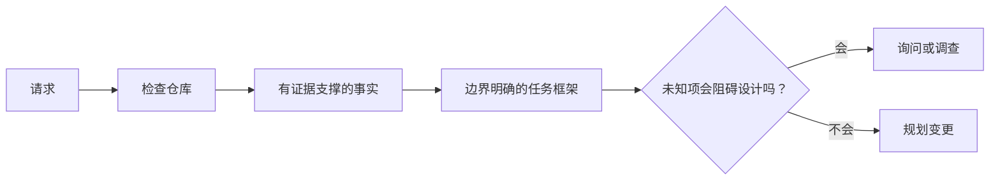

# 在 agent 写代码前框定任务

> 编码 agent 能很快完成清晰的任务，也能很快完成不清晰的任务。速度相同，代价不同。

**类型：** Learn + Build
**语言：** Python（标准库）
**前置要求：** 阶段 14 第 31 和 36 课
**预计时间：** ~60 分钟

## 学习目标

- 在编辑前把请求转成边界清晰的任务框架。
- 区分仓库事实、假设和未决问题。
- 定义允许路径、禁止路径和验收证据。
- 判断何时已完成足够的侦察，可以开始工作。

## 代价高昂的失败

“为重复邮箱加保护”听起来很具体，其实不是。唯一性应该放在 API、领域服务还是数据库？比较是否区分大小写？哪种错误形状已经是公开契约？允许迁移吗？哪项测试能证明行为？

有能力的 agent 会用看似合理的选择填补这些空白。这恰恰危险：实现可以干净、测过，却仍与系统不兼容。

因此，编码 agent 工作的第一单位不是一次编辑，而是由仓库证据支撑的任务框架。

## 任务框架

一个有用的框架包含六个字段：

| 字段 | 问题 |
|---|---|
| 目标 | 哪个可观察行为必须改变？ |
| 仓库事实 | 你在代码、测试、配置或历史中核实了什么？ |
| 允许路径 | 改动可以落在哪里？ |
| 禁止路径 | 哪些内容必须保持不动？ |
| 验收证据 | 哪些命令或观察能证明目标达成？ |
| 未知项 | 哪些决定仍需要证据或人工判断？ |

事实需要凭据。只有能指出既有测试或处理器时，“API 对重复项使用 409”才是事实。文件路径和行号已经足够；涉及行为时，命令结果更好。



## 侦察是在寻找约束

不用读完整个仓库。搜索会约束这次改动的接触面：

1. 当前行为及其调用方。
2. 最接近的既有测试。
3. 公开契约或序列化形状。
4. 约束该路径的项目说明。
5. 构建和验证命令。
6. 能揭示本地模式的相似已完成改动。

当每个计划中的决定都有证据支撑、已被明确委托，或列为未知项时就停下。超过这个点继续阅读，往往是在回避行动。

## 未知项不是失败

未知项是受控的缺口；假设则是对这个缺口不受控的回答。

给每个未知项分类：

- **可发现：** 仓库或运行中的系统能回答它。
- **可决定：** 任务契约授予 agent 选择的权限。
- **人工：** 这个选择会改变产品行为、成本、风险或公开兼容性。
- **延后：** 选择不在这个切片内，属于非目标。

agent 应继续处理可发现和已委托的未知项。在某个选择被埋进代码前，遇到人工未知项就应暂停。

## 实现之前先写验收

在补丁之前写下证明。证明可以是：

- 聚焦的单元或集成测试命令；
- 指定视口和预期状态的浏览器旅程；
- 线上的请求与精确响应契约；
- 带阈值的性能测量；
- 确认没有无关文件改动的范围检查。

“测试通过”不是证明计划。写出权威测试及它支撑的断言。

## 动手构建

实验创建 `TaskFrame`，验证它的边界和证据，并写入 `outputs/task-frame.md`。

从本课目录运行：

```bash
python3 code/main.py
PYTHONPATH=code python3 -m unittest discover code/tests -v
```

用四种方式破坏示例：移除目标、移除事实凭据、让允许路径和禁止路径重叠，以及移除验收命令。验证器应以不同理由拒绝每个框架。

## 在真实仓库中使用

让 agent 编辑前：

1. 把目标写成行为，而不是文件改动。
2. 记录两三条带精确证据的事实。
3. 写出最小的允许路径集。
4. 明确写出负空间。
5. 写下闭合任务的命令或观察。
6. 列出你尚未赢得答案的决定。

框架应能放进一屏。放不下时，任务可能含有多个可独立验证的改动。

## 练习

1. 为你某个仓库的真实 bug 建立框架，但不要提出方案。
2. 找出框架中实际上属于假设的一条主张，用证据替换它。
3. 加入一个答案会改变公开契约的人工未知项。
4. 把一个宽泛的允许路径拆成最小安全集合。
5. 在验收证据中加入范围凭据。

## 延伸阅读

- [Nuseibeh and Easterbrook, Requirements Engineering: A Roadmap](https://www.cs.toronto.edu/~sme/papers/2000/ICSE2000.pdf)，了解如何把实现锚定在现实目标和不断演变的约束上。
- [Yang et al., SWE-agent: Agent-Computer Interfaces Enable Automated Software Engineering](https://arxiv.org/abs/2405.15793)，了解编码 agent 周边接口如何影响其效果的证据。

## 拿去用

保留 `outputs/task-frame.md`。下一课会把它变成由证据支撑的执行计划。
