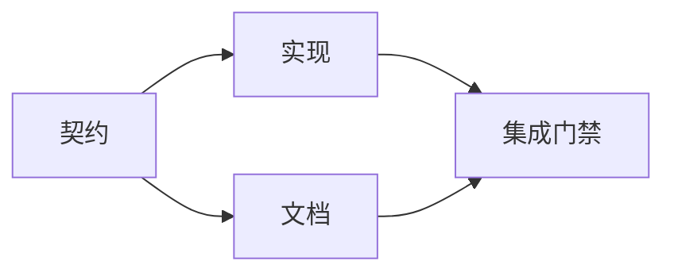

# 制定由证据支撑的执行计划

> 计划不是更好看的待办清单。它是一张依赖图：每项改动都有理由，每个终点都有证明。

**类型：** Learn + Build
**语言：** Python（标准库）
**前置要求：** 阶段 14 第 43 课
**预计时间：** ~65 分钟

## 学习目标

- 把任务框架转为带证据和证明的工作项。
- 将顺序建模为依赖，而非散文式步骤。
- 在编辑前发现缺失事实、未知依赖和环。
- 区分可并行的步骤与必须等待的步骤。

## 为什么 agent 计划会失败

薄弱的计划只是用将来时复述请求：

1. 更新 API。
2. 添加测试。
3. 更新文档。

这份列表没有说明发现了什么、为何这些文件正确、哪个契约应先变，或者哪些事可以并发。agent 即使遵循每一步，仍可能制造返工。

强计划为每个工作项作出五项承诺：

| 承诺 | 作用 |
|---|---|
| 标识符 | 用于依赖和交接的稳定引用 |
| 改动 | 最小的行为或契约变更 |
| 证据 | 证明改动合理的仓库事实 |
| 依赖 | 开始前必须成立的工作 |
| 证明 | 闭合该项的精确检查 |

## 先规划契约，再规划实现

多个接触面依赖同一行为时，先定义行为。测试、实现、文档和集成都能共享一个契约，而不是各自发明四个版本。



这张图显出安全的并发：契约固定后，实现与文档可以同时进行；集成要等两者完成。

## 证据会改变计划

仓库证据不是装饰，它应当有能力改变工作安排：

- 既有辅助函数取消了新增抽象的计划。
- 兼容性测试迫使你加入迁移步骤。
- 部署约束把 schema 变更移到另一项任务。
- 公开响应类型改变了实现和文档的先后顺序。

若证据不能改变计划，它大概不是这项决定的证据。

## 为中断而设计

编码 agent 会话可能意外结束。可恢复的计划应让工作项足够小，以便另一会话能确定：

- 哪一项已完成；
- 哪个证明已运行；
- 哪些产物已改变；
- 哪些依赖现在已解除；
- 下一项安全的工作是什么。

不要只把状态写在聊天中的勾选框里。把计划和工作放在一起。

## 计划验证

执行前遇到以下情况就拒绝计划：

- 标识符重复；
- 工作项没有证据；
- 工作项没有证明；
- 依赖指向未知项目；
- 图中存在环；
- 在相关不确定性解决前就发生第一项不可逆操作。

前五项是机械检查，最后一项需要判断，应该明确标出。

## 动手构建

`code/main.py` 对工作项建模，验证凭据，使用拓扑排序计算执行波次，并写入 `outputs/evidence-plan.json`。

运行：

```bash
python3 code/main.py
PYTHONPATH=code python3 -m unittest discover code/tests -v
```

示例会产生三个波次：先定义契约；实现和文档同时进行；最后是集成关卡。

## 与编码 agent 一起使用

要求 agent 在改文件前产出计划，从三个方面审阅：

1. 每条路径和行为主张都有仓库凭据。
2. 每一项都有一个清晰的完成证明。
3. 图会把昂贵或不可逆的工作推迟到它依赖的不确定性解决之后。

批准这份计划，而不是一句含糊的“我会小心”。

## 练习

1. 加入一项需要明确人工批准的迁移工作。
2. 制造一个环，并解释其背后隐藏的产品分歧。
3. 拆分一个带两条证明命令的工作项。
4. 添加一个可在第二波运行、且不触碰任一既有分支的工作项。
5. 在保持 JSON 为真相源的前提下，把计划渲染为 Markdown。

## 延伸阅读

- [Nuseibeh and Easterbrook, Requirements Engineering: A Roadmap](https://www.cs.toronto.edu/~sme/papers/2000/ICSE2000.pdf)，了解目标、规格、协商与演进之间的迭代关系。
- [Barry Boehm, A Spiral Model of Software Development and Enhancement](https://dl.acm.org/doi/10.1145/12944.12948)，了解围绕风险消解而不是固定线性顺序安排开发。

## 拿去用

保留 `outputs/evidence-plan.json`。下一课会把它作为委派契约。
