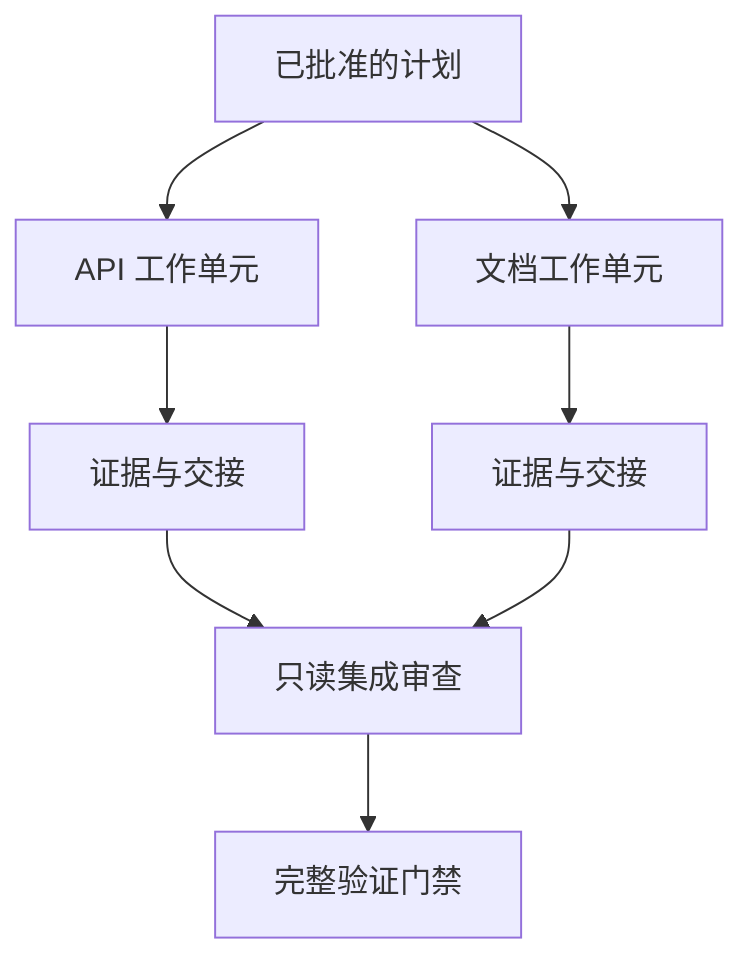

# 通过隔离与合并契约委派 agent 工作

> 并行 agent 只有在工作相互独立时才能节省墙钟时间；否则，它们会把一个清晰任务变成协调问题，并更快地失败。

**类型：** Learn + Build
**语言：** Python（标准库）
**前置要求：** 阶段 14 第 39 和 44 课
**预计时间：** ~70 分钟

## 学习目标

- 根据真实独立性判断委派是否合理。
- 为每位执行者指定独占文件所有权和明确证明。
- 根据依赖计算执行波次。
- 设计安全合并 agent 工作的契约。

## 并行性测试

不要因为可用 agent 更多就委派。至少满足以下一项时才委派：

- 两项调查能独立回答不同未知项；
- 两项实现拥有不相交的文件和契约；
- 审阅者可以检查已完成产物而不改它；
- 缓慢的外部检查可在本地工作继续时运行。

当 agent 需要同一文件、同一个未解决决定或同一可变环境时，保持串行。

## 工作单元是一份契约

每个被委派的单元都需要：

| 字段 | 含义 |
|---|---|
| 目标 | 一个可观察结果 |
| 负责人 | 一位对结果负责的执行者 |
| 路径 | 独占写入所有权 |
| 依赖 | 开始前已完成的单元 |
| 证明 | 返回给集成者的精确证据 |
| 交接 | 改动文件、作出的决定、剩余风险 |

“处理后端”不是工作单元。“在 `app/accounts.py` 实现重复检查，并用聚焦的账户测试证明它”才是。

## 隔离有三层

1. **文件系统隔离：** 独立 worktree 或沙箱避免意外共享编辑。
2. **所有权隔离：** 契约避免两位执行者有意编辑同一路径。
3. **状态隔离：** 独立日志和输出避免一位执行者覆盖另一位的证据。

文件系统隔离不能解决所有权问题。两个干净 worktree 仍可能产生冲突设计。开始工作前，合并契约必须解决共享接口。



## 集成者不重做工作

集成者应当：

1. 确认每份交接符合分配范围；
2. 阅读证明输出，而不只看执行者总结；
3. 按依赖顺序合并改动；
4. 运行完整的跨单元关卡；
5. 拒绝隐蔽的范围扩张；
6. 将冲突记录为新决定，而非悄悄编辑。

若集成需要重写执行者的大部分成果，原先的拆分就是错的。

## 人与 agent 的角色

委派不会消除人工判断。人仍负责会改变公开行为、风险、权限或不可逆成本的选择。agent 可以负责有界的调查、实现、验证和审阅。

这就是校准后的自主性：证据充分且可回滚时系统授予自由；后果高时要求检查点。

## 动手构建

实验检查路径重叠，验证依赖，计算安全执行波次，并写入 `outputs/delegation-plan.json`。

运行：

```bash
python3 code/main.py
PYTHONPATH=code python3 -m unittest discover code/tests -v
```

把文档单元改为拥有 `app/`。该计划应被阻止，因为这个父路径与 API 单元重叠。

## 练习

1. 将一次真实改动分解为两个独立工作单元和一个集成者。
2. 找出一个看似独立的并行拆分，指出共享的决定。
3. 加入一个只读研究执行者，输出为事实表。
4. 加入合并关卡，检查最终改动文件集是否符合所有单元契约。
5. 为依赖失效的执行者定义取消规则。

## 延伸阅读

- [Reid Smith, The Contract Net Protocol](https://doi.org/10.1109/TC.1980.1675516)，早期对分布式任务分配与结果报告的正式论述。
- [Eric Horvitz, Principles of Mixed-Initiative User Interfaces](https://dl.acm.org/doi/10.1145/302979.303030)，了解何时该由自动化行动、何时应把控制权交还给人。

## 拿去用

保留 `outputs/delegation-plan.json`。它记录拆分为何安全、每条路径归谁，以及集成必须收到什么证明。
