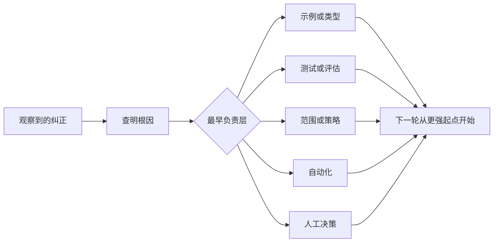

# 把每次 agent 纠正变成系统改进

> 只活在聊天里的纠正只修好一次运行。把它提升为测试、边界、示例或工具，才能改善之后的每次运行。

**类型：** Learn + Build
**语言：** Python（标准库）
**前置要求：** 阶段 14 第 37 到 41 课
**预计时间：** ~65 分钟

## 学习目标

- 将对 agent 的纠正转化为持久控制。
- 把每项控制放在最早能防止复发的层。
- 用稳定指纹去重重复经验。
- 淘汰不再保护真实风险的控制。

## 纠正就是证据

当你对 agent 说“不要编辑那个文件”，你学到的是范围边界不可执行。当你说“这个输出形状不对”，你学到的是缺少示例或测试。部署反复失败时，你学到环境知识应进入自动化。

把纠正视作对工作系统的观察，而非 prompt 编写失败。

## 提升到最早的有效层

按这个顺序处理：

| 反复失败 | 持久归宿 |
|---|---|
| 错误结果或回归 | 测试或评估 |
| 超出范围或不安全的动作 | 范围或权限策略 |
| 重复的设置或命令错误 | 自动化或工具 |
| 重复的输出格式错误 | 规范示例加验证器 |
| 含糊的本地惯例 | 带场景检查的说明 |
| 产品分歧 | 人工决策记录 |

越早的控制越便宜。阻止无效状态的类型，比稍后发现它的审阅评论更强；聚焦的测试，比要求 agent 记住的一段话更强。



## 棘轮记录

记录：

- 症状；
- 根因；
- 后果；
- 复发次数；
- 选定控制；
- 对控制的验证；
- 负责人；
- 复审或淘汰日期。

不要把每个一次性偏好都提升为规则。仅当复发或后果足以支撑永久复杂度时才提升纠正。

## 区分原因与症状

“agent 编辑了 README”是症状。可能的原因包括：

- 任务允许了仓库根目录；
- 文档被隐含视为安全；
- 计划把实现和文档打包在一起；
- 两位执行者有重叠的所有权。

每个原因都属于不同控制。只重复症状的规则，会在下一个稍有不同的案例里失效。

## 控制也会衰退

旧控制可能冲突、膨胀上下文，并编码已不存在的系统。出现以下情况时应移除或重写：

- 底层架构已改变；
- 有更强的可执行控制取代它；
- 有意义的时间窗口内失败没有复发；
- 控制带来的阻力超过它预防的风险。

目标不是最长的说明文件，而是能保住来之不易判断的最小系统。

## 动手构建

实验对纠正分类，将它们提升为控制，为重复项生成指纹，并写入 `outputs/feedback-ratchet.json`。

运行：

```bash
python3 code/main.py
PYTHONPATH=code python3 -m unittest discover code/tests -v
```

添加两条措辞不同但原因相同的纠正。改进归一化，让它们合并为一个控制，同时不合并无关失败。

## 练习

1. 从一次近期编码会话中取五条纠正，分类其真正负责人。
2. 用可执行测试替换一条散文规则。
3. 加入后果权重，使严重的首次发生可以立即提升。
4. 给实验输出增加负责人和淘汰日期。
5. 审阅一条既有 agent 说明，只有证明存在更强控制后才删除它。

## 延伸阅读

- [Basili, Caldiera, and Rombach, The Goal Question Metric Approach](https://www.cs.toronto.edu/~sme/CSC444F/handouts/GQM-paper.pdf)，了解如何将目标转为问题和可操作的测量。
- [Shinn et al., Reflexion](https://arxiv.org/abs/2303.11366)，了解如何利用反馈轨迹改善后续决定而不改变模型权重。
- [Madaan et al., Self-Refine](https://arxiv.org/abs/2303.17651)，了解任务循环中的迭代反馈和修订。

## 拿去用

保留 `outputs/feedback-ratchet.json`。它是 Agent 辅助工程路径的持久终点，也是未来工作台变更的输入。
