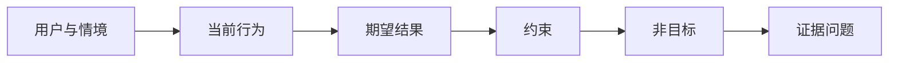

# 在选择产出前定义结果

> 实现越快，选错问题的代价越大。先塑造结果，才能让速度指向正确方向。

**类型：** Learn + Build
**语言：** Python（标准库）
**前置要求：** 无
**预计时间：** ~60 分钟

## 学习目标

- 不提方案地编写结果框架。
- 识别用户、情境、当前行为和期望变化。
- 明确约束和非目标。
- 在方案泄漏固化为范围前发现它。

## 产出不是结果

“构建一个事故助手”说的是产出，没有说明谁需要它、什么会改善、什么必须保持安全。

结果框架会这样表述：

> 当生产告警到达时，值班工程师在两分钟内识别故障服务和一项安全的下一步操作，同时诊断保持只读且可审计。

这个句子可由软件、runbook、数据修复或更小的界面改动来满足。它让团队关注结果，而不是某人首先想到的产物。

## 六部分框架

| 部分 | 问题 |
|---|---|
| 用户 | 谁直接经历问题？ |
| 情境 | 它何时何地发生？ |
| 当前行为 | 今天发生什么，包括变通做法？ |
| 期望结果 | 哪个可观察状态应改善？ |
| 约束 | 哪些安全、策略、成本或兼容性限制固定不变？ |
| 非目标 | 哪些诱人的相邻工作被排除？ |



## 发现方案泄漏

结果陈述在包含尚未由证据赢得的产品形式、界面、模型选择、框架或架构时，就泄漏了方案。

- “用户每周收到 AI 摘要”泄漏了摘要和频率。
- “用户在批准前理解账户变更”描述的是结果。
- “部署一个向量数据库”泄漏了基础设施。
- “审阅时可获得相关策略证据”描述的是能力。

兼容性确实固定技术时，约束可以点名技术；记录它为何固定。

## 约束保护结果

约束不是实现细节，而是现实世界目标的一部分：

- 诊断期间不写生产环境；
- 在事故时间预算内响应；
- 既有审计事件仍是权威；
- 不新增运行时依赖；
- 无障碍行为保持完整。

靠违反约束达成结果的构建，并没有达成结果。

## 非目标建立边界

非目标能防止一个有用切片变成平台。好的非目标足够具体，可以拒绝工作：

- 不自动修复；
- 不新增告警路由系统；
- 不取代事故指挥官；
- 本切片不做历史分析。

## 动手构建

实验验证 `OutcomeFrame` 并写入 `outputs/outcome-frame.json`。

```bash
python3 code/main.py
PYTHONPATH=code python3 -m unittest discover code/tests -v
```

把期望结果替换为“使用事故助手”。验证器应标出拟议产出泄漏进了结果。

## 练习

1. 把待办列表中的一个功能请求改写为结果框架。
2. 加入一项会改变可行方案的约束。
3. 加入两个让首个切片保持小的非目标。
4. 找出最早能证伪期望结果的观察。
5. 写出可满足同一结果的三种不同产出。

## 延伸阅读

- [Nuseibeh and Easterbrook, Requirements Engineering: A Roadmap](https://www.cs.toronto.edu/~sme/papers/2000/ICSE2000.pdf)，将现实世界目标视为软件工作的锚点。
- [Dardenne, van Lamsweerde, and Fickas, Goal-Directed Requirements Acquisition](https://doi.org/10.1016/0167-6423(93)90021-G)，了解如何把高层目标细化为约束和操作性需求。

## 拿去用

保留 `outputs/outcome-frame.json`。下一课会用它检验人们实际执行的工作流。
