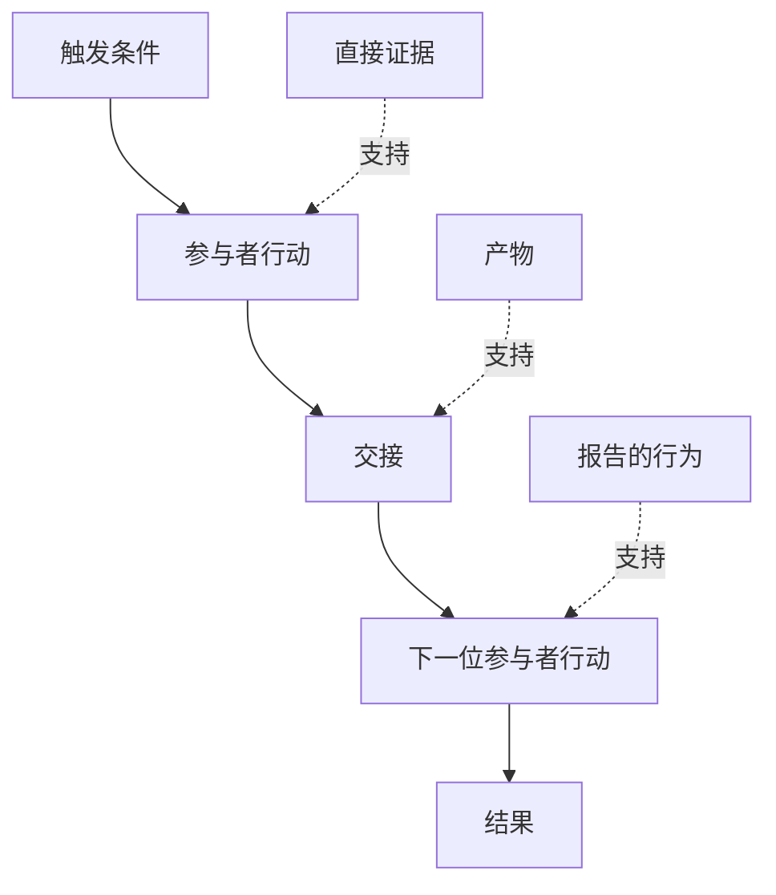

# 发现人们实际执行的工作流

> 需求不会等在会议里被收集。它们散落在行动、变通做法、记录和分歧之中。

**类型：** Learn + Build
**语言：** Python（标准库）
**前置要求：** 阶段 14 第 47 课
**预计时间：** ~70 分钟

## 学习目标

- 将当前工作流建模为带证据的有序行动。
- 区分直接观察与报告或推断出的行为。
- 定位摩擦、交接、权限和隐性状态。
- 让不确定主张保持可见，而不把它们变成需求。

## 从当前系统开始

不要从询问人们想要什么功能开始，先重建现在发生了什么。

每一步记录：

| 字段 | 示例 |
|---|---|
| 执行者 | 值班工程师 |
| 触发器 | 生产告警到达 |
| 动作 | 打开告警，然后搜索仪表盘 |
| 输入 | 告警载荷和部署记录 |
| 输出 | 候选服务和负责人 |
| 摩擦 | 在三个工具之间切换上下文 |
| 权限 | 事故指挥官批准写操作 |
| 证据 | 屏幕录制、事故日志、runbook |

工作流比屏幕大得多。它包括等待、复制粘贴、边路沟通、批准、错误恢复，以及人们已不再注意到的步骤。

## 证据有强弱

使用简单的证据阶梯：

1. **直接行为：** 观察、追踪、录制或系统事件。
2. **产物：** 工单、runbook、日志、表单或完成的输出。
3. **报告的行为：** 某人描述自己如何工作。
4. **推断：** 团队得出大概发生了什么的结论。

四者都有用，但只有前两项直接证明当前行为。给其余项打标签，避免置信度悄悄膨胀。



## 搜索四类事物

- **摩擦：** 重复劳动、延迟、重新输入或恢复。
- **隐性状态：** 带在记忆、聊天或个人笔记中的事实。
- **权限：** 被允许作出关键变更的人或系统。
- **例外：** 正常工作流不再正常的情况。

AI 功能常在交接和例外处失败，因为只塑造了 happy path。

## 不要把分歧平均掉

两位用户可能因为充分理由执行不同工作流。理解它们是否代表以下情况前，保留变体：

- 不同角色；
- 不同风险级别；
- 旧流程和当前流程；
- 专业水平差异；
- 真正的策略分歧。

平均后的工作流可能谁都描述不了。

## 动手构建

实验为每个工作流步骤保存证据，验证顺序与置信度，计算直接证据比例，并写入 `outputs/workflow-evidence.json`。

```bash
python3 code/main.py
PYTHONPATH=code python3 -m unittest discover code/tests -v
```

加入一条部署记录缺失的例外路径。保持主顺序不变，并记录分支从哪里开始。

## 练习

1. 不采访任何人，仅用日志重建一个工作流。
2. 访谈一名用户，为仍缺直接证据的每个主张做标记。
3. 加入一条权限边界和一个故障恢复步骤。
4. 建模两个工作流变体，不把它们合并。
5. 找出一项移除可见步骤、却让隐性工作原封不动的拟议功能。

## 延伸阅读

- [Nuseibeh and Easterbrook, Requirements Engineering: A Roadmap](https://www.cs.toronto.edu/~sme/papers/2000/ICSE2000.pdf)，尤其讨论了把需求获取视为解释、建模和验证，而非简单采集。
- [Gotel and Finkelstein, An Analysis of the Requirements Traceability Problem](https://doi.org/10.1109/ICRE.1994.292398)，了解为何保留需求与其来源的关系如此困难。

## 拿去用

保留 `outputs/workflow-evidence.json`。下一课会把观察到的摩擦和不确定性转成假设地图。
