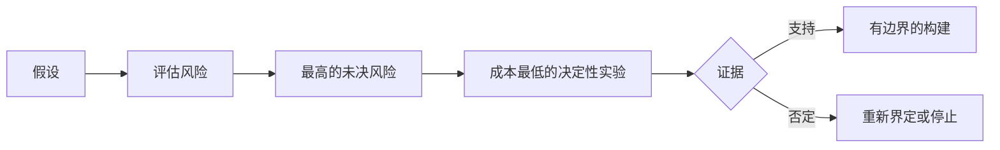

# 绘制假设地图，先化解风险最高的一项

> 路线图把不确定性藏进功能；假设地图则揭示：这些功能值得存在之前，什么必须为真。

**类型：** Learn + Build
**语言：** Python（标准库）
**前置要求：** 阶段 14 第 48 课
**预计时间：** ~65 分钟

## 学习目标

- 把拟议工作转为明确假设。
- 分别评估影响、不确定性和不可逆性。
- 按风险而非热情选择下一个实验。
- 用证据和决定取代已测试的假设。

## 每次构建都包含押注

一个事故工具可能依赖这些前提都成立：

- 告警上下文有足够信息识别服务；
- 工程师信任自己没有亲自推导的建议；
- 期望响应时间对运营确实重要；
- 能在不授予不安全权限的前提下访问所需数据；
- 工作流发生得足够频繁，值得维护。

这些不是实现任务，而是构建具有价值、可用、可行且安全的条件。

## 假设类别

| 类别 | 问题 |
|---|---|
| 价值 | 结果是否足够重要？ |
| 易用性 | 用户能否理解并据此行动？ |
| 可行性 | 系统能否在可用数据和约束下产出它？ |
| 可持续性 | 组织能否承受成本、所有权和运营？ |
| 安全性 | 它能否在不造成不可接受后果的情况下失败？ |

把假设写成可证伪的陈述。“功能有用”无法测试；“十位值班工程师中有八位能用只读结果更快识别正确服务”可以。

## 风险不是一个数字

实验用一到五的三个维度：

- **影响：** 假设为假时的损害。
- **不确定性：** 当前证据的薄弱程度。
- **不可逆性：** 承诺后才学习的代价。

示例分数将影响乘以不确定性，再加不可逆性。公式并不通用；目的在于迫使团队说明，为何某个未知项应先于另一个得到化解。



## 设计实验，而非确认仪式

有用的测试需要：

- 可能为假的主张；
- 人群或现实样本；
- 可观察结果；
- 结果前决定的阈值；
- 通过、失败和模糊证据各自对应的下一决定。

避免只证明团队能把这个想法做出来的测试。

## 可逆性改变顺序

后果高、不可逆的选择需要更早的证据。只读回放可以先于生产集成；临时适配器可以先于数据迁移；人工批准的建议可以先于自动动作。

构建的形状应跟随不确定性的形状。

## 动手构建

实验对假设排序，区分已测试和未决主张，选出最高的未决风险，并写入 `outputs/assumption-map.json`。

```bash
python3 code/main.py
PYTHONPATH=code python3 -m unittest discover code/tests -v
```

改变最高风险假设的证据，观察下一个实验如何随之变化。

## 练习

1. 为你想构建的一项功能写五个假设。
2. 加入功能列表遗漏的一项安全假设。
3. 定义一个会让你停止构建的阈值。
4. 用更便宜、决定性的测试替换一个大型实验。
5. 对比风险排序和路线图优先级，并解释不一致之处。

## 延伸阅读

- [Barry Boehm, A Spiral Model of Software Development and Enhancement](https://dl.acm.org/doi/10.1145/12944.12948)，了解在更深承诺前先化解不确定性的风险驱动开发周期。
- [Dardenne, van Lamsweerde, and Fickas, Goal-Directed Requirements Acquisition](https://doi.org/10.1016/0167-6423(93)90021-G)，了解如何在揭示障碍和约束的同时细化目标。

## 拿去用

保留 `outputs/assumption-map.json`。下一课会用它选择能产生决定性证据的最小切片。
