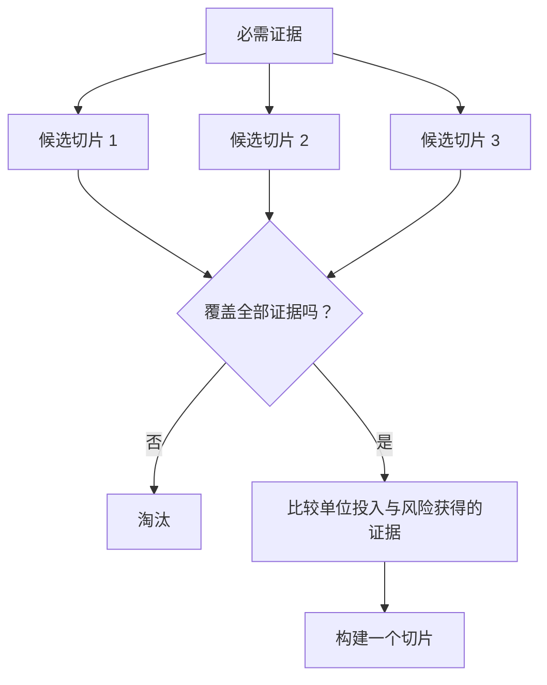

# 选择能改变决定的最小可测试切片

> 小只有在能证明重要事情时才有用。无法改变下一步决定的小构建，只是不完整。

**类型：** Learn + Build
**语言：** Python（标准库）
**前置要求：** 阶段 14 第 49 课
**预计时间：** ~65 分钟

## 学习目标

- 用一个切片所证明的假设来定义它。
- 平衡结果价值、不确定性降低、工作量和后果。
- 选择可逆证据，而不是过早承诺生产环境。
- 拒绝遗漏工作流风险部分的切片。

## 纵向意味着端到端证据

有用的切片穿过观察结果所需的最小真实工作流。它可以在用户、数据、时长和能力上很窄；但不应删掉你正要测试的那项不确定性。

例如：

- 对十起真实事故做只读回放，可测试服务识别和操作员信任。
- 使用合成数据的精致仪表盘也许能测试理解，却不能测试数据可行性。
- 生产自动修复器同时测试一切，后果却不可接受。

## 先定义所需证明

取风险最高的未决假设，将它们转为所需证明集合。候选切片只有覆盖该集合才有资格。

然后按以下维度比较合格切片：

| 维度 | 方向 |
|---|---|
| 结果价值 | 越多越好 |
| 降低的不确定性 | 越多越好 |
| 工作量 | 越少越好 |
| 后果 | 越少越好 |
| 可逆性 | 越多越好 |

实验的评分刻意简单，资格门槛比算术更重要。



## 常见的假最小值

- **只有 UI 的最小值：** 去掉了数据和运营不确定性。
- **只有基础设施的最小值：** 证明技术可能性，却没有用户价值。
- **只走 happy path 的最小值：** 省略了制造大部分风险的例外。
- **演示最小值：** 产出有说服力的产物，却没有可复现测量。
- **平台最小值：** 在一个工作流赢得资格前先造可复用机器。

## 增加停止规则

实现前，写下切片失败时怎么做：

- 放弃这个结果；
- 改变目标用户或情境；
- 测试另一种机制；
- 收集更好的证据；
- 进一步缩小权限。

如果每种结果都导向“继续构建”，这个切片就不是实验。

## 动手构建

实验按所需证明筛选候选项，对合格切片评分，并写入 `outputs/slice-decision.json`。

```bash
python3 code/main.py
PYTHONPATH=code python3 -m unittest discover code/tests -v
```

添加一个只证明一项所需假设的更便宜候选项。即使数值分高，它仍应不合格。

## 练习

1. 为同一结果设计三个后果级别不同的切片。
2. 在评分前说明所需证明集合。
3. 移除一项能力，同时保留决定性证据。
4. 为失败的试点加入停止规则。
5. 找出一个应等到切片之后再做的可复用平台组件。

## 延伸阅读

- [Barry Boehm, A Spiral Model of Software Development and Enhancement](https://dl.acm.org/doi/10.1145/12944.12948)，了解如何让每个开发周期匹配它必须化解的风险。
- [Lenarduzzi and Taibi, MVP Explained: A Systematic Mapping Study on the Definitions of Minimal Viable Product](https://arxiv.org/abs/1609.07592)，了解软件产品实践中“最小”和“可行”的歧义。

## 拿去用

保留 `outputs/slice-decision.json`。它记录这个切片为何是能改变决定的最小切片。
