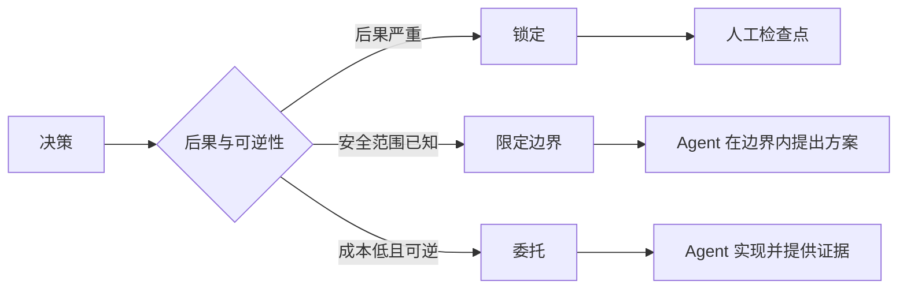

# 编写保留判断空间的规格说明

> 有用的规格固定不变量和证据，同时保留可逆的实现选择。它是决策边界，不是分镜脚本。

**类型：** Learn + Build
**语言：** Python（标准库）
**前置要求：** 阶段 14 第 50 课
**预计时间：** ~75 分钟

## 学习目标

- 区分结果、不变量、示例、非目标和证明。
- 把决定标记为锁定、有界或委托。
- 在选择廉价且可逆时保留 agent 的判断。
- 在后果或公开行为变化时要求人工检查点。

## 两种坏极端

欠规格的任务要求 agent 猜出系统；过度规格的任务要求它转录一个可能已错的设计。

有用的中间地带是一份可执行契约：

| 接触面 | 作用 |
|---|---|
| 结果 | 可观察结果 |
| 不变量 | 必须始终为真的条件 |
| 示例 | 揭示意图的具体案例 |
| 非目标 | 有意排除的相邻行为 |
| 决策策略 | 哪些选择锁定、有界或委托 |
| 证明 | 完成前所需的证据 |

## 三种决策模式

- **锁定：** agent 不得选择。适用于公开兼容性、权限、安全、不可逆成本或产品承诺。
- **有界：** agent 可在明确限度内选择。适用于搜索预算、重试次数、允许依赖或已知接口族。
- **委托：** agent 拥有选择，且必须解释它。适用于本地结构、命名、可逆重构和实现细节。



## 用示例规定行为

示例比形容词更能压缩意图。“有帮助”“稳健”“生产级”都不可执行。一小组正常、边界、失败和禁止案例，能给构建者与验证者具体依据。

示例不能取代不变量。一条通过案例不能证明普遍的安全规则。

## 证明必须匹配主张

- 单元测试证明局部函数契约。
- 线测证明序列化和传输行为。
- 浏览器旅程证明界面路径。
- 回放集证明代表性案例上的行为。
- 审计日志证明权限边界得到遵守。

不要接受低层证据来证明高层主张。

## 有意识地保留未知项

规格可以说：“实现可选择任意能在时间预算内返回的只读来源。”这不是含糊，而是带边界与证明的有意委托决定。

证据变化时，规格也应演进。保留锁定和有界选择背后的理由，让后续团队不用考古就能修订。

## 动手构建

实验验证每个契约接触面，检查决策模式，并写入 `outputs/executable-specification.json`。

```bash
python3 code/main.py
PYTHONPATH=code python3 -m unittest discover code/tests -v
```

把生产写入决定从锁定改成委托。解释 schema 为何接受这个值而产品风险为何不接受。

## 练习

1. 把一个待办工单转换为六个规格接触面。
2. 用一个不变量和两个示例替换三条实现说明。
3. 标记每项决定，并说明每项锁定或有界选择。
4. 为每个不变量添加证明凭据。
5. 移除一项没有证据或风险理由的约束。

## 延伸阅读

- [Nuseibeh and Easterbrook, Requirements Engineering: A Roadmap](https://www.cs.toronto.edu/~sme/papers/2000/ICSE2000.pdf)，了解目标、精确规格、验证、协商与演进的关系。
- [Zave and Jackson, Four Dark Corners of Requirements Engineering](https://doi.org/10.1145/267895.267896)，了解如何区分环境假设、需求和规格。
- [Gotel and Finkelstein, An Analysis of the Requirements Traceability Problem](https://doi.org/10.1109/ICRE.1994.292398)，了解如何保留需求为何存在及其来源。

## 拿去用

保留 `outputs/executable-specification.json`。它成为编码 agent 和人工审阅者共享的契约。
