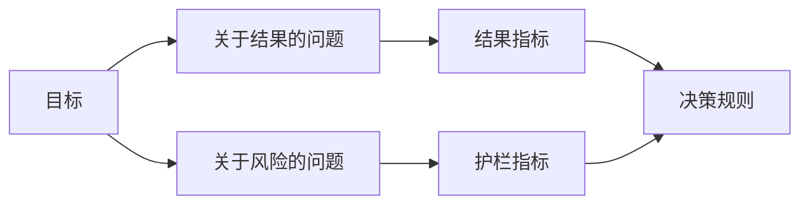

# 在结果出现前设计成功指标

> 测量应回答一个决定，而不是装饰仪表盘。从目标开始，推导问题，再选择能回答它们的最小指标集。

**类型：** Learn + Build
**语言：** Python（标准库）
**前置要求：** 阶段 14 第 47 和 51 课
**预计时间：** ~70 分钟

## 学习目标

- 从结果目标推导问题和指标。
- 在观察结果前定义阈值、窗口、来源和方向。
- 将结果指标与护栏和反指标配对。
- 让评估证据匹配构建必须支持的决定。

## 目标、问题、指标

从一个目标开始：

> 缩短识别受影响服务的时间，同时不增加不安全动作。

推导问题：

- 多快能识别正确服务？
- 被识别的服务正确率多高？
- 诊断是否仍保持只读？
- 工作流会不会增加告警忽略或操作员负担？

然后选择将这些问题操作化的指标。



## 指标需要一份契约

每个指标需要：

| 字段 | 示例 |
|---|---|
| 名称 | `median_identification_seconds` |
| 方向 | 至多 |
| 阈值 | 120 |
| 窗口 | 十次事故回放 |
| 来源 | 回放事件日志 |
| 人群 | 试点中的值班工程师 |
| 类型 | 结果或护栏 |

没有来源和窗口，数字无法复现；没有阈值，它无法驱动决定。

## 结果、护栏与反指标

- **结果指标：** 期望状态是否改善？
- **护栏：** 固定约束是否仍为真？
- **反指标：** 局部改善是否把成本或伤害转移到别处？

对事故工作流而言，速度不够。正确性、生产写入、操作员负担和漏报可防止又快又不安全的结果。

## 离线与在线证据

离线回放有利于可重复性和边界覆盖；有界试点有利于了解真实行为、信任和工作流影响。谁都不能替代另一个。

使用能回答当前决定的最便宜证据。不要只因实现准备好了就暴露真实用户。

## 测量前先决定

在看结果之前写下通过、失败和模糊的路径，否则团队会为了保住构建而移动阈值。

示例：

- 通过：正确服务率至少 0.9，且中位时间至多 120 秒；
- 失败：出现任何生产写入，或正确率低于 0.75；
- 模糊：改善很小且方差很大，需要更大的回放集。

## 动手构建

实验验证测量计划，评估包含边界的阈值，记录缺失值，并写入 `outputs/measurement-report.json`。

```bash
python3 code/main.py
PYTHONPATH=code python3 -m unittest discover code/tests -v
```

移除护栏指标，观察即使结果指标还在，计划为何仍无效。

## 练习

1. 从一个结果目标推导三个问题。
2. 加入一个能发现成本转嫁给其他角色的反指标。
3. 为每项指标定义来源、人群和窗口。
4. 在生成数值前写下通过、失败和模糊的决定。
5. 找出一个易收集但无法改变决定的指标，并移除它。

## 延伸阅读

- [Basili, Software Modeling and Measurement: The Goal/Question/Metric Paradigm](https://drum.lib.umd.edu/items/8119803a-362b-42ec-b6ce-2311713e7236)，了解如何从明确目标推导操作性测量。
- [Basili, Caldiera, and Rombach, The Goal Question Metric Approach](https://www.cs.toronto.edu/~sme/CSC444F/handouts/GQM-paper.pdf)，了解如何把该方法用于反馈和改进系统。

## 拿去用

保留 `outputs/measurement-report.json`。它定义原型、试点或生产阶段的证据关卡。
