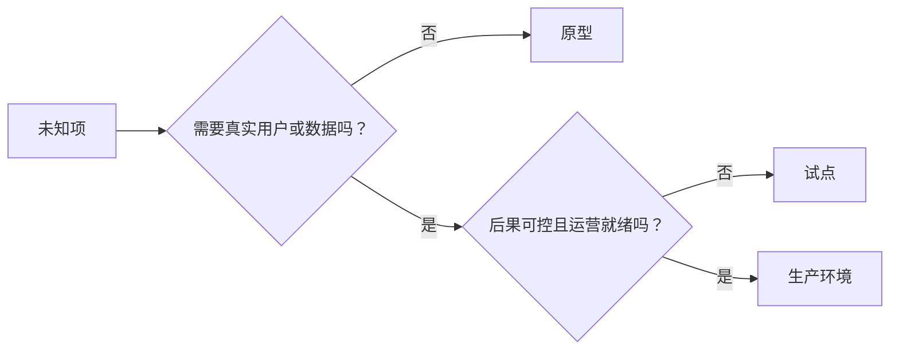

# 有意识地选择原型、试点或生产

> 它们是不同的学习环境，不是精致程度的等级。选择以最少无谓后果回答当前未知项的阶段。

**类型：** Learn + Build
**语言：** Python（标准库）
**前置要求：** 阶段 14 第 50 到 52 课
**预计时间：** ~70 分钟

## 学习目标

- 根据未知项、受众、数据、后果和准备度选择构建阶段。
- 定义阶段专属的控制和退出标准。
- 防止原型悄悄变成生产系统。
- 推迟真实权限，直到证据与运营证明它合理。

## 三个不同的问题

| 阶段 | 首要问题 |
|---|---|
| 原型 | 这个机制能否产出证据？ |
| 试点 | 它能否在有限真实受众与真实条件下安全工作？ |
| 生产 | 我们能否以承诺的可靠性和风险水平持续拥有它？ |

原型技术上可以完整，却仍可丢弃。试点可使用生产数据，同时限制受众和权限。当组织接受持续责任时，生产才开始。

## 原型

当未知项不需要真实用户或真实数据时，使用原型。让它保持：

- 可丢弃；
- 隔离；
- 行为范围窄；
- 明确学习问题；
- 不提供虚假的运营保证。

在机制赢得下一阶段之前，不要优化架构。

## 试点

当未知项需要真实行为、现实数据或真实工作流，但后果或准备度尚不适合广泛发布时，使用试点。

试点需要：

- 指定受众；
- 人类负责人；
- 有界的时长和权限；
- 审计与回滚；
- 结果与护栏阈值；
- 扩大、修订或停止的退出标准。

## 生产

生产需要的不只是部署：

- 服务级别目标；
- 值班和事故所有权；
- 安全与隐私审查；
- 成本和容量控制；
- 回滚和恢复；
- 持续监控；
- 退出路径。



## 阶段漂移

原型代码在获得用户、数据或权限，却没有获得所有权时，会变得危险。在配置、访问控制、遥测和文档中标记原型与试点的边界；警告横幅不够。

阶段应能从系统本身观察到。

## 动手构建

实验从决策上下文选择阶段，返回所需控制，并写入 `outputs/stage-decisions.json`。

```bash
python3 code/main.py
PYTHONPATH=code python3 -m unittest discover code/tests -v
```

将试点示例改为低后果且运营就绪。说明还需要什么证据才能进入生产。

## 练习

1. 按学习阶段而不是部署状态，为三个当前项目分类。
2. 编写包含停止决定的试点退出标准。
3. 加入一项技术控制，阻止原型访问生产数据。
4. 找出让构建成为生产的第一项运营责任。
5. 为有界试点设计一份回滚凭据。

## 延伸阅读

- [Barry Boehm, A Spiral Model of Software Development and Enhancement](https://dl.acm.org/doi/10.1145/12944.12948)，了解如何让每次迭代的承诺匹配已化解的风险。
- [Fagerholm et al., Building Blocks for Continuous Experimentation](https://doi.org/10.1145/2601248.2601276)，了解持续实验所需的组织和技术条件。

## 拿去用

保留 `outputs/stage-decisions.json`。它记录每个阶段为何合理，以及进入下一阶段前必须具备哪些控制。
