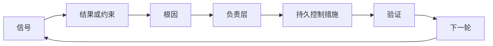

# 构建带所有权与淘汰机制的反馈棘轮

> 交付关闭一次构建循环，也打开学习循环。证据必须改变系统，否则它只是无人负责的遥测。

**类型：** Learn + Build
**语言：** Python（标准库）
**前置要求：** 阶段 14 第 46 和 53 课
**预计时间：** ~75 分钟

## 学习目标

- 将事故、评估、用户行为和纠正转为有人负责的行动。
- 将每个信号路由到上下文、评估、策略、运行时或待办列表。
- 按严重性和频率确定复发优先级。
- 给每项控制一个淘汰条件。

## 反馈是基础设施

团队可以收集追踪、评估、支持工单和事故日志，却没有从任何一项中学习。缺失的机制是提升：从观察到带负责人和证明的持久变更，要有明确路径。

循环是：

1. 观察一个具体信号；
2. 把它关联到结果、约束或假设；
3. 找出拥有原因的最早系统层；
4. 创建有界改动；
5. 验证复发变得更不可能；
6. 复审控制是否应继续保留。

## 路由到拥有的层

| 信号 | 归宿 |
|---|---|
| 误报、回归、错误结果 | 评估或测试 |
| 缺少上下文、重复工作、过时事实 | 上下文源或检索路径 |
| 不安全动作或权限缺口 | 策略或权限边界 |
| 超时、重试风暴、不可用依赖 | 运行时控制 |
| 新产品需求或未解决的取舍 | 已塑造的待办项 |

在最早的有效层修复原因。不要在测试或权限能让失败不可能时，再添一段 prompt。



## 所有权是控制的一部分

每项棘轮行动都需要：

- 一位负责人；
- 基于后果和复发的优先级；
- 要改的产物；
- 证明改动的验证；
- 复审或到期窗口；
- 淘汰条件。

无人负责的改进，不过是格式更好的观察。

## 淘汰过时控制

反馈系统会积累策略，而这些策略会变得矛盾且昂贵。出现以下情况时复审控制：

- 架构或工作流改变；
- 低层不变量取代高层说明；
- 在选定窗口中，受保护的失败没有出现；
- 控制阻碍合法工作的频率超过它防止伤害的频率。

淘汰也需要证据。不要只因感觉旧了就删除控制。

## 连接构建与编码 agent 反馈

同一棘轮服务两条路径：

- 产品证据改变结果框架、假设、切片或测量计划。
- 编码 agent 纠正改变测试、上下文、范围、自动化或交接。
- 事故能同时改变产品边界和 agent 工作台。

这就是为什么塑造构建不是编码前结束的阶段，它会延续到每次被接受的改动中。

## 动手构建

实验对信号分类，创建有负责人的棘轮行动，对其排序，并写入 `outputs/feedback-backlog.json`。

```bash
python3 code/main.py
PYTHONPATH=code python3 -m unittest discover code/tests -v
```

加入一个运行时超时信号，确认它被路由到运行时，而不是通用待办列表。

## 练习

1. 将一起事故和一条用户投诉转为棘轮行动。
2. 为每次复发写出能预防它的最早层。
3. 向实验输出加入验证命令或观察。
4. 为一条策略规则定义淘汰条件。
5. 将一次被接受的纠正追溯回下一个任务框架。

## 延伸阅读

- [Basili, Caldiera, and Rombach, The Goal Question Metric Approach](https://www.cs.toronto.edu/~sme/CSC444F/handouts/GQM-paper.pdf)，了解通过目标导向测量实现组织学习。
- [Fagerholm et al., Building Blocks for Continuous Experimentation](https://doi.org/10.1145/2601248.2601276)，了解将证据连到持续产品开发的技术与组织循环。
- [Nuseibeh and Easterbrook, Requirements Engineering: A Roadmap](https://www.cs.toronto.edu/~sme/papers/2000/ICSE2000.pdf)，了解如何将需求视为在系统生命周期中演进。

## 拿去用

保留 `outputs/feedback-backlog.json`。它是产品判断与交付路径的收尾产物，也是下一个结果框架的输入。
