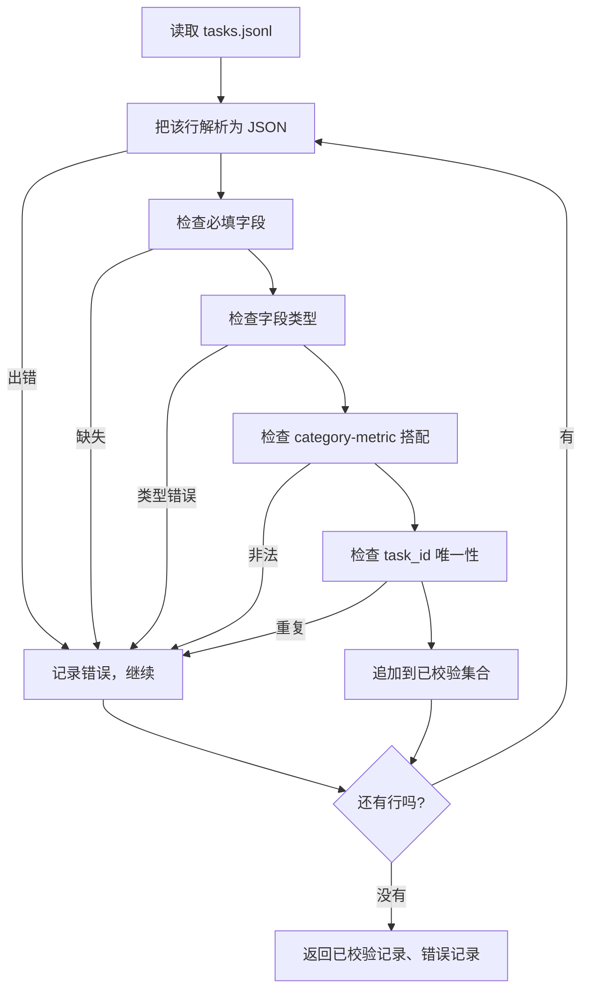

# 任务规格格式

> 一套 eval harness 的好坏，上限就是它的任务所遵守的那份契约。在你动手写第一个打分函数之前，先把 JSONL 的形状和 metric 的命名词表冻结下来。

**类型：** Build
**语言：** Python
**前置要求：** 阶段19 Track B 基础
**预计时间：** ~90 分钟

## 学习目标

- 定义一份 JSONL 任务记录 schema，用同一种形状覆盖算术、选择题、代码执行、分类、自由文本摘要这五类任务。
- 钉死一套封闭的 metric 命名词表，让后续课程（71-73）可以靠单个字段来分发。
- 把 few-shot 示例和后处理规则写进任务里、而不是写进 runner 里，这样同一个 prompt 在不同模型上都能产出同样的目标。
- 实现一个严格的 validator，把格式错误的记录在进入 runner 之前就拦下来。
- 交付一组 10 个任务的 fixture，把规格的每个分支都跑一遍，让 validator 有真东西可以咀嚼。

## 为什么要冻结规格

一个研究型代码库积累 eval 脚本的速度，永远快过它积累测试的速度。半年下来，每个 notebook 都有自己的一套 JSON 形状，每个 metric 都被重写了两遍，没有任何东西能跨 run 对比。修复方法很无聊：选一份 schema，写一个 validator，其余一律拒收。这节课做的就是这件事。

这套形状借鉴了 BIG-bench、HELM 以及 lm-eval 风格 harness 的思路，但字段名是我们自己的。每个字段都有唯一的归属：runner 读任务，metric 读 targets，后处理步骤归一化生成结果。没有任何字段会在 pipeline 中途被改写。

## 记录的形状

一个任务就是单行上的一个 JSON 对象。harness 读取 `tasks.jsonl`，逐行独立校验。坏行只会作废那一条记录，而不是整个 run。

```json
{
  "task_id": "arith_001",
  "category": "arithmetic",
  "prompt": "Compute the result. Question: 17 + 24\nAnswer:",
  "targets": ["41"],
  "metric_name": "exact_match",
  "few_shot_examples": [
    {"prompt": "Question: 2 + 2\nAnswer:", "completion": "4"}
  ],
  "post_process": "strip_whitespace",
  "metadata": {"difficulty": "easy"}
}
```

必填字段是 `task_id`、`category`、`prompt`、`targets`、`metric_name`、`post_process`。`few_shot_examples` 和 `metadata` 可选。出现未知的顶层字段则校验失败。

## 字段规则

`task_id` 是一个不含空白字符的字符串。validator 强制要求它在整个文件中唯一。

`category` 取值为 `arithmetic`、`mcq`、`code_exec`、`classification`、`summary` 之一。category 约束了哪一组 metric 与后处理的搭配是合法的。一个 `code_exec` 任务必须用 `metric_name = code_exec`，一个 `mcq` 任务必须用 `metric_name = exact_match` 去匹配单个字母的 target。

`prompt` 是一个非空字符串。validator 禁止尾部空白，并拒收 prompt 正文里已经塞进了 few-shot 块的记录。few-shot 渲染发生在 runner 里，不在作者这边。

`targets` 是一个非空的字符串列表。对 `exact_match`，任意一个元素命中即算。对 `f1` 和 `rouge_l`，取得分最高的那个 target。对 `mcq`，列表里只能有一个元素。

`metric_name` 取值为 `exact_match`、`f1`、`bleu_4`、`rouge_l`、`accuracy`、`code_exec` 之一。这个词表是封闭的。新增一个 metric 就意味着要新开一节课并在这里加一项。

`few_shot_examples` 是一个 `{prompt, completion}` 对的列表。validator 把列表上限定为八条，保证 prompt 长度有界。

`post_process` 取值为 `none`、`strip_whitespace`、`lower`、`extract_letter`、`extract_code_block`、`extract_first_line` 之一。每条规则都有唯一的确定性行为。validator 禁止把多条规则组合起来用。

## Validator 的行为



validator 返回两个列表：已校验记录，以及错误记录（带上违规的那行、被违反的规则、出错的字段）。只要错误列表非空，runner 就拒绝启动，除非显式带上 `--allow-bad-tasks` 标志。

## Few-shot 渲染

runner 把 few-shot 示例用一个空行分隔，拼接在 prompt 前面。每个模型走的都是同一段代码路径，所以唯一的变量来源就是模型本身。作者只需写一次示例，而不是给每个 provider 写一遍。

```python
def render(task):
    parts = []
    for ex in task.get("few_shot_examples", []):
        parts.append(ex["prompt"] + " " + ex["completion"])
    parts.append(task["prompt"])
    return "\n\n".join(parts)
```

## 后处理规则

后处理步骤在生成之后、metric 之前运行。它是确定性且无状态的。

- `none` 原样返回字符串。
- `strip_whitespace` 去掉首尾空白。
- `lower` 把字符串转小写。
- `extract_letter` 返回第一个匹配 `[A-E]` 的字符，用于 MCQ。
- `extract_code_block` 返回第一个三反引号围栏块的正文，用于 code-exec。
- `extract_first_line` 返回第一个非空行，用于摘要类分类。

需要这个清单之外规则的任务，应该归到新的一节课里。

## 这节课不做什么

它不打分。它不调模型。它不跑代码。这些分别在第 71、72、75 课里出现。这节课冻结的是它们全都要遵守的那份契约。

这组 10 个任务的 fixture 涵盖两道算术、两道 MCQ、两道 code-exec、两道分类、两道摘要。validator 在全部 10 条上都通过。另有一份 fixture（`tasks_bad.jsonl`）把每条规则都踩一遍，validator 返回的错误数刚好等于踩的条数。

## 怎么读代码

`main.py` 定义了 `TaskSpec`、`validate_task`、`validate_file` 以及一个 CLI 入口。fixture 加载器是 `load_fixtures`。渲染和后处理的辅助函数就放在校验逻辑旁边，这样第 75 课的 runner 只需 import 一个模块。

从头到尾读一遍 `main.py`。然后读 `code/tests/test_spec.py`。测试钉死了每一条校验规则和每一种后处理行为。`main.py` 底部的 demo 会校验自带的 fixture 并打印一份摘要。

## 再进一步

真实的 eval 套件长 category 就像 schema 长列：清醒的做法是，不允许只加一个 category 而不顺手加上一个 metric、一条后处理规则、以及至少一个 fixture 任务。把规格当成数据库迁移来对待——每次变更都要走 review、打版本、配测试。这节课里的 validator 就是那道闸门。
