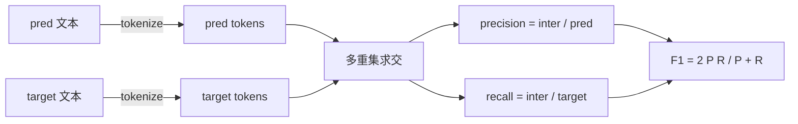
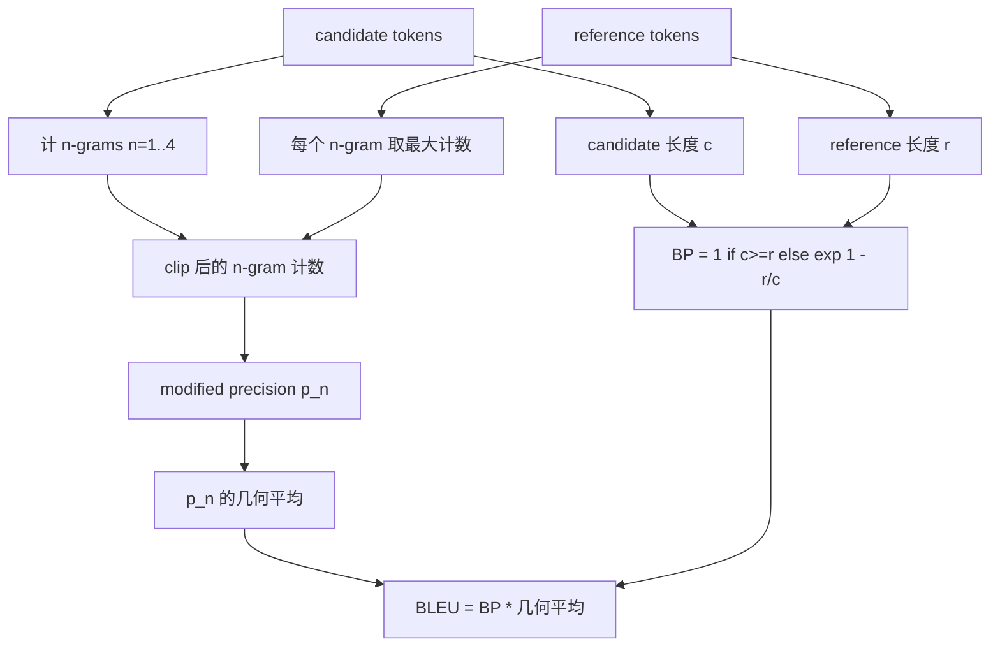

# 经典评测指标

> BLEU、ROUGE-L、F1、exact-match、accuracy。这五个 metric 至今仍占据了已发表 LLM eval 数字的大头。把每一个都从第一性原理重写一遍，你才真正明白那个数字是什么意思。

**类型：** Build
**语言：** Python
**前置要求：** 阶段19 Track B 基础、第 70 课
**预计时间：** ~90 分钟

## 学习目标

- 用明确的 tokenization 规则，实现 token 级别的 exact-match、F1 和 accuracy。
- 从零实现 BLEU-4：modified n-gram precision、对 n 从 1 到 4 取几何平均、brevity penalty。
- 用最长公共子序列实现 ROUGE-L，并用 precision 和 recall 的 F-beta 组合。
- 基于第 70 课的 metric_name 字段做分发，让 runner 与具体 metric 解耦。
- 用从手算示例（而非第三方库）得出的参考向量，把行为钉死。

## 为什么要重写一遍

你会读到一篇论文报告 BLEU 28.3，另一篇报告 BLEU 0.283。你会发现同一段文本在两个库里算出的 ROUGE-L 能差出十个点，只因为一个把文本截成小写、另一个没有。要想最快地走出这种困惑，就是自己把这些 metric 写一遍，然后能指着具体哪一行决定了 tokenizer、哪一行施加了 smoothing。在那之后，跨论文比数字就变成了读 metric 配置的事，而不是在那里吵哪个库对。

标准库加 numpy 就够了。BLEU 就是计数加一个 clamp。ROUGE-L 是动态规划。F1 是 token 上的集合求交。最难的部分，是挑一个 tokenizer 并对它从一而终。

## Tokenization

tokenizer 就是 `re.findall(r"\w+", text.lower())`。转小写、抓字母数字连续段、丢掉标点。这节课里的每个 metric 都用这个 exact 的 tokenizer。runner 没有选择权。换了 tokenizer，你跑的就是另一个 benchmark 了。

```python
TOKEN_RE = re.compile(r"\w+", re.UNICODE)
def tokenize(text):
    return TOKEN_RE.findall(text.lower())
```

这是一个有意为之的简化。生产环境会在意 CJK、缩写、代码标识符。这节课要传达的点是：tokenizer 是一份契约，不是一个旋钮。

## Exact match

```python
def exact_match(pred, targets):
    return float(any(pred.strip() == t.strip() for t in targets))
```

它每个任务返回 1.0 或 0.0。在数据集上的聚合就是取均值。这是算术、MCQ 和短文本分类任务的主力。

## Token 级别 F1

为 prediction 和 target 各建一个 token 多重集（multiset）。precision 是多重集求交后除以 prediction 的多重集，recall 是同一个交集除以 target 的多重集，F1 是二者的调和平均。实现里处理了空 prediction 和空 target 这两个边界情况。



对多 target 的任务，我们取在 target 列表上的最佳 F1。这与文献中广泛报告的 SQuAD 风格行为一致。

## BLEU-4

BLEU 是机器翻译的经典 metric，至今仍出现在摘要工作里。我们采用的是 corpus 级别的 BLEU-4，配标准 brevity penalty，并在 modified n-gram count 上做加一 smoothing，这样单个缺失的 4-gram 不会把分数直接推到零。

对每一个 candidate-reference 对，我们对 n 等于 1、2、3、4 计 modified n-gram precision。modified precision 会把 candidate 的某个 n-gram 计数，clip 到该 n-gram 在任一 reference 中出现的最大次数，这样 candidate 就没法靠重复某个短语来灌水。四个 precision 的几何平均再被 brevity penalty 包住。



这条 smoothing 规则就是 Lin 和 Och 所称的 method 1：在取对数之前，给每个 n-gram precision 的分子和分母都加一。这避免了当 reference 没有匹配 4-gram 时出现 `log 0`，并且在长 candidate 上保持接近未平滑值。

## ROUGE-L

ROUGE-L 比较 candidate 和 reference token 序列的最长公共子序列。LCS 在不强求连续的前提下捕捉词序，这正是它成为默认摘要 metric 的原因。我们用标准的动态规划表算出 LCS 长度，然后推出 recall 为 `lcs / reference 长度`、precision 为 `lcs / candidate 长度`，再用 F-beta 组合，其中 beta 等于 1 即对称的 F1 形式。

```python
def lcs_length(a, b):
    n, m = len(a), len(b)
    dp = numpy.zeros((n + 1, m + 1), dtype=int)
    for i in range(n):
        for j in range(m):
            if a[i] == b[j]:
                dp[i+1, j+1] = dp[i, j] + 1
            else:
                dp[i+1, j+1] = max(dp[i+1, j], dp[i, j+1])
    return int(dp[n, m])
```

numpy 表让实现更易读；纯 Python 列表也能跑。选用 ROUGE-L 的任务，每个任务要付出 O(n m) 的代价。对典型的摘要长度，这仍在一毫秒以内。

## Accuracy

对多 target 的分类任务，accuracy 退化为对单个归一化 target 做 exact-match。我们把它单独暴露成一个函数，这样分发器可以直接基于 `metric_name` 分发，而不必在 runner 内部走字符串比较。

## 分发契约

唯一入口是 `score(metric_name, prediction, targets)`。它返回一个 `[0, 1]` 区间内的 float。runner 不在 metric name 上做分支判断，它把调用交出去再写回结果。这就是第 75 课要拿来粘合第 70 课任务规格的那个接口面。

```python
def score(metric_name, pred, targets):
    if metric_name == "exact_match":
        return exact_match(pred, targets)
    if metric_name == "f1":
        return max(f1_score(pred, t) for t in targets)
    if metric_name == "bleu_4":
        return max(bleu4(pred, t) for t in targets)
    if metric_name == "rouge_l":
        return max(rouge_l(pred, t) for t in targets)
    if metric_name == "accuracy":
        return accuracy(pred, targets)
    raise ValueError(f"unknown metric_name: {metric_name}")
```

`code_exec` 在第 72 课处理，并在那里插进这个分发器。

## 这节课不做什么

它不调模型。它不会在第 70 课后处理规则之外再额外归一化生成结果。它不算置信区间。它不做 BLEURT 或 BERTScore（那些需要一个模型，归到另一节课）。这节课的重点是地基：五个 metric、一个 tokenizer、一张分发表。

## 怎么读代码

`main.py` 把每个 metric 定义成一个自由函数，外加分发器。参考向量放在文件底部的 `_reference_examples` 块里。demo 用分发器跑八个示例并打印各 metric 的得分。`code/tests/test_metrics.py` 里的测试钉死了参考向量，并对每个边界情况施压（空 prediction、空 reference、无共享 token、完全匹配、重复短语的 clip）。

从头到尾读一遍 `main.py`。函数按复杂度排序：exact_match 和 accuracy 各一行，F1 六行，BLEU 和 ROUGE-L 是重头戏，它们带有关于 smoothing 规则和 LCS 递推的详细注释。

## 再进一步

经典 metric 是必要的，但不充分。它们奖励表面重叠，错过语义。修复办法是在你信任了经典地基之后，在其上叠加基于模型的 metric（BLEURT、BERTScore、GEval）。那是后面的课。现在：把这五个跑通，用测试钉死，你就拥有了一套可审计、快、可复现的 metric 栈。
