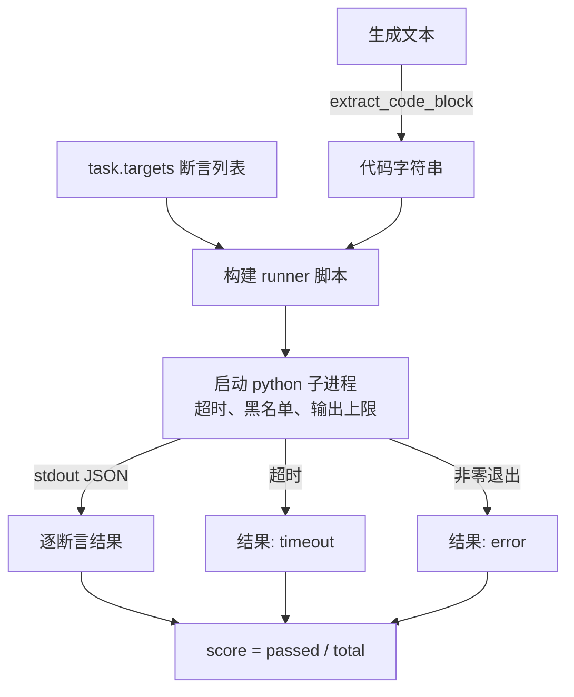
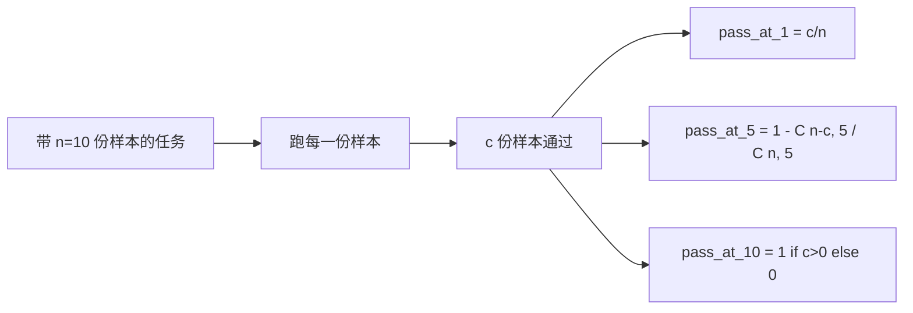

# 代码执行评测指标

> 生成的代码，通过测试才算对。eval harness 必须能把代码抽出来、在不搞崩宿主机的前提下跑起来、并诚实地统计通过率。这节课就来构建这个接口面。

**类型：** Build
**语言：** Python
**前置要求：** 阶段19 Track B 基础、第 70 和 71 课
**预计时间：** ~90 分钟

## 学习目标

- 用与第 70 课后处理规则一致的方式，从自由格式的生成结果里抽出一个代码块。
- 在一个隔离的子进程里执行候选代码，配上 wall-clock 超时、输出上限、以及 import 黑名单。
- 把一个任务的得分定义为：所提供的断言字符串里，对候选代码通过的那部分占比。
- 对那些会从一个模型采样多份生成的任务，计算 pass-at-k。
- 把 sandbox 崩溃、语法错误、超时都当成一等公民式的失败模式，配上各自不同的、runner 能记录的退出码。

## 为什么要用隔离子进程

内联 `exec` 是安全和稳定性上的隐患。一段生成出来的 `while True: pass` 会把 eval 永远卡死。一段生成出来的 `import shutil; shutil.rmtree('/')`，灾难程度跟字面意思一模一样。修复办法是：每个候选都新起一个全新的 Python 解释器，从 stdin 把代码传进去，把断言结果写到 stdout，超时就杀掉进程。宿主 eval 进程照常运行。

像 HumanEval、MBPP、BigCodeBench、LiveCodeBench 这些真实 eval，全都用子进程 sandbox。有些还在上面叠一层 Docker。我们停在子进程是有原因的：它可移植、它是标准库、它能抓住对教学型 eval 真正重要的那些失败模式。生产部署会再加 seccomp、网络隔离、只读文件系统。关于加固的下一节课在本 Track 之外。

## 一个 code-exec 任务的形状

一个 `code_exec` 任务在 `targets` 里携带断言字符串。runner 从生成结果里抽出一个围栏代码块，围着它搭一个测试 harness，然后跑出结果。



得分是 `[0, 1]` 里的一个比例。一个带三条断言、其中两条通过的任务得 0.667。无论是什么挂了，runner 都返回同样的形状：子进程的崩溃被映射成一个归一化的错误码，而不是让 Python traceback 冒泡到 harness 上。

## 黑名单

黑名单是基于 import 的。在运行候选代码之前，runner 脚本会把对危险模块的 import 改写成一个 stub，它会抛出 `ImportError("denied")`。这份清单刻意保守：`os.system`、`subprocess`、`socket`、`requests`、`urllib`、`urllib.request`、`urllib.error`、`urllib.parse`、`ctypes`、`shutil`、`http.client`、`asyncio.subprocess`。

我们并不假装它是金钟罩。铁了心的对抗性代码可以逃出 Python 里任何进程内 sandbox。黑名单是兜底。真正承重的控制项是 wall-clock 超时和输出上限。

```python
DENIED = {
    "os.system": True,
    "subprocess": True,
    "socket": True,
    "shutil": True,
    "requests": True,
    "urllib": True,
    "ctypes": True,
}
```

我们在候选代码前面加上 `import sys` 以及一段把 `os.system` monkey-patch 成抛异常的守卫，以此把它包起来。完整模板在 `main.py` 里。

## Wall-clock 超时

每个子进程默认有三秒 wall-clock 的预算。runner 用 `subprocess.run(..., timeout=t)`。一旦超时触发，runner 捕获 `TimeoutExpired`、杀掉进程、给该任务记一个 `timeout` 退出原因。这个任务得分为零。runner 继续往下走。

超时可以通过 `task.metadata.timeout_s` 按任务配置。跑得久的单元测试可以要更多；第 70 课的 validator 把这个值上限定为三十秒，保证整个套件有界。

## 输出上限

子进程可能往 stdout 灌爆数据，耗光宿主内存。runner 把 stdout 流式读进一个缓冲区，一旦累计总量越过 256 KB 就立刻杀掉子进程。结果被记为 `exit_code = error`，detail 字符串为 `"output overflow"`。这在实践中常常出现于：生成结果不小心写了一个会打印的死循环。

## Pass-at-k

pass-at-k 是 HumanEval 一脉所用的无偏估计量。给定每个任务 `n` 份独立样本、其中 `c` 份通过，那么从这 `n` 份里抽 `k` 份、至少含一份通过解的概率是：

```
pass_at_k(n, c, k) = 1 - C(n - c, k) / C(n, k)
```

当 `n - c < k` 时分子未定义，取值为 `1`。实现里直接处理了这个边界情况。我们暴露 `pass_at_k(n, c, k)` 供第 74 课的 leaderboard 层使用。



## 退出码

runner 每个任务返回五种结果之一：

- `pass`：每条断言都通过。
- `assertion_fail`：代码跑起来了，但至少有一条断言没过。
- `syntax_error`：代码 import 失败或有 SyntaxError。
- `timeout`：wall clock 到期。
- `error`：其他任何崩溃，包括命中黑名单和输出溢出（溢出带 detail `"output overflow"` 现身）。

得分仍是一个比例，退出码是元信息。下游课程可以自行决定：把一次 timeout 算成零，还是算成缺失数据。

## 这节课不做什么

它不给你一个真正的 sandbox。它不跑来自开放互联网的不可信代码。它不处理像文件 I/O、网络调用这类有状态任务。那些需要容器或 microVM。这节课的重点是这份契约：一个隔离子进程、一份黑名单、一个超时、一个输出上限、一套干净的退出码词表、以及 pass-at-k 的数学。

## 怎么读代码

`main.py` 定义了 `extract_code`、`run_candidate`、`score_code_exec`、`pass_at_k`。子进程 runner 脚本被构建成一个字符串，作为 `-c` 传给一个全新的 Python 解释器。`code/tests/test_exec.py` 里的测试对四种退出码、以及对照 HumanEval 风格手算示例的 pass-at-k 都做了演练。

从头到尾读一遍 `main.py`。runner 模板是承重的那块。盯着断言循环看，直到你能预测出它写回父进程的那个 JSON 信封长什么样。

## 再进一步

一旦子进程形状跑通，下一个关注点就是可移植性。不同 Python 版本在 Windows 上对 SIGKILL 的处理不一样。最干净的修法是把 runner 放进一个 Docker 镜像里。再往后一步，是把断言字符串换成真正的单元测试文件，让 eval 与生产 CI 的做法对齐。到那一步就别再把断言字符串叫测试了；它们是玩具测试，有的是玩具式的失败模式。
