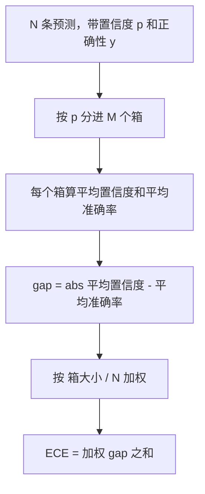
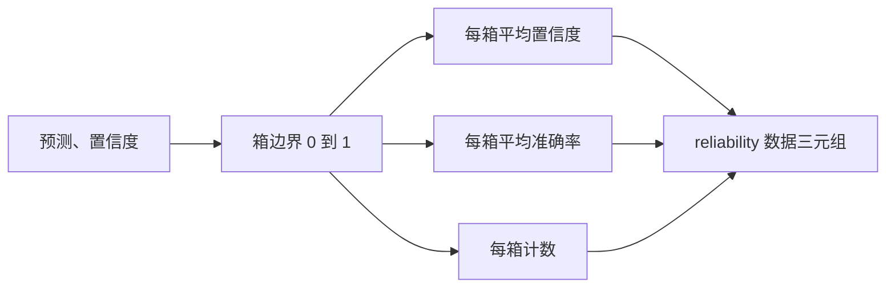

# perplexity 与 calibration

> 如果你的模型在一千个回答上都说自己有 90% 把握，却只答对了六百个，那它的 calibration 就不行。calibration 是可信 eval 的一半。另一半是 perplexity，它告诉你：模型到底觉不觉得这段留出文本是合理的。

**类型：** Build
**语言：** Python
**前置要求：** 阶段19 Track B 基础、第 70 和 71 课
**预计时间：** ~90 分钟

## 学习目标

- 基于模型适配器给出的 token 级负对数概率，在一份留出语料上计算 token 级别的 perplexity。
- 基于分箱后的预测概率，计算分类器或选择题 eval 的 expected calibration error（ECE）。
- 计算 Brier score（对正确性指示变量的均方误差），并解释它在什么时候能做到 ECE 做不到的事。
- 构建画置信度-准确率曲线所需的 reliability diagram 数据。
- 把这三者接进 eval harness，让 runner 能把 `perplexity`、`ece`、`brier` 几个数字挂到模型报告上。

## perplexity 告诉你什么

perplexity 是每 token 平均负对数似然取指数。越低越好。perplexity 为一，意味着模型给每个真实 token 都赋了概率一。perplexity 等于词表大小，意味着模型是均匀分布、什么都没学到。真实数字落在两者之间：一个强的 2026 base 模型在 WikiText-103 上大约在八到十二，一个差的在同一段文本上则在五十以上。

harness 自己不算对数概率，那些来自模型适配器。harness 负责聚合：它拿一个每 token 对数概率的列表、一个每序列 token 数的列表，返回 corpus perplexity。

```python
def perplexity(neg_log_probs, token_counts):
    total_nll = sum(neg_log_probs)
    total_tokens = sum(token_counts)
    return math.exp(total_nll / total_tokens)
```

实现里处理了零 token 的边界情况，并断言负对数概率非负。一个常见错误是忘了取负号：一个返回 `log p` 而非 `-log p` 的适配器会产出小于一的 perplexity，这是不可能的。函数会把它当成契约违反抓出来。

## ECE 衡量什么

expected calibration error 把预测按其置信度分进固定数量的箱里，然后在各箱间测量置信度与准确率之间的平均差距，并按箱的大小加权。



标准做法在 `[0, 1]` 上用十个等宽箱。实现支持任意正整数个数。我们暴露一个 `bins` 参数，让 runner 在发表惯例（10）和对比惯例（15）之间选择。

ECE 会被箱数和样本量带偏。十个箱、一百条预测时，你没法把 0.02 的 ECE 和随机噪声区分开。实现会把已填充的箱数连同 ECE 一起返回，这样 runner 可以在样本太少时拒绝只报一个数字。

## Brier score 能做 ECE 做不到的什么

ECE 只在意平均差距。一个在一半箱上过度自信、在另一半箱上信心不足的模型，可以有很低的 ECE，却在局部校准得很糟。Brier score 逐条预测地测量对真实结果的平方误差，所以它直接惩罚这种发散。

对二元结果，Brier 是 `mean((p_i - y_i)^2)`。它可分解为 reliability、resolution、uncertainty 三项。我们计算这个分数以及它的分解。runner 报告那个标量，但把分解记进 dashboard 的日志。

```python
def brier(p, y):
    return float(np.mean((p - y) ** 2))
```

## reliability diagram 数据

reliability diagram 在每个箱里画预测置信度对经验准确率。对角线就是完美 calibration。函数返回三个数组：每箱平均置信度、每箱平均准确率、每箱计数。画图代码在下游；这节课停在数据形状上。



返回的元组正是调用层画图、或计算某个自定义 ECE 变体（adaptive ECE、sweep ECE 等）所需要的。我们返回 numpy 数组，省得下游代码再去转换。

## 置信度从哪来

harness 不假设置信度来自 softmax。它接受每条预测在 `[0, 1]` 里的任意一个数。对选择题任务，自然的置信度是 `对各选项对数似然做 softmax`。对自由文本，自然的置信度是模型自报的概率、或平均对数似然取指数。eval 只消费这个数。它从哪来，是适配器的活儿。

## 边界情况

- 全部预测错：ECE 是平均置信度，Brier 很高，perplexity 就是模型对那段文本怎么看。
- 全部预测对且高置信度：ECE 接近零，Brier 接近零。
- 在 p=0.5 处完全不确定的预测器：ECE 是 0.5 减去准确率，Brier 是 0.25 减去一个修正项。
- 空输入：ECE、Brier、reliability 返回 `0.0`（或全零数组）。perplexity 在零 token 情形返回 `NaN`。这些路径都不发 warning；由 runner 检查这些值，再决定报还是跳过。

这些情况都已写进测试。真实模型在真实 benchmark 上不会撞到它们，但一个有 bug 的适配器、或一个极小样本会撞到，而 runner 不应崩溃。

## 分发

calibration 不像 F1 那样是逐任务的 metric，它是逐模型的报告。runner 在整个 eval 上累积 `(confidence, correct)` 对，然后一次性算出 ECE、Brier 和 reliability 数据。perplexity 则在一份留出文本语料上计算，与逐任务打分分开。

接口是：

```python
report = CalibrationReport.from_predictions(confidences, correct)
report.ece          # float
report.brier        # float
report.reliability  # tuple of three numpy arrays
report.populated_bins  # int
```

`PerplexityResult.from_token_nll(neg_log_probs, token_counts)` 返回 perplexity 和每 token 平均负对数似然。

## 这节课不做什么

它不调模型。它不实现 softmax。它不从输出 token 估计置信度，那是适配器的活儿。它不做 temperature scaling 或 Platt scaling，那些是事后修正，归到另一节课。这节课的重点是让这三个数字（perplexity、ECE、Brier）变得可信、可复现。

## 怎么读代码

`main.py` 定义了 `perplexity`、`expected_calibration_error`、`brier_score`、`reliability_diagram`，以及 `CalibrationReport` / `PerplexityResult` 两个 dataclass。demo 跑在已知真值的合成预测上：一个良好校准的模型、一个过度自信的、一个信心不足的。`code/tests/test_calibration.py` 里的测试钉死了每个边界情况，外加合成预测器的参考值。

从头到尾读一遍 `main.py`。函数顺序是从标量到向量再到报告。每个函数都有一段简短的 docstring，写着数学和契约。

## 再进一步

calibration 是已发表 eval 里最被忽视的一条轴。大多数 leaderboard 只报一个准确率数字就算完事。一个在准确率上赢、在 Brier 上输的模型，作为生产部署比一个准确率低几个点、但能可靠报告自身不确定性的模型更糟。一旦你把 calibration 的管线搭好，就在一份留出验证切片上加 temperature scaling，重算 ECE，看着那道差距缩小。那是单独的一节课，但地基在这里。
