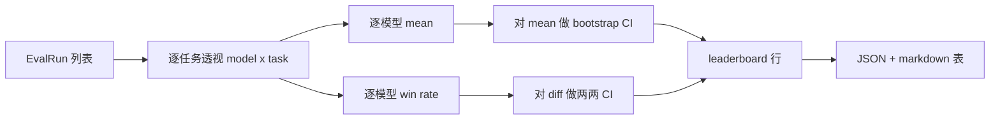
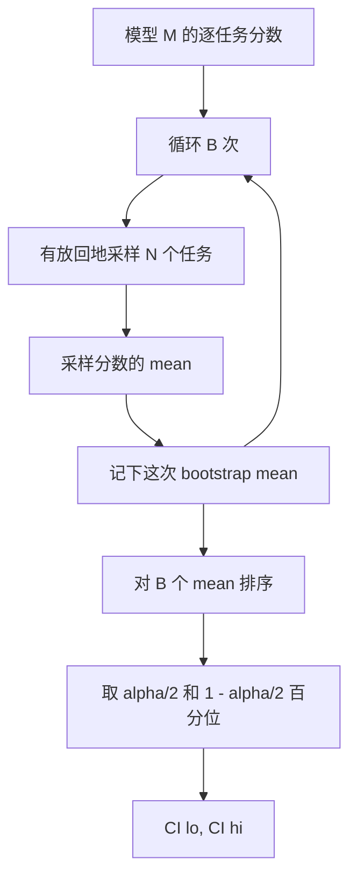

# leaderboard 聚合

> 逐任务的分数很好算。跨异构任务、逐模型的排名就难了。一千条预测的 leaderboard 上的统计显著性，是所有人都跳过的那部分。这节课不跳过。

**类型：** Build
**语言：** Python
**前置要求：** 阶段19 Track B 基础、第 70、71、73 课
**预计时间：** ~90 分钟

## 学习目标

- 把跨多个模型、多个任务的逐任务分数，聚合成一份整洁的逐模型行。
- 把异构分数归一化，让 pass rate 和 BLEU 值不会对聚合结果造成过度影响。
- 按 mean 和按 win-rate 给模型排名，并解释各自在什么时候是对的汇总方式。
- 计算每个模型平均分、以及两两差值的 bootstrap 置信区间。
- 把 leaderboard 输出成一份 JSON 报告、以及一张第 75 课 runner 能贴进 CI 评论的 markdown 表。

## 输入的形状

聚合器消费一个 `EvalRun` 记录的列表：

```python
@dataclass
class EvalRun:
    model_id: str
    task_id: str
    metric_name: str
    score: float          # in [0, 1]
    category: str
```

第 75 课的 runner 给每个 `(model, task)` 对发一条记录。聚合器不在意分数是怎么算出来的，它要求归一化已经做完了：每个分数都在 `[0, 1]` 里。

## 输出

会产出三张表：



leaderboard 行包含：`model_id`、`mean_score`、`mean_ci_lo`、`mean_ci_hi`、`win_rate`、`tasks_completed`，以及一个可选的 `categories` 映射，存逐 category 的 mean。

## 归一化

如果一个任务打分在 `[0, 1]`、另一个在 `[0, 100]`，那第二个会悄悄主导 mean。聚合器会校验每个输入分数都落在 `[0, 1]` 里，否则拒绝这次 run。修复在上游：metric 本就应该返回一个比例。第 71 到 73 课强制执行了这份契约。

## mean 和 win-rate

这两种排名方式服务于不同目标。

mean score 是一个模型逐任务分数的平均。它是 leaderboard 报告的头条数字。它对离群值和任务不均衡敏感。

win-rate 统计一个模型在同一任务上击败其余每个模型的频率。对每个任务，分最高的模型获胜（平局拆分）。win rate 等于胜场除以该模型有分数的任务数。它对离群值和量纲差异不那么敏感，但损失了信息。

```python
def win_rate(model_id, runs_by_task, all_models):
    wins, total = 0, 0
    for task_id, runs in runs_by_task.items():
        scores = {r.model_id: r.score for r in runs if r.model_id in all_models}
        if model_id not in scores:
            continue
        total += 1
        best = max(scores.values())
        if scores[model_id] >= best:
            wins += 1
    return wins / total if total else 0.0
```

harness 两个都报。第 75 课的 runner 默认按 mean 排名；win-rate 的 markdown 列就摆在那里，万一用户更想用它。

## bootstrap 置信区间

逐模型的 mean 配一个由 bootstrap 重采样（在任务上）估计出来的置信区间。我们对 task id 有放回地重采样，在重采样集合上算 mean，重复 `B` 次，然后在 `alpha` 水平上取百分位区间。



对两两比较，我们 bootstrap 逐任务差值 `score_A - score_B`，取百分位区间并报告。用户读一眼这个区间是否排除了零。如果排除了，那这个差异在 alpha 水平上显著。如果没排除，leaderboard 就把这两个模型当成打平。

底层辅助函数（`bootstrap_mean_ci`、`bootstrap_pairwise_diff`）默认 `B=1000`；对外聚合器（`aggregate`、`pairwise_diffs`）默认 `b=500`，让 demo 和测试跑得快。默认 alpha 是 0.05。这节课让 bootstrap 保持纯 numpy，不用 scipy。

## Categories

如果 `EvalRun.category` 有设置，聚合器还会报告逐 category 的 mean。这就是每个 leaderboard 上那些写着 `math`、`reasoning`、`code`、`safety` 的列。它让 runner 能看出一个模型整体不错、但在 code 上偏弱——这是头条 mean 藏起来的信息。

## markdown 渲染

leaderboard 渲染成一张 markdown 表：

```text
| Rank | Model | Mean | 95% CI | Win rate | Tasks |
|------|-------|------|--------|----------|-------|
| 1    | gpt   | 0.78 | 0.74-0.82 | 0.62 | 50 |
| 2    | claude| 0.75 | 0.71-0.79 | 0.34 | 50 |
| 3    | random| 0.10 | 0.07-0.13 | 0.04 | 50 |
```

表按 mean score 排序。CI 渲染到两位小数。过长的 model id 截断到二十个字符。

## 这节课不做什么

它不跑模型。它不调 metric 层。它不实现 adaptive ECE 或其他 calibration 变体，那些是第 73 课。它不实现任务加权——这里每个任务权重都一样。生产 leaderboard 会给任务加权；我们通过 `weight` 字段把这个钩子留着，但在聚合器里忽略它。需要的话，在后续课程里把加权补上。

## 怎么读代码

`main.py` 定义了 `EvalRun`、`LeaderboardRow`、`aggregate`、`bootstrap_mean_ci`、`bootstrap_pairwise_diff`、`render_markdown`。demo 搭了一个三模型、十二任务的合成套件，做聚合，打印出 leaderboard 加两两差值表。`code/tests/test_leaderboard.py` 里的测试钉死了 bootstrap、markdown 渲染、win-rate 边界情况、以及空输入行为。

从头到尾读一遍 `main.py`。数据形状（EvalRun、LeaderboardRow）在最前，聚合器其次，bootstrap 第三，渲染最后。每个函数都有一份聚焦的契约。

## 再进一步

自然的下一步是用配对任务显著性，而非非配对 bootstrap。如果模型 A 和 B 都跑了同样的一百个任务，恰当的检验是对逐任务差值做配对 bootstrap，我们实现了它。再往后，你会想要一个尊重任务族的分层 bootstrap（数学题彼此并不独立；一个算术错误模式会影响其中十道）。那是后续。这节课的重点是把地基做对，让 eval 报出来的数字你站得住脚。
