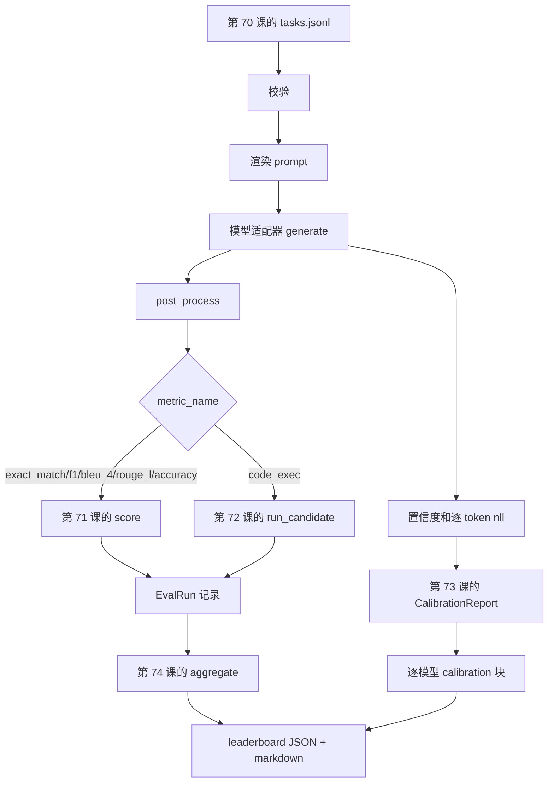

# 端到端 eval runner

> 五节课全是管线，一节课把它们粘起来。runner 读第 70 课的任务规格，通过一个适配器调模型，用第 71 和 72 课打分，挂上第 73 课的 calibration 报告，再发出第 74 课的 leaderboard。demo 自终止。

**类型：** Build
**语言：** Python
**前置要求：** 阶段19 Track B 基础、第 70 到 74 课
**预计时间：** ~90 分钟

## 学习目标

- 定义一个 `ModelAdapter` 接口，让任何模型（mock、本地、API）都能用一个很小的方法面满足它。
- 在一个 fixture JSONL 文件上跑 eval，并在一个 worker 池里并行执行任务。
- 把 metric 层（exact_match、F1、BLEU-4、ROUGE-L、code_exec）和 calibration 层在一遍里组合起来。
- 发出逐模型的 `EvalRun` 记录，直接喂进 leaderboard 聚合器。
- 同时输出一份 JSON 报告和一张 markdown 表；干净跑通时以退出码零自终止，校验或运行失败时非零。

## 这条 pipeline



runner 是集成点。第 70 到 74 课每一节都拥有一个模块，由 runner 来组合。runner 不复制那些模块里的任何逻辑：它 import 它们。

## 适配器接口

适配器是 runner 与任意模型之间的接缝。这个接口刻意做得很小。

```python
class ModelAdapter:
    model_id: str

    def generate(self, prompt: str, task: TaskSpec) -> Generation: ...
```

`Generation` 是一个 dataclass，带有：

- `text`：模型的自由格式输出
- `confidence`：一个 `[0, 1]` 里的 float，表示模型对该答案自报的概率
- `token_nll`：可选，生成 token 上负对数似然之和
- `token_count`：可选，生成 token 的数量

runner 里的 mock 适配器提供三种风味：`RuleBasedAdapter`（确定性、近乎完美）、`NoisyAdapter`（过度自信、经常出错）、`BiasedAdapter`（在某个 category 上很强、在另一个上很烂）。demo 让这三个都在第 70 课的 fixture 上跑一遍。

## 并行执行

runner 用 `concurrent.futures.ThreadPoolExecutor` 给每个模型并行跑任务。worker 数默认取八和任务数里较小的那个。用线程就够，因为真实模型调用的瓶颈是网络 I/O。code-exec 路径会在任务内部自己起一个子进程，executor 只负责调度那个等待。

为了让测试可确定，runner 暴露 `run_eval(adapters, tasks, parallel=False)`，这样测试可以钉死执行顺序。

## 单遍打分循环

对每个任务：

1. 渲染 prompt（few-shot 前缀加 prompt 正文）。
2. 调适配器并给这次调用计时。
3. 按任务的规则后处理生成结果。
4. 分发到 metric 层。
5. 用得分和 metric 元信息构建一条 `EvalRun` 记录。
6. 把 `(confidence, correct)` 对追加到 calibration 缓冲区。

`correct` 信号对 exact_match 风格 metric（`exact_match`、`accuracy`、`code_exec`）是 `score >= 1.0`，对评分式 metric 是 `score >= 0.5`。这个阈值在 `_correct_from_score` 里，runner 不暴露公开的覆盖入口。

## 聚合

每个任务都有结果之后，runner 调第 74 课的 `aggregate` 和 `pairwise_diffs`、以及第 73 课的 `CalibrationReport.from_predictions`。输出是单个 JSON 信封：

```json
{
  "leaderboard": [...],
  "pairwise": [...],
  "calibration": {
    "model_id_a": {"ece": 0.04, "brier": 0.10, "populated_bins": 8, ...},
    ...
  },
  "summary": {
    "tasks": 10,
    "models": 3,
    "wall_seconds": 1.2
  }
}
```

runner 还会把一张 markdown 表写到 stdout，方便用户把结果贴进 PR review。

## 自终止 demo

demo 让三个 mock 适配器在第 70 课的十个 fixture 任务上跑。wall time 应在十秒以内。干净跑通时退出码为零。

干净跑通的判定标准是：

- 每个任务都在第 70 课下校验通过。
- 每个任务都在第 71 和 72 课下打了分。
- calibration 报告在第 73 课下聚合无误。
- leaderboard 把 rule-based 适配器严格排在 random 适配器之上。

只要有任何一条破了，runner 就以非零退出，并在 JSON 信封里带一个结构化错误。

## 这节课不做什么

它不调真实模型。它不实现 API key 流程或限流处理。它不实现流式或部分生成；适配器每次调用返回一份生成。它不做重试或缓存。那些关注点活在适配器层；runner 与 metric 无关、与 provider 无关。

## 怎么读代码

`main.py` 就是集成。它通过一个小小的 `_load_sibling` 辅助函数，按相对路径解析、从其余五节课的模块里 import。`Generation`、`EvalReport`、`ModelAdapter` 这几个 dataclass 在本地定义。mock 适配器在文件底部。

从头到尾读一遍 `main.py`。先扫一眼 import，再看 `run_eval`，然后 `_score_one`，最后看适配器。末尾的 demo 是入口点。

`code/tests/test_runner.py` 里的测试钉死了适配器接口、单遍循环、并行与顺序的等价性、calibration 缓冲区、以及 JSON 信封形状。

## 再进一步

这个 runner 是地基。一个生产 eval 系统会再加：一个以 `(task_id, model_id, model_version)` 为键的结果缓存、一个追踪每次 run 花了多少美元和 token 的成本账本、一个在限流时退避的重试层、一个针对 pass-at-k 任务的采样策略、以及一个面向长套件的流式输出格式。它们每一个都是单一关注点，包在 runner 外面而不改动 metric 或聚合层。那种隔离，正是这份契约的意义所在。

把 mock 跑通之后，再给一个真实 provider 加适配器。挑一个有免费额度的，写三十行胶水代码，看着 leaderboard 亮起来。然后加第二个 provider，让 harness 替你干活。
