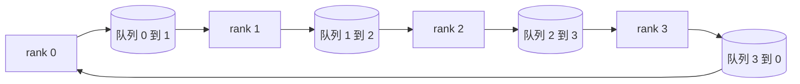

# 从零实现集合通信

> 撑起分布式训练的四个 collective 操作是 allreduce、broadcast、allgather 和 reduce_scatter。训练框架提供的其他所有原语，都是对这四个的封装。用一套 `multiprocessing.Queue` 组成的 mesh 把它们实现一遍，再拿一个参考实现来逐字节核对，这条线后面的内容就只剩接管线了。

**类型：** Build
**语言：** Python
**前置要求：** 阶段19 Track C 第42-49课
**预计时间：** ~90 分钟

## 学习目标

- 用两趟（先 reduce-scatter 再 allgather）实现 ring allreduce，并证明每个 rank 的通信量是每元素 2(N-1)/N 字节。
- 在基于 `multiprocessing.Queue` 的点对点 send 之上，构建 broadcast、allgather 和 reduce_scatter。
- 用同样的输入，把每个原语和 `torch.distributed` 的 gloo 参考实现逐字节对比验证。
- 从集群形态、延迟下限、带宽上限三个角度，论证 ring 与 tree 之间该怎么选。

## 问题背景

N 个 rank 上的朴素 allreduce，会把张量发给一个 root 共 N 次，再广播回来 N 次。每个 rank 的带宽按 O(N) 增长，root 成为瓶颈，墙钟时间下限是最慢那条链路乘以 N。Ring allreduce 把这个过程压平成 2(N-1) 个大小为 T/N 的 chunk，于是每个 rank 的字节数降到 2T(N-1)/N，且与集群规模无关。Tree allreduce 在 N 小、链路高延迟时占优，因为它的深度是 log2(N) 跳，而不是 2(N-1)。给集群形态选错了拓扑，那块最慢的 GPU 就会决定整步的耗时。

这条线你要读的每一个分布式训练框架，都依赖这四个原语。PyTorch DDP 用每个参数 bucket 一次 allreduce 来同步梯度。ZeRO 用 reduce_scatter 来 shard optimizer state，用 allgather 来广播更新后的参数。FSDP 把整个 forward 拆成 allgather 加 reduce_scatter。Pipeline parallel 需要 broadcast 在 stage group 之间传递激活值。如果你实现不了这四个 collective，你就没法推理为什么训练卡住、为什么梯度不匹配偏偏出在 rank 3、为什么换个拓扑 pipeline bubble 就翻倍。

## 核心概念



### 两趟实现 ring allreduce

把张量切成 N 个等大的 chunk，编号 0..N-1。每个 rank 拥有编号等于自身 rank 的那个 chunk。第一趟是 reduce-scatter，跑 N-1 步。在第 s 步，rank r 把 chunk (r - s) mod N 发给 rank (r + 1) mod N，并从 rank (r - 1) mod N 收到 chunk (r - s - 1) mod N，把收到的 chunk 累加到自己的本地副本上。N-1 步之后，rank r 拥有 chunk r 的完整和。第二趟是 allgather，再跑 N-1 步，把算好的 chunk 沿 ring 转一圈，直到每个 rank 都持有每个 chunk 的完整和。

| 原语 | 每 rank 字节 | 步数 | 何时使用 |
|-----------|---------------|-------|------------|
| Ring allreduce | 2T(N-1)/N | 2(N-1) | T 大、粗管道同构集群 |
| Tree allreduce | T log2(N) | 2 log2(N) | T 小或链路高延迟 |
| Broadcast | T | log2(N) tree | 参数初始化、标量配置 |
| Allgather | T(N-1)/N | N-1 | sharded forward、ZeRO unshard |
| Reduce_scatter | T(N-1)/N | N-1 | ZeRO 梯度 sharding |

### 用队列 mesh 替代 NCCL

NCCL 跑在 PCIe 和 NVLink 上，归约由硬件 offload。在 CPU 上你没这条件。给 ring 的每条边配一个 `multiprocessing.Queue`，就有了单生产者、单消费者的有序点对点投递。归约发生在用户态，所以你要付 Python 的开销，但线上的传输模式和 NCCL ring allreduce 完全一致。在队列版本上把正确性推理清楚，集群行为也就顺理成章了。

### 用 gloo 来验证

每个原语落地时都带一个单元测试，把它的输出和用 gloo backend 初始化、跑在同样 world size 同一张张量上的 `torch.distributed` 做对比。如果你的 ring allreduce 和 gloo 的偏差超过 float32 epsilon，测试就失败。拿参考实现来验证这件事没得商量；没有它，原语会一直看起来正确，直到真实训练跑到第 10000 步才露馅。

## 动手构建

`code/main.py` 实现了：

- `Mesh` 类，把 N 个 `multiprocessing.Queue` 实例接成一个 ring，并为每个 rank 暴露 `send(dst, tensor)` 和 `recv(src)`。
- `ring_allreduce(mesh, rank, world_size, tensor)`，跑两趟算法。
- `broadcast(mesh, rank, world_size, tensor, src)`，走对数 tree。
- `allgather(mesh, rank, world_size, tensor)`，用 N-1 次轮转。
- `reduce_scatter(mesh, rank, world_size, tensor)`，作为 allreduce 的前半段。
- `_gloo_reference(op, world_size, tensor)`，把同样的输入喂给带 gloo 的 `torch.distributed`，做逐字节对比。

运行：

```bash
python3 code/main.py
```

输出：逐原语的验证表，对比队列 mesh 和 gloo 的输出，后面跟一个逐 rank 的字节计数器，证明 2T(N-1)/N 的扩展规律。

## 真实世界中的生产模式

有三个模式能把这些原语打磨到可以上线。

**allreduce 前先把梯度 bucket 起来。** 一个 10 亿参数的模型有几万个梯度张量。每个张量一次 allreduce，就要付 N 次延迟下限的代价。DDP 把梯度 bucket 成约 25 MB 的 chunk，每个 bucket 发一次 allreduce；小张量搭在大张量的便车上。不做 bucketing，延迟开销就会主导整步。

**让通信和计算重叠。** Backward 是按反向逐层算梯度的。最后一层的梯度一就绪，就启动它的 allreduce，同时下一层继续算。PyTorch DDP 用 bucket-ready 钩子把这件事接起来。当网络有余量时，这种重叠能把可见的通信时间砍半。

**按消息大小选 ring 还是 tree，别凭信仰。** NCCL 自带一个拓扑探测器，消息大于约 1 MB 选 ring，小于则选 tree。这个临界点是带宽对延迟的权衡：超过 1 MB，带宽项 2T(N-1)/N 主导，ring 胜；低于 1 MB，log2(N) 的跳数胜。硬编码一种拓扑，会在不对的消息大小上损失吞吐。

## 实际使用

生产模式：

- **PyTorch DDP。** 在 backward 之后对 bucket 化的梯度调 `dist.all_reduce`。bucket 大小可调；默认 25 MB 对 100Gbit 以太网是合理的。
- **DeepSpeed ZeRO。** 发 reduce_scatter 来 shard 梯度，发 allgather 在 forward 前重建完整参数。本课的原语正是 ZeRO 所调用的那些。
- **FSDP。** Forward 以 allgather 开头来 unshard 这一层，算完后用 reduce_scatter 归约，再丢弃 unshard。同样的原语，不同的调度。

## 拿去用

在第 77-81 课里使用这套队列 mesh 原语。第 77 课把 allreduce 接进 DDP。第 78 课把 reduce_scatter 接进 ZeRO。第 79 课把 broadcast 接进 pipeline 激活值。第 81 课把四个 collective 全部组装进端到端 demo。

## 练习

1. 加一个 tree allreduce 变体，按消息大小在 ring 和 tree 之间切换。测出临界点。
2. 加一个 `recv_timeout_ms`，让卡住的 rank 抛一个截止时间错误，而不是永远挂着。
3. 把四个原语的 `multiprocessing.Queue` 换成 TCP socket。同样的测试，真实的线路。
4. 加一个带宽埋点钩子，让逐 rank 字节计数器把数据记到 JSONL。
5. 在 4 个 rank 上，对大小为 1KB、1MB、16MB 的张量对比 ring 与 tree 的墙钟时间。用实测数据论证临界点。

## 关键术语

| 术语 | 大家怎么说 | 实际含义 |
|------|----------------|------------------------|
| Allreduce | "跨 rank 求和" | 调用之后每个 rank 都持有同一个归约后的张量 |
| Ring | "那个快拓扑" | N-1 个大小为 T/N 的 chunk 沿环转两圈 |
| Tree | "那个 log 拓扑" | 归约沿二叉树进行；深度是 log2(N) 跳 |
| Allgather | "拼接各分片" | 每个 rank 最终都拿到其他每个 rank 的分片 |
| Reduce_scatter | "把和拆开" | 每个 rank 最终只拿到一个 chunk 的和 |
| Bucket | "融合小张量" | 把 N 个小 allreduce 合并成一个大的 |

## 延伸阅读

- [PyTorch Distributed：NCCL collectives](https://pytorch.org/docs/stable/distributed.html#collective-functions)
- [Horovod ring allreduce 论文](https://arxiv.org/abs/1802.05799)
- [NCCL 拓扑与算法选择](https://docs.nvidia.com/deeplearning/nccl/user-guide/docs/index.html)
- [Patarasuk 与 Yuan，带宽最优的 allreduce 算法](https://www.cs.fsu.edu/~xyuan/paper/09jpdc.pdf)
- 阶段10 第05课 - 分布式训练概览
- 阶段19 第77课 - 在这些原语之上接起来的 DDP
