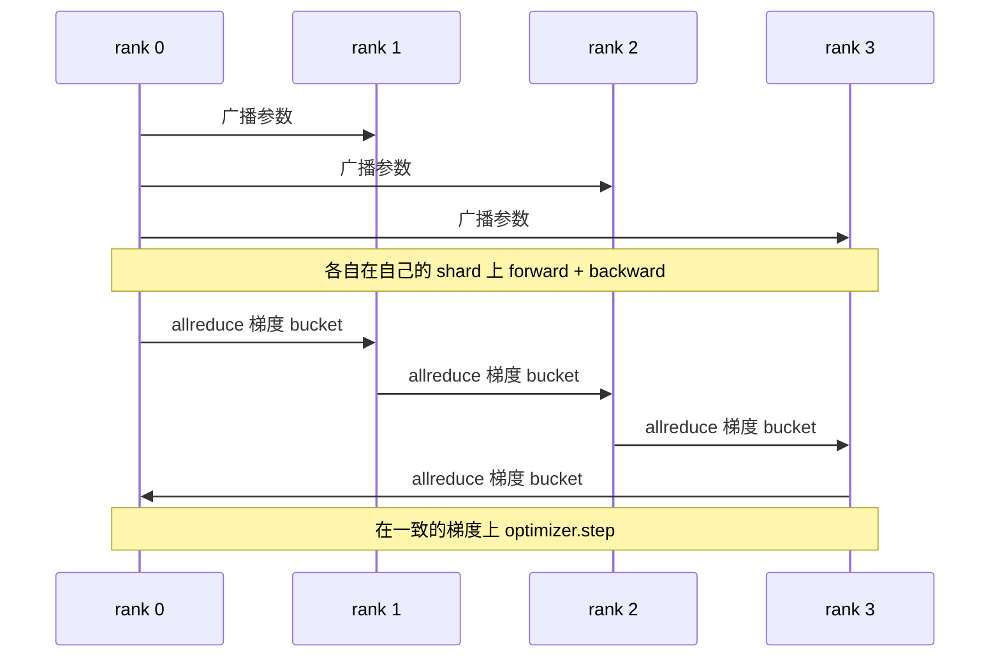

# 数据并行 DDP

> DistributedDataParallel 就是搭在 allreduce 之上的一个钩子。包一个模型，从 rank 0 广播初始参数让每个 rank 起点一致，给每个参数装一个 backward 钩子在梯度算完后发一次 allreduce，剩下的就是梯度下降。整个套路只有 200 行。

**类型：** Build
**语言：** Python
**前置要求：** 阶段19 Track C 第42-49课
**预计时间：** ~90 分钟

## 学习目标

- 接一个 `DistributedDataParallel` 形态的 wrapper，广播初始参数，在 backward 之后对梯度做 allreduce。
- 用 `torch.multiprocessing.spawn` 在 gloo backend 上、用基于文件的 rendezvous 启动 N 个 CPU rank。
- 通过在同样数据上顺序训练同一个模型、展示每步参数等价，来证明 gradient sync 的正确性。
- 论证 bucket（梯度融合）和 overlap（backward 期间通信）这两项改动，正是把一个能跑的 DDP 变成生产级 DDP 的关键。

## 问题背景

一个有 12 GB 激活值的 10 亿参数模型，塞不进一张消费级 GPU。就算塞得下，训练也要几周。数据并行把 batch 切到 N 个 rank 上，每个 rank 在自己那份 shard 上算 forward 和 backward，然后每一步把每个 rank 的梯度求和，让所有 N 份副本保持一致。求和后的梯度才是 optimizer 用来更新的对象。

没有 gradient sync，N 份副本到第 2 步就发散了。这个模型就不再是"在更多数据上训练的同一个模型"，而是 N 个恰好共享初始权重的独立模型。如果 gradient sync 做得糟糕（每个参数一次 allreduce、不重叠、不 bucketing），网络就成了瓶颈，GPU 闲着等线路。DDP 的手艺就在于让 gradient sync 相对计算几乎免费。经典的 PyTorch DDP 靠 bucket 梯度、把 allreduce 和下一层的 backward 重叠、以及在 NVLink 上用 NCCL 来做到这点。我们在 CPU 上用 gloo 把这三件事全做一遍，学到的是同一套道理。

## 核心概念



### DDP 需要的三个操作

| 阶段 | Collective | 为什么 |
|-------|-----------|-----|
| 初始化 | 从 rank 0 broadcast | 每个 rank 都用同样的参数起步 |
| backward 之后 | 对每个梯度 allreduce | optimizer 更新用的是平均梯度 |
| 有时 | broadcast buffer | 让 batchnorm 的 running stats 保持同步 |

### 为什么取平均而不是求和

Allreduce-SUM 再除以 world_size 得到平均梯度。平均对 world_size 不变：在 1 个 rank 上调好的学习率，到 4 个 rank 上照样能用，因为每步的梯度幅度不变。Allreduce-SUM 不除，就逼你每次改集群规模都重调学习率。DDP 包住 SUM 并做除法；本课也照做。

### 为什么要 bucket 梯度

一个 transformer 有上千个参数张量。每个张量一次 allreduce，就要付上千次 gloo 延迟下限的代价。DDP 把梯度分组成约 25 MB 的 bucket，每个 bucket 发一次 allreduce。线上走的总字节数一样，但延迟被摊到整个 bucket 上。本课的小模型把所有东西都放进一个 bucket；能迁移过去的是这个结构本身。

### 为什么要固定 seed

每个 rank 必须用 `torch.manual_seed(seed + rank)` 来做 shuffle，但用 `torch.manual_seed(seed)` 来做参数初始化。共用一个 seed 意味着每个 rank 看到的 batch 顺序相同（数据并行就白搞了）；给参数用 rank 相关的 seed，则会让初始参数差一个 float epsilon，gradient sync 也就再也无法让副本完全一致。Seed 的套路弄对，否则参数等价的测试在第 1 步就挂。

## 动手构建

`code/main.py` 实现了：

- `MiniMLP`：一个 3 层 MLP，小到几秒就收敛，又大到能暴露接线细节。
- `DistributedDataParallel(model, world_size)`：在构造时广播参数，返回一个 wrapper，其 `sync_grads` 把累积的 allreduce-summed 梯度除以 world_size。
- `worker(rank, world_size, ...)`：完整训练循环，含 gloo 上的 `torch.distributed` 初始化、forward、backward、sync、step。
- `_reference_single_process_loop(...)`：在一个 rank 上对同样数据顺序训练同一个模型，供测试在每步之后做逐字节参数等价对比。

运行：

```bash
python3 code/main.py
```

输出：一张逐步训练表，把单进程的 loss 和参数校验和，对比到 4 个 rank 上的 DDP 运行。两条路径产出的 loss 曲线在 float epsilon 内完全一致，证明 gradient sync 是对的。

## 真实世界中的生产模式

有三个模式能把 DDP 打磨到可以上线。

**找出未使用的参数。** 有些 forward 路径会有条件地跳过参数（early exit、mixture-of-experts 的 router）。被跳过的参数没有梯度，但 DDP 的 bucket-ready 钩子仍会等它们，于是 allreduce 死锁。`find_unused_parameters=True` 让 DDP 在归约前先看哪些参数拿到了梯度。代价是每步走一遍计算图，所以除非你的 forward 有分支，否则别开。

**static graph 优化。** 当 forward 在各步之间稳定时，`static_graph=True` 让 DDP 预先算好 bucket 调度。这个优化在大规模时才显著：预计算每步省几毫秒，跨 10000 步累积起来就可观。

**梯度累积需要小心。** 在 K 个 microbatch 上累积梯度、而不每个 microbatch 都同步，能带来 10 倍吞吐提升。DDP 暴露了 `no_sync()` 作为 context manager，用来暂停 backward 后的 allreduce。忘了用这个 manager，你就白白 allreduce 了 K 次；吞吐掉到下限。

## 实际使用

生产模式：

- **PyTorch DDP。** 经典实现。`torch.nn.parallel.DistributedDataParallel(model)` 把 bucketing、overlap 和 no_sync context 全接好。
- **HuggingFace Accelerate。** 加了一个 launcher，处理 `torchrun` 的环境变量和模型 wrap。底层还是同一套 DDP。
- **Megatron-LM 数据并行。** 把 DDP 和 tensor parallel 组合起来训大模型；数据并行那块就是同样的 allreduce-after-backward 套路。

## 拿去用

第 78 课（ZeRO sharding）把逐参数的 allreduce 换成 reduce_scatter，于是每个 rank 只存自己那份 optimizer state 的 shard。第 81 课把 DDP 和 ZeRO 组装进端到端 demo。

## 练习

1. 加可配置大小的梯度 bucket，在一个更深的模型上测量相对"每参数一次 allreduce"的提速。
2. 把 `no_sync()` 实现成 context manager，验证在 K 个 microbatch 上的梯度累积与单进程基线一致。
3. 加一个 `find_unused_parameters` 模式，让 forward 有时跳过一层 MLP；不开这个 flag 运行就应该死锁。
4. 把 gloo 换成只用 `torch.distributed.barrier()` 的同步，感受 allreduce-based 和 barrier-based 同步的区别。
5. 对 batch size 为 1、16、256 测量 gradient-sync 开销占整步时间的比例，并解释这个扩展规律。

## 关键术语

| 术语 | 大家怎么说 | 实际含义 |
|------|----------------|------------------------|
| DDP | "数据并行" | 每步广播参数、allreduce 梯度的 wrapper |
| Bucket | "融合梯度" | 把 N 个小 allreduce 合成一个大的 |
| Overlap | "隐藏通信" | 在后面的层还在算 backward 时就发出 allreduce |
| no_sync | "累积" | 跳过 backward 后的 allreduce 以做梯度累积 |
| find_unused | "带分支的 forward" | 归约前检测出没有梯度的参数 |

## 延伸阅读

- [PyTorch DistributedDataParallel 文档](https://pytorch.org/docs/stable/generated/torch.nn.parallel.DistributedDataParallel.html)
- [PyTorch DDP 内部原理教程](https://pytorch.org/tutorials/intermediate/ddp_tutorial.html)
- [Li 等，PyTorch Distributed：加速数据并行训练的经验](https://arxiv.org/abs/2006.15704)
- 阶段19 第76课 - DDP 所构建于其上的那些 collective
- 阶段19 第78课 - ZeRO sharding 用 reduce_scatter 替换逐参数的 allreduce
