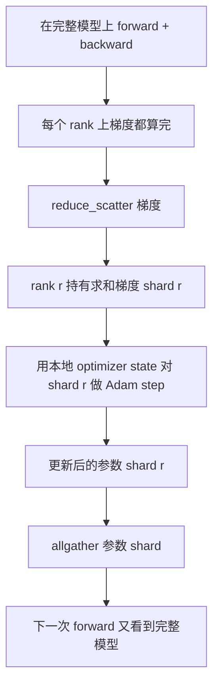

# ZeRO Optimizer State 分片

> Adam 给每个参数存两个 moment 估计，都是 float32。一个 70 亿参数的模型背着 56 GB 的 optimizer state。ZeRO stage 1 把这部分 shard 到 N 个 rank 上；每个 rank 拥有 1/N 的 optimizer。本地 step 之后，更新后的参数 shard 再 broadcast 回来，每个 rank 重建出完整模型，下一步开始。这一招换来的是：把训练栈里最大那块单次分配的内存做了线性下降。

**类型：** Build
**语言：** Python
**前置要求：** 阶段19 Track C 第42-49课
**预计时间：** ~90 分钟

## 学习目标

- 把 optimizer state（first moment、second moment、fp32 master copy）shard 到 N 个 rank 上，让每个 rank 拥有 1/N。
- 用 reduce_scatter 只把每个 rank 自己那份 shard 的梯度和投递给它，再用 allgather 把更新后的参数 shard 广播回来。
- 算出 stage 1、stage 2、stage 3 相对原版 DDP 的内存节省表。
- 从模型规模和带宽预算出发，论证在 stage 1、stage 2、stage 3 之间该怎么选。

## 问题背景

原版 DDP 把一切都复制一遍：参数、梯度、optimizer state 在每个 rank 上都完整存在。对一个 fp16 的 70 亿参数模型，这意味着每个 rank 14 GB 参数、14 GB 梯度、28 GB optimizer state。Optimizer state 是最大的那一项，也是最容易 shard 的，因为它只在 step 时被碰，forward 和 backward 时都不碰。

ZeRO stage 1 把 optimizer state shard 掉。每个 rank 持有 1/N 的 Adam moment。Backward 之后，ZeRO 不再 allreduce 完整梯度再本地 step，而是用 reduce_scatter 让每个 rank 只收到自己那份 shard 的求和梯度。这个 rank 把 optimizer step 应用到它那份 master parameter 的 shard 上。更新后的参数 shard 再 allgather 回来，于是每个 rank 都有完整模型供下一次 forward。Optimizer 内存按 N 下降。每步的线路流量和 DDP 一样：一次 reduce_scatter 加一次 allgather 在带宽上等于一次 allreduce。内存赢了，吞吐不变。

## 核心概念



### ZeRO 的各个 stage

| Stage | shard 了什么 | 每 rank 内存 | 每步通信 |
|-------|----------------|------------------|---------------|
| DDP | 什么都不 | params + grads + optim | 1 次 allreduce |
| ZeRO-1 | optimizer state | params + grads + optim/N | 1 次 reduce_scatter + 1 次 allgather |
| ZeRO-2 | optim + grads | params + grads/N + optim/N | 1 次 reduce_scatter + 1 次 allgather |
| ZeRO-3 | optim + grads + params | params/N + grads/N + optim/N | 每层 1 次 allgather + 每层 1 次 reduce_scatter |

Stage 1 是最便宜的赢面，因为 optimizer state 在预算里占大头。Stage 2 需要梯度 shard 的累积逻辑，但带宽一样。Stage 3（FSDP）为每次 forward 和 backward 付每层通信的代价，换来参数 shard 的内存下降。本课完整实现 stage 1。

### 内存计算，真实数字

对一个有 P 个参数、用 Adam 做混合精度训练的模型：

| 项 | 原版 | ZeRO-1 | 为什么 |
|------|---------|--------|-----|
| fp16 参数 | 2P 字节 | 2P 字节 | forward 需要 |
| fp16 梯度 | 2P 字节 | 2P 字节 | backward 需要 |
| fp32 master copy | 4P 字节 | 4P/N 字节 | 只有 optimizer 用它 |
| fp32 first moment | 4P 字节 | 4P/N 字节 | 只有 optimizer 用它 |
| fp32 second moment | 4P 字节 | 4P/N 字节 | 只有 optimizer 用它 |
| 合计 | 16P 字节 | 4P + 12P/N 字节 |   |

在 N=8 时：原版 16P，ZeRO-1 5.5P，降了 65%。在 N=64 时：原版 16P，ZeRO-1 4.19P，降了 74%。

### 为什么 reduce_scatter 胜过"allreduce 再 shard"

Allreduce 给每个 rank 完整的求和梯度。如果你只需要 shard r，那被归约的梯度里有 (N-1)/N 在 rank r 上是白算的。Reduce_scatter 精确地投递每个 rank 拥有的那份 shard；每 rank 字节数和 allreduce 一样（因为 allreduce 就是 reduce_scatter + allgather），但后半段被换成了之后的参数 shard allgather。净线路流量和 DDP 完全相同，内存被除以了 N。

## 动手构建

`code/main.py` 实现了：

- `flatten_params(module)` 和 `unflatten_into(module, flat)`，把模型参数打包进一个连续张量再解包回去。这种扁平布局让按 rank 做 shard 变成一次简单的切片。
- `ZeroOptimizer(model, world_size, rank, lr)`，持有该 rank 那份 master copy 和 Adam moment 的 shard。
- `step()`，在扁平梯度上跑 reduce_scatter，对该 rank 的 shard 应用 Adam，再 allgather 把更新后的参数取回来。
- 一个 demo，把一个 3 层 MLP 训 20 步，并打印每步的内存预算，旁边附上原版 DDP 基线。

运行：

```bash
python3 code/main.py
```

输出：每步 loss，以及一张内存表，展示 ZeRO-1 在每个 rank 上只持有 1/N 的 optimizer state，而 DDP 持有完整副本。

## 真实世界中的生产模式

有三个模式能把 ZeRO 打磨到可以上线。

**sharded checkpoint 很关键。** ZeRO-1 的 optimizer state 散在各个 rank 上；checkpoint 必须记录哪个 rank 拥有哪部分。第 80 课构建的就是那个 sharded checkpoint manifest，让一次 ZeRO 运行能在同样 world size 上恢复。没有它，存下来的状态在重启时根本读不了。

**混合精度才是重点。** ZeRO 是一种混合精度技术；被 shard 的正是那份 fp32 master copy。不用混合精度跑 ZeRO，就会付 fp32 master 的内存税，却拿不到对应的 fp16 forward 收益。生产运行总是把 ZeRO 和 autocast 或 bf16 权重配在一起。

**stage 1 是近乎免费的赢面。** 通信在带宽上和 DDP 完全一样。内存节省与 N 成线性。唯一的代价是 optimizer shard 的记账。生产栈默认上 stage 1，除非参数 shard 的内存也成了问题；那时再用 stage 2 或 3 拿通信换内存。

## 实际使用

生产模式：

- **DeepSpeed ZeRO。** 参考实现。`deepspeed_config.json` 选 stage 1/2/3 和 partition 大小。
- **PyTorch FSDP。** PyTorch 原生的等价物。`ShardingStrategy.SHARD_GRAD_OP` 是 ZeRO-2；`FULL_SHARD` 是 ZeRO-3。
- **HuggingFace Accelerate。** 用统一配置把 DeepSpeed 和 FSDP 都包起来。

## 拿去用

第 79 课（pipeline parallel）是正交的另一个 sharding 轴：它不是在同一个模型上 shard optimizer state，而是把层 shard 到各个 rank 上。第 81 课在端到端 demo 上把 DDP + ZeRO 组装起来。

## 练习

1. 扩展到 ZeRO-2，做梯度 shard：每个 rank 只存自己那份 shard 的梯度，做法是 backward 之后把非 shard 部分清零。
2. 加一个内存 profiler，在 rank 0 上打印实际的 fp32 字节用量，对比公式预测。
3. 测量原版 DDP 与 ZeRO-1 的每步墙钟时间，并拆解成 forward、backward、通信。
4. 在 ZeRO-1 下实现梯度裁剪：L2 norm 必须通过对本地 norm 平方做 allreduce 来跨所有 shard 计算。
5. 实现一个用 allreduce 而不是 reduce_scatter 的"朴素 ZeRO"，测量线路时间差。用数字论证为什么选 reduce_scatter。

## 关键术语

| 术语 | 大家怎么说 | 实际含义 |
|------|----------------|------------------------|
| ZeRO-1 | "shard optimizer" | 每个 rank 持有 1/N 的 fp32 master + Adam moment |
| ZeRO-2 | "梯度也 shard" | reduce_scatter 之后每个 rank 还会丢掉非 shard 的梯度 |
| ZeRO-3 | "shard 参数" | 每个 rank 持有 1/N 的 fp16 参数；forward 时每层 allgather |
| Master copy | "fp32 权重" | optimizer 更新的那份高精度参数副本 |
| Reduce_scatter | "把和拆开" | 只把每个 rank 自己那份 shard 的求和梯度投递给它 |

## 延伸阅读

- [Rajbhandari 等，ZeRO：面向万亿参数模型训练的内存优化](https://arxiv.org/abs/1910.02054)
- [DeepSpeed ZeRO 文档](https://www.deepspeed.ai/tutorials/zero/)
- [PyTorch FSDP 文档](https://pytorch.org/docs/stable/fsdp.html)
- 阶段19 第76课 - 本课所依赖的 reduce_scatter 和 allgather
- 阶段19 第80课 - ZeRO state 必须用的 sharded checkpoint
