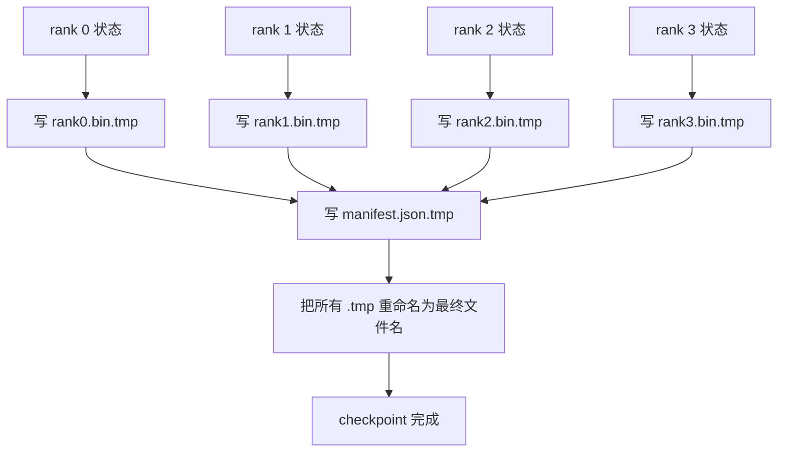

# 分片 Checkpoint 与原子化恢复

> 一个 700 亿参数的训练作业，每隔几小时就会被一次节点故障打断。Checkpoint 的格式决定了你丢的是 30 分钟还是 30 小时。Sharded checkpoint 把每个 rank 的 shard 并行写出，并在 manifest 里记录归属。恢复时每个 rank 从自己的文件加载自己的 shard，在同样 world size 上重建状态，optimizer 像什么都没发生过一样继续 step。原子化写入能防止一个写到一半的 checkpoint 毒害下一次恢复。

**类型：** Build
**语言：** Python
**前置要求：** 阶段19 Track C 第42-49课
**预计时间：** ~90 分钟

## 学习目标

- 把一个多 rank checkpoint 存成"每 rank 一个 shard 文件 + 一份记录哪个 rank 拥有什么的 manifest"。
- 用原子化写入模式（先写到临时路径再 rename），让写到一半时崩溃也绝不会产出半成品 checkpoint。
- 从 manifest 恢复，在每个 rank 上对 fp16 参数和 ZeRO optimizer state 都验证逐字节相等。
- 让 manifest schema 能抵御三种故障模式：world size 改变、shard 数量不匹配、写入不完整。

## 问题背景

朴素 checkpoint 把所有参数和 optimizer state 读进 rank 0，gather 起来，写成一个文件。对一个 700 亿模型那是 1.1 TB 的状态，全过一个 rank 的网络端口。写入期间其他每个 rank 都被阻塞，因为它们闲着等 gather。IO 带宽是最慢那张 GPU 的网络链路，而不是聚合带宽。在真实集群上，这个 gather-then-write 步骤可能比上一个训练小时还久，意味着这个作业一个训练日里产不出一个 checkpoint。

Sharded checkpoint 把这套反过来：每个 rank 并行地把自己的 shard 写到自己的文件。Manifest 记录哪个 rank 拥有哪个 shard，于是恢复时能把每个 shard 放回它来的地方。聚合写带宽随集群规模扩展。一个 1 TB 的 checkpoint，过一个 rank 要 4 小时，过 64 个 rank 只要 4 分钟。此外 manifest 还给了你一份针对不兼容恢复的契约：world size 改变可被检测，写入不完整可被检测，加载路径可以大声失败而不是默默用上陈旧数据。

## 核心概念



### Manifest schema

```json
{
  "world_size": 4,
  "step": 1234,
  "wall_clock_seconds": 4521,
  "shards": [
    {"rank": 0, "path": "rank0.bin", "sha256": "...", "param_shard_offset": 0, "param_shard_numel": 65536},
    {"rank": 1, "path": "rank1.bin", "sha256": "...", "param_shard_offset": 65536, "param_shard_numel": 65536}
  ],
  "schema_version": 1
}
```

有三个字段是承重的。`world_size` 让在不同规模上的恢复大声失败，而不是默默损坏。每 shard 的 `sha256` 抓住写入不完整或损坏。每 shard 的 `param_shard_offset` 和 `param_shard_numel` 让 loader 把扁平参数张量重建到正确的位置。

### 原子化写入

标准模式：把每个 shard 写到 `<name>.tmp`，把 manifest 写到 `manifest.json.tmp`，各自 fsync，然后 rename。同一文件系统内的 POSIX rename 是原子的；要么新文件完整存在，要么旧文件还在。在最终 rename 之前崩溃，会让上一个 checkpoint 仍是活的那个。没有原子化写入，崩溃可能留下一个不完整的 shard 和一份指向它的 manifest，恢复时就把 optimizer state 加载坏了。

### schema 必须抵御的三种故障模式

| 故障 | 症状 | 防御 |
|---------|---------|---------|
| world size 改变 | 用 N=4 的 manifest 在 N=8 上恢复 | manifest 里 world_size 不匹配，大声失败 |
| shard 数量不匹配 | 恢复时看到的 rank*.bin 文件比 manifest 里的 shard 少 | 枚举 shard，验证每一个都存在 |
| 写入不完整 | shard 文件在 flush 中途被截断 | 加载时做 sha256 验证 |

每种防御都尽早拒绝坏的加载；不然就是默默损坏，等到 100 步后 loss 变成 NaN 才浮现。

### 为什么用每 rank 一个文件，而不是一个大文件

通过 `O_APPEND` 并发写一个文件，在 POSIX 上对字节对齐的写入是可行的，但实际中一个 shard 内的 offset 跨越 MB 级区域，锁就成了主导。每 rank 一个文件没有争用，且当底层文件系统是并行的（Lustre、GPFS）时能受益于条带化。正因如此，生产栈（DeepSpeed、FSDP、NeMo）全都用每 rank 一个文件。

## 动手构建

`code/main.py` 实现了：

- `ShardManifest` dataclass，带上面那套 schema 加 `to_json`/`from_json`。
- `save_sharded(state_dict_per_rank, dir, step)`，用 atomic temp-then-rename 模式把每个 rank 的二进制状态写到自己的文件，再写 manifest。
- `load_sharded(dir, expected_world_size)`，读 manifest，验证每个 shard 的 sha256，返回每 rank 的 state dict。
- 一个往返测试：构建每 rank 状态、save、load、断言逐字节相等。

运行：

```bash
python3 code/main.py
```

输出：写出 4 个 shard 文件加 manifest，再带逐字节验证重新加载回来。

## 真实世界中的生产模式

有三个模式能把 checkpoint 打磨到可以上线。

**异步写入。** 生产栈把 checkpoint 写入发到一个单独的线程或进程上，好让训练继续。屏障设在下一次 checkpoint：在上一次 save 完成前不要开始下一次。DeepSpeed 的 `async_io` flag 干的正是这件事。本课把写入保持同步，好让各步看得见。

**先写本地快盘，再异步上传。** 写到本地 NVMe（快），再异步上传到 S3 或 GCS。这种两级模式让集群内的 checkpoint 在恢复时保持快，同时把一份持久副本运到集群外做归档。Manifest 带本地路径；一份 upload manifest 带远端路径。

**轮转很关键。** 生产运行保留最近 K 个 checkpoint（通常 3-5 个），轮转掉最旧的。不轮转，磁盘会在运行中途写满，下一次 checkpoint 就失败。有了轮转，下一次 save 会先删最旧的，腾出预算。

## 实际使用

生产模式：

- **DeepSpeed checkpointing。** `deepspeed.save_checkpoint(tag=step)` 写每 rank 文件，再写一个指向活跃 tag 的 `latest` 文件。
- **PyTorch FSDP checkpointing。** `torch.distributed.checkpoint` 用一个决定每 rank 布局的 `Planner` 来 save sharded state。
- **NeMo。** 用一个统一的 `save_to_checkpoint` API 把 DeepSpeed 和 FSDP 包起来，并加上元数据。

## 拿去用

第 81 课把端到端 DDP+ZeRO 运行的状态存成一个 sharded checkpoint，再在同样 world size 上重新加载，证明恢复契约成立。

## 练习

1. 加异步写入：在一个线程里启动 save 并让训练继续。在上一次完成前阻塞下一次 save。
2. 加一个 `last_5_steps` 轮转：保留最近 5 个 checkpoint，存新的之前删最旧的。
3. 给内层循环的重新加载加一条只用 CRC 的快速验证路径（轮转把一个 checkpoint 滚成新的活跃 checkpoint，不做完整 sha256）。
4. 加一条跨 world size 的加载：通过读 manifest、拼接、再重新 shard，把 shard 从 N=4 重平衡到 N=8。
5. 加一个上传到假 S3（第二个目录）并写出 upload manifest。论证这套两级存储策略。

## 关键术语

| 术语 | 大家怎么说 | 实际含义 |
|------|----------------|------------------------|
| Sharded checkpoint | "每 rank 保存" | 每个 rank 并行写自己的 shard 文件 |
| Manifest | "索引" | 记录 shard 路径、offset 和 sha256 的 JSON 文件 |
| Atomic write | "先 tmp 再 rename" | 写到 .tmp 再做 POSIX rename，崩溃时让上一个文件仍活着 |
| Partial write | "被截断的 shard" | 写入期间崩溃产出损坏的 shard；sha256 抓得住 |
| Rotation | "保留最近 K 个" | 写新 checkpoint 前删最旧的，把磁盘用量限住 |

## 延伸阅读

- [DeepSpeed checkpointing](https://www.deepspeed.ai/tutorials/checkpointing/)
- [PyTorch torch.distributed.checkpoint](https://pytorch.org/docs/stable/distributed.checkpoint.html)
- [POSIX rename 原子性](https://pubs.opengroup.org/onlinepubs/9699919799/functions/rename.html)
- 阶段19 第78课 - 这个 checkpoint 为之塑形保存的 ZeRO state
- 阶段19 第81课 - 端到端 demo 对保存的状态做往返
